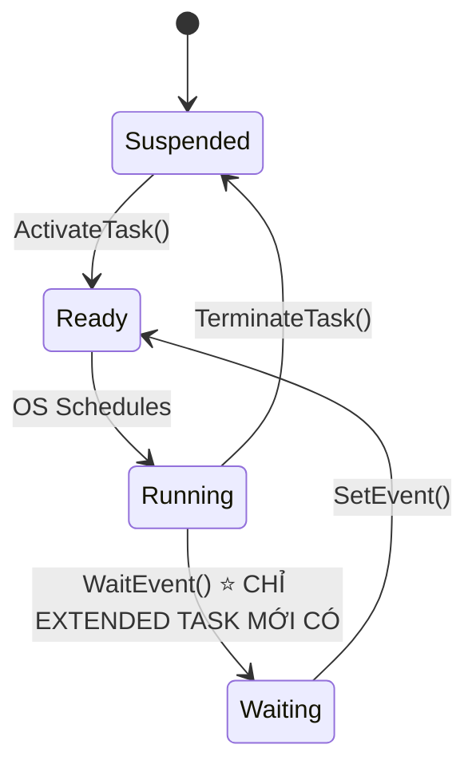

# PROMPT NÂNG CẤP TÀI LIỆU AUTOSAR - PRODUCTION GRADE ENHANCEMENT

> **Mục đích:** Nâng cấp tài liệu AUTOSAR từ cấp độ Senior Engineer sang cấp độ **Universal Learning Resource** phục vụ cả Newbie và Expert.

---

## 🎯 YÊU CẦU NÂNG CẤP CỐT LÕI

### 1. TĂNG GẤP ĐÔI VÍ DỤ MÃ NGUỒN VÀ THỰC HÀNH

#### Quy tắc tỷ lệ Lý thuyết vs Thực hành:
```
HIỆN TẠI:    [Lý thuyết 70%] [Code/Diagram 30%]
MỤC TIÊU:    [Lý thuyết 40%] [Code/Diagram/Hands-on 60%]
```

#### Checklist bắt buộc cho MỖI khái niệm:
- [ ] **Định nghĩa thuật ngữ** (Glossary box với icon 📖)
- [ ] **Ví dụ code tối thiểu** (Before/After comparison nếu có refactor)
- [ ] **Sơ đồ trực quan** (Mermaid diagram / ASCII art / Table)
- [ ] **Kịch bản thực tế** (Real-world use case từ BMS/VCU/Body)
- [ ] **Anti-pattern / Pitfall** (Common mistakes với icon ⚠️)
- [ ] **Hands-on exercise** (Mini-task để người đọc tự thực hành)

---

### 2. CẤU TRÚC PHÂN CẤP ĐỘC GIẢ (PROGRESSIVE DISCLOSURE)

Mỗi section phải có 3 tầng độ sâu:

```
┌─────────────────────────────────────────────────┐
│ 🟢 LEVEL 1: NEWBIE FRIENDLY (ELI5 - Explain    │
│    Like I'm 5)                                  │
│    • Ngôn ngữ đơn giản, ẩn dụ thực tế           │
│    • Icon phân loại: 📖 Định nghĩa, 💡 Ví dụ   │
│    • Highlight key terms bằng **bold**          │
├─────────────────────────────────────────────────┤
│ 🟡 LEVEL 2: INTERMEDIATE (Working Knowledge)   │
│    • Technical details với code examples        │
│    • API signatures, struct definitions         │
│    • Workflow diagrams                          │
├─────────────────────────────────────────────────┤
│ 🔴 LEVEL 3: EXPERT (Deep Dive)                 │
│    • Edge cases, performance implications       │
│    • ISO spec references với số trang cụ thể    │
│    • Production debugging scenarios             │
└─────────────────────────────────────────────────┘
```

#### Template áp dụng:

```markdown
## 2.3 Extended Task và WaitEvent()

### 🟢 Giải Thích Cho Người Mới (ELI5)

> **📖 Extended Task là gì?**
> 
> Hãy tưởng tượng bạn đang chờ người yêu nhắn tin:
> - **Basic Task** = Bạn ngồi F5 liên tục màn hình điện thoại (CPU 100%, tốn pin)
> - **Extended Task** = Bạn đặt điện thoại xuống, báo thức sẽ rung khi có tin nhắn (CPU ngủ, tiết kiệm)
> 
> Extended Task có thể "ngủ" (`WaitEvent()`) và chỉ thức dậy khi có **Event** kích hoạt → Tiết kiệm RAM và CPU.

---

### 🟡 Chi Tiết Kỹ Thuật (Technical Details)

**So sánh State Machine:**



**Code Example - Chờ Gói Tin CAN:**

```c
/* ❌ SAI: Basic Task polling liên tục (lãng phí CPU) */
TASK(Task_CanReceive_WRONG) {
    while (1) {
        if (Can_MessageReceived()) {
            Process_Message();
        }
        // Vòng lặp vô hạn, chiếm CPU luôn!
    }
}

/* ✅ ĐÚNG: Extended Task chờ Event từ ISR */
TASK(Task_CanReceive_CORRECT) {
    EventMaskType ev;
    
    while (1) {
        // Ngủ cho đến khi nhận Event từ CAN ISR
        WaitEvent(EVENT_CAN_RX_COMPLETE);  // ⭐ Task nhường CPU tại đây
        GetEvent(Task_CanReceive_CORRECT, &ev);
        ClearEvent(EVENT_CAN_RX_COMPLETE);
        
        if (ev & EVENT_CAN_RX_COMPLETE) {
            Process_Message();
        }
    }
}

/* ISR Category 2 - Được gọi khi CAN nhận xong frame */
ISR(Can_Rx_ISR) {
    // Đánh thức Task_CanReceive_CORRECT
    SetEvent(Task_CanReceive_CORRECT, EVENT_CAN_RX_COMPLETE);
}
```

**📊 Bảng So Sánh Tác Động RAM:**

| Kịch bản | Basic Task | Extended Task |
|----------|------------|---------------|
| **3 Tasks, mỗi task 512 bytes stack** | 512 bytes (share stack) | 3 × 512 = 1536 bytes (riêng stack) |
| **10 Tasks polling CAN/UART** | 512 bytes | 10 × 512 = 5120 bytes |
| **Khi nào dùng?** | Task chạy nhanh < 1ms, không chờ | Task chờ I/O, network, timer |

---

### 🔴 Deep Dive - Chi Tiết Triển Khai (Expert Level)

**Cơ chế Context Switching:**

Khi `WaitEvent()` được gọi:

```c
// Pseudo-code của AUTOSAR OS internals
void OS_WaitEvent(EventMaskType Mask) {
    TCB_Type* currentTask = OS_GetCurrentTask();
    
    // 1. Lưu ngữ cảnh CPU registers lên stack riêng của task
    OS_SaveContext(currentTask);
    
    // 2. Chuyển task sang trạng thái WAITING
    currentTask->state = WAITING;
    currentTask->waitingEvents = Mask;
    
    // 3. Loại task ra khỏi Ready Queue
    OS_RemoveFromReadyQueue(currentTask);
    
    // 4. Gọi Scheduler chọn task ưu tiên cao nhất tiếp theo
    OS_Schedule();  // ⚠️ Hàm này KHÔNG BAO GIỜ RETURN về vị trí cũ!
    
    // Khi SetEvent() được gọi từ ISR/Task khác:
    // → OS_AddToReadyQueue(currentTask)
    // → Scheduler sẽ chọn lại task này nếu priority cao nhất
    // → OS_RestoreContext(currentTask) → Task "tỉnh dậy" tại đây
}
```

**⚠️ Common Pitfall - Deadlock Scenario:**

```c
/* ❌ LỖI NGHIÊM TRỌNG: WaitEvent() trên Event chưa ai Set */
TASK(Task_DeadlockExample) {
    // Task chờ EVENT_NEVER_COMES nhưng không có ai gọi SetEvent()
    WaitEvent(EVENT_NEVER_COMES);  // 💀 TASK BỊ ĐÓNG BĂNG MÃI MÃI!
    
    // Code phía dưới KHÔNG BAO GIỜ chạy
    Do_Critical_Safety_Check();
}
```

**✅ Best Practice - Timeout Protection:**

```c
/* Dùng Alarm làm watchdog cho WaitEvent */
TASK(Task_SafeWait) {
    SetRelAlarm(Alarm_EventTimeout, 100, 0);  // 100ms timeout
    
    WaitEvent(EVENT_CAN_RX | EVENT_TIMEOUT);
    EventMaskType ev;
    GetEvent(TASK_ID_SELF, &ev);
    ClearEvent(EVENT_CAN_RX | EVENT_TIMEOUT);
    
    if (ev & EVENT_TIMEOUT) {
        // Xử lý trường hợp timeout - vào chế độ Limp-Home
        Handle_CAN_Loss_Communication();
    } else {
        Process_CAN_Message();
    }
    
    CancelAlarm(Alarm_EventTimeout);
}
```

**📚 ISO Spec Reference:**
- OSEK/VDX OS 2.2.3 - Section 13.5.3.2 "WaitEvent"
- AUTOSAR OS SWS R22-11 - Section 8.4.7 "Extended Task Semantics"

---

### 🛠️ Hands-On Exercise

**Bài tập thực hành:**

Cho đoạn code sau (từ `parai/as`):

```c
// File: as/com/as.infrastructure/system/kernel/trampoline/autosar/tpl_os_event.c
FUNC(StatusType, OS_CODE) WaitEvent(EventMaskType Mask)
{
    // TODO: Implement theo OSEK/VDX spec
}
```

**Nhiệm vụ của bạn:**

1. Đọc file `tpl_os_event.c` trong repo Study_AUTOSAR-main
2. Viết test case kiểm tra:
   - Task chờ đúng Event
   - Task bị preempt khi chờ
   - Xử lý trường hợp WaitEvent(0) (invalid)
3. Trace execution flow bằng debugger khi gọi `SetEvent()` từ ISR

**Expected Output:**
```
[Task_A] Calling WaitEvent(EVENT_1)...
[Task_A] State: RUNNING → WAITING
[Scheduler] Switching to Task_B (higher priority ready)
[ISR_Can] Received frame, calling SetEvent(Task_A, EVENT_1)
[Task_A] State: WAITING → READY
[Scheduler] Preempting Task_B, resuming Task_A
[Task_A] WaitEvent() returned, processing event
```
```

---

## 📋 TEMPLATE NÂNG CẤP CHO TỪNG LOẠI NỘI DUNG

### A. APIs và Functions

```markdown
### 🔧 `Dio_ReadChannel(Dio_ChannelType ChannelId)`

#### 📖 Định Nghĩa (Glossary)

> **Dio_ReadChannel()** - Hàm đọc giá trị logic (0 hoặc 1) của một chân GPIO đã được cấu hình ở chế độ Input.

#### 🎯 Khi Nào Dùng?

- ✅ Đọc trạng thái nút bấm (Button pressed/released)
- ✅ Đọc tín hiệu cảm biến digital (Hall sensor, Limit switch)
- ❌ KHÔNG dùng cho ADC (phải dùng `Adc_ReadGroup()`)
- ❌ KHÔNG dùng trong ISR nếu pin chưa init (`Port_Init()` trước)

#### 💡 Ví Dụ Thực Tế - Đọc Nút Bấm Khởi Động Xe (Start Button)

```c
#include "Dio.h"
#include "Port.h"

/* Khai báo Channel ID (được sinh từ DaVinci Configurator) */
#define DioConf_DioChannel_StartButton  ((Dio_ChannelType)0)

void Init_StartButton(void) {
    // 1. PHẢI gọi Port_Init() trước để cấu hình hướng pin
    Port_Init(&Port_ConfigData);  // Set PA0 = Input, Pull-up
}

Dio_LevelType Read_StartButton_Status(void) {
    Dio_LevelType level;
    
    // 2. Đọc mức logic của chân PA0
    level = Dio_ReadChannel(DioConf_DioChannel_StartButton);
    
    /* Giải thích giá trị trả về:
     * STD_HIGH (1) = Nút KHÔNG được bấm (Pull-up kéo lên 3.3V)
     * STD_LOW  (0) = Nút ĐANG được bấm (chân nối Mass 0V)
     */
    
    if (level == STD_LOW) {
        return BUTTON_PRESSED;
    } else {
        return BUTTON_RELEASED;
    }
}
```

#### 📊 Chi Tiết Tham Số

| Parameter | Type | Valid Range | Description |
|-----------|------|-------------|-------------|
| `ChannelId` | `Dio_ChannelType` | 0 .. `DIO_NUMBER_OF_CHANNELS-1` | ID của chân GPIO (được gen từ ARXML) |
| **Return** | `Dio_LevelType` | `STD_LOW` (0) hoặc `STD_HIGH` (1) | Mức logic đọc được |

#### 🎓 Mức Độ An Toàn (ASIL Level)

- **ASIL**: ASIL-D (theo ISO 26262)
- **DET Errors**:
  - `DIO_E_PARAM_INVALID_CHANNEL_ID` nếu ChannelId vượt giới hạn

#### 🔗 Liên Kết Tài Liệu Chuẩn

- AUTOSAR MCAL Dio SWS R22-11, Section 8.3.1 "Dio_ReadChannel"
- Mã nguồn: `as/com/as.infrastructure/arch/stm32f1/mcal/Dio.c:58`
```

---

### B. Protocols và Specifications

```markdown
## 1.3 Cơ Chế Bitwise Arbitration (Tranh Chấp Bus Không Phá Hủy)

### 🟢 Giải Thích Đơn Giản (ELI5)

**Ẩn dụ thực tế:**

Hình dung 3 người cùng hô to ID của mình vào 1 micro chung:
- Người A hô: "Tôi là số **001**01010"
- Người B hô: "Tôi là số **010**11001"
- Người C hô: "Tôi là số **011**00111"

**Quy tắc:**
- Bit `0` (Dominant) = Giọng to, át mọi người
- Bit `1` (Recessive) = Giọng nhỏ, bị át

→ Khi hô bit đầu tiên:
  - A hô `0` (to) → Át B và C
  - B, C hô `0`, `0` → Nghe thấy có người to hơn → **TỰ ĐỘNG THOÁT RA, KHÔNG CÓ XUNG ĐỘT!**

→ **Người A thắng và phát tiếp, B & C im lặng chờ vòng sau.**

---

### 🟡 Chi Tiết Kỹ Thuật - Ví Dụ Trace Từng Bit

Cho 3 ECU cùng phát đồng thời:

| Time | ECU1 (ID=0x123) | ECU2 (ID=0x125) | ECU3 (ID=0x140) | Bus Value | Ai Thắng? |
|------|-----------------|-----------------|-----------------|-----------|-----------|
| Bit 10 | `0` | `0` | `0` | `0` (Dom) | Tất cả còn tranh |
| Bit 9  | `0` | `0` | `0` | `0` (Dom) | Tất cả còn tranh |
| Bit 8  | `1` | `1` | `1` | `1` (Rec) | Tất cả còn tranh |
| Bit 7  | `0` | `0` | `1` | `0` (Dom) | **ECU3 thua → Dừng phát** ❌ |
| Bit 6  | `0` | `0` | — | `0` (Dom) | ECU1, ECU2 còn |
| Bit 5  | `0` | `1` | — | `0` (Dom) | **ECU2 thua → Dừng phát** ❌ |
| Bit 4  | `0` | — | — | `0` (Dom) | **ECU1 thắng!** ✅ |

**Kết quả:** ECU1 giành quyền phát hoàn chỉnh frame, ECU2 & ECU3 tự động chuyển sang chế độ nhận.

---

### 🔴 Production Debugging - Arbitration Loss Counter

```c
/* Theo dõi số lần thua tranh chấp trong CAN Controller */
typedef struct {
    uint32 txArbitrationLost;   // Số lần bị preempt bởi ID thấp hơn
    uint32 txSuccess;
    float  busLoadPercent;
} Can_Statistics_t;

Can_Statistics_t g_CanStats = {0};

void Can_TxIsr_ArbitrationLostHandler(void) {
    g_CanStats.txArbitrationLost++;
    
    /* ⚠️ Nếu counter này tăng liên tục → Bus quá tải!
     * Giải pháp:
     * 1. Giảm tần suất phát frame priority thấp
     * 2. Tăng baudrate từ 500kbps → 1Mbps (nếu dây cáp cho phép)
     * 3. Tách bus thành 2 mạng CAN riêng (Powertrain / Body)
     */
    
    if (g_CanStats.txArbitrationLost > 1000) {
        Dem_SetEventStatus(DEM_EVENT_CAN_BUS_CONGESTION, DEM_EVENT_STATUS_FAILED);
    }
}
```

#### 📐 Công Thức Tính Bus Load

$$
\text{Bus Load} = \frac{\sum (\text{Frame Size} \times \text{Frequency})}{\text{Baudrate}} \times 100\%
$$

**Ví dụ thực tế:**
- 50 frames, mỗi frame 130 bits (bao gồm stuffing bits), 10ms cycle
- Baudrate: 500 kbps

$$
\text{Bus Load} = \frac{50 \times 130 \times 100}{500000} = 130\%
$$

→ **Quá tải! Phải giảm frames hoặc tăng baudrate.**

---

### 🛠️ Hands-On - Thử Nghiệm Arbitration

**Bài lab:**

1. Kết nối 2 ECU board trên 1 bus CAN
2. Cấu hình:
   - ECU1 phát `ID=0x100` mỗi 10ms
   - ECU2 phát `ID=0x101` mỗi 10ms
3. Đồng bộ thời gian phát để 2 ECU gửi cùng lúc
4. Dùng logic analyzer capture bus → Đếm số lần ECU2 thua

**Expected:** ECU2 luôn thua vì ID cao hơn.
```

---

## 🎨 QUY TẮC ĐỊNH DẠNG VÀ ICON

### Icon System

| Icon | Ý Nghĩa | Khi Nào Dùng |
|------|---------|--------------|
| 📖 | Glossary / Định nghĩa | Giải thích thuật ngữ lần đầu xuất hiện |
| 💡 | Ví dụ / Example | Code snippet minh họa |
| ⚠️ | Warning / Pitfall | Lỗi thường gặp, anti-pattern |
| ✅ | Best Practice | Cách làm đúng, recommended approach |
| ❌ | Bad Practice | Cách làm sai, tránh xa |
| 🎯 | Use Case | Khi nào áp dụng pattern này |
| 🔧 | API Reference | Function signature, parameters |
| 📊 | Data / Statistics | Bảng số liệu, benchmark |
| 🔗 | External Link | ISO spec, AUTOSAR SWS reference |
| 🛠️ | Hands-On Exercise | Bài tập thực hành |
| 🟢🟡🔴 | Difficulty Level | Newbie / Intermediate / Expert |
| 💀 | Critical Bug | Lỗi nghiêm trọng gây hệ thống sập |
| 🌟 | Pro Tip | Kinh nghiệm thực chiến từ dự án thật |

---

## 🔍 CHECKLIST KIỂM TRA CHẤT LƯỢNG

### Trước khi submit tài liệu đã nâng cấp:

#### A. Độ dễ tiếp cận (Accessibility)

- [ ] Mỗi khái niệm có **📖 Glossary box** định nghĩa bằng tiếng Việt
- [ ] Có ít nhất **1 ẩn dụ thực tế** (real-world analogy) cho mỗi concept phức tạp
- [ ] Thuật ngữ tiếng Anh có kèm phiên âm IPA hoặc cách đọc: `Arbitration /ˌɑːrbɪˈtreɪʃən/`
- [ ] Acronyms được viết đầy đủ lần đầu: **MCAL** (*Microcontroller Abstraction Layer*)

#### B. Tỷ lệ Code vs Text

- [ ] Mỗi API có **ít nhất 2 code examples**: 1 basic + 1 advanced
- [ ] Mỗi protocol có **sequence diagram** (Mermaid)
- [ ] Code examples có **comments giải thích từng dòng** quan trọng
- [ ] Có **Before/After comparison** khi refactor code

#### C. Tính thực chiến

- [ ] Mỗi chương có **ít nhất 1 real-world scenario** (BMS/VCU/Body)
- [ ] Có **⚠️ Common Pitfalls** section với ít nhất 3 lỗi thường gặp
- [ ] Có **🛠️ Hands-On Exercise** với expected output rõ ràng
- [ ] Link đến **mã nguồn thực tế** trong repo `parai/as`

#### D. Phân cấp độ khó

- [ ] Có 3 levels rõ ràng: 🟢 Newbie / 🟡 Intermediate / 🔴 Expert
- [ ] Newbie section KHÔNG có jargon chưa được định nghĩa
- [ ] Expert section có **ISO spec references** với số trang cụ thể

#### E. Visual Aids

- [ ] Mỗi concept phức tạp có **ít nhất 1 diagram** (Mermaid / ASCII art)
- [ ] Có **bảng so sánh** (comparison table) cho các lựa chọn khác nhau
- [ ] Có **formula toán học** (KaTeX) nếu có tính toán (ví dụ: Bus Load, SoC)

---

## 📚 DANH SÁCH GLOSSARY BẮT BUỘC

Tất cả thuật ngữ sau PHẢI có định nghĩa ngay lần đầu xuất hiện:

### AUTOSAR Core Terms

- [ ] **AUTOSAR** (*AUTOmotive Open System ARchitecture*)
- [ ] **BSW** (*Basic Software*)
- [ ] **SWC** (*Software Component*)
- [ ] **RTE** (*Runtime Environment*)
- [ ] **VFB** (*Virtual Functional Bus*)
- [ ] **MCAL** (*Microcontroller Abstraction Layer*)
- [ ] **ECU** (*Electronic Control Unit*)
- [ ] **OEM** (*Original Equipment Manufacturer* - Hãng xe)
- [ ] **Tier-1** (*Nhà cung cấp cấp 1 - Bosch, Denso*)

### OS Terms

- [ ] **OSEK** (*Offene Systeme und deren Schnittstellen für die Elektronik in Kraftfahrzeugen*)
- [ ] **VDX** (*Vehicle Distributed eXecutive*)
- [ ] **Runnable** (*Hàm thực thi nghiệp vụ trong SWC*)
- [ ] **Task** (*Đơn vị lập lịch của OS*)
- [ ] **ISR** (*Interrupt Service Routine*)
- [ ] **Priority Ceiling Protocol** (*Giao thức nâng ưu tiên tức thì*)
- [ ] **Deadlock** (*Tình trạng kẹt chờ vòng tròn*)

### Communication Terms

- [ ] **CAN** (*Controller Area Network*)
- [ ] **PDU** (*Protocol Data Unit*)
- [ ] **I-PDU** (*Interaction Layer PDU*)
- [ ] **N-PDU** (*Network Layer PDU*)
- [ ] **DLC** (*Data Length Code*)
- [ ] **Arbitration** (*Tranh chấp bus*)
- [ ] **Bus-Off** (*Trạng thái cách ly khỏi mạng*)

### Diagnostic Terms

- [ ] **UDS** (*Unified Diagnostic Services - ISO 14229*)
- [ ] **DTC** (*Diagnostic Trouble Code*)
- [ ] **DID** (*Data Identifier*)
- [ ] **NRC** (*Negative Response Code*)
- [ ] **Freeze Frame** (*Dữ liệu đóng băng tại thời điểm lỗi*)

---

## 🎓 MẪU UPGRADE HOÀN CHỈNH - SO SÁNH TRƯỚC/SAU

### ❌ TRƯỚC KHI NÂNG CẤP (Tài liệu cũ)

```markdown
### 2.2 Basic Task vs Extended Task

Basic Task không thể chờ Event, Extended Task dùng WaitEvent() để chờ.

Basic Task dùng chung stack, Extended Task cần stack riêng.

Code example:
```c
TASK(Task_Example) {
    WaitEvent(EVENT_1);
    TerminateTask();
}
```
```

**Vấn đề:**
- ❌ Không giải thích TẠI SAO cần 2 loại task
- ❌ Thiếu ví dụ thực tế
- ❌ Code không có context (khai báo Event ở đâu?)
- ❌ Không có visual diagram

---

### ✅ SAU KHI NÂNG CẤP (Tài liệu mới)

```markdown
### 2.2 Basic Task vs Extended Task: Chiến Lược Tiết Kiệm CPU & RAM

#### 🟢 Giải Thích Cho Người Mới (Newbie Friendly)

> **📖 Task là gì?**
> 
> **Task** là một "công việc" mà hệ điều hành AUTOSAR OS phải lập lịch thực thi. Ví dụ:
> - Task đọc cảm biến nhiệt độ mỗi 100ms
> - Task xử lý gói tin CAN khi có dữ liệu đến
> 
> Có 2 loại Task: **Basic** (đơn giản) và **Extended** (nâng cao).

**🎯 Khi nào dùng loại nào?**

| Kịch bản | Dùng Basic Task | Dùng Extended Task |
|----------|-----------------|---------------------|
| Công việc chạy nhanh < 1ms (Đọc ADC, Toggle LED) | ✅ | ❌ (Lãng phí RAM) |
| Chờ dữ liệu từ CAN/UART/SPI | ❌ (Lãng phí CPU) | ✅ |
| 10 task polling cùng lúc | ❌ (Bus CPU 100%) | ✅ |

---

#### 🟡 Ví Dụ Thực Tế - Đọc Cảm Biến Nhiệt Độ Qua UART

**Tình huống:** ECU BMS cần đọc nhiệt độ từ cảm biến qua UART. Cảm biến trả lời sau 5ms.

##### ❌ Cách 1: Basic Task (SAI - Lãng phí CPU)

```c
/* File: Appl_TempSensor.c */

TASK(Task_ReadTemp_BasicWrong) {
    uint8 temp_data[4];
    
    // 1. Gửi lệnh đọc qua UART
    Uart_SendCommand(CMD_READ_TEMPERATURE);
    
    // 2. ❌ POLLING liên tục trong 5ms (CPU chạy idle!)
    while (!Uart_IsDataReady()) {
        // Vòng lặp này lãng phí ~500,000 CPU cycles!
        // Trong khi đó, các Task khác không chạy được!
    }
    
    // 3. Đọc dữ liệu
    Uart_ReadData(temp_data, 4);
    Process_Temperature(temp_data);
    
    TerminateTask();
}
```

**Hậu quả:**
- 💀 CPU load 100% trong 5ms
- 💀 Task khác bị trễ (ví dụ: Task điều khiển ABS bị skip)
- 💀 Không scale được (nếu có 10 sensor → 50ms block!)

##### ✅ Cách 2: Extended Task (ĐÚNG - Nhường CPU)

```c
/* File: Appl_TempSensor.c */

/* Khai báo Event trong OIL config:
EVENT Event_UartRxComplete {
    MASK = AUTO;
};

TASK Task_ReadTemp_ExtendedCorrect {
    PRIORITY = 5;
    SCHEDULE = FULL;
    ACTIVATION = 1;
    AUTOSTART = TRUE;
    EVENT = Event_UartRxComplete;  // ⭐ Task được đánh thức bởi Event này
};
*/

TASK(Task_ReadTemp_ExtendedCorrect) {
    EventMaskType ev;
    uint8 temp_data[4];
    
    // 1. Gửi lệnh đọc qua UART
    Uart_SendCommand(CMD_READ_TEMPERATURE);
    
    // 2. ✅ NGỦ chờ Event từ UART ISR (nhường CPU cho Task khác)
    WaitEvent(Event_UartRxComplete);  // ⭐ Task dừng tại đây, OS chạy Task khác!
    
    GetEvent(Task_ReadTemp_ExtendedCorrect, &ev);
    ClearEvent(Event_UartRxComplete);
    
    // 3. Khi tỉnh dậy → Dữ liệu đã sẵn sàng
    Uart_ReadData(temp_data, 4);
    Process_Temperature(temp_data);
    
    TerminateTask();
}

/* UART Rx Interrupt - Gọi khi nhận đủ 4 bytes */
ISR(Uart_Rx_ISR) {
    // Đánh thức Task_ReadTemp_ExtendedCorrect
    SetEvent(Task_ReadTemp_ExtendedCorrect, Event_UartRxComplete);
}
```

**Lợi ích:**
- ✅ CPU load ~0% trong lúc chờ UART
- ✅ Task ABS vẫn chạy bình thường
- ✅ Scale tốt: 100 sensors cũng không ảnh hưởng CPU

---

#### 📊 So Sánh Chi Tiết

```mermaid
gantt
    title CPU Timeline Comparison (5ms UART Response)
    dateFormat X
    axisFormat %L ms

    section Basic Task (Wrong)
    Task_ReadTemp : active, 0, 5
    CPU Idle Waste : crit, 0, 5
    Task_ABS Delayed : crit, 5, 6

    section Extended Task (Correct)
    Task_ReadTemp Start : milestone, 0, 0
    WaitEvent (CPU Free) : 0, 5
    Task_ABS Running : active, 0, 5
    Task_ReadTemp Resume : active, 5, 6
```



---

#### 🔴 Deep Dive - RAM Consumption

**Chi phí bộ nhớ Stack:**

```c
/* Basic Task - Share stack */
#define BASIC_TASK_SHARED_STACK_SIZE  512  // Bytes

/* Extended Task - Dedicated stack per task */
#define EXTENDED_TASK_STACK_SIZE      256  // Bytes mỗi task

/* Kịch bản: 5 Tasks đọc 5 sensors */
// Basic:    5 tasks × 0 (share) = 512 bytes total
// Extended: 5 tasks × 256       = 1280 bytes total
//
// Trade-off: +768 bytes RAM nhưng giảm 95% CPU load!
```

**💡 Quy Tắc Vàng:**

| RAM Available | CPU Critical? | Recommendation |
|---------------|---------------|----------------|
| < 16KB | ❌ No | Dùng Basic Task, tối ưu stack sharing |
| > 32KB | ✅ Yes (Safety-critical) | Dùng Extended Task, đổi RAM lấy determinism |
| > 64KB | ✅ Yes | Luôn dùng Extended cho I/O tasks |

---

#### 🛠️ Hands-On Exercise

**Bài tập 1: Trace Stack Consumption**

1. Mở file `as/com/as.infrastructure/system/kernel/trampoline/os/tpl_os_definitions.h`
2. Tìm struct `tpl_proc_static`:
   ```c
   typedef struct {
       tpl_stack_word  *stack_zone;  // ⭐ Con trỏ stack riêng (NULL nếu Basic)
       tpl_stack_size  stack_size;
   } tpl_proc_static;
   ```
3. Debug và quan sát:
   - Basic Task: `stack_zone == NULL` (dùng chung)
   - Extended Task: `stack_zone` trỏ đến vùng RAM riêng

**Bài tập 2: Convert Basic → Extended**

File `Appl_LedBlink.c` có code:

```c
TASK(Task_BlinkLED) {
    static uint32 counter = 0;
    counter++;
    if (counter % 100 == 0) {  // Toggle LED mỗi 1s (10ms × 100)
        Dio_FlipChannel(LED_PIN);
    }
    TerminateTask();
}
```

**Nhiệm vụ:** Refactor sang Extended Task dùng Alarm timeout 1s thay vì đếm counter.

**Expected code:**
```c
ALARM Alarm_LedBlink {
    COUNTER = SystemCounter;
    ACTION = SETEVENT {
        TASK = Task_BlinkLED;
        EVENT = Event_1Second;
    };
    AUTOSTART = TRUE {
        ALARMTIME = 1000;  // 1000 ticks = 1s
        CYCLETIME = 1000;
    };
};

TASK(Task_BlinkLED) {
    WaitEvent(Event_1Second);
    ClearEvent(Event_1Second);
    Dio_FlipChannel(LED_PIN);
    TerminateTask();
}
```
```

---

## 🚀 CÁCH SỬ DỤNG PROMPT NÀY

### Bước 1: Chuẩn bị

```bash
cd Study_AUTOSAR-main/docs
```

### Bước 2: Chọn file cần nâng cấp

Ví dụ: `02_AUTOSAR_OS_And_MCAL_Deep_Dive.md`

### Bước 3: Gửi prompt cho AI

```
Hãy nâng cấp file `02_AUTOSAR_OS_And_MCAL_Deep_Dive.md` theo template 
UPGRADE_PROMPT.md với các yêu cầu:

1. Thêm 🟢🟡🔴 level cho MỌI section
2. Thêm ít nhất 15 code examples mới (hiện tại chỉ có 7)
3. Thêm 📖 Glossary cho 20 thuật ngữ chưa có định nghĩa
4. Thêm 5 real-world scenarios từ BMS/VCU
5. Thêm 10 ⚠️ Common Pitfalls với code examples
6. Thêm 3 🛠️ Hands-On Exercises với expected output

Focus vào:
- Section 2 (Basic vs Extended Task) - cần nhiều ví dụ nhất
- Section 4 (ISR Cat1 vs Cat2) - cần sequence diagram
- Section 8 (MCAL drivers) - cần Before/After code comparison

Giữ nguyên:
- Cấu trúc Mermaid diagrams hiện tại
- References đến parai/as source code
```

### Bước 4: Review và adjust

Checklist sau khi nhận output:

- [ ] Đếm số code examples: Phải >= 2× số cũ
- [ ] Kiểm tra tất cả 📖 icons có định nghĩa rõ ràng
- [ ] Verify tất cả links đến source code còn đúng
- [ ] Test tất cả Mermaid diagrams render OK
- [ ] Đọc thử ở góc độ Newbie: Có hiểu không?

---

## 📈 TIÊU CHÍ THÀNH CÔNG

Tài liệu được coi là **nâng cấp thành công** khi:

### Quantitative Metrics

- ✅ **Code-to-Text Ratio**: Tăng từ 30% lên 60%
- ✅ **Diagrams**: Tăng từ ~3/document lên ~10/document
- ✅ **Glossary Terms**: 100% thuật ngữ có định nghĩa lần đầu
- ✅ **Exercises**: Ít nhất 3 hands-on/document

### Qualitative Metrics

- ✅ **Newbie Test**: Sinh viên năm 3 đọc hiểu được 🟢 sections
- ✅ **Interview Prep**: Đủ material để answer 80% câu hỏi phỏng vấn Bosch/VinFast
- ✅ **Practical Value**: Mọi code example đều build được với repo parai/as
- ✅ **Self-Contained**: Không cần đọc external docs để hiểu flow

---

## 🎁 BONUS: TEMPLATE THÊM SECTIONS MỚI

### A. "Common Interview Questions" Section

```markdown
## 🎤 Câu Hỏi Phỏng Vấn Thường Gặp

### Q1: Sự khác biệt giữa ISR Category 1 và Category 2?

**🟢 Câu trả lời cấp Newbie:**

ISR Cat 1 nhanh hơn vì không qua OS, ISR Cat 2 chậm hơn nhưng được phép gọi OS APIs.

**🟡 Câu trả lời cấp Intermediate:**

| Tiêu chí | ISR Cat 1 | ISR Cat 2 |
|----------|-----------|-----------|
| OS Overhead | Không | Có (save context) |
| Latency | < 100ns | ~500ns - 2μs |
| Gọi OS API | ❌ Cấm | ✅ Được phép |
| Use case | Watchdog, Critical sensor | CAN Rx, Timer callback |

**🔴 Câu trả lời cấp Expert:**

ISR Cat 1 nhảy trực tiếp từ vector table hardware mà không qua OS wrapper, không lưu ngữ cảnh Task vào TCB (Task Control Block). Do đó latency tối thiểu nhưng TUYỆT ĐỐI KHÔNG được gọi bất kỳ OS service nào (kể cả `GetTaskID()`) vì vi phạm invariant của scheduler.

ISR Cat 2 được OS bọc một entry/exit wrapper:
```c
// OS-generated wrapper
void ISR_Can_Rx_Wrapper(void) {
    OS_SaveAllRegisters();           // Lưu R0-R15, PSR
    OS_IncrementISRNestingLevel();   // Tăng counter cho nested ISR
    
    ISR_Can_Rx_UserCode();           // Gọi code người dùng viết
    
    OS_DecrementISRNestingLevel();
    if (OS_ISRNestingLevel == 0) {
        OS_Schedule();                // ⭐ Có thể preempt Task cũ!
    }
    OS_RestoreAllRegisters();
}
```

Trong Cat 2, lệnh `SetEvent()` không thực thi ngay mà chỉ set bit trong TCB, sau đó khi exit ISR, OS chạy scheduler kiểm tra xem có Task nào ready với priority cao hơn current Task không. Nếu có → Context switch ngay lập tức.

**📚 Spec Reference:** OSEK/VDX OS 2.2.3 Section 9.2.4

---

### Q2: Tại sao Extended Task tốn RAM hơn Basic Task?

**🟢 Trả lời Newbie:**

Vì Extended Task cần stack riêng để lưu trạng thái khi ngủ (`WaitEvent()`).

**🔴 Trả lời Expert:**

Khi Extended Task gọi `WaitEvent()`, CPU registers (R0-R15, PC, PSR) phải được lưu vào stack của Task đó vì Task sẽ rời khỏi CPU và có thể "ngủ" hàng giờ. Nếu dùng shared stack như Basic Task, khi Task khác chạy sẽ ghi đè lên vùng stack này → Corruption.

RAM breakdown cho Extended Task:
```
Stack size = Local vars + Nested function calls + Saved context
           = 128 bytes  + 64 bytes            + 68 bytes (ARM Cortex-M)
           = 260 bytes minimum/task
```

Trong khi Basic Task chỉ cần:
```
Shared stack = MAX(all Basic Task peak stack usage)
             = 512 bytes cho cả 10 tasks
```

→ Trade-off: +200 bytes/task nhưng giảm CPU idle từ 60% xuống <5%.
```

---

## 🏁 CHECKLIST HOÀN THÀNH CUỐI CÙNG

Trước khi commit tài liệu đã nâng cấp, check tất cả:

### Content Quality

- [ ] Mỗi section có đủ 3 levels: 🟢🟡🔴
- [ ] 100% acronyms được viết đầy đủ lần đầu
- [ ] Tất cả code examples có thể build với repo hiện tại
- [ ] Mọi diagram Mermaid render không lỗi
- [ ] Không còn "TODO" hay placeholder nào

### Accessibility

- [ ] Glossary đầy đủ cho người chưa biết gì về AUTOSAR
- [ ] Ẩn dụ thực tế (real-world analogy) cho concepts khó
- [ ] Step-by-step explanations, không bỏ bước

### Practical Value

- [ ] Hands-on exercises có thể làm với hardware/simulator
- [ ] Interview questions cover 80% câu hỏi thực tế
- [ ] Anti-patterns cảnh báo lỗi production thật

### Technical Accuracy

- [ ] ISO/AUTOSAR spec references chính xác
- [ ] Code syntax đúng (compile được)
- [ ] Numeric values realistic (baudrate, timing, RAM size)

---

## 🎯 MỤC TIÊU CUỐI CÙNG - TRANSITION PATH CHO MID-LEVEL EMBEDDED ENGINEER

Sau khi nâng cấp, tài liệu phải đạt được:

> **"Một Mid-level Embedded Engineer với nền tảng vững về RTOS/Driver/BSP, sau 3-4 tuần intensive study tài liệu này + hands-on với parai/as repo, có thể:**
> 
> ### ✅ Phase 1: Knowledge Mapping (Tuần 1-2)
> 
> 1. **Map kiến thức RTOS hiện có sang OSEK/VDX:**
>    - FreeRTOS Task Priorities → AUTOSAR Task/Resource/PCP
>    - FreeRTOS Semaphore/Mutex → AUTOSAR Resource + Priority Ceiling
>    - FreeRTOS Queue/Event → AUTOSAR SetEvent/WaitEvent + COM Signal
>    - ISR Context Saving → AUTOSAR ISR Cat1 vs Cat2
> 
> 2. **Map kiến thức Driver Model sang MCAL/BSW:**
>    - Linux Driver Init Sequence → Port_Init → Dio_Init → Module_Init
>    - Device Tree Config → ARXML EcuExtract + BSW Configuration
>    - Driver Config/Data separation → MCAL PBcfg.c vs Lcfg.c
>    - Custom Driver Hooks → CDD (Complex Device Driver) layer
> 
> 3. **Map kiến thức Memory Layout sang AUTOSAR Memory Stack:**
>    - Linker Script .rodata/.data/.bss → AUTOSAR MemMap sections
>    - Flash Wear Leveling → Fee (Flash EEPROM Emulation)
>    - NVRAM Persistence → NvM (Non-Volatile Memory Manager)
> 
> ---
> 
> ### ✅ Phase 2: Hands-On Implementation (Tuần 2-3)
> 
> 4. **Build từ source parai/as:**
>    - Cấu hình toolchain (GCC ARM/TriCore)
>    - Trace boot flow từ startup.s → EcuM_Init → StartOS
>    - Debug bằng GDB/Lauterbach từng bước khởi động
> 
> 5. **Thực hành cấu hình BSW stacks:**
>    - Tạo OIL config cho OS (Tasks, ISRs, Events, Resources)
>    - Cấu hình ComStack từ ARXML mock (CanIf → PduR → COM)
>    - Tích hợp DiagStack cơ bản (DCM + DEM với 3-5 DTCs)
> 
> 6. **Code Application SWC:**
>    - Viết SWC với Sender-Receiver Port
>    - Tích hợp RTE APIs (Rte_Read, Rte_Write)
>    - Test integration với BSW qua RTE boundary
> 
> ---
> 
> ### ✅ Phase 3: Production-Ready Skills (Tuần 3-4)
> 
> 7. **Toolchain Workflow (DaVinci/Tresos):**
>    - Import System.arxml và EcuExtract.arxml
>    - Generate RTE code và BSW configuration
>    - Integrate sinh mã vào build system (CMake/Makefile)
> 
> 8. **Debug & Troubleshooting thực chiến:**
>    - Stack Overflow detection (WdgM Alive/Deadline supervision)
>    - CAN Bus congestion analysis (Bus Load calculation)
>    - Memory corruption hunting (MemMap section overlap)
>    - Deadlock scenario debugging (Resource Ceiling trace)
> 
> 9. **Interview Preparation:**
>    - Trả lời được 40/50 câu hỏi phỏng vấn technical (80%)
>    - Giải thích được end-to-end flow: SWC → RTE → COM → CanTp → Can Driver
>    - Present được 1 mini-project BMS/VCU đã implement
> 
> ---
> 
> ### ✅ Outcome - Sẵn Sàng Apply Vị Trí:
> 
> - **BSW Integration Engineer** tại VinFast/Bosch BGSV/FPT Automotive
> - **ECU Software Engineer (BMS/VCU)** tại LG Vehicle Solutions/Hyundai Kefico
> - **AUTOSAR Architect** (nếu kết hợp thêm 6 tháng experience thực tế)
> 
> **Mức lương mục tiêu:** 35-50M VNĐ/tháng (Mid-Senior level, deal cao nhờ nền tảng RTOS/Driver vững)"

---

## 📚 BONUS SECTION: KNOWLEDGE MAPPING TABLE (Thêm Vào Mỗi Tài Liệu)

Mỗi chuyên đề cần có bảng ánh xạ kiến thức cho Mid-level Engineer:

```markdown
## 🔄 Knowledge Mapping - Từ RTOS/Driver Truyền Thống Sang AUTOSAR

### Nếu Bạn Đã Biết...

| Kiến Thức Hiện Có | Tương Đương AUTOSAR | Điểm Khác Biệt Cốt Lõi |
|-------------------|---------------------|------------------------|
| **FreeRTOS xTaskCreate()** | `TASK { ... }` trong OIL config | AUTOSAR: Tĩnh 100%, không có dynamic task creation |
| **FreeRTOS vTaskDelay()** | `WaitEvent()` trong Extended Task | AUTOSAR: Event-driven, không sleep tuyệt đối |
| **FreeRTOS xSemaphoreTake()** | `GetResource(ResID)` + PCP | AUTOSAR: Priority Ceiling tự động, không deadlock |
| **Linux module_init()** | `EcuM_Init()` → `StartOS()` → `EcuM_StartupTwo()` | AUTOSAR: Boot 3 phases rõ ràng |
| **Linux request_irq()** | ISR Category 2 khai báo trong OIL | AUTOSAR: ISR vector tĩnh, không register runtime |
| **Device Tree .dts** | ARXML EcuExtract + BSWMD | AUTOSAR: XML schema chuẩn hóa, tool generate code |
| **Custom GPIO driver** | MCAL Dio + Port driver | AUTOSAR: SWS spec cứng, vendor implement |
| **EEPROM read/write** | NvM_ReadBlock / NvM_WriteBlock | AUTOSAR: Async + queue, callback khi done |

### Điểm Mạnh Của Bạn Áp Dụng Trực Tiếp:

✅ **Hiểu Memory Layout** → Dễ dàng config AUTOSAR MemMap sections và Linker Script integration  
✅ **Thành thạo ISR Context** → Nắm ngay ISR Cat1/Cat2 và OS wrapper mechanism  
✅ **Kinh nghiệm Bootloader** → Hiểu sâu EcuM startup flow và Reset Vector handling  
✅ **Debug Mutex/Deadlock** → Dễ trace Resource acquisition và PCP behavior  
✅ **Driver Config/Data separation** → Concept quen thuộc với MCAL PBcfg/Lcfg pattern  

### ⚠️ Pitfalls Cần Lưu Ý (Khác Hoàn Toàn):

❌ **Static Configuration Mindset:**  
   - Linux: Linh hoạt config runtime (`insmod`, `sysfs`)  
   - AUTOSAR: Mọi thứ cố định lúc compile, không thay đổi runtime  

❌ **Toolchain Dependency:**  
   - Bạn quen viết code thuần C + Makefile  
   - AUTOSAR: 60% code auto-generated từ Vector/EB tools  

❌ **Layering Strictness:**  
   - Linux: Driver có thể gọi trực tiếp syscall  
   - AUTOSAR: Tầng trên TUYỆT ĐỐI KHÔNG gọi xuống tầng dưới (chỉ qua RTE)  
```

---

## 🎓 STUDY PLAN ĐỀ XUẤT CHO MID-LEVEL ENGINEER

### Week 1: Foundation + Mapping
- [ ] Đọc Chuyên Đề 01 (Architecture) - Focus vào RTE/VFB concepts  
- [ ] Đọc Chuyên Đề 02 (OS/MCAL) - So sánh OSEK vs FreeRTOS  
- [ ] Hands-on: Build parai/as trên board STM32/S32K  

### Week 2: ComStack + DiagStack
- [ ] Đọc Chuyên Đề 03 (CAN/ComStack) - Trace message flow  
- [ ] Đọc Chuyên Đề 04 (UDS/DEM/NvM) - Compare với Linux sysfs  
- [ ] Hands-on: Config CanTp + gửi UDS diagnostic frame  

### Week 3: Toolchain + Integration
- [ ] Đọc Chuyên Đề 05 (ARXML/Toolchain) - Học workflow DaVinci  
- [ ] Đọc Chuyên Đề 06 (BMS/VCU) - Implement mini BMS SWC  
- [ ] Hands-on: Generate RTE từ ARXML và integrate vào project  

### Week 4: Production Skills + Mock Interview
- [ ] Debug scenarios: Stack overflow, CAN congestion, Memory leak  
- [ ] Làm hết 50 câu hỏi phỏng vấn trong Chuyên Đề 05  
- [ ] Prepare presentation về 1 mini-project (15 phút demo)  

---

**END OF UPGRADE PROMPT**

Lưu file này và sử dụng cho mỗi lần nâng cấp tài liệu.  
**Đối tượng:** Mid-level Embedded Engineer transitioning to AUTOSAR BSW/ECU roles.
