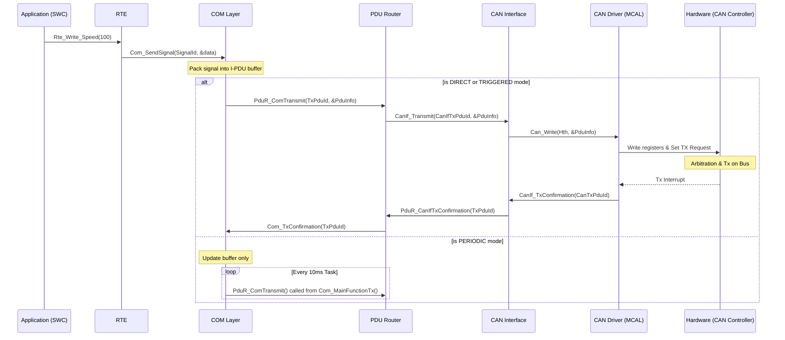

# TÀI LIỆU DEEP DIVE: COM STACK END-TO-END TRACE

Tài liệu này cung cấp cái nhìn chi tiết và sâu sắc về kiến trúc truyền nhận dữ liệu (COM Stack) trong AUTOSAR, từ mức ứng dụng (Application Layer - SWC) cho đến khi tín hiệu điện tử được truyền/nhận trên đường truyền CAN.

## 1. Transmit Path — Luồng Truyền Dữ Liệu Từng Bước (Function Calls)

Quá trình truyền một tín hiệu (ví dụ: Tốc độ xe - `Speed`) từ một Software Component (SWC) xuống Bus CAN trải qua nhiều lớp phần mềm (layers), mỗi lớp thực hiện một chức năng đóng gói và định tuyến chuyên biệt.

```
SWC Runnable gọi:
Rte_Write_PpSpeed_Speed(100)   → SWC muốn gửi Speed=100 km/h
  │ (Generated RTE code)
  ▼
Com_SendSignal(ComConf_Signal_Speed, &value)
  │ - Lớp COM (Communication) nhận tín hiệu.
  │ - Serialize (đóng gói) giá trị vào I-PDU (Interaction Layer PDU) buffer theo cấu hình (Big/Little Endian).
  │ - Kiểm tra Send Mode cấu hình cho I-PDU này: DIRECT / PERIODIC / TRIGGERED.
  │ - DIRECT: Gọi PduR_ComTransmit() ngay lập tức để đẩy xuống layer dưới.
  │ - PERIODIC: Chỉ cập nhật buffer, chờ task định kỳ Com_MainFunctionTx() (ví dụ mỗi 10ms) gọi PduR_ComTransmit().
  ▼
PduR_ComTransmit(PduId, &PduInfo)
  │ - Lớp PduR (PDU Router) chịu trách nhiệm định tuyến.
  │ - Tra cứu Routing Table (Bảng định tuyến): PduId từ COM → Đích đến là lớp nào (CanIf, LinIf, FrIf).
  │ - Có thể định tuyến tới nhiều bus (Multicast: CAN1, CAN2) nếu cấu hình gateway.
  ▼
CanIf_Transmit(CanIfTxPduId, &PduInfo)
  │ - Lớp CanIf (CAN Interface) trừu tượng hóa phần cứng CAN.
  │ - Tra cứu HTH (Hardware Transmit Handle) tương ứng với TxPduId.
  │ - Basic SW Filter: Kiểm tra trạng thái của CAN Controller (nếu đang SLEEP/STOPPED → Reject request).
  │ - Gọi API của lớp driver MCAL.
  ▼
Can_Write(Hth, &PduInfo)
  │ - Lớp CAN Driver (MCAL) tương tác trực tiếp với thanh ghi vi điều khiển.
  │ - Tìm kiếm một Mailbox (Tx Buffer) đang trống (free) trong CAN Controller.
  │ - Ghi các thông số: CAN ID, DLC (Data Length Code), và payload (Data) vào thanh ghi của mailbox.
  │ - Set TX request bit (ví dụ TXRQ trong thanh ghi điều khiển) để yêu cầu phần cứng bắt đầu truyền.
  ▼
[CAN Controller Hardware]
  - Phần cứng tự động thực hiện arbitration (phân xử bit) và truyền frame lên bus CAN vật lý.
  - Sau khi truyền thành công (nhận được ACK từ các node khác), phần cứng trigger ngắt TX (TX Interrupt).
  ▼
Can_TxConfirmation_ISR()
  │ - Trình phục vụ ngắt TX (Interrupt Service Routine) của CAN Driver.
  │ - Xóa cờ ngắt, đọc mailbox nào vừa gửi xong.
  ▼
CanIf_TxConfirmation(CanTxPduId)
  │ - Báo cáo ngược lên lớp CanIf.
  ▼
PduR_CanIfTxConfirmation(PduId)
  │ - Báo cáo ngược lên lớp PduR.
  ▼
Com_TxConfirmation(PduId)
    - Đánh dấu quá trình truyền I-PDU đã hoàn tất, có thể trigger thông báo lên RTE/SWC nếu được cấu hình.
```

## 2. Receive Path — Luồng Nhận Dữ Liệu Từng Bước

Luồng nhận diễn ra khi có một frame xuất hiện trên đường truyền CAN. Phần cứng CAN Controller sẽ lọc (hardware filter) và đẩy vào Rx Mailbox, sau đó trigger ngắt.

```
[CAN Frame arrives on bus]
  |
  ▼
Can_Rx_ISR (Category 2 ISR)
  ├── Trình phục vụ ngắt RX của MCAL đọc thanh ghi mailbox: ID, DLC, Data payload.
  └── Xóa cờ ngắt và gọi CanIf_RxIndication().
        |
        ▼
      CanIf_RxIndication(HrhId, CanId, &PduInfo)
        ├── Lớp CanIf thực hiện Software Acceptance Filter: Kiểm tra xem CAN ID nhận được có thuộc khoảng (range) hợp lệ không.
        ├── CanIf_HrhSearchForFilter() → Tìm kiếm PDU tương ứng (RxPduId).
        └── Gọi PduR_CanIfRxIndication().
              |
              ▼
            PduR_CanIfRxIndication(RxPduId, &PduInfo)
            - PduR tra cứu Routing Table: Frame này là I-PDU cho COM hay N-PDU cho CanTp.
            - Nếu là tín hiệu thông thường, route tới COM:
            Com_RxIndication(ComRxPduId, &PduInfo)
              |
              ▼
            Com_RxIndication() / COM Layer:
            - COM copy payload vào internal buffer.
            - Khi cần, COM unpack (giải nén) tín hiệu từ buffer:
            Com_ReceiveSignal(ComConf_Signal_Speed, &value)
              |
              ▼
            RTE Layer:
            - Tùy cấu hình, RTE có thể được thông báo qua flag (Event-driven) hoặc trực tiếp đọc giá trị qua hàm API (Polling).
            Rte_Read_RpSpeed_Speed(&value)  ← SWC (Application) gọi để lấy giá trị tốc độ.
```

## 3. Signal Packing — Bit Operations & Byte Ordering

Dữ liệu truyền đi thường được đóng gói (pack) thành các I-PDU. Mỗi tín hiệu chiếm một số bit nhất định. Quá trình này đòi hỏi xử lý endianness.

- **Big Endian (Motorola):** Byte có trọng số cao (Most Significant Byte - MSB) được lưu ở địa chỉ thấp (được gửi đi trước).
- **Little Endian (Intel):** Byte có trọng số thấp (Least Significant Byte - LSB) được lưu ở địa chỉ thấp (được gửi đi trước).

**Ví dụ cụ thể:** Tín hiệu `Speed` là số nguyên không dấu 16-bit (0-65535). PDU dài 8 bytes. `Speed` được cấu hình nằm ở Byte 0 và Byte 1.
Giả sử `Speed = 1000` (Hex: `0x03E8`).
- **Intel (Little Endian):**
  - Byte 0 (LSB): `0xE8`
  - Byte 1 (MSB): `0x03`
  - I-PDU Payload: `[E8, 03, xx, xx, xx, xx, xx, xx]`
- **Motorola (Big Endian):**
  - Byte 0 (MSB): `0x03`
  - Byte 1 (LSB): `0xE8`
  - I-PDU Payload: `[03, E8, xx, xx, xx, xx, xx, xx]`

Mã nguồn C của module COM thường sử dụng các macro và phép toán bit (shift `<<`, `>>`, và mask `&`) để tách ghép các tín hiệu không tròn byte (ví dụ tín hiệu 3-bit, 12-bit) một cách chính xác mà không làm ảnh hưởng đến các tín hiệu liền kề trong cùng PDU.

## 4. Send Modes (Chế Độ Gửi)

Lớp COM hỗ trợ nhiều chiến lược gửi I-PDU khác nhau, phụ thuộc vào bản chất của tín hiệu:
- **DIRECT:** Khi RTE ghi tín hiệu (`Rte_Write`), COM lập tức gọi PduR để truyền đi. Dùng cho các sự kiện khẩn cấp (như cảnh báo va chạm).
- **PERIODIC:** I-PDU được gửi định kỳ dựa trên một bộ đếm thời gian trong `Com_MainFunctionTx()` (ví dụ 10ms/lần). Dùng cho các tín hiệu liên tục như Tốc độ xe, Nhiệt độ.
- **TRIGGERED:** Việc truyền chỉ xảy ra khi giá trị của tín hiệu thay đổi (Change of Data - CoD). Giúp tiết kiệm băng thông bus.
- **MIXED:** Kết hợp PERIODIC và TRIGGERED. I-PDU được gửi định kỳ, nhưng nếu tín hiệu có sự thay đổi đột ngột, nó cũng được gửi ngay lập tức.

## 5. Phân Loại PDU (Protocol Data Unit)

Trong kiến trúc AUTOSAR phân tầng, dữ liệu đi qua mỗi tầng được gọi bằng một tên PDU khác nhau:
- **I-PDU (Interaction Layer PDU):** Tồn tại từ lớp COM. Đây là gói dữ liệu chứa các Signal đã được pack. (Ví dụ: `Com_PduId`).
- **N-PDU (Network Layer PDU):** Tồn tại khi đi qua CanTp (CAN Transport Layer). Nếu I-PDU lớn hơn 8 bytes (hoặc 64 bytes với CAN-FD), CanTp chia nhỏ I-PDU thành nhiều N-PDU.
- **L-PDU (Link Layer PDU):** Tồn tại ở lớp CanIf và CAN Driver. Đây là cấu trúc frame hoàn chỉnh chuẩn bị được đẩy lên bus cứng (gồm CAN ID, DLC, Data).

## 6. CanTp Multi-frame (Quản lý PDU > 8 Bytes)

Khi lớp COM cần gửi một I-PDU có kích thước ví dụ 20 bytes trên bus CAN chuẩn (giới hạn 8 bytes payload), lớp **CanTp (CAN Transport Layer)** can thiệp để thực hiện Segmentation (phân mảnh) khi truyền và Reassembly (tái tạo) khi nhận (Theo chuẩn ISO 15765-2).

- **First Frame (FF):** N-PDU đầu tiên, chứa metadata về tổng kích thước thông điệp (Total Length) và một phần dữ liệu đầu tiên.
- **Flow Control (FC):** Node nhận phản hồi bằng một frame FC, báo hiệu "Tôi đã sẵn sàng nhận, hãy gửi tiếp" cùng với các thông số:
  - `BS` (Block Size): Số lượng frame được phép gửi liên tiếp trước khi phải chờ FC tiếp theo.
  - `STmin` (Separation Time Minimum): Thời gian delay tối thiểu giữa 2 frame liên tiếp.
- **Consecutive Frame (CF):** Các frame tiếp theo mang phần dữ liệu còn lại. Mỗi CF mang một sequence number (SN) 4-bit (0-15) để kiểm tra thứ tự.

## 7. Các Kịch Bản Gỡ Lỗi Điển Hình (Debug Scenarios)

1. **Tín hiệu không xuất hiện trên CAN bus:**
   - Đặt breakpoint từ trên xuống dưới: `Com_SendSignal` → `PduR_ComTransmit` → `CanIf_Transmit` → `Can_Write`.
   - Xem bị rớt ở đâu. Ví dụ rớt ở CanIf do trạng thái mạng chưa chuyển sang `CANIF_CS_STARTED`.
2. **Sai giá trị tín hiệu (vd: gửi 100 nhận 25600):**
   - Vấn đề endianness (Byte order mismatch). Tín hiệu được pack ở định dạng Intel nhưng config ở node nhận đang cấu hình Motorola.
3. **Mất gói tin (Frame drop) ở Tx:**
   - Tx Buffer (Mailboxes) đầy do gửi quá nhanh hoặc Bus Off (CAN controller lỗi vật lý). `Can_Write` trả về `CAN_BUSY`.
4. **Không nhận được tín hiệu (Reception miss):**
   - Kiểm tra Software Acceptance Filter trong CanIf hoặc Hardware Filter Mask trong MCAL config chặn mất CAN ID đó.

## 8. Sơ Đồ Tuần Tự (Mermaid Sequence Diagram) cho Transmit Path



## 9. Vị trí Code (Source Code Mapping)

Tham chiếu mã nguồn trong các dự án AUTOSAR tiêu chuẩn (như Arctic Core, EB Tresos, Vector MICROSAR):
- **COM:** `as/com/as.infrastructure/communication/Com/Com.c` (Hàm `Com_SendSignal`, `Com_RxIndication`, `Com_MainFunctionTx`)
- **PduR:** `as/com/as.infrastructure/communication/PduR/PduR.c` (Bảng định tuyến `PduR_RoutingPath`, hàm `PduR_ComTransmit`)
- **CanIf:** `as/com/as.infrastructure/communication/CanIf/CanIf.c` (Quản lý trạng thái, hàm `CanIf_Transmit`, `CanIf_RxIndication`)
- **CAN MCAL:** `as/com/as.infrastructure/arch/stm32f1/mcal/Can.c` (Tương tác thanh ghi STM32 bxCAN: `Can_Write`, `Can_Isr`)

## 10. 20 Câu Hỏi Phỏng Vấn (Interview Q&A)

1. **Q:** Sự khác biệt giữa I-PDU và N-PDU là gì?
   **A:** I-PDU do lớp COM quản lý, chứa các tín hiệu ứng dụng. N-PDU do CanTp quản lý, chứa (các phân mảnh) của I-PDU phục vụ việc truyền frame lớn.
2. **Q:** Lớp PduR có chức năng cốt lõi gì?
   **A:** Định tuyến tĩnh (Static routing) PDU giữa các module (ví dụ COM ↔ CanIf, CanTp ↔ CanIf, CanIf ↔ LinIf cho gateway).
3. **Q:** Mô tả cơ chế CanTp First Frame và Flow Control?
   **A:** FF mang chiều dài tổng của message đa frame. Đầu nhận trả lại FC báo Block Size và Thời gian chờ tối thiểu (STmin) để điều tiết luồng dữ liệu.
4. **Q:** "Change of Data" (CoD) send mode hoạt động ra sao?
   **A:** Lớp COM so sánh giá trị mới từ RTE với giá trị cũ trong buffer, nếu khác nhau, nó trigger gửi I-PDU ngay.
5. **Q:** Acceptance Filter trong phần cứng CAN khác gì Software Filter trong CanIf?
   **A:** Hardware filter nằm ở thanh ghi CAN Controller (MCAL), loại bỏ rác từ bus, giảm ngắt. Software filter ở CanIf tinh chỉnh lại đảm bảo message này thực sự dành cho node (vì HW filter đôi khi dùng mask rộng lọt frame không cần).
6. **Q:** Tại sao cần `Com_TxConfirmation`?
   **A:** Để báo cho tầng trên (nếu cấu hình) biết frame đã lên bus thành công (hữu ích cho chẩn đoán lỗi đường truyền).
7. **Q:** Endianness ảnh hưởng thế nào đến tín hiệu 12-bit bắt đầu từ vị trí bit lẻ?
   **A:** Rất phức tạp. Intel (Little) sắp xếp LSB của tín hiệu vào bit thấp của byte thấp. Motorola sắp xếp MSB vào bit cao của byte thấp. Quá trình pack phải dùng mask và shift cực kì cẩn thận.
8. **Q:** Làm thế nào để biết một tín hiệu mất timeout (không nhận được)?
   **A:** Lớp COM có cơ chế Deadline Monitoring (ComTimeout). Nếu quá thời gian cấu hình không có RxIndication, COM sẽ báo lỗi hoặc set tín hiệu về giá trị mặc định (InitValue).
9. **Q:** CanIfTxPduId và CanTxPduId có giống nhau không?
   **A:** Không, chúng là index ảo. CanIfTxPduId dùng giữa PduR và CanIf. CanTxPduId dùng giữa CanIf và MCAL. CanIf giữ bảng ánh xạ giữa chúng.
10. **Q:** Tại sao hàm `Can_Write` lại có thể trả về `CAN_BUSY`?
    **A:** Khi toàn bộ Hardware Tx Mailboxes của vi điều khiển đang chứa các frame chưa kịp gửi đi (do bus quá tải hoặc node bị mất liên kết vật lý).
11. **Q:** Signal Group là gì trong COM?
    **A:** Là một tập hợp các tín hiệu cần được xử lý một cách nguyên tử (atomic) và đồng bộ với nhau (Complex data types).
12. **Q:** Lớp nào chịu trách nhiệm đánh thức mạng (Network Wakeup) nếu nhận được CAN frame lúc đang sleep?
    **A:** CAN Transceiver hardware tạo ngắt, CanIf/CanNm (Network Management) xử lý và thông báo trạng thái Wakeup.
13. **Q:** Polling và Interrupt trong RX path khác nhau thế nào?
    **A:** Interrupt: Can_Rx_ISR ngay lập tức khi frame tới. Polling: OS task định kỳ quét cờ RX trong thanh ghi để giảm over-head ngắt (dùng trong môi trường noise cao).
14. **Q:** Gateway message khác gì local message trong PduR?
    **A:** Local message định tuyến lên/xuống giữa COM/CanTp và CanIf. Gateway định tuyến ngang giữa 2 interface (vd: CanIf_CAN1 sang CanIf_CAN2).
15. **Q:** HTH và HRH là gì?
    **A:** Hardware Transmit Handle / Hardware Receive Handle. Cấu trúc ảo trỏ tới các Mailbox cụ thể trong phần cứng.
16. **Q:** Khi PDU truyền từ CanIf lên PduR, PduInfo (Data pointer, Length) được phân bổ bộ nhớ ở đâu?
    **A:** Thường tham chiếu trực tiếp đến địa chỉ vùng nhớ RAM của Hardware Mailbox hoặc buffer nội bộ của CanIf. Lớp trên chỉ đọc.
17. **Q:** Làm sao để ưu tiên một I-PDU quan trọng?
    **A:** Gán cho I-PDU đó một CAN ID có giá trị số nhỏ (ưu tiên cao trong arbitration của CAN hardware).
18. **Q:** `Com_MainFunctionTx` vs `Com_MainFunctionRx` làm gì?
    **A:** Là các Scheduled Tasks (chạy nền). Tx để trigger các frame định kỳ, Rx để kiểm tra Deadline Monitoring (timeout tín hiệu).
19. **Q:** Dynamic PDU là gì?
    **A:** PDU có chiều dài không cố định, phụ thuộc vào lúc runtime (như các gói chẩn đoán UDS).
20. **Q:** Xử lý lỗi Bus Off diễn ra ở đâu?
    **A:** MCAL phát hiện (qua thanh ghi báo lỗi). Báo cho CanIf, CanIf báo lên CanSM (State Manager) để yêu cầu restart hoặc tắt module CAN.

---
*Tài liệu được biên soạn dành cho Senior/Principal BSW Engineer.*
