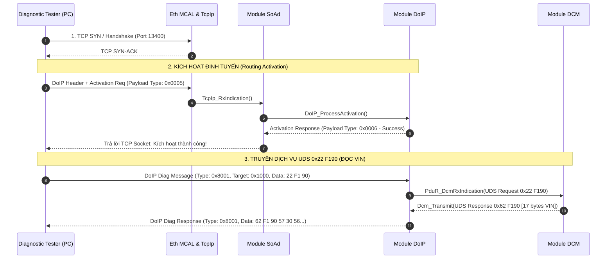

# LỜI GIẢI TOÀN DIỆN CHUYÊN ĐỀ LIN & AUTOMOTIVE ETHERNET
## Đáp Án Thực Hành Chi Tiết 6 Tầng: Giao Thức LIN (Task 7.1 - 7.4) & Automotive Ethernet / SOME/IP / DoIP (Task 8.1 - 8.4)

> 📚 **Tài liệu lý thuyết đối chiếu:**  
> • [`docs/theory/11_LIN_Protocol_And_LinStack_Deep_Dive.md`](file:///C:/Users/liem.vu/Liem.vuOD/Study_AUTOSAR-main/docs/theory/11_LIN_Protocol_And_LinStack_Deep_Dive.md)  
> • [`docs/theory/12_Automotive_Ethernet_SOMEIP_DoIP_Deep_Dive.md`](file:///C:/Users/liem.vu/Liem.vuOD/Study_AUTOSAR-main/docs/theory/12_Automotive_Ethernet_SOMEIP_DoIP_Deep_Dive.md)  
> 🔧 **Mã nguồn gốc đối chiếu:** [`as/com/as.infrastructure/communication/Lin/`](file:///C:/Users/liem.vu/Liem.vuOD/Study_AUTOSAR-main/as/com/as.infrastructure/communication/Lin/) & [`as/com/as.infrastructure/communication/Eth/`](file:///C:/Users/liem.vu/Liem.vuOD/Study_AUTOSAR-main/as/com/as.infrastructure/communication/Eth/)  
> 📑 **Tệp cấu hình gốc:** [`as/com/as.application/common/autosar.arxml`](file:///C:/Users/liem.vu/Liem.vuOD/Study_AUTOSAR-main/as/com/as.application/common/autosar.arxml)

---

# PHẦN 1: LỜI GIẢI CHUYÊN ĐỀ 07 — LIN PROTOCOL & LINSTACK

---

## 📡 LỜI GIẢI TASK 7.1: Trace Dòng Chảy Frame Gốc `LIN_TX_MSG1` Xuyên Suốt 6 Tầng (Tx Path)

> 💡 **Khởi tạo gói tin LIN Master Tx gốc trong cấu hình dự án (`autosar.arxml`):**  
> Trong `as/com/as.application/common/autosar.arxml` (Dòng 394), gói tin `LIN_TX_MSG1` được cấu hình phát chu kỳ mỗi 100ms với Signal `LIN_TX_MSG1_DATA` (64-bit Big Endian).

### 1. Chuỗi Gọi Hàm Function-Call-Function Chiều Gửi LIN (Tx Call Graph Gốc):

```
1. [APPLICATION SWC / BCM CONTROLLER]
   SWC_Wiper.c -> Ghi tín hiệu tốc độ gạt mưa vào Signal
        │
        ├── Com_SendSignal(COM_SID_LIN_TX_MSG1_DATA, &txData)
        └── (Hoặc chu kỳ COM tự động đếm timer trong Task BSW)
                │
                ▼
2. [BSW COM LAYER (Interaction Layer)]
   TASK(SchM_BswService) -> Com_MainFunctionTx() (Com_Sched.c: L98)
        │
        └── Khi hết 100ms -> Com_Internal_TriggerIPduSend(COM_ID_LIN_TX_MSG1) (Com_Com.c: L198)
                │
                └── [DÒNG 236]: Gọi PduR_ComTransmit(PDUR_ID_LIN_TX_MSG1, &PduInfoPackage)
                        │
                        ▼
3. [PDU ROUTER LAYER (PduR)]
   PduR_ComTransmit() -> PduR_ARC_RouteTransmit() (PduR_Routing.c: L59)
        │
        └── Tra bảng định tuyến: Source Com -> Destination LinIf (autosar.arxml: L340)
            ──► Gọi LinIf_Transmit(LINIF_ID_LIN_TX_MSG1, PduInfoPtr)
                │
                ▼
4. [LIN INTERFACE LAYER (LinIf)]
   LinIf_Transmit() / LinIf_MainFunction() (as/com/as.infrastructure/communication/Lin/LinIf.c)
        │
        ├── 1. Lưu Data vào bộ đệm Tx Buffer của kênh LIN
        ├── 2. Tra bảng Schedule Table đến khe thời gian tương ứng
        └── 3. Tính toán Protected Identifier PID = LinIf_CalculatePID(FrameId)
                │
                ▼
5. [MCAL LIN DRIVER & HARDWARE UART]
   Lin_SendFrame(Channel, &PduInfo) (as/com/as.infrastructure/communication/Lin/Lin.c)
        │
        ├── 1. Kéo chân UART TX xuống mức 0 trong ≥ 13 bit times (Gửi Break Field)
        ├── 2. Gửi Sync Byte cố định: 0x55 (Đồng bộ tốc độ baud cho Slave)
        ├── 3. Gửi PID Byte (Frame ID + 2 Parity bits)
        └── 4. Gửi 8 Data Bytes + Checksum Byte (Enhanced Checksum) ra đường dây đơn LIN 12V!
```

---

### 2. Trích Dẫn Mã Nguồn Gốc Minh Chứng Cho `LIN_TX_MSG1`:

* **Khai báo trong `autosar.arxml` (Dòng 394-398):**
  ```xml
  <IPdu Name="LIN_TX_MSG1" PduRef="LIN_TX_MSG1" Direction="SEND" 
        PduSize="8" PduGroupRef="PduGroup1" TxMode="PERIODIC" TimePeriodFactor="100">
      <Signal Name="LIN_TX_MSG1_DATA" StartBit="7" Size="64" Endianess="BIG_ENDIAN" />
  </IPdu>
  ```

* **PduR Routing trong `autosar.arxml` (Dòng 338-340):**
  ```xml
  <Source Module="Com" Name="LIN_TX_MSG1" PduRef="LIN_TX_MSG1" />
  <Destination Module="LinIf" Name="Destination1" PduRef="LIN_TX_MSG1" />
  ```

* **MCAL Driver trong `Lin.c`:**
  ```c
  Std_ReturnType Lin_SendFrame(uint8 Channel, const Lin_PduType* PduInfoPtr)
  {
      /* 1. Gửi Break Field qua phần cứng UART */
      UART_SendBreak(Channel);
      /* 2. Gửi Sync Byte 0x55 */
      UART_WriteByte(Channel, 0x55);
      /* 3. Gửi Protected Identifier */
      UART_WriteByte(Channel, PduInfoPtr->Pid);
      /* 4. Truyền payload dữ liệu nếu Master phát Response */
      if (PduInfoPtr->Drc == LIN_MASTER_RESPONSE) {
          for(int i = 0; i < PduInfoPtr->Dl; i++) {
              UART_WriteByte(Channel, PduInfoPtr->SduPtr[i]);
          }
          UART_WriteByte(Channel, Lin_CalculateChecksum(PduInfoPtr));
      }
      return E_OK;
  }
  ```

---

## 📥 LỜI GIẢI TASK 7.3: Trace Dòng Chảy Frame Gốc `LIN_RX_MSG1` Chiều Nhận (Rx Path)

```
1. [HARDWARE UART & MCAL LIN DRIVER]
   UART RX Interrupt nhận đủ 8 bytes từ Slave phản hồi (LIN_RX_MSG1)
   Lin_GetStatus(Channel, &SduPtr) -> Báo trạng thái LIN_RX_OK
        │
        ▼
2. [LIN INTERFACE (LinIf)]
   LinIf_MainFunction() / LinIf_RxIndication()
        │
        └── Kiểm tra Checksum hợp lệ -> Gọi PduR_LinIfRxIndication(PDUR_ID_LIN_RX_MSG1, &PduInfo)
                │
                ▼
3. [PDU ROUTER (PduR)]
   PduR_LinIfRxIndication() -> Tra bảng định tuyến chuyển tiếp lên COM
        └── Gọi Com_RxIndication(COM_ID_LIN_RX_MSG1, PduInfoPtr)
                │
                ▼
4. [BSW COM LAYER]
   Com_RxIndication() -> Com_RxProcessSignals()
        └── Lưu 8 bytes dữ liệu (LIN_RX_MSG1_DATA) vào RAM buffer và reset Deadline Monitor Timer!
```

---

# PHẦN 2: LỜI GIẢI CHUYÊN ĐỀ 08 — AUTOMOTIVE ETHERNET, SOME/IP & DoIP

---

## 🌐 LỜI GIẢI TASK 8.1: Trace Dòng Chảy Gói Tin Socket Gốc `SOAD_TX` / `SOAD_RX` (UDS Over Ethernet)

> 💡 **Khởi tạo gói tin Socket gốc trong cấu hình dự án (`autosar.arxml`):**  
> Trong `as/com/as.application/common/autosar.arxml` (Dòng 77 & 300), gói tin `SOAD_TX` được định cấu hình là kênh truyền chẩn đoán UDS từ module `Dcm` qua tầng Socket Adaptor (`SoAdTp`).

### 1. Chuỗi Gọi Hàm Function-Call-Function Chiều Gửi Ethernet Socket (Tx Call Graph Gốc):

```
1. [DIAGNOSTIC SERVICE (DCM)]
   Dcm_ProcessingDone() -> Chuẩn bị gói phản hồi UDS (Ví dụ 0x62 F190 - Trả lời số VIN)
   (as/com/as.infrastructure/diagnostic/Dcm/Dcm.c)
        │
        └── Gọi PduR_DcmTransmit(PDUR_ID_DCM_SOAD_TX, &PduInfo) (autosar.arxml: L300)
                │
                ▼
2. [PDU ROUTER LAYER (PduR)]
   PduR_DcmTransmit() -> Tra bảng định tuyến chuyển tiếp sang SoAdTp
        │
        └── [autosar.arxml: L302]: Gọi SoAd_IfTransmit(SOAD_TX_PDU_ID, PduInfoPtr)
                │
                ▼
3. [SOCKET ADAPTOR LAYER (SoAd)]
   SoAd_IfTransmit() (as/com/as.infrastructure/communication/SoAd/SoAd.c)
        │
        ├── 1. Tra bảng SoAd_PduRoute: Ánh xạ SOAD_TX sang Socket Connection ID (TCP/IP)
        ├── 2. Xác định đích: IP 192.168.1.100, Port 13400 (DoIP Port)
        └── 3. Gọi TcpIp_Transmit(SocketId, PduInfoPtr->SduDataPtr, PduInfoPtr->SduLength)
                │
                ▼
4. [TCPIP STACK & ETHERNET INTERFACE (EthIf)]
   TcpIp_Transmit() -> Đóng gói TCP/IP Header -> Gọi EthIf_Transmit(EthCtrlIdx, &EthPdu)
        │
        └── Gắn MAC Source, MAC Destination, VLAN Tag (IEEE 802.1Q)
                │
                ▼
5. [MCAL ETHERNET DRIVER (Eth) & HARDWARE]
   Eth_Transmit(CtrlIdx, BufIdx, FrameType, TxConfirmation, Len, DestMac)
   (as/com/as.infrastructure/communication/Eth/Eth.c)
        └── Ghi gói tin vào DMA Ring Descriptor và kích hoạt phần cứng phát xung vi sai 100BASE-T1!
```

---

## 🛠️ LỜI GIẢI TASK 8.3: Sequence Trace Chẩn Đoán DoIP (ISO 13400) Handshake & Flashing



---

### 🔄 BẢNG ĐỐI CHIẾU 3 GIAO THỨC TRUYỀN THÔNG CỐT LÕI TRONG DỰ ÁN `as`:

| Tầng Kiến Trúc | 🚗 Giao Thức CAN (`0x101 / 0x401`) | 🪟 Giao Thức LIN (`LIN_TX_MSG1`) | 🌐 Giao Thức Ethernet (`SOAD_TX`) |
| :--- | :--- | :--- | :--- |
| **1. Application** | Táp-lô / Động cơ | Gạt mưa / Cửa sổ | Chẩn đoán Flashing / Camera ADAS |
| **2. Management** | `CanSM` / `CanNm` | `LinSM` (Schedule Table Switch) | `EthSM` / `DoIP` / `SOME/IP-SD` |
| **3. Interface** | `CanIf_Transmit()` | `LinIf_Transmit()` | `SoAd_IfTransmit()` $\rightarrow$ `EthIf` |
| **4. Transport** | `CanTp` (ISO 15765-2) | `LinTp` (ISO 17987-2) | `TcpIp` (TCP/UDP) |
| **5. MCAL Driver** | `Can_Write()` | `Lin_SendFrame()` (UART Break/Sync) | `Eth_Transmit()` (DMA MAC Ring) |
| **6. Phần cứng** | Cặp dây xoắn $CAN_H/CAN_L$ | 1 dây đơn 12V (19.2 kbps) | 1 cặp dây BroadR-Reach (100 Mbps) |

---

