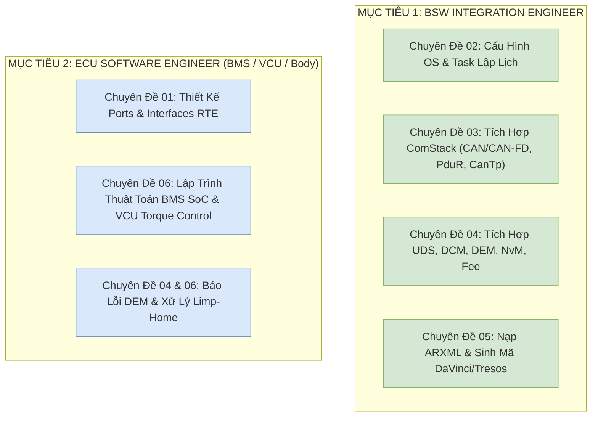

# AUTOSAR Classic Master Engineering Handbook & Career Roadmap
## Bản Đồ Định Hướng Kỹ Nghệ Chuyên Sâu: BSW Integration Engineer & ECU Software Engineer (BMS / VCU / Body)

> **Ngôn ngữ:** Tiếng Việt Kỹ Nghệ Chuẩn Mực  
> **Định hướng nghề nghiệp mục tiêu:**  
> 1. **BSW Integration Engineer** *(Kỹ sư tích hợp & cấu hình ngăn xếp BSW, ARXML, RTE)*  
> 2. **ECU Software Engineer (BMS / VCU / Body)** *(Kỹ sư lập trình thuật toán điều khiển ứng dụng ô tô)*  
> **Các tập đoàn mục tiêu:** VinFast, FPT Automotive, Bosch BGSV, LG Vehicle Solutions, Hyundai Kefico  
> **Kho mã nguồn đối chiếu thực tế:** [Study_AUTOSAR-main/as/](file:///C:/Users/liem.vu/Liem.vuOD/Study_AUTOSAR-main/as) (2.190+ tệp C/H, ARXML, Tools)  
> **Thư mục tài liệu:** [Study_AUTOSAR-main/docs/](file:///C:/Users/liem.vu/Liem.vuOD/Study_AUTOSAR-main/docs)  

---

## 1. Ma Trận Đọc Học Thuật Trọng Tâm (Laser-Focused Curriculum)

Tất cả các chuyên đề đã được tinh lọc để **tập trung 100% vào năng lực làm việc thực tế của BSW Integrator và ECU Developer**, loại bỏ toàn bộ các kiến thức lan man:

| Thứ Tự | Tên Chuyên Đề Masterclass | Trọng Số | Vai Trò & Kiến Thức Cốt Lõi Cần Làm Chủ |
|:---:|---|:---:|---|
| **01** | [01_AUTOSAR_Layered_Architecture_And_VFB_Masterclass.md](file:///C:/Users/liem.vu/Liem.vuOD/Study_AUTOSAR-main/docs/01_AUTOSAR_Layered_Architecture_And_VFB_Masterclass.md) | **10.0 / 10** | • **Nền tảng phân tầng BSW**: Ranh giới giữa MCAL, ECU Abstraction, Service Layer, RTE, SWC. • **Triết lý VFB & Cơ chế Port**: Sender-Receiver, Client-Server, Parameter, Mode-Switch. • **Mã nguồn:** `include/Std_Types.h`, `include/Compiler.h`, `include/Rte.h`. |
| **02** | [02_AUTOSAR_OS_And_MCAL_Deep_Dive.md](file:///C:/Users/liem.vu/Liem.vuOD/Study_AUTOSAR-main/docs/02_AUTOSAR_OS_And_MCAL_Deep_Dive.md) | **9.5 / 10** | • **Cấu hình OS tĩnh**: Basic Task (dùng chung stack) vs Extended Task (WaitEvent, stack riêng). • **Tránh Deadlock/Inversion**: Priority Ceiling Protocol (PCP), ISR Cat 1 vs Cat 2. • **7 Driver MCAL cốt lõi**: `Port` (chạy đầu tiên), `Dio`, `Gpt`, `Adc`, `Spi`, `Can`, `Wdg`. • **Mã nguồn:** `include/Dio.h`, `include/Port.h`, `include/Gpt.h`, `include/Can.h`. |
| **03** | [03_Communication_Stack_And_CAN_Protocol.md](file:///C:/Users/liem.vu/Liem.vuOD/Study_AUTOSAR-main/docs/03_Communication_Stack_And_CAN_Protocol.md) | **10.0 / 10** | • **Giao thức CAN & CAN-FD**: Điện áp vi sai 120Ω, Bit Timing, Fault Confinement (TEC/REC $\rightarrow$ Bus-Off). • **ComStack End-to-End**: `COM` (Signal packing/Deadline monitoring) $\rightarrow$ `PduR` (Routing 1:1, 1:N) $\rightarrow$ `CanTp` (ISO 15765-2 phân mảnh SF/FF/CF/FC) $\rightarrow$ `CanIf` (HTH/HRH) $\rightarrow$ `Can`. • **Mã nguồn:** `communication/CanIf/`, `CanTp/`, `PduR/`, `Com/`. |
| **04** | [04_Diagnostic_UDS_And_Memory_Stack.md](file:///C:/Users/liem.vu/Liem.vuOD/Study_AUTOSAR-main/docs/04_Diagnostic_UDS_And_Memory_Stack.md) | **9.5 / 10** | • **Chẩn đoán UDS ISO 14229**: Ma trận dịch vụ `0x10`, `0x11`, `0x14`, `0x19`, `0x22`, `0x2E`, `0x27` (Seed/Key), `0x31`, Phản hồi âm NRC `0x7F`. • **DCM & DEM**: Giải mã 8-bit DTC Status Byte, Debounce Counter, Freeze Frame Snapshot. • **Memory Stack**: `NvM` (Native, Redundant, Dataset), `NvM_ReadAll`/`WriteAll`, `Fee` (Wear Leveling). • **Mã nguồn:** `diagnostic/Dcm/`, `diagnostic/Dem/`, `memory/NvM/`, `memory/Fee/`. |
| **05** | [05_Toolchain_ARXML_And_ECU_Integration.md](file:///C:/Users/liem.vu/Liem.vuOD/Study_AUTOSAR-main/docs/05_Toolchain_ARXML_And_ECU_Integration.md) | **9.5 / 10** | • **ARXML Engineering**: `System.arxml`, `EcuExtract.arxml`, `SWCD.arxml`, `BSWMD.arxml`. • **Chu trình khởi động ECU**: `EcuM_Init` $\rightarrow$ `StartOS` $\rightarrow$ `EcuM_StartupTwo` $\rightarrow$ `Rte_Start`. • **An toàn WdgM**: Alive, Deadline, Logical Supervision. • **Bộ 50 câu hỏi phỏng vấn thực chiến (Easy $\rightarrow$ Hard)**. |
| **06** | [06_Real_World_ECU_Applications_BMS_VCU_Body.md](file:///C:/Users/liem.vu/Liem.vuOD/Study_AUTOSAR-main/docs/06_Real_World_ECU_Applications_BMS_VCU_Body.md) | **10.0 / 10** | • **BMS ECU Design**: Thuật toán Coulomb Counting tính SoC %, ngắt rơ-le cao áp, tích hợp DTC DEM. • **VCU ECU Design**: Kiểm tra tín hiệu kép chân ga (Plausibility Check), thuật toán phân bổ mô-men xoắn. • **Body Controller**: Quản trị nguồn EcuM Sleep / CAN Wakeup. • **Kỹ năng BSW Integrator**: Debug Linker, Stack Overflow, Bus CAN nghẽn, kịch bản phỏng vấn tình huống. |

---

## 2. Bản Đồ Phân Bổ Kiến Thức Theo Vị Trí Mục Tiêu

---

*Toàn bộ tài liệu được lưu trữ tại [Study_AUTOSAR-main/docs/](file:///C:/Users/liem.vu/Liem.vuOD/Study_AUTOSAR-main/docs) và liên kết trực tiếp với mã nguồn thực tế tại [Study_AUTOSAR-main/as/](file:///C:/Users/liem.vu/Liem.vuOD/Study_AUTOSAR-main/as).*
