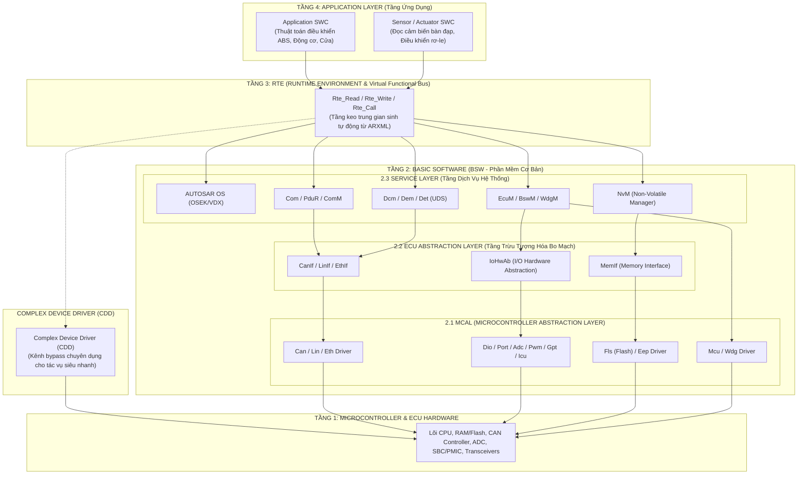
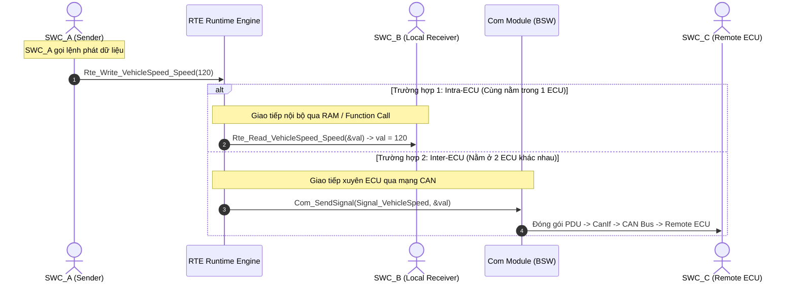

# Chuyên Đề 01: Kiến Trúc Phân Tầng Chuẩn Hóa & Triết Lý Virtual Functional Bus (VFB)
## Masterclass Phân Tích Kiến Trúc AUTOSAR Classic, 4 Tầng BSW, Cơ Chế Trừu Tượng Hóa RTE và Cấu Trúc Software Component (SWC)

> **Ngôn ngữ:** Tiếng Việt Kỹ Nghệ Chuẩn Mực  
> **Cấp độ:** Universal Learning Resource (Từ Newbie đến Expert)  
> **Tiêu chuẩn tham chiếu:** AUTOSAR Classic Platform Release 4.x / R22-11 (`AUTOSAR_EXP_LayeredSoftwareArchitecture`, `AUTOSAR_EXP_VFB`)  
> **Mã nguồn đối chiếu thực tế:** Kho mã nguồn [Study_AUTOSAR-main/as/](file:///C:/Users/liem.vu/Liem.vuOD/Study_AUTOSAR-main/as) (`com/as.infrastructure/`)  
> **Vị trí tài liệu:** [Study_AUTOSAR-main/docs/01_AUTOSAR_Layered_Architecture_And_VFB_Masterclass.md](file:///C:/Users/liem.vu/Liem.vuOD/## Mục Lục
1. [Bối Cảnh Lịch Sử & Động Lực Hình Thành Chuẩn AUTOSAR](#1)
2. [Mô Hình Kiến Trúc Phân Tầng Tổng Quan (Layered Architecture Overview)](#2)
3. [TẦNG 1: Phần Cứng Vi Điều Khiển & Bo Mạch ECU (Microcontroller & ECU Hardware Anatomy)](#3)
4. [TẦNG 2: Phần Mềm Cơ Bản (Basic Software - BSW)](#4)
5. [TẦNG 3: Môi Trường Thực Thi (RTE) & Bus Chức Năng Ảo (VFB)](#5)
6. [TẦNG 4: Tầng Ứng Dụng (Application Layer & Software Components - SWC)](#6)
7. [Bằng Chứng Mã Nguồn & Định Nghĩa Chuẩn Hóa Trong `parai/as`](#7)
8. [Bảng So Sánh Toàn Diện AUTOSAR Classic vs AUTOSAR Adaptive Platform](#8)
9. [Đúc Kết Kiến Trúc & Tiêu Chuẩn Đánh Giá](#9)
10. [Bảng Ánh Xạ Kiến Thức (Knowledge Mapping)](#10)
11. [Real-World Scenarios (Các kịch bản thực tế)](#11)
12. [Common Pitfalls (Những Lỗi Thường Gặp)](#12)
13. [Thực Hành (Hands-On Exercises)](#13)
14. [Câu Hỏi Phỏng Vấn (Interview Questions)](#14)
15. [Phụ Lục Kỹ Thuật Chuyên Sâu (Deep Dive Specifications)](#15)

---

## 📖 Bảng Chú Giải Thuật Ngữ (Glossary)
> 📖 **AUTOSAR** (*AUTOmotive Open System ARchitecture*): Kiến trúc hệ thống mở cho ngành ô tô, tiêu chuẩn hóa phần mềm nhúng.  
> 📖 **VFB** (*Virtual Functional Bus*): Bus chức năng ảo, cơ chế giao tiếp không phụ thuộc phần cứng ở mức thiết kế hệ thống toàn xe.  
> 📖 **RTE** (*Runtime Environment*): Môi trường thực thi, tầng phần mềm trung gian được sinh tự động trên từng hộp ECU.  
> 📖 **SWC** (*Software Component*): Thành phần phần mềm ứng dụng, chứa thuật toán điều khiển độc lập.  
> 📖 **BSW** (*Basic Software*): Phần mềm cơ bản, cung cấp các dịch vụ nền tảng (OS, mạng, bộ nhớ, chẩn đoán).  
> 📖 **MCAL** (*Microcontroller Abstraction Layer*): Tầng trừu tượng hóa vi điều khiển, giao tiếp trực tiếp với thanh ghi chip.  
> 📖 **ECU** (*Electronic Control Unit*): Hộp điều khiển điện tử trên xe.  
> 📖 **OEM** (*Original Equipment Manufacturer*): Nhà sản xuất xe gốc (Ví dụ: VinFast, Toyota, BMW).  
> 📖 **CDD** (*Complex Device Driver*): Trình điều khiển thiết bị phức tạp (Kênh bypass).  
> 📖 **PDU** (*Protocol Data Unit*): Đơn vị dữ liệu giao thức mạng.  
> 📖 **DBC** (*CAN DataBase*): Định dạng file mô tả cấu trúc mạng CAN (ID, Signals, Factor, Offset) dùng làm từ điển giải mã tín hiệu trong các công cụ như CANoe, SavvyCAN (Xem chi tiết tại [10_CAN_DBC_Format_And_Tools.md](10_CAN_DBC_Format_And_Tools.md)).

---

<a id="1"></a>
## 1. Bối Cảnh Lịch Sử & Động Lực Hình Thành Chuẩn AUTOSAR

### 🟢 LEVEL 1: NEWBIE FRIENDLY
💡 **Ẩn dụ thực tế (Real-world analogy):** 
Hãy tưởng tượng trước đây bạn mua một chiếc điện thoại và mỗi ứng dụng (như Camera, Nhắn tin) phải được viết riêng biệt cho từng loại chip, từng loại màn hình cụ thể. Nếu bạn đổi điện thoại sang hãng khác, bạn phải viết lại toàn bộ ứng dụng từ đầu. Đó chính là tình trạng "Spaghetti Code" của ngành ô tô trước 2003. 
AUTOSAR ra đời giống như hệ điều hành Android/iOS: Nó tạo ra một lớp nền tảng chung để ứng dụng (như phần mềm phanh ABS) có thể chạy trên bất kỳ phần cứng (vi điều khiển) nào mà không cần sửa code!

### 🟡 LEVEL 2: INTERMEDIATE
**1.1 Vấn Nạn Phầm Mềm Đóng Trước Năm 2003 (Pre-AUTOSAR Era)**
Trước năm 2003, mỗi OEM và các nhà cung cấp Tier-1 tự phát triển kiến trúc phần mềm vi điều khiển độc quyền riêng biệt (*Proprietary Spaghetti Code*):

```
+-------------------------------------------------------------+
|               TRƯỚC NĂM 2003 (PRE-AUTOSAR)                  |
|                                                             |
|  [Thuật Toán Điều Khiển Phanh ABS / Động Cơ]                |
|       │                                                     |
|       │ (Truy cập trực tiếp thanh ghi vi điều khiển)        |
|       ▼                                                     |
|  [Thanh Ghi Phần Cứng Chip Infineon TriCore / NXP S32K]     |
|                                                             |
|  👉 HỆ QUẢ:                                                 |
|  - Khóa chặt vào nhà cung cấp chip (Vendor Lock-in).        |
|  - Đổi vi điều khiển = Viết lại 100% phần mềm từ đầu.      |
|  - Không thể tái sử dụng (Zero Reusability) giữa các dự án. |
|  - Chi phí tích hợp ECU tăng theo hàm mũ khi xe có 100+ ECU.|
+-------------------------------------------------------------+
```

**1.2 Sự Ra Đời Của Liên Minh AUTOSAR (2003)**
Liên minh AUTOSAR được thành lập với mục tiêu cốt lõi: **"Hợp tác về tiêu chuẩn, cạnh tranh về giải pháp triển khai"** (*Cooperate on standards, compete on implementation*).

Mục tiêu kỹ thuật sống còn:
1. **Tách biệt hoàn toàn Phần Cứng và Phần Mềm (Hardware/Software Decoupling):** Phần mềm thuật toán ứng dụng (*Application SWC*) hoàn toàn độc lập với phần cứng.
2. **Chuẩn hóa giao diện phân tầng (Layered Standardized APIs):** Mọi module BSW đều có API cố định.
3. **Cấu hình tĩnh dựa trên Mô Hình Dữ Liệu (Model-Driven ARXML Configuration):** Toàn bộ bộ nhớ được sinh mã C tự động trước khi biên dịch (*Compile-time Determinism*).

✅ **Best Practice:** Tách biệt triệt để Logic ứng dụng và Giao tiếp phần cứng. Đổi chip = Chỉ thay MCAL, giữ nguyên SWC.

### 🔴 LEVEL 3: EXPERT (Deep Dive)
Mục tiêu cốt lõi của AUTOSAR là đạt được *Hardware/Software Decoupling* và *Compile-time Determinism*.
📊 **Data / Statistics:** Một chiếc xe hiện đại có >100 ECUs và >100 triệu dòng code. Nếu không có AUTOSAR, chi phí tích hợp phần mềm sẽ tăng theo hàm mũ $O(N^2)$. Việc kiểm thử toàn bộ hệ thống cũng gần như bất khả thi do sự phụ thuộc lẫn nhau quá lớn.
🔗 **External Link:** [AUTOSAR EXP Layered Software Architecture](https://www.autosar.org/fileadmin/standards/R22-11/CP/AUTOSAR_EXP_LayeredSoftwareArchitecture.pdf)

---

<a id="2"></a>
## 2. Mô Hình Kiến Trúc Phân Tầng Tổng Quan (Layered Architecture Overview)

### 🟢 LEVEL 1: NEWBIE FRIENDLY
💡 **Ẩn dụ thực tế:** 
Kiến trúc AUTOSAR giống như **chiếc bánh kẹp Burger 4 tầng**:
1. **Lớp vỏ trên cùng (Application Layer - Tầng 4):** Giao diện người dùng, nơi chứa các công thức nấu ăn (logic điều khiển xe: ABS, Pin BMS, Đèn xe).
2. **Lớp phô mai dẻo (RTE & VFB - Tầng 3):** Lớp keo kết dính, truyền thông tin và điều hướng dữ liệu giữa các tầng.
3. **Lớp thịt nhân đậm đà (BSW - Tầng 2):** Các dịch vụ nền tảng cốt lõi (Hệ điều hành, Ngăn xếp mạng CAN, Chẩn đoán lỗi UDS, Quản lý bộ nhớ Flash).
4. **Đĩa đựng bánh (Microcontroller & ECU Hardware - Tầng 1):** Con chip điện tử vi điều khiển và toàn bộ bo mạch vật lý.

### 🟡 LEVEL 2: INTERMEDIATE
AUTOSAR Classic Platform chia phần mềm nhúng của một hộp ECU thành **4 tầng chính**:



### 🔴 LEVEL 3: EXPERT (Deep Dive)
* **Quy tắc phân tầng nghiêm ngặt (Strict Layering Rule):** Tầng trên chỉ được gọi trực tiếp xuống tầng dưới liền kề thông qua các API chuẩn hóa.
* ❌ **Cấm gọi ngược (No Upward Call):** Tầng dưới tuyệt đối không được gọi trực tiếp hàm của tầng trên mà bắt buộc phải sử dụng cơ chế **Callback** hoặc kích hoạt **RTE Event**.
* ❌ **Cấm vượt tầng (No Layer Skipping):** Không bao giờ cho phép SWC ở Tầng 4 gọi trực tiếp xuống MCAL (Tầng 2.1) hoặc chọc trực tiếp vào thanh ghi phần cứng (Tầng 1).

---

<a id="3"></a>
## 3. TẦNG 1: Phần Cứng Vi Điều Khiển & Bo Mạch ECU (Microcontroller & ECU Hardware Anatomy)

### 🟢 LEVEL 1: NEWBIE FRIENDLY
💡 **Ẩn dụ thực tế:** 
Nếu ECU là một chiếc máy tính để bàn:
* **MCU On-Chip** giống như con chip CPU Intel/AMD (chứa nhân xử lý, bộ nhớ đệm Cache và bộ điều khiển RAM bên trong).
* **ECU Board Off-Chip** giống như Bo mạch chủ Mainboard (chứa tụ điện, cổng cắm USB, chip Card mạng LAN, cổng âm thanh và bộ nguồn).

### 🟡 LEVEL 2: INTERMEDIATE
Một hộp ECU (*Electronic Control Unit*) trên ô tô là một bo mạch điện tử tích hợp (PCB) hoàn chỉnh gồm **2 thành phần phần cứng cốt lõi**: phần cứng tích hợp bên trong con chip (*MCU On-Chip*) và các linh kiện phần cứng gắn ngoài trên mạch in (*Off-Chip ICs*).

```
+─────────────────────────────────────────────────────────────────────────────────────────────+
│                           GIẢI PHẪU PHẦN CỨNG HỘP ECU Ô TÔ THỰC TẾ                          │
│                                                                                             │
│  ┌───────────────────────────── BO MẠCH ECU (ECU PCB) ──────────────────────────────────┐  │
│  │                                                                                      │  │
│  │  ┌─────────────────────── VI ĐIỀU KHIỂN CHÍNH (MCU ON-CHIP) ──────────────────────┐  │  │
│  │  │  [Lõi CPU (Cortex-M/R, TriCore)]   [Bộ Nhớ Nội (RAM, Program/Data Flash)]      │  │  │
│  │  │  [Bộ Ngắt (NVIC / IRQ)]            [Khối An Toàn (Lockstep, ECC, MPU, Wdg nội)]│  │  │
│  │  │  [Ngoại Vi Logic (CAN Controller, SPI, UART/LIN, ADC, Timers, DMA)]            │  │  │
│  │  └───────────────────────────────────┬────────────────────────────────────────────┘  │  │
│  │                                      │ (Giao tiếp Bus nội bộ PCB: SPI, I2C, GPIO)    │  │
│  │                                      ▼                                               │  │
│  │  ┌──────────────────── CÁC THÀNH PHẦN GẮN NGOÀI (OFF-CHIP ICs) ───────────────────┐  │  │
│  │  │ • Nguồn & Quản Lý Hệ Thống: PMIC / SBC (Cấp nguồn 5V/3.3V, Watchdog ngoài)     │  │  │
│  │  │ • Bộ Thu Phát Mạng: CAN Transceiver (TJA1043), LIN Trcv, Ethernet PHY         │  │  │
│  │  │ • Bộ Nhớ Ngoài: SPI EEPROM (25LCxxx), External QSPI Flash                      │  │  │
│  │  │ • Mạch Công Suất: Smart High/Low-Side Drivers, H-Bridge (Rơ-le, Solenoid, Motor) │  │
│  │  │ • Mạch Tiền Xử Lý Cảm Biến: Analog Front End (AFE - Pin BMS), Mạch Lọc RC, Op-Amp│ │
│  │  └───────────────────────────────────┬────────────────────────────────────────────┘  │  │
│  └──────────────────────────────────────┼───────────────────────────────────────────────┘  │
│                                         ▼ (Giắc cắm Connector & Bó dây Harness)            │
│                     [ MẠNG TRUYỀN THÔNG & CƠ CẤU CHẤP HÀNH TOÀN XE ]                        │
│                 (CAN/LIN Bus, Cảm Biến Bánh Xe, Van Thủy Lực, Rơ-le Cao Áp)                 │
+─────────────────────────────────────────────────────────────────────────────────────────────+
```

#### 3.1 Phân Rã Phần Cứng Trên Chip Vi Điều Khiển (MCU On-Chip Hardware)
Đây là các khối mạch điện tích hợp bên trong con chip Silicon, chịu sự điều khiển trực tiếp của tầng **MCAL**:
1. **Lõi Xử Lý (CPU Cores):**
   * Các kiến trúc ô tô tiêu chuẩn: ARM Cortex-M4/M7 (STM32, NXP S32K), ARM Cortex-R52 (Safety Core), Infineon TriCore AURIX (TC2xx/TC3xx/TC4xx), Renesas RH850, NXP PowerPC (MPC56xx).
   * Tần số hoạt động: từ 80 MHz đến 400 MHz (được tối ưu hóa cho độ bền nhiệt và khả năng chống nhiễu điện từ EMC).
2. **Bộ Nhớ Tích Hợp (On-Chip Embedded Memories):**
   * **Program Flash (Flash ROM):** Lưu trữ mã nhị phân thực thi (.text section), bảng vector ngắt (.isr_vector) và hằng số tĩnh (.rodata).
   * **Data Flash (NVM Flash / DFlash):** Vùng Flash chuyên dụng giả lập EEPROM để lưu thông số căn chỉnh (Calibration) và mã lỗi DTC qua tầng `Fee`.
   * **SRAM Nội (Static RAM):** Lưu trữ ngăn xếp (Stack), các biến toàn cục và trạng thái runtime (.data, .bss).
3. **Khối Truyền Thông & Ngoại Vi Logic (On-Chip Peripherals):**
   * **CAN Controller (FlexCAN / MCAN Controller):** Xử lý khung truyền CAN ở mức logic, quản lý bộ đệm Mailbox, Message RAM, tự động kiểm tra CRC và Bit-stuffing.
   * **SPI / QSPI Master/Slave:** Bus truyền thông nối tiếp đồng bộ tốc độ cao (10–50 Mbps) điều khiển các IC phụ trên bo mạch.
   * **LIN / UART / FlexRay / Ethernet MAC Controller:** Bộ điều khiển các giao thức mạng ô tô tích hợp.
   * **ADC (Analog-to-Digital Converter):** Bộ chuyển đổi tương tự-số 12-bit / 16-bit đo điện áp cảm biến, giám sát nguồn cấp, nhiệt độ bo mạch.
   * **Timer & Pulse Modules (GPT, PWM, ICU):** Tạo xung điều khiển van, đo tần số xung cảm biến tốc độ bánh xe (Wheel Speed Sensor).
   * **DMA (Direct Memory Access):** Tự động đẩy dữ liệu giữa ngoại vi (CAN/SPI/ADC) và RAM mà không chiếm dụng chu kỳ CPU.
4. **Khối An Toàn & Bảo Mật Phần Cứng (Hardware Safety & Security):**
   * **Hardware Watchdog Nội:** Đếm ngược độc lập, tự động Reset MCU nếu CPU bị treo trong vòng lặp vô tận.
   * **MPU (Memory Protection Unit):** Phân vùng bộ nhớ RAM/Flash, cấm các SWC ứng dụng truy cập trái phép vào vùng nhớ nhạy cảm của nhân OS.
   * **Lockstep Core Architecture (ISO 26262 ASIL-D):** 2 lõi CPU chạy song song cùng một tập lệnh; mạch so sánh phần cứng (*Hardware Comparator*) phát hiện sai lệch bit do xung nhiễu trong vòng 1 chu kỳ clock.
   * **ECC (Error Correcting Code):** Tự động phát hiện và sửa lỗi 1-bit, phát hiện lỗi 2-bit trên toàn bộ Flash và RAM.
   * **HSM / SHE (Hardware Security Module):** Lõi mã hóa bảo mật phần cứng độc lập xử lý Secure Boot, xác thực khóa đối xứng AES, chống can thiệp Firmware.

#### 3.2 Phân Rã Phần Cứng Gắn Ngoài Trên Bo Mạch (Off-Chip Hardware on ECU Board)
Đây là các linh kiện điện tử nằm trên mạch in PCB bên ngoài MCU, chịu sự quản lý của tầng **ECU Abstraction Layer**:
1. **Nguồn & Chip Quản Lý Hệ Thống (SBC - System Basis Chip / PMIC):**
   * Linh kiện tiêu biểu: NXP UJA1169, Infineon TLE9263.
   * Chức năng: Hạ điện áp từ 12V/24V bình ắc quy xuống 5V/3.3V/1.2V cấp cho MCU; quản lý các trạng thái năng lượng (RUN, STANDBY, SLEEP) và tích hợp Watchdog ngoài độc lập.
2. **Bộ Thu Phát Tín Hiệu Vật Lý (Physical Layer Transceivers):**
   * **CAN Transceiver (VD: TJA1043, MCP2562):** Chuyển đổi mức logic Tx/Rx 3.3V từ MCU thành điện áp vi sai $V_{CANH} - V_{CANL}$ trên cặp dây xoắn của xe. Cung cấp tính năng đánh thức hộp qua mạng (Bus Wakeup).
   * **LIN Transceiver (VD: TJA1021):** Chuyển đổi logic 3.3V thành xung 12V trên 1 dây đơn.
   * **Automotive Ethernet PHY (VD: TJA1100, DP83TC811):** Chuyển đổi giao tiếp MII/RMII thành tín hiệu mạng 100BASE-T1 trên 1 cặp dây xoắn chống nhiễu.
3. **Bộ Nhớ Phi Bốc Hơi Gắn Ngoài (External Non-Volatile Memory):**
   * Chip EEPROM ngoài (VD: 25LC256, AT24C512) qua giao tiếp SPI/I2C: Dùng khi ứng dụng cần tần suất ghi xóa liên tục (>1.000.000 lần) mà Flash nội của MCU không đáp ứng nổi.
   * External QSPI Flash: Lưu trữ dữ liệu đồ họa màn hình hiển thị (Cluster/IVI) hoặc bộ nhớ đệm cập nhật phần mềm từ xa (OTA Buffer).
4. **Mạch Công Suất Điều Khiển Cơ Cấu Chấp Hành (Smart Power Drivers):**
   * **High-Side / Low-Side Switches (VD: PROFET BTS50085):** Đóng ngắt nguồn điều khiển đèn pha, cuộn hút rơ-le, van solenoid thủy lực; có mạch tự bảo vệ quá dòng, ngắn mạch và trả về chân phản hồi chẩn đoán.
   * **H-Bridge Motor Drivers (VD: TLE9201):** Mạch cầu H đảo chiều động cơ DC (gạt mưa, khóa cửa trung tâm, nâng hạ kính).
5. **Mạch Tiền Xử Lý Cảm Biến (Signal Conditioning & Analog Front End - AFE):**
   * Mạch lọc thông thấp (RC Filter) và Diode TVS dập xung sét/xung tĩnh điện ESD từ môi trường khoang động cơ.
   * Mạch khuếch đại thuật toán (Op-Amp) đo dòng điện Shunt cực nhỏ.
   * Chip AFE chuyên dụng (VD: LTC6811, BQ79616 trong hộp BMS): Đo trực tiếp điện áp từng cell pin Li-ion (độ chính xác cỡ 1mV) và gửi về MCU qua bus SPI cách ly.

#### 3.3 Bảng Ánh Xạ Phần Cứng Thực Tế $\leftrightarrow$ Module Phần Mềm AUTOSAR

| Linh Kiện Phần Cứng Thực Tế | Vị Trí Vật Lý | Module MCAL Điều Khiển (2.1) | Module ECU Abstraction (2.2) | Module Service / Ứng Dụng (2.3 - 4) |
| :--- | :--- | :--- | :--- | :--- |
| **Lõi CPU / Clock / Power Management** | On-Chip MCU | `Mcu` | — | `EcuM` (Quản lý chu trình khởi động/tắt máy) |
| **Khối CAN Controller** | On-Chip MCU | `Can` | `CanIf` | `PduR`, `Com`, `Dcm` |
| **Chip CAN Transceiver (TJA1043)** | Off-Chip PCB | `Dio` / `Spi` | `CanTrcv` | `CanSM`, `ComM` (Quản lý trạng thái mạng) |
| **Chân GPIO điều khiển Rơ-le** | On-Chip MCU | `Dio`, `Port` | `IoHwAb` | `SWC_ActuatorControl` |
| **Khối ADC đo cảm biến** | On-Chip MCU | `Adc` | `IoHwAb` | `SWC_SensorProcessing` |
| **Chip AFE đo Cell Pin (BMS)** | Off-Chip PCB | `Spi` | `CDD_AFE` | `SWC_BMS_CellMonitor` |
| **Data Flash nội bộ** | On-Chip MCU | `Fls` | `Fee`, `MemIf` | `NvM` (Lưu trữ cấu hình / SoC Pin) |
| **Chip EEPROM ngoài qua SPI** | Off-Chip PCB | `Spi` | `Eep`, `MemIf` | `NvM` (Lưu trữ cấu hình / SoC Pin) |
| **Watchdog nội MCU** | On-Chip MCU | `Wdg` | `WdgIf` | `WdgM` (Giám sát an toàn Alive/Deadline) |
| **Chip SBC / Watchdog ngoài** | Off-Chip PCB | `Dio` / `Spi` | `Wdg_Ext` | `WdgM` (Giám sát an toàn toàn hệ thống) |

---

#### 3.4 Cơ Chế Khởi Tạo Ngoại Vi: Vi Điều Khiển (MCU) vs Máy Tính (PC) & Bản Chất Của Bootloader

> 💡 **Câu hỏi kỹ nghệ kinh điển:**  
> *"Nếu nạp trực tiếp file `ascore` vào vi điều khiển mà không có Bootloader, làm sao các ngoại vi (CAN, GPIO, Clock, ADC) chạy được? Chẳng lẽ chỉ có CPU chạy?"*

##### 1. Khác biệt cốt lõi: Máy Tính (PC) vs Vi Điều Khiển Nhúng (MCU)
* **Trên máy tính cá nhân (PC):** Bắt buộc phải có **BIOS / UEFI** (firmware của bo mạch chủ) khởi tạo phần cứng (RAM, PCIe, Chipset), sau đó mới nạp hệ điều hành Windows/Linux vào RAM để chạy.
* **Trên vi điều khiển nhúng (MCU như STM32, NXP, AURIX):** **HOÀN TOÀN KHÔNG CÓ BIOS!** 
  Sau khi cấp nguồn (Power-On Reset), phần cứng CPU tự động đọc 2 giá trị đầu tiên tại địa chỉ `0x00000000`:
  1. `SP (Stack Pointer)`: Địa chỉ đỉnh RAM để làm ngăn xếp.
  2. `PC (Program Counter)`: Địa chỉ của hàm `reset_handler` trong mã nguồn C của bạn.
  => Toàn bộ mã nguồn cấu hình phần cứng sau đó đều do chính chương trình C của bạn tự thực hiện từ con số 0.

##### 2. Tầng MCAL là "BIOS Tự Viết" Nằm Trọn Trong `ascore`
Trong kiến trúc AUTOSAR, file ứng dụng `ascore` **tự chứa đầy đủ 100% mã nguồn khởi tạo phần cứng từ con số 0** thông qua tầng MCAL và module `EcuM`:

```c
/* ========================================================================= */
/* CHU TRÌNH TỰ KHỞI TẠO NGOẠI VI TỪ CON SỐ 0 TRONG ascore (EcuM_Init)       */
/* ========================================================================= */
void EcuM_Init(void) {
    /* 1. Tự kích hoạt thạch anh ngoài (HSE) và nhân xung nhịp CPU lên 72MHz */
    Mcu_Init(&Mcu_Config);
    Mcu_InitClock(McuClockSettingConfig_0);
    while(Mcu_GetPllStatus() != MCU_PLL_LOCKED); // Chờ thạch anh khóa tần số
    Mcu_DistributePllClock();

    /* 2. Cấp nguồn xung clock và cấu hình từng chân GPIO (Chân đèn, cảm biến) */
    Port_Init(&Port_Config);

    /* 3. Tự cấu hình bộ điều khiển mạng CAN (Baudrate 500kbps, Mailbox, Filter) */
    Can_Init(&Can_Config);

    /* 4. Cấu hình bộ đọc tương tự ADC (điện áp pin) và điều tốc xung PWM */
    Adc_Init(&Adc_Config);
    Pwm_Init(&Pwm_Config);

    /* 5. Cấu hình chip nhớ Flash / EEPROM Driver */
    Fee_Init();
    Fls_Init(&Fls_Config);

    /* 6. Khởi tạo xong 100% phần cứng ngoại vi -> Mới bật Hệ điều hành OS */
    StartOS(OSDEFAULTAPPMODE);
}
```
👉 `ascore` tự nuôi sống và cấu hình 100% ngoại vi mà không cần dựa dẫm vào Bootloader!

##### 3. Bản Chất Thực Sự Của Bootloader (`asboot`) Trong Ngành Ô Tô
Bootloader sinh ra **không phải để làm nền tảng nuôi ngoại vi cho Application**, mà chỉ có duy nhất 1 nhiệm vụ: **Cứu hộ và Nạp phần mềm qua cổng CAN (UDS Reprogramming Services 0x34/0x36)**.

```
┌────────────────────────────────────────────────────────────────────────┐
│  KHI XE ĐANG VẬN HÀNH TRÊN ĐƯỜNG:                                      │
│  • asboot chỉ chạy 5ms đầu để kiểm tra mã lỗi CRC.                     │
│  • Sau đó nó TẮT HẾT ngoại vi nó từng dùng (De-initialize) và trao     │
│    100% quyền điều khiển cho ascore tự khởi tạo từ đầu!                │
│                                                                        │
│  KHI XE VÀO GARA CẦN NÂNG CẤP FIRMWARE:                                │
│  • Thợ cắm máy chẩn đoán gửi lệnh UDS -> asboot giữ quyền điều khiển,  │
│    nhận dữ liệu hex từ cổng CAN và ghi đè vào Flash của ascore.        │
└────────────────────────────────────────────────────────────────────────┘
```

##### 4. Hai Chế Độ Nạp Trong Kỹ Nghệ Ô Tô:
* **Chế độ 1: Production Mode (Chuẩn xe thật - Dual Binary):**
  * `asboot` đặt tại `0x00000000` (64KB đầu) $
ightarrow$ `ascore` đặt tại `0x00010000` (192KB sau).
  * Hỗ trợ cập nhật phần mềm không dây OTA / qua cổng CAN.
* **Chế độ 2: Standalone / Development Mode (Chế độ phát triển & debug nhanh):**
  * Đặt `ascore` ngay tại gốc `0x00000000` (sửa `linker-app.lds`).
  * Nạp trực tiếp qua mạch nạp ST-Link/J-Link hoặc chạy trong QEMU: Board thật và máy ảo vẫn chạy đủ 100% ngoại vi (CAN, GPIO, ADC, Timer), giúp kỹ sư tập trung kiểm thử logic thuật toán mà không tốn thời gian kiểm tra CRC của Bootloader.

---

#### 3.5 Cơ Chế Hook & Callout Trong Kiến Trúc AUTOSAR (Sự Phân Tách Giữa Mã Lõi BSW Và Tùy Biến Ứng Dụng)

> 📖 **Định nghĩa Callout & Hook:**  
> Trong tiêu chuẩn AUTOSAR, để đảm bảo mã lõi **BSW tĩnh (Static BSW Code)** có thể tái sử dụng 100% trên mọi dòng vi điều khiển (NXP, Infineon, ST, TI) mà không bị lập trình viên sửa đổi lung tung, AUTOSAR thiết kế sẵn các **"Điểm Neo Tùy Biến" (Hook & Callout Stubs)**.

```
┌─────────────────────────────────────────────────────────────────────────────────────────────┐
│                          KIẾN TRÚC CALLOUTS & HOOKS TRONG AUTOSAR                           │
│                                                                                             │
│  ┌────────────────────── TẦNG BSW LÕI CHUẨN (STATIC BSW - KHÔNG ĐƯỢC SỬA) ────────────────┐  │
│  │                                                                                        │  │
│  │  1. EcuM_Init() ──────► Gọi hàm Hook: EcuM_AL_DriverInitZero()                         │  │
│  │  2. StartOS() ────────► Gọi hàm Hook: StartupHook()                                    │  │
│  │  3. EcuM_StartupTwo() ► Gọi hàm Hook: EcuM_AL_DriverInitOne()                          │  │
│  │  4. OS Crash/Fault ───► Gọi hàm Hook: ErrorHook(StatusType Error)                      │  │
│  │  5. ShutdownOS() ─────► Gọi hàm Hook: ShutdownHook(StatusType Error)                   │  │
│  └───────────────────────────────────┬────────────────────────────────────────────────────┘  │
│                                      │ Điểm cắm mở rộng (Hook / Callout Interface)           │
│                                      ▼                                                       │
│  ┌────────────────────── FILE STUBS DO KỸ SƯ TỰ VIẾT (TÙY BIẾN HỢP LỆ) ───────────────────┐  │
│  │                                                                                        │  │
│  │  📄 File: EcuM_Callout_Stubs.c                                                         │  │
│  │     void EcuM_AL_DriverInitZero(void) {                                                │  │
│  │         printf("[Boot Phase 1] Initializing MCU PLL & Clock...\n");                    │  │
│  │         Mcu_Init(&Mcu_Config);                                                         │  │
│  │         Port_Init(&Port_Config);                                                       │  │
│  │     }                                                                                  │  │
│  │                                                                                        │  │
│  │  📄 File: app.c / Os_Hooks.c                                                           │  │
│  │     void StartupHook(void) {                                                           │  │
│  │         printf("[Boot Phase 2] OS Scheduler Active! All Tasks Ready.\n");              │  │
│  │     }                                                                                  │  │
│  │     void ErrorHook(StatusType Error) {                                                 │  │
│  │         printf("[OS Panic] Error Code = %d! Entering Safe State...\n", Error);         │  │
│  │     }                                                                                  │  │
│  └────────────────────────────────────────────────────────────────────────────────────────┘  │
└─────────────────────────────────────────────────────────────────────────────────────────────┘
```

##### 1. Phân Biệt 3 Khái Niệm Cốt Lõi: Callout vs Hook vs Callback
* **Callout (Lệnh gọi ngoại vi từ BSW):** Do BSW chủ động gọi ra ngoài file `EcuM_Callout_Stubs.c` để thực thi logic phần cứng hoặc thuật toán đặc thù mà chuẩn AUTOSAR không bao quát hết.
* **Hook (Hàm Xử Lý Sự Kiện Vòng Đời OS / OS Lifecycle Event Handler):** Về bản chất, **Hook chính là một dạng Handler** do nhân hệ điều hành OSEK/AUTOSAR OS tự động kích hoạt khi có các sự kiện vòng đời hệ thống (Khởi động `StartupHook`, Tắt nguồn `ShutdownHook`, Xử lý lỗi Runtime `ErrorHook`, hoặc Giám sát chuyển ngữ cảnh Task `PreTaskHook`/`PostTaskHook`).
* **Callback (Báo hiệu bất đồng bộ):** Do tầng thấp (MCAL / CanIf) gọi ngược lên tầng cao (PduR, CanTp, Dem) khi hoàn tất một công việc I/O (`CanIf_TxConfirmation`, `CanIf_RxIndication`).

##### 2. Hai Cơ Chế Tracing & Logging Phổ Biến Trong Dự Án AUTOSAR:
1. **Cơ Chế 1 - Hệ Thống Macro Tracing BSW (`asdebug.h`):** Tác giả BSW đặt sẵn các macro `ASLOG(level, msg)`. Ở bản Production, macro biến thành `((void)0)` để đạt **Zero-Cost CPU**. Ở bản Debug, bật cờ `USE_ASLOG` để in chi tiết từng bước.
2. **Cơ Chế 2 - Khai Thác EcuM Callouts & OS Hooks:** Kỹ sư viết code log/đo thời gian boot vào thân các hàm `EcuM_AL_DriverInitZero()`, `StartupHook()`, `EcuM_AL_DriverInitOne()`. Đây là cách làm chuẩn mực của các hãng Tier-1 vì nó tuân thủ quy tắc **không chạm vào mã nguồn gốc của BSW**.

---

<a id="4"></a>
## 4. TẦNG 2: Phần Mềm Cơ Bản (Basic Software - BSW)

### 🟢 LEVEL 1: NEWBIE FRIENDLY
BSW là toàn bộ phần mềm hệ thống bên dưới giúp biến một bo mạch điện tử vô tri thành một cỗ máy thông minh có thể giao tiếp mạng CAN, lưu dữ liệu an toàn và tự chẩn đoán lỗi.

### 🟡 LEVEL 2: INTERMEDIATE
BSW được chia thành **3 phân tầng con chính** và **1 kênh bypass đặc biệt**:

```
┌─────────────────────────────────────────────────────────────────────────────────────────────────┐
│                                   TẦNG 2: BASIC SOFTWARE (BSW)                                  │
│                                                                                                 │
│  ┌───────────────────────────────────────────────────────────────────────────────────────────┐  │
│  │ 2.3 SERVICE LAYER (Hệ Thống Dịch Vụ Cấp Cao - 100% Độc Lập Phần Cứng)                     │  │
│  │ • Memory Stack: NvM (Quản lý khối nhớ, CRC, Ghi bất đồng bộ, Power-Loss Safe)             │  │
│  │ • ComStack: COM, PduR (Bóc tách Signal, E2E Protection, Deadline Monitoring)              │  │
│  │ • DiagStack: DCM, DEM (Máy trạng thái UDS ISO 14229, Debounce DTC, Freeze Frame)          │  │
│  │ • System Management: AUTOSAR OS (OSEK Preemptive, PCP), EcuM, BswM, WdgM                  │  │
│  └─────────────────────────────────────────────┬─────────────────────────────────────────────┘  │
│                                                │                                                │
│  ┌─────────────────────────────────────────────┴─────────────────────────────────────────────┐  │
│  │ 2.2 ECU ABSTRACTION LAYER (Trừu Tượng Hóa Bo Mạch - Phối Hợp Đa MCAL)                     │  │
│  │ • MemIf (Gộp Fls nội & Eep ngoài), CanIf/CanTrcv (Quản lý mạng & Sleep/Wakeup)            │  │
│  │ • IoHwAb (Gom Dio + Pwm + Adc thành API nghiệp vụ: IoHwAb_SetHeadlight, IoHwAb_GetVoltage)│  │
│  └─────────────────────────────────────────────┬─────────────────────────────────────────────┘  │
│                                                │                                                │
│  ┌─────────────────────────────────────────────┴─────────────────────────────────────────────┐  │
│  │ 2.1 MCAL (Microcontroller Abstraction Layer - Driver Hạt Nhân)                            │  │
│  │ • Mcu, Wdg, Gpt, Port, Dio, Adc, Pwm, Icu, Can, Lin, Eth, Spi, Fls                        │  │
│  │ • Trực tiếp chọc thanh ghi phần cứng vi điều khiển On-Chip                                │  │
│  └───────────────────────────────────────────────────────────────────────────────────────────┘  │
│                                                                                                 │
│  ┌───────────────────────────────────────────────────────────────────────────────────────────┐  │
│  │ [CDD] COMPLEX DEVICE DRIVERS (Kênh Bypass Cho Tác Vụ Thời Gian Thực Siêu Nhanh < 10us)     │  │
│  └───────────────────────────────────────────────────────────────────────────────────────────┘  │
└─────────────────────────────────────────────────────────────────────────────────────────────────┘
```

#### 4.1 Phân Tầng 2.1: MCAL (Microcontroller Abstraction Layer)
* **Tên gọi:** *Microcontroller Abstraction Layer* (Driver hạt nhân).
* **Đơn vị phát triển:** Do nhà sản xuất chip bán dẫn (Infineon, NXP, ST, Renesas, TI) cung cấp theo chuẩn AUTOSAR SWS.
* **Nhiệm vụ:** Đóng gói thao tác thanh ghi phần cứng của chip thành API C chuẩn hóa.
* **Phân nhóm 4 họ Driver chính:**
  1. **Microcontroller Drivers:** `Mcu` (Clock, Reset), `Wdg` (Watchdog nội), `Gpt` (General Purpose Timer).
  2. **I/O Drivers:** `Port` (Cấu hình hướng chân và Pin Muxing), `Dio` (Đọc/ghi mức logic chân GPIO), `Adc` (Đọc điện áp analog), `Pwm` (Băm xung điều khiển), `Icu` (Input Capture bắt sườn xung ngắt).
  3. **Communication Drivers:** `Can`, `Lin`, `Eth`, `Spi`, `Fr` (FlexRay).
  4. **Memory Drivers:** `Fls` (Flash nội), `Eep` (EEPROM Driver).

🔧 **API Reference: MCAL Dio & Port**
```c
// 💡 Basic Example: Ghi mức cao ra chân LED qua MCAL Dio
Dio_WriteChannel(DioConf_DioChannel_LED_PIN, STD_HIGH);

// 💡 Advanced Example: Đọc trạng thái Port và kiểm tra mask
Dio_PortLevelType portVal = Dio_ReadPort(DioConf_DioPort_PORT_A);
if ((portVal & 0x0F) == 0x05) { /* Logic xử lý */ }
```

#### 4.2 Phân Tầng 2.2: ECU Abstraction Layer (Trừu Tượng Hóa Bo Mạch)
* **Tên gọi:** *ECU Abstraction Layer* (Layer 2.2 của BSW).
* **Nhiệm vụ:** Trừu tượng hóa **toàn bộ bo mạch ECU (PCB)**, bao gồm con chip MCU chính và tất cả các linh kiện điện tử phụ gắn ngoài bo mạch (*Off-Chip ICs*).

##### 💡 Tại sao 1 linh kiện gắn ngoài trên PCB thường cần từ 2 đến 4 driver MCAL để điều khiển?
Một con chip phụ gắn trên bo mạch PCB (Off-chip IC) **không bao giờ chỉ dùng 1 đường truyền đơn lẻ**, mà thực tế nó cần **phối hợp đồng thời nhiều driver MCAL khác nhau** để vận hành:
1. **Đường điều khiển nguồn & trạng thái (Control/State):** Dùng MCAL `Dio` (kéo chân Reset, Enable, Chip Select, Standby).
2. **Đường dữ liệu (Data Payload):** Dùng MCAL `Spi`, `I2c`, hoặc `Uart`.
3. **Đường bắt sự kiện khẩn cấp (Interrupt/Event):** Dùng MCAL `Icu` hoặc `Dio` ngắt ngoài (External Interrupt) để bắt tín hiệu báo lỗi hoặc đánh thức (Wakeup).
4. **Đường phản hồi tương tự (Analog Feedback):** Dùng MCAL `Adc` để đo dòng điện hoặc nhiệt độ thực tế của IC.

```
           [ Tầng 2.2: ECU Abstraction (Module Eep / CanTrcv / IoHwAb) ]
                                         │
        ┌────────────────────────────────┼────────────────────────────────┐
        ▼                                ▼                                ▼
[ MCAL Dio Driver ]              [ MCAL Spi Driver ]              [ MCAL Adc / Icu ]
(Kéo chân Chip Select / Enable)  (Truyền nhận Data Payload)       (Đo dòng phản hồi / Bắt ngắt Wakeup)
        │                                │                                │
        └────────────────────────────────┼────────────────────────────────┘
                                         ▼
                     [ Linh Kiện Gắn Ngoài Trên Bo Mạch PCB ]
```

##### 🚗 3 Ví Dụ Thực Tế Kinh Điển Trong Hộp ECU Ô Tô:
1. **Chip Nhớ SPI EEPROM Gắn Ngoài (Module `Eep` / `MemIf`):**
   * Phối hợp **MCAL `Dio`** (kéo chân Chip Select `CS = 0`, Write Protect `WP = 1`) + **MCAL `Spi`** (bắn lệnh ghi `0x02` và mảng Data qua chân MOSI/SCK).
   * 👉 Cung cấp cho tầng trên API: `Eep_Write(address, data, len)` mà không bắt tầng trên phải tự bật/tắt chân CS.
2. **Chip Thu Phát Mạng CAN Transceiver (Module `CanTrcv` / `CanIf`):**
   * Phối hợp **MCAL `Dio`** (kéo chân `STB_N`, `EN` để chuyển chế độ Sleep $\leftrightarrow$ Normal) + **MCAL `Can`** (truyền nhận khung CAN) + **MCAL `Icu`** (bắt ngắt giật chân `ERR_N` để đánh thức MCU khi có tin nhắn tới).
   * 👉 Cung cấp cho tầng trên API: `CanTrcv_SetOpMode(NORMAL)` và `CanTrcv_GetBusWuReason()`.
3. **Chip Công Suất Thông Minh Điều Khiển Đèn Pha / Rơ-le (Module `IoHwAb`):**
   * Phối hợp **MCAL `Pwm`/`Dio`** (băm xung điều chỉnh độ sáng đèn) + **MCAL `Dio`** (chân `DEN` kích hoạt tự chẩn đoán) + **MCAL `Adc`** (chân `IS` đo dòng điện phản hồi để phát hiện đứt dây hoặc ngắn mạch).
   * 👉 Cung cấp cho tầng trên API: `IoHwAb_SetHeadlight(ON)` và `IoHwAb_GetHeadlightCurrent(&mA)`.

#### 4.3 Phân Tầng 2.3: Service Layer (Hệ Thống Dịch Vụ Cấp Cao)
* **Tên gọi:** *Service Layer* (Layer 2.3 của BSW — Tầng cao nhất của phần mềm cơ bản).
* **Đặc tính cốt lõi:** **100% ĐỘC LẬP VỚI PHẦN CỨNG (Hardware-Independent)**.

##### 🏗️ Service Layer Sử Dụng Tài Nguyên Gì Từ Tầng Dưới & Xây Dựng Nên Tính Năng Gì Cho Tầng Trên?
1. **Ngăn Xếp Bộ Nhớ (Memory Stack — `NvM`):**
   * *Tài nguyên sử dụng bên dưới:* Dùng `MemIf` (Tầng ECU Abstraction) để đọc/ghi mảng byte thô vào Flash/EEPROM.
   * *Tính năng xây dựng cung cấp lên trên:* Quản lý khối dữ liệu (**NVRAM Blocks**), kiểm tra toàn vẹn **CRC16/CRC32**, hàng đợi ghi bất đồng bộ (**Asynchronous Queue**), tự động phục hồi ROM mặc định và lưu tự động khi tắt máy (`NvM_WriteAll`).
2. **Ngăn Xếp Truyền Thông (Communication Stack — `COM`, `PduR`):**
   * *Tài nguyên sử dụng bên dưới:* Dùng `CanIf`/`LinIf` để nhận/phát các khung tin thô (Raw CAN Frame 8-byte / 64-byte).
   * *Tính năng xây dựng cung cấp lên trên:* 
     * **Đóng gói / Bóc tách tín hiệu (Signal Packing/Unpacking):** Biến đổi tín hiệu thực tế (như *VehicleSpeed* 12-bit, factor 0.1) nhét vào đúng vị trí bit trong khung tin CAN theo ma trận tín hiệu định nghĩa trong file **DBC** hoặc **ARXML** (Tham khảo: [10_CAN_DBC_Format_And_Tools.md](10_CAN_DBC_Format_And_Tools.md)).
     * **Bảo vệ toàn vẹn dữ liệu E2E (End-to-End Protection):** Chèn số đếm chu kỳ (Alive Counter) và mã CRC để phát hiện gói tin bị mất hoặc giả mạo.
     * **Giám sát thời gian chết (Deadline Monitoring):** Báo lỗi sang DEM nếu quá hạn không nhận được tin nhắn chu kỳ.
3. **Ngăn Xếp Chẩn Đoán & Mã Lỗi (Diagnostic Stack — `DCM`, `DEM`):**
   * *Tài nguyên sử dụng bên dưới:* Dùng `PduR` (nhận lệnh chẩn đoán) và `NvM` (lưu mã lỗi xuống Flash).
   * *Tính năng xây dựng cung cấp lên trên:*
     * **`DCM`**: Xây dựng toàn bộ máy trạng thái giao thức chẩn đoán **UDS ISO 14229** (Session 0x10, SecurityAccess 0x27 Seed/Key, Read/Write DID 0x22/0x2E).
     * **`DEM`**: Xây dựng thuật toán lọc nhiễu lỗi (**Debounce Counter**), chụp khung ảnh dữ liệu đóng băng (**Freeze Frame Snapshot**) và quản lý trạng thái 8-bit DTC Status Byte.
4. **Hệ Điều Hành & Quản Trị Hệ Thống (System Management — `AUTOSAR OS`, `EcuM`, `BswM`, `WdgM`):**
   * *Tài nguyên sử dụng bên dưới:* Dùng bộ định thời ngắt Timer và thanh ghi Reset/Clock từ MCAL `Mcu`.
   * *Tính năng xây dựng cung cấp lên trên:*
     * **`AUTOSAR OS`**: Lập lịch đa nhiệm thời gian thực OSEK/VDX, chống đảo ngược độ ưu tiên (*Priority Ceiling Protocol - PCP*).
     * **`EcuM / BswM`**: Quản lý chu trình sống 5 pha của xe (Khởi động $\rightarrow$ Chạy $\rightarrow$ Chờ tắt $\rightarrow$ Ngủ sâu Low Power $\rightarrow$ Đánh thức Wakeup).
     * **`WdgM`**: Giám sát an toàn 3 cấp (Alive, Deadline, Logical Supervision).

##### ❓ Tại Sao Bắt Buộc Phải Có Tầng Service Layer? (Lý Do Sinh Tồn)
Nếu **KHÔNG** có Service Layer, lập trình viên ứng dụng (SWC) sẽ phải:
* Tự viết thuật toán ngắt, tự quản lý chia sẻ bộ nhớ $\rightarrow$ Nguy cơ Deadlock, Race Condition làm sập hệ thống.
* Tự bóc tách từng bit dữ liệu từ khung CAN 8-byte, tự tính toán bit-mask $\rightarrow$ Code cực kỳ phức tạp và dễ nhầm lẫn.
* Tự tính toán số lần xóa khối Flash để tránh cháy chip nhớ $\rightarrow$ Không đảm bảo độ bền 10-15 năm của xe.
👉 **Service Layer ra đời để giải phóng 100% gánh nặng về hạ tầng và giao thức**, giúp các kỹ sư thuật toán (BMS, VCU, ADAS) chỉ cần tập trung vào việc tính toán logic điều khiển xe.

#### 4.4 Trình Điều Khiển Thiết Bị Phức Tạp (Complex Device Drivers - CDD)
* **Tại sao cần CDD?** Bypass cho các thao tác ngoại vi yêu cầu thời gian phản ứng siêu nhanh, cỡ micro-giây (ví dụ: điều khiển góc đánh lửa động cơ xăng, hoặc điều khiển băm xung góc đóng mở van thủy lực phanh ESC/ABS).

### 🔴 LEVEL 3: EXPERT (Deep Dive)
💀 **Critical Bug / Pitfall:** Không bao giờ cho phép SWC ở Tầng 4 gọi trực tiếp xuống MCAL (Tầng 2.1). Việc này phá vỡ *Layering Architecture*.
⚠️ **Warning:** Kênh Bypass CDD chỉ được dùng cho ngoại vi phi chuẩn hoặc yêu cầu phản hồi theo thời gian thực khắt khe. Lạm dụng CDD sẽ làm hỏng toàn bộ cấu trúc hệ thống.

🛠️ **Hands-On Exercise 1: Gọi API IoHwAb thay vì MCAL**
```c
uint16_t voltage_mv = 0;
// Gọi API của ECU Abstraction thay vì MCAL Adc_ReadGroup()
IoHwAb_GetVoltage(IoHwAbConf_Sensor_Temp, &voltage_mv);
if (voltage_mv > 3000) { 
    // Xử lý báo lỗi quá áp 
}
```

---

<a id="5"></a>
## 5. TẦNG 3: Môi Trường Thực Thi (RTE) & Bus Chức Năng Ảo (VFB)

### 🟢 LEVEL 1: NEWBIE FRIENDLY
💡 **Ẩn dụ thực tế:** 
* **VFB (Virtual Functional Bus)** giống như **Bản vẽ quy hoạch mạng bưu chính toàn quốc**: Nó vạch ra ai sẽ gửi thư cho ai trên toàn bộ đất nước mà chưa cần quan tâm thư sẽ được chở bằng xe máy, tàu hỏa hay máy bay.
* **RTE (Runtime Environment)** giống như **Bưu tá tại một bưu cục địa phương cụ thể (từng ECU)**: Họ nhận các lá thư thực tế, nếu người nhận ở cùng phường thì đi bộ giao ngay (RAM copy), nếu ở tỉnh khác thì mang ra bến xe gửi đi (ComStack qua CAN).

### 🟡 LEVEL 2: INTERMEDIATE

#### 5.1 Phân Biệt Rạch Ròi: VFB vs RTE

| Tiêu Chí | VFB (Virtual Functional Bus) | RTE (Runtime Environment) |
| :--- | :--- | :--- |
| **Bản chất là gì?** | Là một **Khái niệm / Ý tưởng thiết kế ảo** (*Design-time Concept*). | Là **Mã nguồn C thực tế** được sinh ra (`Rte.c`, `Rte.h`) (*Implementation*). |
| **Tồn tại ở đâu?** | Tồn tại trong phần mềm thiết kế kiến trúc (DaVinci Developer) và file `System.arxml`. **Không có dòng code C nào**. | Nằm trong bộ nhớ Flash/RAM của **từng con chip MCU**. |
| **Phạm vi hoạt động?** | **TOÀN BỘ XE (Vehicle-Wide)**: Coi toàn bộ chiếc xe như một chiếc máy tính khổng lồ nối tất cả các SWC lại với nhau. | **NỘI BỘ 1 ECU (Local ECU)**: Chỉ phục vụ các SWC nằm trong hộp ECU đó. |
| **Nhiệm vụ chính?** | Cho phép kỹ sư vẽ các kết nối giữa các tính năng mà **chưa cần quan tâm tính năng đó sẽ được nạp vào hộp ECU nào**. | **Hiện thực hóa bản vẽ VFB thành code C**: Cung cấp API và điều hướng dữ liệu. |

#### 5.2 Hai Chức Năng Song Song Của RTE
1. **Cung Cấp Bộ API Chuẩn Hóa:** Tạo ra các hàm `Rte_Read_*()`, `Rte_Write_*()`, `Rte_Call_*()` để tầng Application SWC hoàn toàn không phụ thuộc vào hệ điều hành hay phần cứng.
2. **Bộ Điều Hướng Luồng Dữ Liệu Thông Minh:** Tự động quyết định luồng truyền dữ liệu:
   * Nếu đích đến ở **CÙNG ECU** $\rightarrow$ RTE ghi trực tiếp vào biến toàn cục trong RAM.
   * Nếu đích đến ở **ECU KHÁC** $\rightarrow$ RTE chuyển tiếp dữ liệu xuống ComStack (`Com_SendSignal()`) để bắn ra mạng CAN.

#### 5.3 4 Lý Do Sống Còn Bắt Buộc Phải Có Tầng RTE

```
[ TẦNG 4: APPLICATION SWC ] (Chỉ biết gọi API quy chuẩn: Rte_Read, Rte_Write, Rte_Call)
                 │
═════════════════╪═══════════════════════════════════════════════════════════════════════════
                 ▼
┌───────────────────────────────────────────────────────────────────────────────────────────┐
│                                 TẦNG 3: RUNTIME ENVIRONMENT (RTE)                         │
│                                                                                           │
│  ┌───────────────────────┐  ┌────────────────────────┐  ┌──────────────────────────────┐  │
│  │ 1. Location           │  │ 2. Thread Safety       │  │ 3. Event-to-Runnable Mapping │  │
│  │    Transparency       │  │    (An Toàn Luồng)     │  │    (Kích Hoạt Hàm)           │  │
│  │ • Cùng ECU: RAM Read  │  │ • Exclusive Areas      │  │ • Timer 10ms -> Gọi Hàm C    │  │
│  │ • Khác ECU: Gửi CAN   │  │ • Copy-in / Copy-out   │  │ • CAN Rx -> Kích Hoạt Task   │  │
│  └───────────┬───────────┘  └───────────┬────────────┘  └──────────────┬───────────────┘  │
└──────────────┼──────────────────────────┼──────────────────────────────┼──────────────────┘
═════════════════╪══════════════════════════╪══════════════════════════════╪═══════════════════
                 ▼                          ▼                              ▼
[ BSW: ComStack / NvM ]            [ BSW: AUTOSAR OS ]            [ BSW: SchM / EcuM ]
```

1. **Phân Khớp Nối Tuyệt Đối Giữa SWC và Phần Cứng/BSW (Complete Decoupling):**
   * *Nếu không có RTE:* SWC phải `#include "Com.h"`, `#include "NvM.h"`, `#include "Dio.h"`. Mỗi khi đổi nhà cung cấp BSW hoặc đổi vi điều khiển, toàn bộ code thuật toán SWC sẽ bị gãy và phải sửa lại.
   * *Khi có RTE:* SWC **không hề include bất kỳ file header BSW nào**, chỉ include duy nhất `Rte_<SWC>.h`. Thuật toán của bạn trở thành tài sản trí tuệ (IP) độc lập 100%, có thể mang nạp lên xe tải, xe hơi, xe máy điện mà không sửa 1 dòng code.
2. **Hiện Thực Hóa VFB — Giao Tiếp Không Phụ Thuộc Vị Trí Vật Lý (Location Transparency):**
   * SWC A gửi dữ liệu cho SWC B qua hàm `Rte_Write_Speed(100)`.
   * Nếu SWC A và SWC B nằm **cùng 1 ECU** $\rightarrow$ RTE sinh ra lệnh ghi thẳng vào biến toàn cục trong RAM.
   * Nếu kiến trúc sư dời SWC B sang **ECU khác trên xe** $\rightarrow$ Chỉ cần cấu hình lại ARXML, RTE sẽ tự động chuyển `Rte_Write_Speed` thành lệnh gọi `Com_SendSignal()` để bắn qua mạng CAN. Code của SWC A giữ nguyên 100%.
3. **Đảm Bảo An Toàn Đa Nhiệm & Chống Xung Đột Bộ Nhớ (Thread Safety & Concurrency):**
   * Các Runnable của SWC chạy trên các OS Task có độ ưu tiên khác nhau (ví dụ: Task 10ms có thể ngắt quãng Task 100ms bất cứ lúc nào). Nếu cả 2 cùng đọc/ghi 1 biến trong RAM sẽ gây ra lỗi tranh chấp dữ liệu (**Race Condition / Data Inconsistency**).
   * RTE tự động bọc các vùng truy cập dữ liệu bằng **Exclusive Areas** (Vùng găng) hoặc cơ chế **Implicit Communication (Copy-in / Copy-out)**: Tạo bản sao cục bộ của biến khi bắt đầu Task và chỉ cập nhật lại khi Task kết thúc, đảm bảo tính toán an toàn tuyệt đối.
4. **Cầu Nối Kích Hoạt Sự Kiện Vào Hàm C (Event-to-Runnable Mapping):**
   * Tầng Application chỉ là các hàm C rời rạc (`void BMS_MainFunction_10ms(void)`).
   * RTE đóng vai trò liên kết: Khi Alarm của OS đếm đủ 10ms $\rightarrow$ RTE tự động gọi hàm C tương ứng; khi có gói tin CAN gửi tới $\rightarrow$ RTE kích hoạt Runnable xử lý tín hiệu.

#### 5.4 Các Loại Cổng Giao Tiếp (Ports) & Interfaces

| Loại Port Interface | Kiểu Tương Tác | Mục Đích Kỹ Thuật | Tên Hàm RTE Sinh Ra Điển Hình |
|---|---|---|---|
| **Sender-Receiver (S/R)** | Data-Oriented | Truyền giá trị đo đạc (Tốc độ). | `Rte_Write_<Port>_<Data>(val)` |
| **Client-Server (C/S)** | Operation-Oriented | Gọi hàm dịch vụ (Lưu EEPROM). | `Rte_Call_<Port>_<Operation>(in, &out)` |
| **Parameter Interface** | Calibration Data | Cung cấp hằng số hiệu chỉnh. | `Rte_CData_<Parameter>()` |
| **Mode-Switch Interface** | State-Oriented | Thông báo chế độ (Init, Sleep). | `Rte_Mode_<Port>_<ModeGroup>()` |

🔧 **API Reference: RTE Sender-Receiver**
```c
// 💡 Basic Example: Gửi một giá trị nguyên (Intra-ECU)
Rte_Write_PPort_EngineSpeed_Speed(3500);

// 💡 Advanced Example: Đọc trạng thái lỗi từ API nhận (Kèm kiểm tra status)
Std_ReturnType status;
uint16_t speed_val;
status = Rte_Read_RPort_EngineSpeed_Speed(&speed_val);
if (status == RTE_E_TIMEOUT) {
    // ❌ Dữ liệu quá hạn (Ví dụ: ECU gửi bị ngắt mạng)
    GoToSafeState();
} else if (status == RTE_E_NEVER_RECEIVED) {
    // Chưa nhận được data kể từ lúc boot
}
```

#### 5.5 Cơ Chế Định Tuyến Dữ Liệu: Intra-ECU vs Inter-ECU


### 🔴 LEVEL 3: EXPERT (Deep Dive)
💀 **Critical Bug / Pitfall:** Không kiểm tra `Std_ReturnType` từ `Rte_Read`. Nếu frame mạng bị rớt, dữ liệu cũ vẫn tồn tại trong buffer, dẫn đến tính toán sai lệch vô cùng nguy hiểm. Luôn check `RTE_E_TIMEOUT`.

🛠️ **Hands-On Exercise 2: Sử Dụng Client-Server Interface**
```c
Std_ReturnType ret;
uint8_t data_to_save[4] = {0x11, 0x22, 0x33, 0x44};

// Gọi qua RTE tới NvM (Synchronous Call)
ret = Rte_Call_RPort_NvMService_WriteBlock(data_to_save);
if (ret == E_OK) {
    // Ghi thành công
} else if (ret == E_NOT_OK) {
    // Lỗi ghi
} else if (ret == RTE_E_TIMEOUT) {
    // Timeout
}
```

---

<a id="6"></a>
## 6. TẦNG 4: Tầng Ứng Dụng (Application Layer & Software Components - SWC)

### 🟢 LEVEL 1: NEWBIE FRIENDLY
💡 **Ẩn dụ thực tế:** SWC là một "Phòng ban" trong công ty. Runnables là "Nhân viên" trong phòng đó. Khi có sự kiện (chuông reo, có thư đến), nhân viên sẽ bắt đầu làm việc. 

### 🟡 LEVEL 2: INTERMEDIATE
**6.1 Các Loại Software Component (SWC Types)**
1. **Application SWC:** Chứa thuật toán nghiệp vụ thuần túy (SoC Pin, Torque Bàn đạp ga).
2. **Sensor / Actuator SWC:** Cầu nối giữa phần cứng cảm biến và tầng ứng dụng.
3. **Service SWC:** Cung cấp các dịch vụ hệ thống của BSW lên cho các Application SWC.
4. **Complex Device Driver SWC:** Module ứng dụng đặc thù bypass BSW.

**6.2 Thành Phần Thực Thi (Runnables), Sự Kiện Kích Hoạt (Events) & Biến Trung Gian (IRV)**
* Một SWC chứa các **Runnable Entities** (hàm C).

```c
// 💡 Basic Example: Runnable Logic thuần túy
void EngineControl_CalculateFuel_Runnable(void)
{
    uint16_t engine_speed;
    uint8_t throttle_pos;
    Rte_Read_RpEngineSpeed_Speed(&engine_speed);
    Rte_Read_RpThrottle_Position(&throttle_pos);
    uint32_t fuel_injection_time = (engine_speed * throttle_pos) / 100;
    Rte_Write_PpFuelInjection_Time(fuel_injection_time);
}
```

Các Runnable được kích hoạt bởi RTE Events:
* **TimingEvent**, **DataReceivedEvent**, **OperationInvokedEvent**, **ModeSwitchEvent**

🔧 **API Reference: Explicit IRV**
```c
// 💡 Advanced Example: Chia sẻ dữ liệu giữa các Runnable trong cùng SWC qua IRV
void Runnable_A_SensorRead(void) {
    uint8_t sensor_val = ReadHardware();
    Rte_IrvWrite_Irv_InternalTemp(sensor_val);
}

void Runnable_B_Control(void) {
    uint8_t temp = Rte_IrvRead_Irv_InternalTemp();
    if (temp > 100) { TriggerAlarm(); }
}
```

### 🔴 LEVEL 3: EXPERT (Deep Dive)
⚠️ **Common Pitfalls:** Lỗi chia sẻ dữ liệu (Data Inconsistency) khi dùng biến toàn cục thay vì IRV trong SWC. Nếu Runnable A bị ngắt bởi Runnable B, biến toàn cục sẽ bị hỏng.
✅ **Best Practice:** Luôn dùng *Implicit IRV* cho hệ thống có Preemptive OS, vì RTE sẽ tự động tạo local copy trước khi Runnable chạy, giúp code toàn vẹn dữ liệu.

---──────────────────┐  ┌────────────────────────┐  ┌──────────────────────────────┐  │
│  │ 1. Location           │  │ 2. Thread Safety       │  │ 3. Event-to-Runnable Mapping │  │
│  │    Transparency       │  │    (An Toàn Luồng)     │  │    (Kích Hoạt Hàm)           │  │
│  │ • Cùng ECU: RAM Read  │  │ • Exclusive Areas      │  │ • Timer 10ms -> Gọi Hàm C    │  │
│  │ • Khác ECU: Gửi CAN   │  │ • Copy-in / Copy-out   │  │ • CAN Rx -> Kích Hoạt Task   │  │
│  └───────────┬───────────┘  └───────────┬────────────┘  └──────────────┬───────────────┘  │
└──────────────┼──────────────────────────┼──────────────────────────────┼──────────────────┘
═════════════════╪══════════════════════════╪══════════════════════════════╪═══════════════════
                 ▼                          ▼                              ▼
[ BSW: ComStack / NvM ]            [ BSW: AUTOSAR OS ]            [ BSW: SchM / EcuM ]
```

1. **Phân Khớp Nối Tuyệt Đối Giữa SWC và Phần Cứng/BSW (Complete Decoupling):**
   * *Nếu không có RTE:* SWC phải `#include "Com.h"`, `#include "NvM.h"`, `#include "Dio.h"`. Mỗi khi đổi nhà cung cấp BSW hoặc đổi vi điều khiển, toàn bộ code thuật toán SWC sẽ bị gãy và phải sửa lại.
   * *Khi có RTE:* SWC **không hề include bất kỳ file header BSW nào**, chỉ include duy nhất `Rte_<SWC>.h`. Thuật toán của bạn trở thành tài sản trí tuệ (IP) độc lập 100%, có thể mang nạp lên xe tải, xe hơi, xe máy điện mà không sửa 1 dòng code.
2. **Hiện Thực Hóa VFB — Giao Tiếp Không Phụ Thuộc Vị Trí Vật Lý (Location Transparency):**
   * SWC A gửi dữ liệu cho SWC B qua hàm `Rte_Write_Speed(100)`.
   * Nếu SWC A và SWC B nằm **cùng 1 ECU** $\rightarrow$ RTE sinh ra lệnh ghi thẳng vào biến toàn cục trong RAM.
   * Nếu kiến trúc sư dời SWC B sang **ECU khác trên xe** $\rightarrow$ Chỉ cần cấu hình lại ARXML, RTE sẽ tự động chuyển `Rte_Write_Speed` thành lệnh gọi `Com_SendSignal()` để bắn qua mạng CAN. Code của SWC A giữ nguyên 100%.
3. **Đảm Bảo An Toàn Đa Nhiệm & Chống Xung Đột Bộ Nhớ (Thread Safety & Concurrency):**
   * Các Runnable của SWC chạy trên các OS Task có độ ưu tiên khác nhau (ví dụ: Task 10ms có thể ngắt quãng Task 100ms bất cứ lúc nào). Nếu cả 2 cùng đọc/ghi 1 biến trong RAM sẽ gây ra lỗi tranh chấp dữ liệu (**Race Condition / Data Inconsistency**).
   * RTE tự động bọc các vùng truy cập dữ liệu bằng **Exclusive Areas** (Vùng găng) hoặc cơ chế **Implicit Communication (Copy-in / Copy-out)**: Tạo bản sao cục bộ của biến khi bắt đầu Task và chỉ cập nhật lại khi Task kết thúc, đảm bảo tính toán an toàn tuyệt đối.
4. **Cầu Nối Kích Hoạt Sự Kiện Vào Hàm C (Event-to-Runnable Mapping):**
   * Tầng Application chỉ là các hàm C rời rạc (`void BMS_MainFunction_10ms(void)`).
   * RTE đóng vai trò liên kết: Khi Alarm của OS đếm đủ 10ms $\rightarrow$ RTE tự động gọi hàm C tương ứng; khi có gói tin CAN gửi tới $\rightarrow$ RTE kích hoạt Runnable xử lý tín hiệu.

**4.2 Các Loại Cổng Giao Tiếp (Ports) & Interfaces**

| Loại Port Interface | Kiểu Tương Tác | Mục Đích Kỹ Thuật | Tên Hàm RTE Sinh Ra Điển Hình |
|---|---|---|---|
| **Sender-Receiver (S/R)** | Data-Oriented | Truyền giá trị đo đạc (Tốc độ). | `Rte_Write_<Port>_<Data>(val)` |
| **Client-Server (C/S)** | Operation-Oriented | Gọi hàm dịch vụ (Lưu EEPROM). | `Rte_Call_<Port>_<Operation>(in, &out)` |
| **Parameter Interface** | Calibration Data | Cung cấp hằng số hiệu chỉnh. | `Rte_CData_<Parameter>()` |
| **Mode-Switch Interface** | State-Oriented | Thông báo chế độ (Init, Sleep). | `Rte_Mode_<Port>_<ModeGroup>()` |

🔧 **API Reference: RTE Sender-Receiver**
```c
// 💡 Basic Example: Gửi một giá trị nguyên (Intra-ECU)
Rte_Write_PPort_EngineSpeed_Speed(3500);

// 💡 Advanced Example: Đọc trạng thái lỗi từ API nhận (Kèm kiểm tra status)
Std_ReturnType status;
uint16_t speed_val;
status = Rte_Read_RPort_EngineSpeed_Speed(&speed_val);
if (status == RTE_E_TIMEOUT) {
    // ❌ Dữ liệu quá hạn (Ví dụ: ECU gửi bị ngắt mạng)
    GoToSafeState();
} else if (status == RTE_E_NEVER_RECEIVED) {
    // Chưa nhận được data kể từ lúc boot
}
```

**4.3 Cơ Chế Định Tuyến Dữ Liệu: Intra-ECU vs Inter-ECU**


### 🔴 LEVEL 3: EXPERT (Deep Dive)
💀 **Critical Bug / Pitfall:** Không kiểm tra `Std_ReturnType` từ `Rte_Read`. Nếu frame mạng bị rớt, dữ liệu cũ vẫn tồn tại trong buffer, dẫn đến tính toán sai lệch vô cùng nguy hiểm. Luôn check `RTE_E_TIMEOUT`.

🛠️ **Hands-On Exercise 2: Sử Dụng Client-Server Interface**
* **Yêu cầu:** Viết một Client-Server call tới dịch vụ NvM để lưu thông số cài đặt. Phải kiểm tra kết quả trả về.
* **Expected Output:**
```c
Std_ReturnType ret;
uint8_t data_to_save[4] = {0x11, 0x22, 0x33, 0x44};

// Gọi qua RTE tới NvM (Synchronous Call)
ret = Rte_Call_RPort_NvMService_WriteBlock(data_to_save);
if (ret == E_OK) {
    // Ghi thành công
} else if (ret == E_NOT_OK) {
    // Lỗi ghi
} else if (ret == RTE_E_TIMEOUT) {
    // Timeout
}
```

---

<a id="7"></a>
## 7. Bằng Chứng Mã Nguồn & Định Nghĩa Chuẩn Hóa Trong `parai/as`

### 🟢 LEVEL 1 & 🟡 LEVEL 2
Kho mã nguồn tham chiếu: [Study_AUTOSAR-main/as/](file:///C:/Users/liem.vu/Liem.vuOD/Study_AUTOSAR-main/as)

#### 🔧 API Reference: Chuẩn Định Nghĩa Kiểu Dữ Liệu (`Std_Types.h`)
```c
// 💡 Basic Example: Chuẩn hóa trả về
typedef uint8_t Std_ReturnType;
#define E_OK        ((Std_ReturnType)0x00U)
#define E_NOT_OK    ((Std_ReturnType)0x01U)
#define STD_HIGH    0x01U
#define STD_LOW     0x00U
```

#### 🔧 API Reference: Trừu Tượng Hóa Compiler (`Compiler.h`)
```c
// 💡 Advanced Example: Định nghĩa con trỏ an toàn bộ nhớ cho Compiler
#define AUTOMATIC
#define TYPEDEF
#define P2VAR(ptrtype, memclass, ptrclass) ptrtype *
#define P2CONST(ptrtype, memclass, ptrclass) const ptrtype *
#define FUNC(rettype, memclass) rettype
```
🎯 **Use Case:** Code C của bạn có thể compile bằng GCC trên PC, hoặc bằng IAR cho chip ARM, mà không bị lỗi cấp phát RAM/Flash nhờ macro này.

---

<a id="8"></a>
## 8. Bảng So Sánh Toàn Diện AUTOSAR Classic vs AUTOSAR Adaptive Platform

| Tiêu Chí Kỹ Thuật | AUTOSAR Classic Platform | AUTOSAR Adaptive Platform |
|---|---|---|
| **Mục tiêu ứng dụng** | Các ECU điều khiển thời gian thực cứng: Động cơ, Phanh, BMS. | Các bộ HPC, Buồng lái số, Xe tự hành (ADAS). |
| **Phần cứng xử lý** | Vi điều khiển (MCU) 32-bit (ARM Cortex-M/R, TriCore). | Vi xử lý đa nhân (SoC) 64-bit (ARM Cortex-A, Orin). |
| **Hệ điều hành (OS)** | **OSEK/VDX OS**: Lập lịch tĩnh, không có Virtual Memory. | **POSIX OS**: Chạy trên nền Linux hoặc QNX. |
| **Kiến trúc giao tiếp** | **Signal-Based**: CAN, CAN-FD, LIN, FlexRay. | **Service-Oriented (SOA)**: SOME/IP, DDS qua Ethernet. |
| **Bộ nhớ** | **100% Cấp phát tĩnh (Static)**: Cấm dùng `malloc()`. | **Cấp phát động (Dynamic)** được phép. |
| **Ngôn ngữ** | **C (C99 / MISRA-C)**. | **C++ hiện đại (C++14/17)**. |
| **OTA Update** | Cập nhật nguyên khối Firmware qua Bootloader. | Cập nhật từng ứng dụng linh hoạt. |

---

<a id="9"></a>
## 9. Đúc Kết Kiến Trúc & Tiêu Chuẩn Đánh Giá

1. **Nguyên lý 3 tầng trừu tượng:**
   * **MCAL** giúp ứng dụng không cần biết chip của hãng nào.
   * **ECU Abstraction** giúp ứng dụng không cần biết sơ đồ bo mạch ra sao.
   * **RTE (VFB)** giúp ứng dụng không cần biết truyền thông qua RAM hay CAN.
2. **Quy tắc phân tầng bất biến:**
   * Tầng trên được gọi xuống tầng dưới liền kề.
   * ❌ **Tuyệt đối không gọi vòng ngược (Upward call) từ dưới lên trên.** (Phải dùng Callback).

---

<a id="10"></a>
## 10. Bảng Ánh Xạ Kiến Thức (Knowledge Mapping)

Dành cho những người chuyển từ Linux/FreeRTOS sang AUTOSAR:

| Khái niệm trên Linux / FreeRTOS | Tương đương trong AUTOSAR Classic | Giải thích / Khác biệt |
|---|---|---|
| `Thread` / `Task` | **OS Task** & **Runnables** | Trong AUTOSAR, Dev không viết vòng lặp `while(1)` trong Runnable. OS Task gọi Runnable qua RTE. |
| `Mutex` / `Semaphore` | **RTE Exclusive Area** | Cấu hình trong ARXML. RTE tự sinh mã khóa ngắt (`SuspendAllInterrupts()`) hoặc dùng OS Resource. |
| `Message Queue` | **RTE Sender-Receiver** | RTE quản lý queue, tự động unbox data. |
| `/dev/i2c`, `/sys/class/gpio` | **IoHwAb / MCAL** | Không có File System. Gọi trực tiếp API C (`Dio_WriteChannel`). |
| `malloc()` / `free()` | **Không có! (Forbidden)** | AUTOSAR cấm cấp phát động để đảm bảo an toàn tuyệt đối. Mọi buffer phân bổ tĩnh. |

---

<a id="11"></a>
## 11. Real-World Scenarios (Các kịch bản thực tế)

### 10.1 Kịch bản: Battery Management System (BMS)
BMS quản lý hàng trăm cell pin.
* **Tương tác:** SWC_CellMonitor (Đọc ADC điện áp từng cell) -> VFB -> SWC_SocCalculation (Tính phần trăm pin còn lại) -> VFB -> SWC_Display (Gửi dữ liệu lên màn hình).
* 💡 **Phân tích VFB:** Nếu thuật toán SOC quá nặng và phải đưa lên một ECU mạnh hơn (Vehicle Computer), SWC_SocCalculation được dời đi. Các SWC khác không cần thay đổi dù chỉ 1 dòng code, RTE sẽ tự động chuyển từ RAM memory read sang CAN bus read.

### 10.2 Kịch bản: Vehicle Control Unit (VCU)
VCU là não bộ của xe điện (EV). Nhận tín hiệu chân ga, và điều khiển Inverter cấp điện cho Motor.
* **Tương tác:** SWC_Pedal (Đọc chân ga) -> VFB -> SWC_TorqueControl (Tính toán momen xoắn) -> CDD_Inverter (Băm xung PWM cho Motor).
* **Ứng dụng RTE:** Sử dụng CDD để đảm bảo tần số băm PWM đạt 10kHz siêu tốc.

### 10.3 Kịch bản: Body Control Module (BCM)
BCM điều khiển hệ thống chiếu sáng, gạt mưa, khóa cửa.
* **Tương tác:** SWC_RainSensor (Cảm biến mưa) -> VFB -> SWC_WiperControl (Điều khiển gạt mưa).
* **Ứng dụng RTE:** Sử dụng Client-Server Interface. BCM gọi một dịch vụ NvM để lưu trữ trạng thái người dùng.

---

<a id="12"></a>
## 12. Common Pitfalls (Những Lỗi Thường Gặp)

⚠️ **Pitfall 1: Bỏ qua lỗi trả về của API BSW/RTE**
- ❌ *Bad Practice:* `Rte_Write_Speed(100);` (Bỏ qua return value)
- ✅ *Best Practice:* `Std_ReturnType ret = Rte_Write_Speed(100); if (ret != E_OK) { ErrorHandler(); }`

⚠️ **Pitfall 2: Gọi vòng ngược (Upward Call) từ MCAL lên SWC**
- ❌ *Bad Practice:* Trong driver CAN (`Can.c`), viết code gọi trực tiếp hàm của Tầng Ứng Dụng.
- ✅ *Best Practice:* Sử dụng hệ thống Callback. MCAL gọi `CanIf_RxIndication()`, CanIf gọi lên `PduR`, lên `Com`, cuối cùng RTE kích hoạt `DataReceivedEvent` cho SWC.

⚠️ **Pitfall 3: Sử dụng biến toàn cục (`extern`) giữa các SWC**
- ❌ *Bad Practice:* `extern uint16_t global_speed;` trong nhiều file `.c` của SWC khác nhau.
- ✅ *Best Practice:* Mọi dữ liệu đi qua Cổng (Port) của RTE. Biến toàn cục phá vỡ hoàn toàn nguyên lý VFB.

---

<a id="13"></a>
## 13. Thực Hành (Hands-On Exercises)

🛠️ **Hands-On Exercise 3: Kiến Trúc Ứng Dụng BMS**
- **Kịch bản (Real-world scenario):** Bạn đang lập trình SWC quản lý Pin (BMS). Đọc nhiệt độ pin, nếu > 60°C thì yêu cầu ngắt Relay nguồn.
- **Yêu cầu:** Thiết kế luồng gọi API và xử lý lỗi.
- **Expected Output:**
```c
#include "Rte_BmsApp.h"

void Bms_TempMonitor_Runnable(void) {
    uint8_t temp_c;
    Std_ReturnType status;

    // 1. Đọc qua Sender-Receiver Port
    status = Rte_Read_RPort_CellTemp_Temperature(&temp_c);
    
    if (status == RTE_E_OK) {
        if (temp_c > 60) {
            // 2. Yêu cầu ngắt Relay qua Client-Server Port
            Std_ReturnType call_stat = Rte_Call_RPort_RelayControl_OpenRelay();
            if (call_stat != E_OK) {
                // Xử lý lỗi khẩn cấp
                Set_Fault_DTC();
            }
        }
    } else {
        // Dữ liệu cảm biến không hợp lệ
        GoToSafeState();
    }
}
```

---

<a id="14"></a>
## 14. Câu Hỏi Phỏng Vấn (Interview Questions & Detailed Answers)

### 🟢 LEVEL 1: NEWBIE (Fresher / Junior)

#### ❓ Câu 1: Hãy liệt kê 4 tầng cơ bản của kiến trúc AUTOSAR và nêu mục đích cốt lõi của từng tầng.
> 💡 **Gợi ý trả lời chuẩn phỏng vấn:**
> 1. **Tầng 1: Microcontroller & ECU Hardware (Phần cứng):** Con chip vi điều khiển vật lý (ARM Cortex, TriCore) và các linh kiện ngoại vi trên bo mạch (SBC, Transceiver, EEPROM ngoài).
> 2. **Tầng 2: Basic Software (BSW - Phần mềm cơ bản):** Chia làm 3 phân tầng (`MCAL` trừu tượng hóa chip, `ECU Abstraction` trừu tượng hóa bo mạch, `Service Layer` cung cấp OS/ComStack/DiagStack/MemStack) và kênh `CDD` (bypass). Nhiệm vụ: Cung cấp toàn bộ dịch vụ nền tảng độc lập phần cứng cho ứng dụng.
> 3. **Tầng 3: Runtime Environment (RTE) & VFB:** Tầng trung gian sinh mã tự động đóng vai trò cầu nối, cung cấp bộ API chuẩn hóa (`Rte_Read`, `Rte_Write`, `Rte_Call`), đảm bảo an toàn luồng (Exclusive Areas) và điều hướng dữ liệu (Intra-ECU qua RAM vs Inter-ECU qua CAN).
> 4. **Tầng 4: Application Layer (Tầng ứng dụng):** Bao gồm các Software Components (SWC) chứa thuật toán điều khiển thuần túy (tính pin BMS, điều khiển chân ga VCU). SWC hoàn toàn độc lập với vi điều khiển và có thể tái sử dụng trên bất kỳ dòng xe nào.

---

#### ❓ Câu 2: Tại sao trong các dự án AUTOSAR thực tế, kỹ sư tuyệt đối không được phép chỉnh sửa trực tiếp vào file mã nguồn do RTE sinh ra?
> 💡 **Gợi ý trả lời chuẩn phỏng vấn:**
> Có 3 lý do kỹ thuật sống còn:
> 1. **Bị ghi đè hoàn toàn (Overwritten):** RTE là mã nguồn sinh tự động từ file cấu hình ARXML. Mỗi khi có thay đổi trong hệ thống (thêm signal, đổi chu kỳ task), công cụ sinh mã (DaVinci/EB tresos) sẽ xóa sạch và gen lại toàn bộ file `Rte.c` / `Rte.h` $
ightarrow$ Mọi dòng code sửa tay sẽ mất trắng.
> 2. **Vi phạm nguyên tắc "Single Source of Truth" & Trượt chuẩn ASPICE / ISO 26262:** File ARXML là bản thiết kế hệ thống gốc duy nhất. Nếu sửa code C mà không sửa trong ARXML, thiết kế và thực thi sẽ bị sai lệch $
ightarrow$ Bị đánh trượt kiểm toán an toàn (Audit Fail).
> 3. **Gây lỗi ẩn trong nhóm (Silent Team Bugs):** Khi các thành viên trong team pull code về và bấm Generate trên máy của họ, mã nguồn sẽ bị khôi phục về trạng thái ARXML ban đầu, làm phát sinh lỗi crash không rõ nguyên nhân.

---

#### ❓ Câu 3: Hãy giải thích ý nghĩa viết tắt của các thuật ngữ cốt lõi: AUTOSAR, BSW, RTE, SWC, VFB, MCAL.
> 💡 **Gợi ý trả lời chuẩn phỏng vấn:**
> * **AUTOSAR:** *AUTOmotive Open System ARchitecture* (Kiến trúc hệ thống mở cho ngành công nghiệp ô tô).
> * **BSW:** *Basic Software* (Phần mềm cơ bản cung cấp các dịch vụ hệ điều hành, mạng, lưu trữ, chẩn đoán).
> * **RTE:** *Runtime Environment* (Môi trường thực thi trung gian sinh mã tự động trên từng ECU).
> * **SWC:** *Software Component* (Thành phần phần mềm ứng dụng chứa logic nghiệp vụ).
> * **VFB:** *Virtual Functional Bus* (Bus chức năng ảo ở mức thiết kế toàn xe).
> * **MCAL:** *Microcontroller Abstraction Layer* (Tầng trừu tượng hóa vi điều khiển, chứa các driver trực tiếp chạm thanh ghi chip).

---

### 🟡 LEVEL 2: INTERMEDIATE (1 - 3 Năm Kinh Nghiệm)

#### ❓ Câu 4: Phân biệt sự khác nhau giữa Sender-Receiver (S/R) Interface và Client-Server (C/S) Interface trong AUTOSAR RTE.
> 💡 **Gợi ý trả lời chuẩn phỏng vấn:**
> 
> | Tiêu Chí | Sender-Receiver (S/R) Interface | Client-Server (C/S) Interface |
> | :--- | :--- | :--- |
> | **Mô hình tương tác** | **Data-Oriented (Hướng dữ liệu):** Truyền nhận dữ liệu đo lường, trạng thái tín hiệu. | **Operation-Oriented (Hướng hành vi/dịch vụ):** Gọi hàm thực thi một dịch vụ cụ thể. |
> | **Quan hệ gửi - nhận** | **1-to-Many (Broadcast):** Một SWC gửi, nhiều SWC khác có thể cùng nhận. | **1-to-1 hoặc Many-to-1:** Nhiều Client có thể gọi tới 1 Server cụ thể. |
> | **Cơ chế thực thi** | **Bất đồng bộ (Asynchronous / Non-blocking):** Sender ghi dữ liệu vào buffer rồi tiếp tục chạy, không chờ Receiver. | Hỗ trợ cả **Đồng bộ (Synchronous - Client đợi Server trả về)** và **Bất đồng bộ (Asynchronous)**. |
> | **API RTE sinh ra** | `Rte_Write_<Port>_<Data>()`<br>`Rte_Read_<Port>_<Data>()` | `Rte_Call_<Port>_<Operation>()`<br>`Rte_Result_<Port>_<Operation>()` |
> | **Ví dụ thực tế** | Gửi tốc độ xe (*VehicleSpeed*), nhiệt độ pin (*BatteryTemp*). | Yêu cầu ghi bộ nhớ (`NvM_WriteBlock`), kiểm tra mã an toàn (`Dcm_GetSeed`). |

---

#### ❓ Câu 5: Chuyện gì xảy ra nếu bạn gọi một hàm MCAL trực tiếp từ một Application SWC? Điều này vi phạm nguyên tắc kiến trúc nào?
> 💡 **Gợi ý trả lời chuẩn phỏng vấn:**
> * **Hậu quả kỹ thuật:** 
>   1. Phá vỡ hoàn toàn nguyên lý **Hardware Decoupling**: SWC bị khóa chặt vào chip vi điều khiển đó (Vendor Lock-in). Khi chuyển ứng dụng sang MCU khác, toàn bộ SWC sẽ bị lỗi biên dịch.
>   2. Không thể kiểm thử mô phỏng mức phần mềm (SIL / VFB Virtual Testing trên PC) vì PC không có các thanh ghi phần cứng của chip.
>   3. Vi phạm quy chuẩn phân tầng của **ASPICE (SWE.2 Kiến trúc phần mềm & SWE.3 Thiết kế chi tiết)** $
ightarrow$ Bị đánh lỗi Critical trong quá trình Code Review.
> * **Giải pháp đúng chuẩn:** SWC phải gọi qua cổng chuẩn của RTE $
ightarrow$ RTE gọi xuống tầng **`IoHwAb` (ECU Abstraction)** hoặc **`Service Layer`**, sau đó mới xuống MCAL.

---

#### ❓ Câu 6: Trình bày vai trò và ý nghĩa của file cấu hình ARXML trong chu trình phát triển phần mềm AUTOSAR.
> 💡 **Gợi ý trả lời chuẩn phỏng vấn:**
> * **Bản chất:** ARXML (*AUTOSAR XML*) là định dạng file mô tả cấu hình hệ thống tiêu chuẩn hóa dựa trên XML Schema do hiệp hội AUTOSAR quy định.
> * **Vai trò cốt lõi:**
>   1. **Single Source of Truth:** Là hợp đồng kỹ thuật thống nhất giữa OEM (hãng xe) và Tier-1 (nhà cung cấp ECU).
>   2. **Chuyển giao thông tin phân tầng:**
>      * `System.arxml`: Mô tả toàn bộ mạng lưới xe, danh sách ECU, khung truyền CAN và tín hiệu.
>      * `SWCD.arxml` (*Software Component Description*): Mô tả cấu trúc các cổng Port, Interface, Runnables, Events của ứng dụng.
>      * `BSWMD.arxml` (*BSW Module Description*): Mô tả các tham số cấu hình của từng module BSW.
>   3. **Đầu vào của Code Generator:** Các công cụ sinh mã (Vector DaVinci, EB tresos, ArGen) đọc các file ARXML này để tự động sinh ra toàn bộ mã nguồn C tĩnh (`Rte.c`, `Os_Cfg.c`, `Com_PbCfg.c`) đảm bảo tính xác định (*Compile-time Determinism*).

---

### 🔴 LEVEL 3: EXPERT (Senior / Lead / Architect)

#### ❓ Câu 7: Trình bày sự khác biệt giữa Implicit IRV và Explicit IRV trong SWC. Tại sao trong hệ thống sử dụng Preemptive OS, Implicit IRV lại đảm bảo tính toàn vẹn dữ liệu (Data Consistency)?
> 💡 **Gợi ý trả lời chuẩn phỏng vấn:**
> * **Khái niệm IRV (*Inter-Runnable Variable*):** Là cơ chế chia sẻ dữ liệu giữa các Runnable thuộc **cùng một SWC**.
> * **Explicit IRV:** Các Runnable đọc/ghi trực tiếp vào biến dùng chung tại thời điểm gọi API `Rte_IrvRead()` / `Rte_IrvWrite()`.
>   * *Rủi ro:* Nếu Runnable A (ưu tiên thấp) đang đọc dở 4 bytes của một biến 32-bit thì bị Runnable B (ưu tiên cao) ngắt quãng (preempt) và ghi đè giá trị mới $
ightarrow$ Runnable A khi chạy tiếp sẽ đọc ra 2 byte cũ + 2 byte mới (**Lỗi xé dữ liệu - Data Tearing / Inconsistency**).
> * **Implicit IRV (Nguyên lý Copy-in / Copy-out):**
>   * Khi Runnable A bắt đầu chạy, RTE tự động chụp một bản sao cục bộ (**Snapshot copy-in**) của biến vào Stack/Local RAM của Runnable đó.
>   * Trong suốt quá trình thực thi, Runnable A chỉ thao tác trên bản sao này. Dù Runnable B có ngắt quãng và thay đổi giá trị gốc, bản sao của Runnable A vẫn hoàn toàn nguyên vẹn.
>   * Khi Runnable A kết thúc, RTE mới copy giá trị ra ngoài (**Copy-out**).
>   * 👉 **Kết luận:** Implicit IRV loại bỏ hoàn toàn hiện tượng Race Condition mà không cần lập trình viên phải tự khóa ngắt thủ công.

---

#### ❓ Câu 8: Khi một SWC gọi hàm `Rte_Write_VehicleSpeed(100)` để gửi dữ liệu cho 2 nơi: Receiver 1 (ở cùng ECU) và Receiver 2 (ở ECU khác qua CAN), hãy phân tích chi tiết chuỗi thực thi và luồng dữ liệu qua các module BSW.
> 💡 **Gợi ý trả lời chuẩn phỏng vấn:**
> 
> ```mermaid
> sequenceDiagram
>     autonumber
>     actor SWC as SWC Sender
>     participant RTE as Local RTE
>     actor R1 as Receiver 1 (Same ECU)
>     participant COM as Com Module
>     participant PDUR as PduR Module
>     participant CANIF as CanIf Module
>     participant CAN as Can Driver
>     actor R2 as Receiver 2 (Remote ECU)
> 
>     SWC->>RTE: Rte_Write_VehicleSpeed(100)
>     
>     par Nhánh 1: Intra-ECU (Nội bộ)
>         RTE->>R1: Ghi trực tiếp RAM biến toàn cục (Hoặc kích hoạt Runnable qua DataReceivedEvent)
>     and Nhánh 2: Inter-ECU (Qua mạng CAN)
>         RTE->>COM: Com_SendSignal(ComConf_Signal_VehicleSpeed, &100)
>         Note over COM: Pack 100 vào I-PDU (chèn E2E Alive Counter & CRC)
>         COM->>PDUR: PduR_ComTransmit(PduId, &PduInfo)
>         PDUR->>CANIF: CanIf_Transmit(CanTxPduId, &PduInfo)
>         CANIF->>CAN: Can_Write(Hth, &PduInfo) -> Ghi vào Mailbox phần cứng
>         CAN->>R2: Truyền vật lý qua CAN Bus -> CAN ISR -> CanIf -> PduR -> Com -> RTE -> Receiver 2
>     end
> ```
> 
> * **Giải thích:** RTE hoạt động như một bộ điều phối luồng thông minh:
>   * Với **Receiver 1 (Intra-ECU):** RTE xử lý nội bộ qua vùng nhớ RAM dùng chung (Shared RAM buffer) với thời gian thực thi gần như tức thì (~0.1 us).
>   * Với **Receiver 2 (Inter-ECU):** RTE gọi API `Com_SendSignal()`. Module `COM` đóng gói signal vào I-PDU $
ightarrow$ chuyển sang `PduR` định tuyến $
ightarrow$ chuyển sang `CanIf` kiểm tra trạng thái Controller $
ightarrow$ gọi `Can_Write()` để đưa dữ liệu vào Mailbox của chip CAN $
ightarrow$ bắn ra mạng dây CAN tới ECU từ xa.

---

#### ❓ Câu 9: Giải thích ý nghĩa của các macro trừu tượng hóa con trỏ trong `Compiler.h` (như `P2VAR`, `P2CONST`, `CONSTP2VAR`). Tại sao AUTOSAR bắt buộc dùng các macro này thay vì dùng con trỏ C thuần túy?
> 💡 **Gợi ý trả lời chuẩn phỏng vấn:**
> * **Vấn đề của con trỏ C thuần túy trong vi điều khiển nhúng:** Các dòng vi điều khiển ô tô (đặc biệt là dòng 16-bit như Freescale S12, hoặc vi điều khiển DSP có phân vùng nhớ Harvard) phân biệt các loại con trỏ: Con trỏ gần (*Near Pointer* - 16 bit), Con trỏ xa (*Far Pointer* - 24/32 bit), Con trỏ vùng nhớ ROM/Flash. Nếu viết `uint8* ptr;`, trình biên dịch có thể cấp phát sai loại con trỏ, gây lỗi tràn bộ nhớ hoặc chậm tốc độ truy cập.
> * **Giải pháp của AUTOSAR (`Compiler.h`):** Định nghĩa các macro chuẩn hóa con trỏ 3 tham số:
>   * `P2VAR(ptrtype, memclass, ptrclass)`: Con trỏ trỏ tới biến (Data Pointer to Variable).
>     * Ví dụ: `P2VAR(uint8, AUTOMATIC, BSW_APPL_DATA) ptr;`
>     * Trên GCC 32-bit: Mở rộng thành `uint8 *ptr;`
>     * Trên Tasking/Cosmic 16-bit: Mở rộng thành `uint8 far *ptr;`
>   * `P2CONST(ptrtype, memclass, ptrclass)`: Con trỏ trỏ tới hằng số trong ROM (Pointer to Constant Data).
>   * `CONSTP2VAR(...)`: Hằng con trỏ trỏ tới biến (Constant Pointer to Variable).
> * 👉 **Ý nghĩa sống còn:** Giúp toàn bộ mã nguồn BSW đạt tính **Portable 100%**, có thể biên dịch bằng bất kỳ Compiler nào (GCC, IAR, WindRiver Diab, Green Hills, Tasking) mà không cần sửa một dòng mã nguồn C nào.

---

#### ❓ Câu 10: Khi ECU chuyển từ trạng thái hoạt động bình thường (RUN) sang chế độ ngủ tiết kiệm điện (SLEEP), chuỗi module BSW nào tham gia điều phối và vai trò cụ thể của từng module là gì?
> 💡 **Gợi ý trả lời chuẩn phỏng vấn:**
> Chuỗi chuyển trạng thái Sleep được điều phối theo trình tự chuẩn:
> 1. **`BswM` (BSW Mode Manager):** Nhận sự kiện điều kiện ngủ thỏa mãn (ví dụ: Khóa điện Ignition = OFF và không có phiên UDS chẩn đoán nào đang mở) $
ightarrow$ Kích hoạt Action List chuyển Mode sang `SLEEP`.
> 2. **`Com` & `ComM`:** Module Com dừng toàn bộ việc phát các gói tin chu kỳ (`Com_IpduGroupStop`), tránh việc gửi gói tin rác làm nghẽn bus mạng.
> 3. **`NvM` (Non-Volatile Memory Manager):** `EcuM` kích hoạt lệnh `NvM_WriteAll()` để lưu toàn bộ các thông số căn chỉnh, dữ liệu Odometer, DTC và trạng thái hệ thống từ RAM xuống Flash/EEPROM.
> 4. **`CanSM` / `CanIf` / `CanTrcv`:** Chuyển bộ điều khiển CAN Controller về chế độ `SLEEP` và chuyển chip CAN Transceiver ngoài về chế độ `STANDBY/SLEEP` có bật tính năng bắt ngắt đánh thức (*Bus Wakeup Enabled*).
> 5. **`EcuM` (ECU State Manager):** Thực hiện chuỗi `EcuM_GoHalt()` hoặc `EcuM_GoPoll()` $
ightarrow$ Tắt các nguồn xung Clock ngoại vi không dùng $
ightarrow$ Gọi xuống MCAL `Mcu_SetMode(MCU_MODE_SLEEP)` để đưa CPU vào trạng thái dừng tiêu thụ dòng điện thấp (< 1mA).

---

<a id="15"></a>
## 15. Phụ Lục Kỹ Thuật Chuyên Sâu (Deep Dive Specifications)
Phần này cung cấp các phân tích mã nguồn và tài liệu tham khảo chi tiết mở rộng để bổ sung kiến thức.

### 15.1 Kiến Trúc Bộ Nhớ Trong AUTOSAR (Memory Mapping)
AUTOSAR yêu cầu kiểm soát chặt chẽ vị trí của từng biến, hằng số, và hàm trong bộ nhớ (RAM/Flash/EEPROM). Module `MemMap.h` được sinh ra tự động để đáp ứng yêu cầu này thông qua các chỉ thị `#pragma`.
```c
#define BSW_START_SEC_VAR_CLEARED_8BIT
#include "Bsw_MemMap.h"
uint8_t global_status = 0; // Biến này sẽ được cấp phát vào vùng RAM zero-initialized
#define BSW_STOP_SEC_VAR_CLEARED_8BIT
#include "Bsw_MemMap.h"
```
✅ **Best Practice:** Mọi biến toàn cục, mọi hàm đều phải được bao bọc bởi các macro `START_SEC` và `STOP_SEC`.

### 15.2 Cơ Chế Quản Lý Ngắt (Interrupt Handling)
Tất cả các ngắt phần cứng phải được quản lý thông qua OS (Operating System).
* **Category 1 ISR (Interrupt Service Routine):** Không được phép sử dụng bất kỳ OS API nào. Cực kỳ nhanh.
* **Category 2 ISR:** Được phép sử dụng OS API, bị quản lý và lập lịch bởi OS.
```c
// Khai báo ISR Category 2 theo chuẩn OSEK
ISR(CanIsr_Rx) {
    // Xử lý ngắt nhận CAN
    Can_RxIndication();
    
    // Kích hoạt Task xử lý tiếp theo nếu cần
    ActivateTask(Task_ComRx);
}
```

### 15.3 Phân Tích Kỹ Thuật ComStack (Communication Stack)
ComStack là một trong những hệ thống phức tạp nhất. Các luồng xử lý:
1. **Can_RxIndication()**: Nhận được một Frame vật lý từ Can Controller.
2. **CanIf_RxIndication()**: Nhận diện Frame ID thuộc PDU nào.
3. **PduR_CanIfRxIndication()**: Định tuyến PDU. Nếu đây là gói mạng Gateway, PduR chuyển tiếp sang mạng CAN khác. Nếu là gói cho ECU nội bộ, chuyển lên Com.
4. **Com_RxIndication()**: Giải mã PDU thành các Signal cụ thể. Kích hoạt RTE Event.

### 15.4 Diagnostics Stack (Chẩn Đoán Lỗi)
Diagnostics là phần không thể thiếu để chẩn đoán bảo dưỡng xe.
* **DEM (Diagnostic Event Manager):** Quản lý mã lỗi (DTC - Diagnostic Trouble Code).
```c
// Báo cáo lỗi khi cảm biến nhiệt độ bị đứt dây
Dem_SetEventStatus(DemConf_DemEventParameter_SensorTemp_ShortToBat, DEM_EVENT_STATUS_FAILED);
```
* **DCM (Diagnostic Communication Manager):** Xử lý giao thức UDS (ISO 14229) từ máy tính chẩn đoán (Tester).
```c
// Hàm gọi tự động khi Tester yêu cầu đọc Data Identifier (DID)
Std_ReturnType Dcm_ReadData_VIN(uint8_t* Data) {
    // Copy mã số khung xe (VIN) vào buffer
    memcpy(Data, VinNumber, 17);
    return E_OK;
}
```
