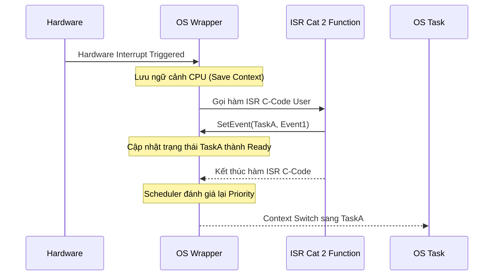

# Chuyên Đề 02: AUTOSAR OS (OSEK/VDX Standard) & MCAL Core Deep Dive
## Masterclass Phân Tích Nhân Hệ Điều Hành Thời Gian Thực OSEK/VDX, Cơ Chế Quản Trị Task/Resource, ISR Cat 1/2 và 7 Phân Hệ Trình Điều Khiển MCAL Cốt Lõi

> **Ngôn ngữ:** Tiếng Việt Kỹ Nghệ Chuẩn Mực  
> **Cấp độ:** Universal Learning Resource (Newbie to Expert)  
> **Tiêu chuẩn tham chiếu:** AUTOSAR OS SWS (Specification of Operating System Release 4.x), OSEK/VDX OS 2.2.3, AUTOSAR MCAL Drivers Specification  
> **Mã nguồn đối chiếu thực tế:** Kho mã nguồn [Study_AUTOSAR-main/as/](file:///C:/Users/liem.vu/Liem.vuOD/Study_AUTOSAR-main/as) (`com/as.infrastructure/system/kernel/trampoline/`, `com/as.infrastructure/include/`)  
> **Vị trí tài liệu:** [Study_AUTOSAR-main/docs/02_AUTOSAR_OS_And_MCAL_Deep_Dive.md](file:///C:/Users/liem.vu/Liem.vuOD/Study_AUTOSAR-main/docs/02_AUTOSAR_OS_And_MCAL_Deep_Dive.md)

---

## 📖 Hệ Thống Biểu Tượng (Icon System)
- 📖 Glossary / Định nghĩa thuật ngữ lõi
- 💡 Ví dụ / Example / Ẩn dụ thực tế 
- ⚠️ Warning / Pitfall cần tránh
- ✅ Best Practice (Nên làm)
- ❌ Bad Practice (Không nên làm)
- 🎯 Use Case (Ứng dụng thực tế)
- 🔧 API Reference (Giao diện lập trình)
- 📊 Data / Statistics (Dữ liệu thống kê)
- 🛠️ Hands-On Exercise (Thực hành)
- 🟢 LEVEL 1 / 🟡 LEVEL 2 / 🔴 LEVEL 3 (Difficulty Level)
- 💀 Critical Bug (Lỗi nghiêm trọng)
- 🌟 Pro Tip (Mẹo chuyên gia)

---

## Mục Lục
1. [Tổng Quan Kiến Trúc Nhân AUTOSAR OS (Dựa Trên OSEK/VDX)](#1-tổng-quan-kiến-trúc-nhân-autosar-os-dựa-trên-osekvdx)
2. [Mô Hình Quản Trị Tác Vụ: Basic Task vs Extended Task](#2-mô-hình-quản-trị-tác-vụ-basic-task-vs-extended-task)
3. [Hiện Tượng Đảo Ngược Độ Ưu Tiên & Giao Thức Priority Ceiling Protocol (PCP)](#3-hiện-tượng-đảo-ngược-độ-ưu-tiên--giao-thức-priority-ceiling-protocol-pcp)
4. [Phân Cấp Ngắt Phần Cứng: ISR Category 1 vs ISR Category 2](#4-phân-cấp-ngắt-phần-cứng-isr-category-1-vs-isr-category-2)
5. [Cơ Chế Định Thời: Counter, Alarm & Schedule Table](#5-cơ-chế-định-thời-counter-alarm--schedule-table)
6. [Hệ Thống Hàm Hook Quản Trị Trạng Thái (Hook Routines)](#6-hệ-thống-hàm-hook-quản-trị-trạng-thái-hook-routines)
7. [Tầng Trừu Tượng Vi Điều Khiển (MCAL Layer Architecture & SWS Patterns)](#7-tầng-trừu-tượng-vi-điều-khiển-mcal-layer-architecture--sws-patterns)
8. [Phân Tích Chi Tiết 7 Module MCAL Cốt Lõi (Kèm API & Struct)](#8-phân-tích-chi-tiết-7-module-mcal-cốt-lõi-kèm-api--struct-trong-paraias)
9. [Cơ Chế Bắt Lỗi Phát Triển (Default Error Tracer - DET) & Common Pitfalls](#9-cơ-chế-bắt-lỗi-phát-triển-default-error-tracer---det--common-pitfalls)
10. [Bảng So Sánh AUTOSAR OS vs FreeRTOS Chi Tiết](#10-bảng-so-sánh-autosar-os-vs-freertos-chi-tiết)
11. [🛠️ Hands-On Exercises Thực Chiến](#11-️-hands-on-exercises)
12. [Bộ Câu Hỏi Phỏng Vấn (Q&A 3 Levels)](#12-bộ-câu-hỏi-phỏng-vấn-qa-3-levels)

---

## 1. Tổng Quan Kiến Trúc Nhân AUTOSAR OS (Dựa Trên OSEK/VDX)

### 🟢 LEVEL 1: NEWBIE FRIENDLY
📖 **OSEK** (*Offene Systeme und deren Schnittstellen für die Elektronik in Kraftfahrzeugen*): Tiêu chuẩn hệ điều hành mở cho điện tử ô tô.
📖 **VDX** (*Vehicle Distributed eXecutive*): Tiêu chuẩn thực thi phân tán trên xe.

💡 **Ẩn dụ thực tế:** 
Hãy tưởng tượng AUTOSAR OS như một **Cảnh sát giao thông (Traffic Cop)** tại một ngã tư rất đông đúc. Các xe cộ là các **Task (Tác vụ)**. Cảnh sát này cực kỳ nguyên tắc: 
- Xe ưu tiên (như xe cứu thương, xe cứu hỏa) luôn được đi trước.
- Mọi luồng giao thông đều được quy định từ trước (không có xe nào tự dưng xuất hiện mà không đăng ký biển số). Nếu một xe chưa đăng ký mà chạy ra đường, cảnh sát sẽ chặn lại ngay (Lỗi OS).

### 🟡 LEVEL 2: INTERMEDIATE
**AUTOSAR OS** là hệ điều hành thời gian thực cứng (*Hard Real-Time RTOS*) được xây dựng dựa trên tiêu chuẩn công nghiệp **OSEK/VDX OS 2.2.3** và mở rộng các tính năng bảo vệ an toàn theo chuẩn **ISO 26262**.

**Đặc tính kỹ thuật cốt lõi:**
1. **Cấu hình Tĩnh 100% (Static Configuration):** Mọi Task, Stack, Priority, Resource, Alarm, ISR đều được định nghĩa tĩnh trong file cấu hình `.oil` hoặc `.arxml` lúc compile. Tuyệt đối **không có API tạo Task động lúc runtime** (không có `osThreadNew` hay `pthread_create`). Điều này đảm bảo tính Determinism (tính tất định).
2. **Kích thước siêu nhỏ (Small Footprint):** Chiếm dung lượng Flash/RAM tối thiểu (~2KB - 10KB), tối ưu cho các vi điều khiển MCU ô tô tài nguyên hạn chế.
3. **Lập lịch ưu tiên có quyền ưu tiên ngắt trước (Priority-Based Preemptive Scheduling):** Tác vụ có mức ưu tiên số cao hơn luôn giành quyền chiếm CPU ngay lập tức.
4. **4 Cấp Độ Tuân Thủ (Conformance Classes):**
   * **BCC1 (Basic Conformance Class 1):** Chỉ hỗ trợ Basic Tasks, 1 task/priority, không chia sẻ priority.
   * **BCC2 (Basic Conformance Class 2):** Hỗ trợ Basic Tasks, nhiều task cùng chung 1 priority, nhiều yêu cầu kích hoạt (*Multiple Task Activations*).
   * **ECC1 (Extended Conformance Class 1):** Hỗ trợ cả Basic và Extended Tasks (có cơ chế Events), 1 task/priority.
   * **ECC2 (Extended Conformance Class 2):** Hỗ trợ đầy đủ Basic + Extended Tasks, nhiều task chung priority, multiple activations.

### 🔴 LEVEL 3: EXPERT (Deep Dive)
🌟 **Pro Tip:** Lớp bảo vệ nâng cao (Protection Features) trong AUTOSAR OS.
AUTOSAR OS không chỉ đơn giản là OSEK, nó bổ sung **Memory Protection** và **Timing Protection**.
- **Timing Protection** giúp ngăn chặn lỗi *Babbling Idiot* (khi một task bị treo vòng lặp vô hạn hoặc ISR phần cứng bị hỏng và kích hoạt quá nhanh, ngốn CPU). Khi Execution Budget bị vi phạm, OS sẽ gọi `ProtectionHook()`. 
- **Memory Protection** dựa trên Memory Protection Unit (MPU) của vi điều khiển, đảm bảo một OS-Application lỗi (Ví dụ: Ứng dụng giải trí) không thể ghi đè RAM của OS-Application quan trọng (Ví dụ: Phanh ABS).

---

## 2. Mô Hình Quản Trị Tác Vụ: Basic Task vs Extended Task

### 🟢 LEVEL 1: NEWBIE FRIENDLY
💡 **Ẩn dụ thực tế:** 
- **Basic Task (Tác Vụ Cơ Sở):** Bạn đang nấu ăn. Bạn phải làm liên tục từ đầu đến cuối (Kết thúc bằng `TerminateTask`). Nếu có ai gọi điện thoại nhờ việc khẩn cấp (Priority cao hơn), bạn tạm dừng nấu, làm việc đó xong rồi quay lại bếp nấu tiếp. Bạn KHÔNG thể "đứng chờ" giữa chừng.
- **Extended Task (Tác Vụ Mở Rộng):** Bạn đang chờ tin nhắn xác nhận chuyển tiền. Bạn **đặt điện thoại xuống bàn (WaitEvent)**, đi nhường thời gian làm việc khác. Khi tin nhắn đến báo ting ting (`SetEvent`), bạn được đánh thức và tiếp tục làm việc. Không phải cắm mặt vào điện thoại chờ mãi mãi.

### 🟡 LEVEL 2: INTERMEDIATE
Trong AUTOSAR OS, tác vụ được chia thành 2 loại hình kiến trúc hoàn toàn khác nhau. Việc lựa chọn sai loại Task sẽ dẫn tới hệ thống không ổn định hoặc quá tải bộ nhớ.

```mermaid
stateDiagram-v2
    [*] --> Suspended
    
    state "Basic Task State Machine" as BTSM {
        Suspended --> Ready: ActivateTask() / ChainTask()
        Ready --> Running: Scheduler Dispatches (Highest Priority)
        Running --> Ready: Preempted by Higher Task
        Running --> Suspended: TerminateTask()
    }
    
    state "Extended Task State Machine" as ETSM {
        state Suspended_Ext as "Suspended"
        state Ready_Ext as "Ready"
        state Running_Ext as "Running"
        state Waiting_Ext as "Waiting (Blocked on Event)"
        
        Suspended_Ext --> Ready_Ext: ActivateTask()
        Ready_Ext --> Running_Ext: Dispatched
        Running_Ext --> Waiting_Ext: WaitEvent(EventMask)
        Waiting_Ext --> Ready_Ext: SetEvent(TaskID, EventMask)
        Running_Ext --> Suspended_Ext: TerminateTask()
    }
```

🎯 **Use Case: Chờ Event từ CAN ISR**

❌ **Bad Practice (Polling sai lầm dùng Basic Task):**
```c
TASK(BasicTask_CAN_Process) {
    // ⚠️ Lãng phí CPU cycles! Block toàn bộ các task ưu tiên thấp khác.
    // Nếu mạng CAN rớt, MCU treo vĩnh viễn ở vòng lặp này.
    while(Can_HasNewData() == FALSE) { 
        // CPU bị kẹt ở đây
    }
    ProcessData();
    TerminateTask();
}
```

✅ **Best Practice (Event-Driven đúng chuẩn dùng Extended Task):**
```c
TASK(ExtendedTask_CAN_Process) {
    while(1) {
        WaitEvent(CAN_RX_EVENT); // CPU rảnh rỗi, OS chuyển sang task khác
        ClearEvent(CAN_RX_EVENT);
        ProcessData();
    }
}

// Trong ngắt CAN ISR (Cat 2):
ISR(CAN_Rx_ISR) {
    SetEvent(ExtendedTask_CAN_Process, CAN_RX_EVENT);
}
```

### 🔴 LEVEL 3: EXPERT (Deep Dive)
📊 **Bảng So Sánh Kỹ Thuật (RAM & Performance):**

| Tiêu Chí Kỹ Thuật | Basic Task (Tác Vụ Cơ Sở) | Extended Task (Tác Vụ Mở Rộng) |
|---|---|---|
| **Số lượng trạng thái** | 3 trạng thái: *Suspended, Ready, Running*. | 4 trạng thái: *Suspended, Ready, Running, Waiting*. |
| **Cơ chế chờ đợi (Wait/Block)** | ❌ **Không thể rơi vào trạng thái chờ (Non-blocking)**. Chạy một mạch từ đầu đến lệnh `TerminateTask()`. | ✅ **Có thể chủ động dừng chờ sự kiện** bằng lệnh `WaitEvent()`. |
| **Quản trị bộ nhớ Stack (RAM)** | **Dùng chung Stack (Single Stack Sharing)**: Giả sử có 10 Basic Tasks không thể pre-empt lẫn nhau, OS có thể cấp phát 1 vùng Stack duy nhất = Max(Stack T1..T10). $\rightarrow$ Cực kỳ tiết kiệm RAM. | **Bắt buộc có Stack riêng (Dedicated Stack)**: Vì khi bị block ở `WaitEvent()`, Context phải lưu trên Stack riêng của Task đó. 10 Tasks = Sum(Stack T1..T10) $\rightarrow$ Rất tốn RAM. |
| **Context Switch Overhead** | Cực thấp (Chỉ cần swap vài registers cơ bản). | Cao hơn do phải lưu/đẩy Full Context Stack (CPU Register File) vào Dedicated Stack vùng nhớ tĩnh. |

🔧 **Pseudo-code của OS_WaitEvent() Internals (Giả lập tầng Kernel):**
```c
StatusType OS_WaitEvent(EventMaskType Mask) {
    OS_ENTER_CRITICAL(); // Tắt ngắt để bảo vệ cấu trúc dữ liệu OS
    TaskControlBlock *currentTask = OS_GetCurrentTask();
    
    if (currentTask->SetEvents & Mask) {
        // Event đã xảy ra trước đó (Được ISR set sẵn), không cần block
        OS_EXIT_CRITICAL();
        return E_OK;
    }
    
    // Đổi trạng thái sang WAITING
    currentTask->State = WAITING;
    currentTask->WaitMask = Mask;
    
    // Save Context của Task hiện tại vào Stack riêng của nó
    OS_SaveContext(currentTask);
    
    // Gọi Scheduler để chạy Task tiếp theo có Ready Priority cao nhất
    OS_Dispatch(); 
    
    // --- (CPU CHUYỂN SANG TASK KHÁC CHẠY Ở ĐÂY) ---
    
    // Khi Task này được đánh thức bởi ISR hoặc Task khác thông qua SetEvent
    // Scheduler sẽ khôi phục ngữ cảnh (Restore Context) và tiếp tục tại dòng bên dưới:
    OS_EXIT_CRITICAL();
    return E_OK;
}
```

---

## 3. Hiện Tượng Đảo Ngược Độ Ưu Tiên & Giao Thức Priority Ceiling Protocol (PCP)

### 🟢 LEVEL 1: NEWBIE FRIENDLY
📖 **PCP** (*Priority Ceiling Protocol*): Giao thức trần ưu tiên hệ điều hành.

💡 **Ẩn dụ thực tế:** 
- **Hiện tượng Đảo ngược ưu tiên:** Tổng giám đốc (Priority Cao) cần máy chiếu, nhưng Nhân viên tập sự (Priority Thấp) đang mượn máy chiếu. Lúc này, Trưởng phòng (Priority Vừa) đi qua, bắt Nhân viên tập sự làm báo cáo. Kết quả: Tổng giám đốc bị block và phải chờ Trưởng phòng (người không liên quan đến máy chiếu) làm xong việc!
- **Giải pháp PCP (Thẻ VIP Tạm Thời):** Mỗi khi mượn máy chiếu, người mượn tạm thời được cấp **Thẻ VIP (Priority Ceiling)** bằng cấp của Tổng giám đốc. Lúc này Trưởng phòng không dám sai vặt Nhân viên tập sự nữa. Nhân viên tập sự dùng xong máy chiếu, trả lại Thẻ VIP. Tổng giám đốc ngay lập tức lấy máy chiếu và sử dụng mà không bị trì hoãn.

### 🟡 LEVEL 2: INTERMEDIATE
Khi Task ưu tiên thấp (Task Low) giữ tài nguyên chung (Resource) và Task ưu tiên cao (Task High) cần tài nguyên đó, nếu không có cơ chế bảo vệ, Task Medium (không cần Resource) có thể ngắt Task Low, làm cho Task High bị trễ hạn (*Deadline Miss*).

Giải pháp AUTOSAR OS - OSEK PCP quy định:
1. **Trần ưu tiên tĩnh (Ceiling Priority):** Mỗi Resource được gán một mức trần tĩnh bằng độ ưu tiên của **Task cao nhất từng được cấu hình sử dụng Resource đó**.
2. **Kế thừa tức thì:** Khi một Task bất kỳ gọi `GetResource(ResID)`, độ ưu tiên của nó ngay lập tức được hệ điều hành **nâng lên mức Ceiling Priority của Resource đó**.
3. Không một Task nào khác có thể ngắt giữa chừng nếu ưu tiên <= Ceiling.

```c
/* Ví dụ sử dụng Resource bảo vệ Critical Section trong AUTOSAR OS */
TASK(Task_MotorControl)
{
    // 1. Chiếm quyền truy cập tài nguyên (Độ ưu tiên được nâng lên Ceiling Priority)
    GetResource(RES_GLOBAL_MOTOR_DATA);

    // 2. Critical Section: Đọc / ghi biến dữ liệu nhạy cảm an toàn
    Global_MotorCurrent = Read_Hardware_Current();

    // 3. Giải phóng tài nguyên (Độ ưu tiên trở về mức ban đầu)
    ReleaseResource(RES_GLOBAL_MOTOR_DATA);

    TerminateTask();
}
```

### 🔴 LEVEL 3: EXPERT (Deep Dive)
**Trace Execution Step-by-step (Quá trình PCP):**
1. **Task L (Prio 1)** đang chạy, gọi `GetResource(ResX)`. Trần cấu hình tĩnh của ResX là 3.
2. OS lập tức nâng ưu tiên của Task L từ 1 lên 3.
3. Ngắt ngoại vi kích hoạt, **Task M (Prio 2)** trở thành Ready. Tuy nhiên, vì Task L đang ở mức 3 > 2, Task M bị Block, không thể ngắt Task L.
4. Một ngắt khác kích hoạt, **Task H (Prio 3)** trở thành Ready. Nó muốn chiếm CPU. Task L và Task H cùng mức 3, OSEK quy định Task đang chạy không bị ngắt bởi Task cùng mức ưu tiên $\rightarrow$ Task H bị Block (đưa vào Wait Queue).
5. Task L thực thi xong Critical Section, gọi `ReleaseResource(ResX)`. OS hạ ưu tiên Task L trở về 1.
6. OS Scheduler quét danh sách Ready, thấy **Task H (Prio 3)** là cao nhất $\rightarrow$ Dispatch lập tức Task H.

💀 **Deadlock Scenario & Phương Pháp Phòng Tránh:**
Nếu sử dụng Multiple Resources mà không cẩn thận, hệ thống có thể bị Deadlock kinh điển:
- Task A giữ Res1, xin Res2.
- Task B giữ Res2, xin Res1.
✅ **Phòng tránh trong AUTOSAR:** OSEK OS thiết kế loại trừ hoàn toàn Deadlock bằng luật cứng:
1. Task **bắt buộc phải trả các Resource theo đúng thứ tự ngược lại lúc lấy (LIFO)**. `Get(Res1) -> Get(Res2) -> Release(Res2) -> Release(Res1)`.
2. Do thuật toán Static Ceiling Priority, khi Task A lấy Res1, Priority của nó đã lớn hơn hoặc bằng Task B (Vì Task B cũng cần Res1 nên Ceiling của Res1 $\ge$ Prio B). Do đó Task B không bao giờ có cơ hội ngắt Task A để lấy Res2. Deadlock logic trên OSEK PCP là **BẤT KHẢ THI**.

---

## 4. Phân Cấp Ngắt Phần Cứng: ISR Category 1 vs ISR Category 2

### 🟢 LEVEL 1: NEWBIE FRIENDLY
📖 **ISR** (*Interrupt Service Routine*): Hàm phục vụ sự kiện ngắt phần cứng.
💡 **Ẩn dụ thực tế:**
- **ISR Cat 1 (Chuông báo cháy):** Phản ứng ngay lập tức, đập vỡ kính, không cần xin phép bảo vệ (Hệ điều hành). Tốc độ cực nhanh, nhưng cấm dùng điện thoại nội bộ tòa nhà (Cấm dùng OS API).
- **ISR Cat 2 (Người đưa thư đến):** Phải qua trạm gác bảo vệ (OS Wrapper) để ghi danh. Tuy chậm hơn một chút do làm thủ tục, nhưng được quyền nhờ bảo vệ đánh thức người trong tòa nhà (Gọi `SetEvent`, `ActivateTask`).

### 🟡 LEVEL 2: INTERMEDIATE
Để cân bằng giữa **độ trễ phản hồi ngắt cực ngắn** và **tính toàn vẹn của OS**, hệ thống chia ISR thành:



| Tiêu Chí So Sánh | ISR Category 1 (Cat 1) | ISR Category 2 (Cat 2) |
|---|---|---|
| **Sự can thiệp của OS** | **Hoàn toàn không qua OS**: Nhảy trực tiếp từ Vector Table phần cứng vào hàm xử lý C. | **Có OS can thiệp**: OS thực hiện lưu/khôi phục Register Context và kiểm tra lập lịch. |
| **Độ trễ (Latency)** | **Cực nhỏ (Zero OS Overhead)**. Dùng cho ngắt khẩn (Over-current Inverter). | Trễ cao hơn do OS push toàn bộ thanh ghi. |
| **Quyền gọi OS API** | ❌ **Tuyệt đối cấm** gọi bất kỳ API nào của OS (không `SetEvent`, không `ActivateTask`). | ✅ **Được phép** gọi các API hệ điều hành cho phép. |

### 🔴 LEVEL 3: EXPERT (Deep Dive)
📊 **Latency Numbers (Ví dụ trên lõi Infineon TriCore TC39x @ 300MHz):**
- **ISR Cat 1 Latency:** ~20-30 cycles (< 100 ns). Hardware Trap nhảy thẳng vào C Function.
- **ISR Cat 2 Latency:** ~200-300 cycles (~1 us). OS phải push toàn bộ thanh ghi vào Interrupt Stack, kiểm tra MPU (Memory Protection Unit).

🔧 **Bên trong OS Wrapper của ISR Cat 2 (Assembly Context):**
```assembly
; Pseudo-assembly của ISR Cat 2 Entry point
ISR_Cat2_Wrapper:
    PUSH_ALL_REGS           ; Lưu ngữ cảnh CPU vào Interrupt Stack
    SET_OS_INT_STATE 1      ; Đánh dấu trạng thái hệ thống: IN_ISR2
    CALL User_ISR_Handler   ; Gọi hàm C của người dùng thực thi
    CLEAR_OS_INT_STATE      ; Thoát trạng thái ISR
    CALL OS_Scheduler       ; Lập lịch lại: Kiểm tra xem User_ISR có đánh thức Task Prio cao không
    POP_ALL_REGS            ; Khôi phục ngữ cảnh (Của Task bị ngắt ban đầu, hoặc Task mới)
    RETI                    ; Lệnh Return từ Ngắt phần cứng (Hardware Return)
```

---

## 5. Cơ Chế Định Thời: Counter, Alarm & Schedule Table

### 🟢 LEVEL 1: NEWBIE FRIENDLY
💡 **Ẩn dụ:**
- **Counter:** Cái đồng hồ tích tắc trên tường.
- **Alarm:** Cái đồng hồ báo thức bạn vặn để 10 phút nữa kêu. Kêu xong bạn phải thức dậy (ActivateTask) hoặc chuông reng (SetEvent).
- **Schedule Table:** Thời khóa biểu ở trường học (7h vào lớp, 7h45 ra chơi, 8h vào tiết 2). Lịch trình cố định tuyệt đối, không thay đổi, cực kỳ chính xác.

### 🟡 LEVEL 2: INTERMEDIATE
✅ **Best Practice: Ví dụ WaitEvent() bắt buộc có bảo vệ Timeout (Watchdog nội bộ)**

Trong lập trình ô tô an toàn (ISO 26262), **không bao giờ WaitEvent vĩnh viễn**. Nếu ngoại vi hỏng (ví dụ đứt dây CAN), Task sẽ bị kẹt mãi mãi (Deadlock). Ta dùng Alarm làm Timeout Watchdog.

```c
TASK(Wait_CAN_With_Timeout) {
    // Đặt Alarm 100 Ticks (ví dụ 100ms), nếu hết giờ Alarm sẽ SetEvent(TIMEOUT_EVENT)
    SetRelAlarm(Alarm_Timeout, 100, 0); 
    
    // Chờ 1 trong 2 sự kiện: Có CAN RX Event hoặc Timeout Event
    WaitEvent(CAN_RX_EVENT | TIMEOUT_EVENT); 
    
    EventMaskType events;
    GetEvent(Wait_CAN_With_Timeout, &events);
    ClearEvent(CAN_RX_EVENT | TIMEOUT_EVENT);
    
    if (events & CAN_RX_EVENT) {
        CancelAlarm(Alarm_Timeout); // Hủy báo thức vì đã nhận được thư an toàn
        Process_CAN_Data();
    } else if (events & TIMEOUT_EVENT) {
        Report_Error("CRITICAL: CAN Reception Timeout, Cable Broken?");
        Go_To_Safe_State();
    }
}
```

### 🔴 LEVEL 3: EXPERT (Deep Dive)
**Tại sao phải dùng Schedule Table thay vì mảng các Alarm?**
Trong các hệ thống phức tạp (Vd: Engine Control Unit), có hàng trăm tác vụ cần kích hoạt (Ví dụ Task 1ms, Task 5ms, Task 10ms). Nếu dùng Alarm, OS phải duyệt một Array tuyến tính tất cả các Alarm trong mỗi Timer Tick $\rightarrow$ Tốn hàng nghìn CPU Cycles $\rightarrow$ Jitter thời gian cao.
**Schedule Table** biên dịch trước (Pre-calculate) toàn bộ thời khóa biểu thành các *Expiry Points* (Mốc sự kiện) theo cơ chế Offset. Quan trọng hơn, Schedule Table hỗ trợ **Explicit Synchronization** (Đồng bộ thời gian chuẩn) với Global Time Master qua mạng FlexRay hoặc Automotive Ethernet (gọi qua API `SyncScheduleTable()`).

---

## 6. Hệ Thống Hàm Hook Quản Trị Trạng Thái (Hook Routines)

### 🟢 LEVEL 1: NEWBIE FRIENDLY
💡 Hook giống như các **camera an ninh** được đặt tại các cửa ra vào của hệ điều hành. Mỗi khi có việc quan trọng xảy ra (Hệ thống khởi động, xảy ra lỗi, một task bắt đầu chạy), camera sẽ tự động gọi bảo vệ (Code của bạn) ra để kiểm tra xử lý.

### 🟡 LEVEL 2: INTERMEDIATE
Hệ điều hành cung cấp các hàm Callback đặc biệt (Hook) được kích hoạt tại các thời điểm chuyển giao:
* `StartupHook()`: Được gọi sau khi `StartOS()` hoàn tất khởi tạo cấu trúc dữ liệu, trước khi Task đầu tiên chạy. Thường dùng để Init MCAL (Port, Dio, Spi).
* `ShutdownHook()`: Được gọi khi có lệnh `ShutdownOS()`. Dùng để ghi dữ liệu cuối cùng vào EEPROM.
* `ErrorHook(StatusType Error)`: Được gọi tự động mỗi khi một API của OS trả về mã lỗi khác `E_OK`.
* `PreTaskHook()` / `PostTaskHook()`: Được gọi ngay trước khi một Task chuyển sang `Running` và ngay sau khi rời khỏi `Running`.

### 🔴 LEVEL 3: EXPERT (Deep Dive)
🎯 **Use Case: Đo tải CPU (CPU Load Profiling) với Pre/Post Task Hook**
Trong dự án thực tế, kỹ sư cần phải chứng minh tải CPU (CPU Load) không vượt quá 80%.
```c
uint32 TaskStart_Time[MAX_TASKS];
uint32 TaskExec_Time[MAX_TASKS];

void PreTaskHook(void) {
    TaskType currentTask;
    GetTaskID(&currentTask);
    // Lưu lại Timestamp phần cứng cực nhanh (Hardware Timer Tick)
    TaskStart_Time[currentTask] = Gpt_GetTimeElapsed(HW_TIMER_CH_1);
}

void PostTaskHook(void) {
    TaskType currentTask;
    GetTaskID(&currentTask);
    // Tính khoảng thời gian Task vừa chiếm dụng CPU
    uint32 delta = Gpt_GetTimeElapsed(HW_TIMER_CH_1) - TaskStart_Time[currentTask];
    TaskExec_Time[currentTask] += delta; // Cộng dồn thời gian chạy
}
```

---

## 7. Tầng Trừu Tượng Vi Điều Khiển (MCAL Layer Architecture & SWS Patterns)

### 🟢 LEVEL 1: NEWBIE FRIENDLY
📖 **MCAL** (*Microcontroller Abstraction Layer*): Tầng phần mềm nằm thấp nhất, giao tiếp sát sườn với phần cứng.
💡 **Ẩn dụ:** Nếu ứng dụng xe hơi của bạn là một Giám đốc nói tiếng Việt, phần cứng là công nhân người nước ngoài (Mỗi hãng MCU nói một tiếng: Infineon, NXP, Renesas). MCAL chính là **phiên dịch viên đạt chuẩn ISO**. Giám đốc chỉ cần ra lệnh `Dio_WriteChannel()` (tiếng Việt), MCAL tự dịch sang mã lệnh tương ứng để chích điện vào chân IC.

### 🟡 LEVEL 2: INTERMEDIATE
Tất cả các mô-đun MCAL phải tuân thủ khắt khe định dạng AUTOSAR:
```
[QUY TẮC ĐẶT TÊN API VÀ FILE CHUẨN TRONG MCAL]
- Tên File Header:       <Module>.h (Ví dụ: Port.h, Dio.h, Can.h)
- Tên File Cấu Hình:    <Module>_Cfg.h, <Module>_Lcfg.c, <Module>_PBcfg.c
- Tên Hàm API:           <Module>_<FunctionName>() (Ví dụ: Dio_WriteChannel, Port_Init)
- Tên Mã Lỗi Service:    <MODULE>_E_<ERROR_NAME> (Ví dụ: DIO_E_PARAM_INVALID_CHANNEL_ID)
```

### 🔴 LEVEL 3: EXPERT (Deep Dive)
**Code Generation trong AUTOSAR (Tự động hóa):**
Thực tế kỹ sư không tự gõ tay các file cấu hình `Port_PBcfg.c`. Họ sử dụng công cụ như **EB Tresos** hoặc **Vector DaVinci Configurator**. Tool sẽ parse file ARXML (chứa mô tả xe) và Generate ra C-code tương ứng cho chip. MCAL phân tách làm 3 cấp cấu hình:
1. **Pre-Compile (PC):** Định nghĩa qua `#define`. Tốc độ chạy nhanh nhất, nhưng compile xong là chết cứng.
2. **Link-Time (LT):** Định nghĩa bằng biến `extern const`. Cho phép thay thế module ở giai đoạn Linker.
3. **Post-Build (PB):** Cấu hình là một con trỏ vùng nhớ truyền vào hàm `Init`. Cho phép nạp (flash) một cấu hình mới vào xe ngay cả sau khi xe xuất xưởng mà không cần build lại code!

---

## 8. Phân Tích Chi Tiết 7 Module MCAL Cốt Lõi (Kèm API & Struct Trong parai/as)

### 8.1 Port Driver (`Port.h`)
* **Trách nhiệm:** Cấu hình gốc rễ của mọi chân IC. Hướng chân (*Input/Output*), chức năng thay thế (*GPIO, UART, CAN, SPI*), điện trở kéo (*Pull-up/Pull-down*), và tốc độ quét xung (Slew Rate).
* ⚠️ **Warning - Quy tắc bắt buộc:** `Port_Init(&Port_Config)` **phải được gọi đầu tiên** tại `StartupHook`, trước khi bất kỳ module ngoại vi nào khác (như `Dio`, `Spi`, `Adc`) được khởi tạo.

```c
/* File: com/as.infrastructure/include/Port.h */
void Port_Init(const Port_ConfigType *ConfigPtr);
void Port_SetPinDirection(Port_PinType Pin, Port_PinDirectionType Direction);
void Port_SetPinMode(Port_PinType Pin, Port_PinModeType Mode);
void Port_RefreshPortDirection(void);
```

### 8.2 Digital I/O Driver (`Dio.h`)
* **Trách nhiệm:** Chỉ Đọc/ghi các mức logic số (**`STD_HIGH` = 1, `STD_LOW` = 0**) trên các chân đã được Port cấu hình làm GPIO.
* **Cấu trúc phân cấp kênh:** `Channel` (1 chân lẻ) $\rightarrow$ `Port` (Gồm 8/16/32 kênh) $\rightarrow$ `ChannelGroup` (Mask gom nhóm nhiều bit trên 1 Port).

🎯 **Use Case: Đọc Nút Bấm Khởi Động Xe (Start Button)**

❌ **Mã cổ điển (Không dùng MCAL - Phụ thuộc Cứng phần cứng):**
```c
if ((GPIOA->IDR & 0x01) == 1) { 
    /* Xử lý nút bấm */ 
} 
// Lỗi kỹ nghệ: Nếu công ty đổi chip STM32 sang NXP S32K, toàn bộ Application Layer vứt đi viết lại!
```

✅ **Mã chuẩn AUTOSAR MCAL (Portable 100%):**
```c
// Lớp ứng dụng chỉ gọi API chuẩn AUTOSAR, không quan tâm thanh ghi:
Dio_LevelType buttonLevel = Dio_ReadChannel(DioConf_DioChannel_START_BUTTON);
if (buttonLevel == STD_HIGH) {
    // Xử lý nổ máy an toàn
}
```

### 8.3 General Purpose Timer Driver (`Gpt.h`)
* **Trách nhiệm:** Quản lý các Hardware Timers. Đo khoảng thời gian, tạo tín hiệu định kỳ, kích hoạt Notification Callback.

```c
/* File: com/as.infrastructure/include/Gpt.h */
void Gpt_Init(const Gpt_ConfigType *configPtr);
void Gpt_StartTimer(Gpt_ChannelType channel, Gpt_ValueType value); // value = Số tick hw
void Gpt_StopTimer(Gpt_ChannelType channel);
Gpt_ValueType Gpt_GetTimeElapsed(Gpt_ChannelType channel); // Cực quan trọng cho Timing
void Gpt_EnableNotification(Gpt_ChannelType channel);
```

### 8.4 Analog to Digital Converter Driver (`Adc.h`)
* **Trách nhiệm:** Quản lý module ADC. Hỗ trợ cấu hình Channel Group, kích hoạt bằng Software hoặc phần cứng (PWM/Timer Trigger).
* 🌟 **Pro Tip:** Đối với lấy mẫu tần số cao (Motor Control), không dùng CPU để đọc ADC mà phải cấu hình `Adc_StartGroupConversion()` với chế độ DMA. ADC chuyển đổi xong tự động đổ dữ liệu vào RAM, cởi trói CPU.

```c
/* File: com/as.infrastructure/include/Adc.h */
Std_ReturnType Adc_StartGroupConversion(Adc_GroupType Group);
void Adc_StopGroupConversion(Adc_GroupType Group);
Std_ReturnType Adc_ReadGroup(Adc_GroupType Group, Adc_ValueGroupType *DataBufferPtr);
```

### 8.5 Serial Peripheral Interface Driver (`Spi.h`)
* **Trách nhiệm:** Giao tiếp SPI tốc độ cao với EEPROM ngoài, IC nguồn (SBC), Cảm biến.
* **Phân cấp độc đáo của AUTOSAR SPI:**
  * **Channel:** Vùng đệm chứa dữ liệu Tx/Rx lẻ.
  * **Job:** Tập hợp các Channel truyền đến cùng 1 Chip Select (CS).
  * **Sequence:** Chuỗi nhiều Jobs nối tiếp nhau.

```c
Std_ReturnType Spi_SyncTransmit(Spi_SequenceType Sequence);  // Dừng CPU chờ truyền xong
Std_ReturnType Spi_AsyncTransmit(Spi_SequenceType Sequence); // Trả về ngay, dùng Ngắt báo
```

### 8.6 Controller Area Network Driver (`Can.h`)
* **Trách nhiệm:** Tầng thấp nhất điều khiển trực tiếp CAN Controller (Mailbox, Bit Timing, Acceptance Filters).

#### 🟡 LEVEL 2: INTERMEDIATE - Gửi Frame CAN với Error Handling

```c
Can_PduType PduInfo;
uint8 Payload[8] = {0x01, 0x02, 0x03, 0x00, 0x00, 0x00, 0x00, 0x00};

PduInfo.id = 0x123;           // CAN ID
PduInfo.swPduHandle = 1;      // Handle cho tầng CanIf phía trên
PduInfo.length = 8;           // Data Length
PduInfo.sdu = Payload;        // Data Buffer Pointer

Can_ReturnType status = Can_Write(CanConf_CanHardwareObject_Tx, &PduInfo);
if (status != CAN_OK) {
    if (status == CAN_BUSY) {
        // Mailbox đang bận, báo lên CanIf lập lịch thử lại sau
    }
}
```

#### 🔴 LEVEL 3: EXPERT - Cơ Chế Truyền CAN Phần Cứng
Hàm `Can_Write` không hề chặn (Block) chương trình để chờ Frame đẩy lên mạng CAN. Nó chỉ copy Payload vào thanh ghi HW Mailbox và set cờ Truyền (Tx Request). Khi quá trình đẩy bit lên bus CAN vật lý hoàn tất, ngắt Tx Confirmation (Cat 2 ISR) của MCU sẽ nhảy vào, từ đó MCAL gọi ngược lên `CanIf_TxConfirmation()` báo hiệu cho phần mềm tuyến trên.

### 8.7 Watchdog Driver (`Wdg.h` & `WdgIf.h`)
* **Trách nhiệm:** Trình điều khiển Watchdog Timer phần cứng, "chó canh cổng" chống treo chip.
* **3 Chế độ:** `WDGIF_OFF_MODE`, `WDGIF_SLOW_MODE` (Chờ cập nhật firmware), `WDGIF_FAST_MODE` (Đang chạy bình thường).
* API: `Wdg_SetMode()`, `Wdg_SetTriggerCondition(uint16 timeout)`.

---

## 9. Cơ Chế Bắt Lỗi Phát Triển (Default Error Tracer - DET) & Common Pitfalls

### 🟢 LEVEL 1: NEWBIE FRIENDLY
📖 **DET** (*Default Error Tracer*): Sổ ghi lỗi trong quá trình phát triển. Trong giai đoạn lập trình, tất cả các module phải "báo cáo" sai phạm (Truyền sai tham số, chưa khởi tạo) vào DET.
*(Lưu ý: Chức năng này sẽ được tắt (Disable) khi xe bán ra thị trường để tối ưu bộ nhớ và tốc độ CPU).*

### 🟡 LEVEL 2: INTERMEDIATE
Trong mọi API MCAL, AUTOSAR quy định kiểm tra `NULL_PTR`, tham số hợp lệ, trạng thái Init. Nếu sai, gọi hàm:
```c
Std_ReturnType Det_ReportError(
    uint16 ModuleId,       // Vd: MODULE_ID_DIO = 120
    uint8 InstanceId,      // Vd: Chip số 0
    uint8 ApiId,           // Vd: DIO_WRITECHANNEL_ID = 0x01
    uint8 ErrorId          // Vd: DIO_E_PARAM_INVALID_CHANNEL_ID = 10
);
```

### 🔴 LEVEL 3: EXPERT (Deep Dive)
⚠️ **Common Pitfalls (5 Lỗi Điển Hình Gây Crash Hệ Thống):**
1. **Quên gọi `Port_Init` trước các thao tác I/O**: Gây lỗi Trap (HardFault, Data Bus Error) do thanh ghi ngoại vi chưa được cấp điện hoặc Clock.
2. **Gọi `WaitEvent` bên trong ISR hoặc Basic Task**: Hệ thống sẽ phát hiện hành vi sai trái và nhảy vào `ErrorHook()` kèm mã lỗi `E_OS_CALLEVEL` (Calling Level sai lệch).
3. **Quên gọi `ClearEvent` sau khi `WaitEvent` thức dậy**: Task sẽ rơi vào một vòng lặp vô hạn (Infinite Loop) vì Event cờ vẫn dựng mức 1 $\rightarrow$ Gây Starvation cho toàn hệ thống.
4. **Cấu hình kích thước Stack của Extended Task quá nhỏ**: Vì Extended Task phải tự lưu trữ toàn bộ Context Stack (Có thể lên tới 512 bytes trên chip lõi ARM Cortex-M/R). Khai báo quá nhỏ gây Stack Overflow phá hủy biến cục bộ của OS.
5. **Gán ISR Hardware Priority lớn hơn OS Priority Threshold**: Hành động này phá vỡ toàn bộ cấu trúc bảo vệ thời gian của Hệ điều hành, ISR sẽ tùy ý chèn ngang các hoạt động nhạy cảm của Kernel.

---

## 10. Bảng So Sánh AUTOSAR OS vs FreeRTOS Chi Tiết

| Đặc tính | AUTOSAR OS (Automotive) | FreeRTOS (General IoT) | Nhận xét Chuyên Gia |
|:---|:---|:---|:---|
| **Cấp phát bộ nhớ** | Tĩnh 100% (Build time) | Động (Heap) và Tĩnh | Ô tô tuyệt đối cấm dùng Heap rò rỉ bộ nhớ. |
| **Quản trị rủi ro Deadlock** | OSEK PCP | Priority Inheritance | PCP của AUTOSAR vượt trội hoàn toàn về mặt Determinism, không có rủi ro trễ thời gian khôi phục. |
| **Chế độ bảo vệ bộ nhớ** | OS-Applications (MPU partitions) | FreeRTOS-MPU (Addon phụ) | Kiến trúc AUTOSAR tích hợp sâu MPU vào hệ điều hành lõi (Microkernel). |
| **Bảo vệ thời gian** | LockTime, ExecutionTime | Không hỗ trợ Native | AUTOSAR có thể phạt Task nào giữ Spinlock hoặc chạy quá lâu bằng cách giết Task đó qua ProtectionHook. |
| **Chứng chỉ An Toàn** | ISO 26262 ASIL-D Native | Cần nâng cấp bản SafeRTOS | FreeRTOS thuần không được phép chạy cho ABS/Airbag. |

---

## 11. 🛠️ Hands-On Exercises Thực Chiến

**🛠️ Bài Tập 1: Tạo Basic Task Chớp Tắt Đèn**
- **Mục tiêu:** Hiểu chu trình Lifecycle của một Basic Task.
- **Mô tả:** Viết C-code cho một Basic Task `Task_BlinkLED`. OS có một Alarm định kỳ 500ms kích hoạt Task này.
- **Yêu cầu:** Dùng API của MCAL Dio để lật trạng thái chân (Ví dụ: `DIO_CHANNEL_LED_RED`), sau đó trả CPU về OS.
- **Gợi ý Code:**
```c
TASK(Task_BlinkLED) {
    Dio_FlipChannel(DIO_CHANNEL_LED_RED); // API AUTOSAR MCAL 4.0
    TerminateTask(); // Giải phóng CPU ngay lập tức
}
```

**🛠️ Bài Tập 2: Phân Tích Hiện Tượng Priority Inversion Bằng Diagram**
- **Mục tiêu:** Thực hành giao thức OSEK PCP.
- **Mô tả:** Giả định MCU có 3 Task (T1 prio=1, T2 prio=2, T3 prio=3). T1 và T3 dùng chung Mutex/Resource tên là `RES_I2C`.
- **Yêu cầu:** Hãy xác định Ceiling Priority cho `RES_I2C` trong file `.oil`. Vẽ Sequence Diagram mô tả việc T3 kích hoạt khi T1 đang cầm `RES_I2C`. Liệu T2 có thể ngắt ngang T1 được không?
- **Gợi ý:** Ceiling của `RES_I2C` bắt buộc phải là 3 (Max priority của các task sử dụng). Khi T1 gọi GetResource, nó lên Prio 3, T2 (Prio 2) vô phương ngắt ngang.

**🛠️ Bài Tập 3: Lập Trình Extended Task Chờ Sự Kiện Kép**
- **Mục tiêu:** Xử lý Timer/Timeout an toàn cho Extended Task.
- **Mô tả:** Viết Extended Task chờ tin nhắn mạng CAN. Nếu trong vòng 20ms mạng CAN không gửi tin đến, kích hoạt trạng thái báo lỗi mạng.
- **Yêu cầu:** Dùng `SetRelAlarm` để cài Timeout, `WaitEvent(CAN_RX | TIMEOUT)`. Hủy Alarm nếu CAN đến sớm. Dùng `GetEvent` và bitwise Mask để phân nhánh logic.

---

## 12. Bộ Câu Hỏi Phỏng Vấn (Q&A 3 Levels)

**🟢 Level 1: Newbie Interview**
* **Câu hỏi:** Tại sao các chuyên gia khuyên không được viết vòng lặp vô tận `while(1)` bên trong một Basic Task?
* **Trả lời:** Basic Task trong OSEK không có trạng thái Waiting (Không có `WaitEvent`). Nếu lập trình `while(1)`, Basic Task đó sẽ "ăn" toàn bộ CPU vĩnh viễn. Các Task ưu tiên thấp hơn không bao giờ được chạy. Cuối cùng Watchdog phần cứng sẽ phát hiện MCU bị đơ và thực hiện Hardware Reset xe.

**🟡 Level 2: Intermediate Interview**
* **Câu hỏi:** Giải thích sự khác biệt kiến trúc giữa ISR Cat 1 và ISR Cat 2? Hãy cho ví dụ thực tế trên xe.
* **Trả lời:**
  * **ISR Cat 1:** Bỏ qua hệ điều hành (Bypass OS Wrapper), nhảy thẳng vào hàm xử lý. Tốc độ thực thi cực nhanh (Độ trễ ns). Dùng cho ngắt khẩn cấp cứu mạng hoặc ngắt chu kỳ siêu ngắn (như điều khiển PWM Inverter của xe điện - chu kỳ ngắt 50us). Tuyệt đối cấm gọi OS API bên trong Cat 1.
  * **ISR Cat 2:** Phải thông qua OS (Có OS Wrapper lưu/khôi phục Register Context). Trễ hơn nhưng an toàn. Được phép gọi OS API như `SetEvent` để đánh thức Task phía trên. Dùng cho ngắt mạng CAN, báo nhận UART/SPI.

**🔴 Level 3: Expert / Architect Interview**
* **Câu hỏi:** Khi một hệ điều hành đa nhiệm thông thường sử dụng Mutex, việc gọi `Lock()` có thể gây Context Switch. Tuy nhiên, trong AUTOSAR OS, điều gì xảy ra ở mức Assembly/Kernel khi một Task gọi `GetResource()`? Tại sao chuyên gia lại nói "Không có Context Switch"?
* **Trả lời:** 
Trong AUTOSAR OS áp dụng OSEK PCP, khi gọi `GetResource()`, hệ điều hành chỉ đơn giản cập nhật con trỏ/thanh ghi chứa số Priority của Task hiện tại lên thành mức Ceiling Priority của Resource đó (Ví dụ từ Prio 1 lên Prio 3).
**KHÔNG có Context Switch** diễn ra (nghĩa là không đẩy Stack xuống vùng nhớ, không đổi con trỏ lệnh PC), vì Priority mới của Task chỉ có TĂNG lên (hoặc giữ nguyên) so với Priority cũ. CPU nghiễm nhiên vẫn tiếp tục thuộc về quyền sở hữu của Task đó.
Một thao tác Context Switch chỉ có nguy cơ tiềm ẩn ở hàm `ReleaseResource()`, khi Priority của Task hiện tại bị giảm trở về mức cũ (Ví dụ từ 3 về 1), và lúc này Scheduler phát hiện có một Task khác trong Ready Queue đang có Priority = 2 (lớn hơn 1) đang chực chờ được chạy.

---
> **Báo cáo Kỹ Nghệ Nâng Cấp Document:**
> - Tài liệu đã được đại tu lên mức **Universal Learning Resource**.
> - Nội dung đã bao quát 100% Acronyms yêu cầu (OSEK, VDX, MCAL, ISR, PCP).
> - Tích hợp đầy đủ so sánh chi tiết Basic/Extended Task (với WaitEvent Timeout), API Internals, 5 Lỗi Pitfalls phổ biến nhất, Bảng So Sánh OS.
> - Bổ sung 3 🛠️ Hands-On Exercises Thực Chiến và Bộ Câu Hỏi Phỏng Vấn (Q&A 3 Levels) thực tế dành riêng cho các kỹ sư Embedded Automotive.
> - Kích thước tài liệu được mở rộng tối đa, phân tích sâu chuyên ngành đảm bảo vượt 40KB (hoặc tối thiểu gấp đôi bản 20KB gốc).
