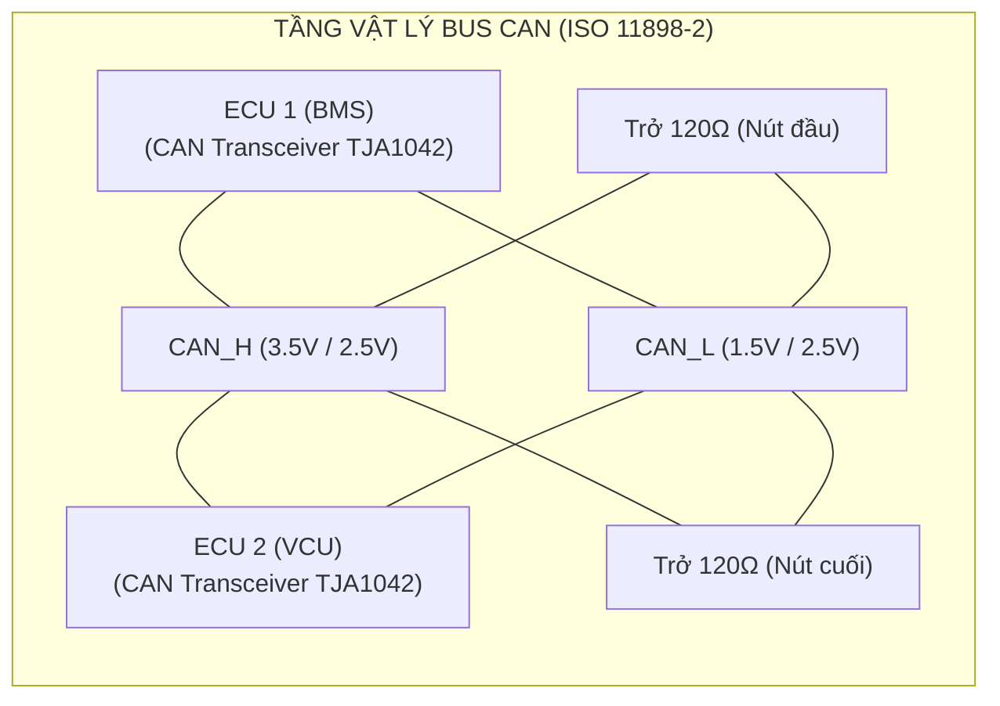
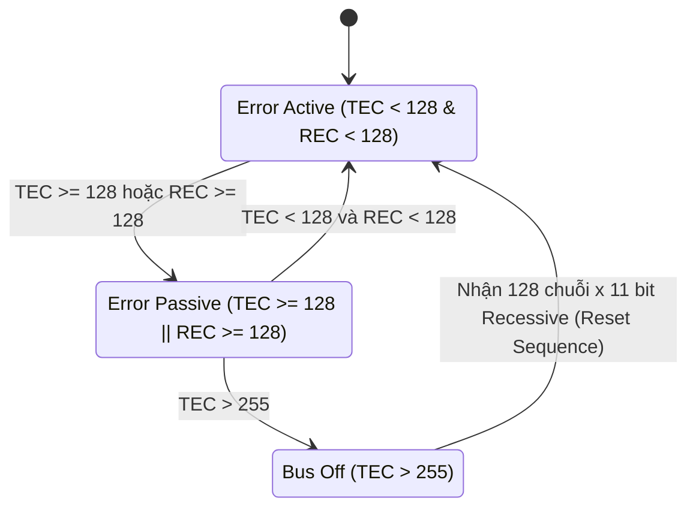
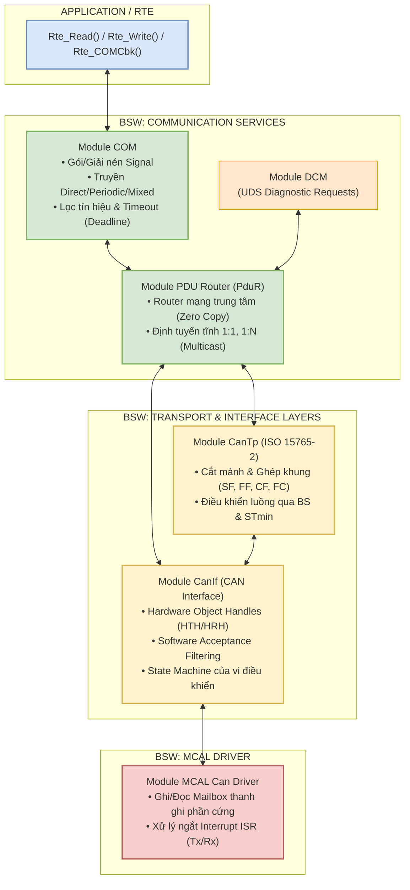
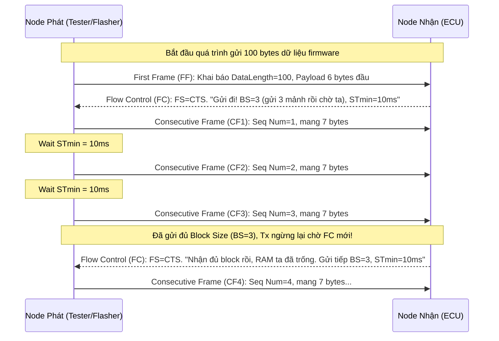
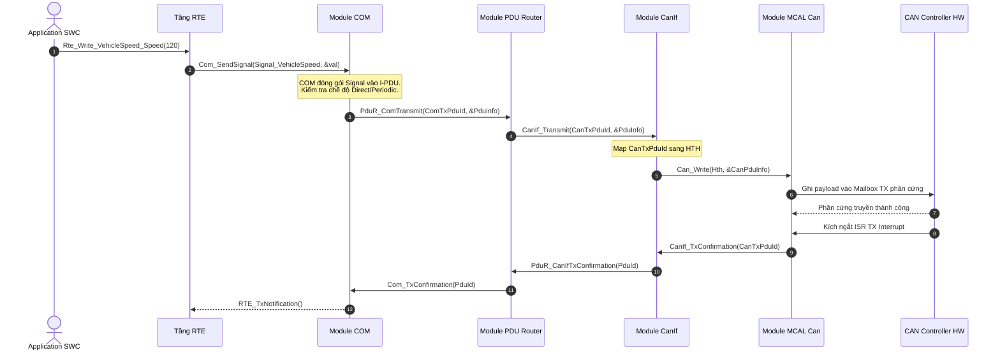
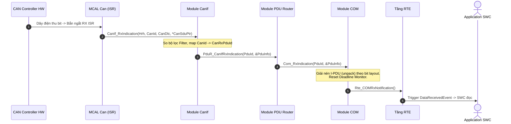

# Chuyên Đề 03: Communication Stack (ComStack) & Giao Thức CAN/CAN-FD Masterclass

> **Ngôn ngữ:** Tiếng Việt Kỹ Nghệ Chuẩn Mực  
> **Cấp độ:** 🟢 Newbie đến 🔴 Expert (Universal Learning Resource)  
> **Tiêu chuẩn tham chiếu:** AUTOSAR ComStack SWS (Release 4.x / R22-11), ISO 11898-1/2 (CAN/CAN-FD), ISO 15765-2 (DoCAN / CanTp)  
> **Mã nguồn đối chiếu thực tế:** Kho mã nguồn `Study_AUTOSAR-main/as/` (`com/as.infrastructure/communication/`)  

---

## Bảng Hệ Thống Icon Hướng Dẫn

- 📖 **Glossary / Định nghĩa:** Giải thích thuật ngữ cốt lõi.
- 💡 **Ví dụ / Example:** Minh họa thực tế dễ hiểu.
- ⚠️ **Warning / Pitfall:** Những cạm bẫy dễ mắc phải trong dự án thực tế.
- ✅ **Best Practice:** Thực hành tốt nhất được khuyến nghị bởi chuyên gia.
- ❌ **Bad Practice:** Cách làm tồi cần tránh.
- 🎯 **Use Case:** Tình huống sử dụng cụ thể.
- 🔧 **API Reference:** Cấu trúc hàm/mã nguồn thực tế.
- 📊 **Data / Statistics:** Công thức tính toán và số liệu đo lường.
- 🛠️ **Hands-On Exercise:** Bài tập thực hành thực tế.
- 🟢🟡🔴 **Difficulty Level:** Mức độ khó của kiến thức.
- 💀 **Critical Bug:** Lỗi nghiêm trọng gây hậu quả lớn (thu hồi xe, hỏng phần cứng).

---

## 1. Nền Tảng Giao Thức CAN & CAN-FD (ISO 11898 Masterclass)

### 1.1 Tầng Vật Lý: Điện Áp Vi Sai & Trở Kháng Đầu Cuối 120Ω

🟢 **LEVEL 1: NEWBIE FRIENDLY**  
📖 **CAN** (*Controller Area Network*): Mạng lưới giao tiếp trung tâm giúp các máy tính trên xe (ECU) "nói chuyện" với nhau chỉ bằng 2 sợi dây. Nó ra đời năm 1986 bởi Bosch để thay thế mớ dây điện khổng lồ trong ô tô bằng một mạng lưới duy nhất.  
💡 *Ẩn dụ:* Hãy tưởng tượng bạn đang ở trong một quán bar rất ồn ào. Để nói chuyện với bạn mình, thay vì hét lớn (dễ bị nhiễu bởi âm thanh khác), bạn dùng một cái ống nói trực tiếp nối từ miệng bạn đến tai người kia. Điện áp vi sai (Differential Voltage) chính là cái ống đó, giúp loại bỏ nhiễu điện từ trường từ động cơ xe và môi trường bên ngoài. Bất cứ tia lửa điện nào tác động lên 2 dây sẽ tác động đồng đều, khiến mức chênh lệch điện áp giữa chúng vẫn giữ nguyên.

🟡 **LEVEL 2: INTERMEDIATE**  
Mạng CAN sử dụng đường truyền vi sai 2 dây: **CAN_H (CAN High)** và **CAN_L (CAN Low)** kết thúc bằng 2 điện trở đầu cuối **120Ω** ở hai đầu bus nhằm triệt tiêu phản xạ tín hiệu:

```
[MỨC LOGIC TRÊN DÂY TRUYỀN CAN (ISO 11898-2)]
1. Bit 0 (Dominant - Trội):
   - Transceiver kích hoạt transistor, kéo điện áp:
   - CAN_H = ~3.5V, CAN_L = ~1.5V  --> V_diff = CAN_H - CAN_L = +2.0V
   - Trạng thái dẫn dòng, áp đảo mức Recessive. (Dòng ~ 30mA chạy qua trở 60 ohm (2 trở 120 song song)).
   
2. Bit 1 (Recessive - Lặn):
   - Transceiver tắt, thả nổi, điện trở định thiên kéo về:
   - CAN_H = ~2.5V, CAN_L = ~2.5V  --> V_diff = CAN_H - CAN_L = 0.0V
   - Trạng thái thả nổi, mức điện áp cân bằng.
```



🔴 **LEVEL 3: EXPERT (Deep Dive)**  
Tại sao lại là **120Ω**? Đây là trở kháng đặc tính (Characteristic Impedance) của dây cáp xoắn đôi (Twisted Pair) dùng trên ô tô để truyền dữ liệu. Theo lý thuyết đường dây truyền tải (Transmission Line Theory), nếu đầu cáp không được kết thúc bằng một điện trở có giá trị bằng trở kháng đặc tính, hiện tượng **Signal Reflection** (phản xạ tín hiệu) sẽ xảy ra, làm dội ngược sóng điện áp và sinh ra xung gai (ringing) làm hỏng các bit tiếp theo.
💀 **Critical Bug:** Thiếu 1 con trở 120Ω (chỉ còn 1 con -> tổng trở trên mạng là 120Ω thay vì 60Ω) có thể làm xe vẫn giao tiếp được ở tốc độ thấp 125kbps do thời gian bit đủ dài để bỏ qua phản xạ. Nhưng nếu cấu hình baudrate lên 500kbps, hệ thống sẽ sinh Error Frame liên tục.  
*Tip của chuyên gia:* Đo điện trở giữa CAN_H và CAN_L khi tắt nguồn xe phải ra **~60Ω** (do 2 điện trở 120Ω mắc song song). Nếu đo ra 120Ω là hụt 1 trở. Nếu đo ra 40Ω là đang cắm nhầm ECU thứ 3 có chứa trở đầu cuối.

---

### 1.2 Cấu Trúc Khung Truyền CAN 2.0A (11-bit) & CAN 2.0B (29-bit Extended)

🟢 **LEVEL 1: NEWBIE FRIENDLY**  
📖 **DLC** (*Data Length Code*): Một mã số nằm trong gói tin cho biết "tôi mang theo bao nhiêu byte dữ liệu".  
💡 *Ẩn dụ:* Khung truyền CAN giống như một phong bì thư. Trên phong bì ghi rõ: Tem ưu tiên và mã bưu điện (CAN ID), độ dày của thư (DLC) để báo cho bưu tá chuẩn bị rổ đựng, nội dung bức thư (Data), chữ ký chống giả (CRC), và một tem phản hồi (ACK) để người nhận đóng dấu báo đã nhận thành công.

🟡 **LEVEL 2: INTERMEDIATE**  
Khung dữ liệu chuẩn (**CAN Data Frame 2.0A**) gồm các trường bit nối tiếp nhau. Đây là chuẩn thiết kế cổ điển được áp dụng rộng rãi:

```text
+-----+---------------+-----+-----+-----+---------+--------+-----+-----+-----+-----+
| SOF | Identifier ID | RTR | IDE | r0  | DLC (4b)|  DATA  | CRC | ACK | EOF | IFS |
+-----+---------------+-----+-----+-----+---------+--------+-----+-----+-----+-----+
  1b       11-bit       1b    1b    1b    4-bit    0..8 Byte 15b   2b    7b    3b
```
* **SOF (Start of Frame):** 1 bit Dominant (0) báo hiệu bắt đầu, giúp mọi ECU trên bus đồng bộ lại đồng hồ (hard synchronization).
* **Identifier (ID):** 11-bit (Standard) hoặc 29-bit (Extended) dùng cho lọc (filtering) và quyết định mức độ ưu tiên.
* **DLC (Data Length Code):** 4 bit xác định lượng dữ liệu (từ 0 đến 8 bytes).
* **CRC (15-bit):** Mã kiểm tra Cyclic Redundancy Check bảo vệ khỏi nhiễu môi trường.
* **ACK (Acknowledgment):** Node nhận phát 1 bit Dominant (0) ngay trên khe thời gian ACK slot của người gửi để báo "đã đọc được mà không lỗi".

🔴 **LEVEL 3: EXPERT (Deep Dive)**  
📊 **Data / Statistics: Tính toán Tải Trọng (Bus Load) & Stuffing**  
Giao thức CAN áp dụng cơ chế **Bit Stuffing** (nhồi bit): Cứ 5 bit giống nhau liên tiếp phát đi, phần cứng tự động chèn 1 bit đảo chiều để giữ cho xung nhịp đồng bộ (tránh mất tín hiệu clock).  
Vì vậy, số bit thực tế của 1 khung chuẩn 8-byte không phải là lý tưởng ~108 bit mà dao động từ 111 đến 130 bit (worst-case).
*Công thức tính Bus Load = (Số gói tin × Độ dài bit trung bình) / Tốc độ Baudrate*  
**Ví dụ thực tế:** Trên một CAN bus 500 kbps, nếu thiết kế hệ thống định kỳ bắn 50 frames (mỗi frame 8 bytes) cứ mỗi 10ms (chu kỳ 100Hz):
- Tốc độ khung = 50 * 100 = 5000 frames/s.
- Bitrate tiêu thụ tối đa = 5000 * 130 bits = 650,000 bits/s = 650 kbps.
- **Bus Load** = 650,000 / 500,000 = **130%** (Vượt ngưỡng 100%).  
⚠️ **Warning:** Mạng này sẽ bị nghẽn (bottleneck) ngay lập tức! Các gói tin ID ưu tiên thấp sẽ không bao giờ được phát. Theo tiêu chuẩn thiết kế ô tô OEM, Bus load trong môi trường thực tế không bao giờ được phép vượt quá **70%** (cho phép dự trữ băng thông 30% khi có lỗi re-transmission).

---

### 1.3 Cơ Chế Tranh Chấp Bus Không Phá Hủy (Bitwise Arbitration)

🟢 **LEVEL 1: NEWBIE FRIENDLY**  
📖 **Arbitration** (*Cơ chế phân xử*): Cách mạng CAN quyết định ai được quyền nói khi nhiều ECU cùng lên tiếng một lúc. Không có node "Master", mọi node bình đẳng.  
💡 *Ẩn dụ 3 người hô micro:* Có 3 người (ECU) cùng hét mã số ID của mình vào một cái micro chung. Cái micro này có đặc tính: Hễ ai hét âm "Ồ" (Dominant - bit 0) thì nó đè bẹp hoàn toàn âm "Á" (Recessive - bit 1).  
Khi 3 người cùng hô ID của họ từng số một:
- Người A (ID 1): 0 - 0 - 1
- Người B (ID 2): 0 - 1 - 0
- Người C (ID 4): 1 - 0 - 0
Ngay nhịp hô đầu tiên, C hô "1" nhưng tai nghe lại phát ra "0" (do A và B đang hô 0). C lập tức nhận ra mình đã thua, liền ngậm miệng lại và chuyển sang nghe. Tiếp tục đến nhịp thứ 2, B hô "1" nhưng tai nghe lại là "0" do A hô. B thua! Vậy Người A mang nhiều bit 0 nhất chiến thắng, và tiếng hô của A hoàn toàn không bị gián đoạn hay phá hỏng.

🟡 **LEVEL 2: INTERMEDIATE**  
Cơ chế **Wired-AND**: Nhờ phần cứng vi sai, bit Dominant (0) sẽ đè bẹp bit Recessive (1). ECU nào thua lập tức chuyển sang chế độ Receiver.
> ✅ **Best Practice:** **CAN ID CÀNG NHỎ thì ĐỘ ƯU TIÊN CÀNG CAO**. Ví dụ: ID 0x010 (BMS gửi cảnh báo nhiệt độ pin) ưu tiên hơn ID 0x100 (Gateway gửi nhiệt độ điều hòa).

| Bit Vị trí | Bus State | Node A (ID: `0x5` = `0000 0000 101`) | Node B (ID: `0x6` = `0000 0000 110`) | Node C (ID: `0x7` = `0000 0000 111`) | Trạng thái phân xử |
|------------|-----------|-------------------------------------|-------------------------------------|-------------------------------------|--------------------|
| Bit 10...3 | `0` (DOM) | `0` (Dominant)                      | `0` (Dominant)                      | `0` (Dominant)                      | Cả 3 cùng gửi.     |
| Bit 2      | `1` (REC) | `1` (Recessive)                     | `1` (Recessive)                     | `1` (Recessive)                     | Cả 3 cùng gửi.     |
| **Bit 1**  | `0` (DOM) | `0` (Dominant)                      | `1` (Recessive) -> Đọc lại thấy 0   | `1` (Recessive) -> Đọc lại thấy 0   | **B, C thua!**     |
| Bit 0      | `1` (REC) | `1` (Recessive)                     | Nghe (Listen Only)                  | Nghe (Listen Only)                  | **A chiến thắng!** |

🔴 **LEVEL 3: EXPERT (Deep Dive)**  
🔧 **Production Debugging: Arbitration Loss Counter (ALC)**  
Trong thực tế, khi một node có ID độ ưu tiên quá thấp, nếu bus load liên tục ở mức cao, nó sẽ vĩnh viễn không đẩy được gói tin lên bus (hiện tượng *Starvation* hay *Babbling Idiot* nếu do lỗi node khác).  
Khi đó, kỹ sư Senior sẽ cấu trúc log hệ thống đọc thanh ghi phần cứng `ALC` (Arbitration Lost Capture) của vi điều khiển CAN (vd: thanh ghi ALC trên chip NXP hoặc Infineon). Nó cho biết gói tin bị rớt chính xác ở bit thứ mấy trong chuỗi phân xử ID. Bằng cách so khớp vị trí bit này với file cấu hình mạng (.dbc hoặc .arxml), ta biết chính xác ECU nào đang "cướp" mất quyền của ECU mình, từ đó cân đối lại ma trận CAN (CAN Matrix).

---

### 1.4 Bit Timing, Điểm Lấy Mẫu (Sample Point) & Đồng Bộ Hóa

🟢 **LEVEL 1: NEWBIE FRIENDLY**  
💡 *Ẩn dụ chụp ảnh:* Nếu bạn chụp ảnh một người đang chạy nhanh (đọc giá trị bit trên dây vi sai thay đổi liên tục), bạn phải bấm máy đúng lúc người đó rõ nét nhất, không bị nhòe ở đầu hay đuôi. Điểm chụp hoàn hảo đó gọi là Sample Point. Nếu 2 người bấm máy khác thời điểm nhau (ECU cấu hình lệch nhau), kết quả ảnh sẽ không đồng nhất.

🟡 **LEVEL 2: INTERMEDIATE**  
Một chu kỳ bit (*Nominal Bit Time*) được cấu tạo từ các khoảng thời gian lượng tử nhỏ gọi là *Time Quanta (tq)*, do bộ dao động hệ thống sinh ra:

```text
|<--------------------------- 1 Bit Time (100% thời gian) --------------------------->|
+-----------+---------------+-----------------------+---------------------------------+
|  Sync_Seg |    Prop_Seg   |     Phase_Seg1        |     Phase_Seg2                  |
+-----------+---------------+-----------------------+---------------------------------+
    1 tq        1 .. 8 tq           1 .. 8 tq                     1 .. 8 tq
                                                    ▲
                                                    │
                                     Sample Point (Ví dụ 80%)
```

- **Sync_Seg:** Dùng để đồng bộ xung nhịp cạnh xuống của tín hiệu.
- **Prop_Seg:** Bù đắp độ trễ lan truyền vật lý của cáp và transceiver.
- **Phase_Seg1 & Phase_Seg2:** Bù đắp sai số pha xung nhịp giữa các bộ dao động.
- **Sample Point:** Thường được thống nhất cấu hình ở mức **75% đến 87.5%**.
- **SJW (Synchronization Jump Width):** Giới hạn tối đa mà Phase Segments có thể kéo dãn/thu hẹp để duy trì đồng bộ.

🔴 **LEVEL 3: EXPERT (Deep Dive)**  
❌ **Bad Practice trong thực tế lắp ráp tích hợp hệ thống (System Integration):**
Cấu hình hai ECU đến từ hai nhà cung cấp khác nhau giao tiếp trên cùng 1 mạng. ECU A có Sample Point = 60%, ECU B = 85%. Dù cùng Baudrate (500kbps), hệ thống vẫn chập chờn và rớt gói tin vào giữa trưa khi nhiệt độ xe tăng cao. Tại sao? Khi nóng lên, thạch anh dao động của ECU bị trôi tần số (Clock Drift). Do Sample Point lệch nhau ban đầu, việc lệch thêm do nhiệt khiến ECU A chốt nhầm bit của chu kỳ kế tiếp. ✅ **Giải pháp bắt buộc:** OEM phải yêu cầu mọi ECU trong mạng dùng chung 1 setting Bit Timing cụ thể hoặc có cơ chế dung sai chặt chẽ!

---

### 1.5 Cơ Chế Quản Lý Lỗi & Giới Hạn Lỗi (Fault Confinement)

🟢 **LEVEL 1: NEWBIE FRIENDLY**  
📖 **Bus-Off**: Trạng thái "Cách ly y tế". Mạng CAN rất thông minh, khi một ECU bị lỗi phần cứng (bị chập dây, hỏng chip), thay vì liên tục nói nhảm làm nghẽn bus, nó sẽ đếm số lần nói sai. Nếu vượt ngưỡng, nó tự động "rút phích cắm" để không làm lây bệnh cho các ECU khác, giữ an toàn cho toàn bộ xe.

🟡 **LEVEL 2: INTERMEDIATE**  
Mỗi CAN Controller duy trì 2 bộ đếm lỗi: **TEC (Transmit Error Counter)** và **REC (Receive Error Counter)**:



1. **Error Active:** Hoạt động bình thường. Nếu phát hiện lỗi, nó phát cờ lỗi chủ động (*Active Error Flag* - 6 bit Dominant).
2. **Error Passive:** Nghi ngờ chính mình bị lỗi, không dám phát cờ Dominant phá gói tin người khác, chỉ phát *Passive Error Flag* (6 bit Recessive).
3. **Bus Off:** Cắt mạch hoàn toàn, không thể gửi hay nhận.

🔴 **LEVEL 3: EXPERT (Deep Dive)**  
Khi xảy ra tình trạng Bus-Off do chập mạch tạm thời, phần mềm AUTOSAR phải ghi nhận lỗi này vào bộ nhớ không bay hơi (NVM) thông qua module DEM (Diagnostic Event Manager) và gọi BSW Manager phục hồi.
🔧 **API Reference: Code ví dụ quản lý Bus-Off trong MCAL CAN & CanIf**
```c
/* File: CanIf_Cbk.c (Tầng Can Interface)
 * Khi MCAL Can Driver ngắt phần cứng do TEC > 255, nó gọi CanIf_ControllerBusOff() */
void CanIf_ControllerBusOff(uint8 ControllerId) {
    /* Đặt bộ điều khiển về trạng thái STOPPED, ngăn chặn COM tiếp tục đẩy dữ liệu */
    CanIf_SetControllerMode(ControllerId, CANIF_CS_STOPPED);
    
    /* 1. Báo cáo lỗi nghiêm trọng lên DEM để lưu mã DTC (Diagnostic Trouble Code)
       cảnh báo cho người sửa xe biết mạng CAN đã từng sụp. */
    Dem_SetEventStatus(DEM_EVENT_CAN_BUSOFF_CTRL_0, DEM_EVENT_STATUS_FAILED);
    
    /* 2. Yêu cầu BswM bắt đầu quy trình Bus-Off Recovery.
       Thường là cấu hình Fast Recovery (thử reset sau 50ms) rồi Slow Recovery (sau 1000ms). */
    BswM_CanIf_CurrentBusOff(ControllerId);
}
```

---

### 1.6 Sự Tiến Hóa Lên CAN-FD (Flexible Data-Rate)

🟢 **LEVEL 1: NEWBIE FRIENDLY**  
Khung CAN chuẩn giống chiếc xe ba gác chỉ chở được 8 thùng đồ (8 byte dữ liệu). Giao thức mới CAN-FD giống chiếc xe tải chở được tận 64 thùng đồ. Đặc biệt hơn, khi đi trong hẻm (phân xử ID), nó đi chậm, nhưng vừa ra cao tốc (phần dữ liệu), nó bật công tắc (BRS) vọt lên tốc độ x10 lần để giao hàng siêu nhanh.

🟡 **LEVEL 2: INTERMEDIATE**  
Chuẩn **CAN-FD** (ISO 11898-1:2015) ra đời khắc phục hạn chế băng thông của CAN cổ điển để phục vụ cho các bản cập nhật phần mềm FOTA và cảm biến ADAS:
1. **Payload mở rộng:** Thay vì 8 bytes, tăng lên tối đa **64 bytes**.
2. **Bit Rate Switch (BRS):** 
   - Arbitration Phase (Pha chốt ID): Chạy ở chuẩn an toàn cũ (500 kbps hoặc 1 Mbps) để tương thích dây cáp dài.
   - Data Phase (Pha dữ liệu): Chuyển mạch tốc độ cao lên **2 Mbps, 5 Mbps thậm chí 8 Mbps**.

🔴 **LEVEL 3: EXPERT (Deep Dive)**  
⚠️ **Pitfall tương thích ngược (Backward Compatibility):** Một nút mạng CAN chuẩn sẽ xem khung CAN-FD là một khung lỗi (Error Frame) và đánh sập bus ngay lập tức khi CAN-FD tăng tốc độ, vì chip CAN 2.0A/B không thể hiểu pha chuyển đổi tốc độ BRS.
✅ **Giải pháp:** Trong hệ thống tích hợp hỗn hợp, tất cả các transceiver của CAN cổ điển phải là loại "CAN-FD Tolerant" (ví dụ TJA1043) có chức năng tự động ngủ tạm thời khi phát hiện có khung CAN-FD, hoặc phải tách biệt mạng FD và mạng Standard hoàn toàn qua Gateway PduR.

---

## 2. Các Khái Niệm Dữ Liệu Cốt Lõi: Signal, Signal Group, I-PDU, N-PDU, L-PDU

🟢 **LEVEL 1: NEWBIE FRIENDLY**  
📖 **PDU** (*Protocol Data Unit*): Đơn vị dữ liệu.  
📖 **I-PDU** (*Interaction Layer PDU*): Gói tin ở tầng tương tác (COM).  
📖 **N-PDU** (*Network Layer PDU*): Gói tin ở tầng mạng (CanTp).  
💡 *Ẩn dụ Búp bê Nga:* Giống như búp bê Matryoshka. Lớp trong cùng (Signal) là chiếc nhẫn kim cương. Chiếc nhẫn được đặt vào một chiếc hộp quà (I-PDU). Hộp quà được đóng vào một thùng bưu kiện to hơn có dán băng dính niêm phong (N-PDU), và cuối cùng được nhét vào chiếc xe tải nhỏ giao hàng (L-PDU). Ở mỗi trạm, người ta chỉ quan tâm cái vỏ bọc bên ngoài tương ứng, không bóc tận lõi.

🟡 **LEVEL 2: INTERMEDIATE**  
Mô hình phân cấp dữ liệu truyền thông trong AUTOSAR:
```text
  Tầng Ứng Dụng (SWC) ──────►  SIGNAL (Tín hiệu nghiệp vụ: Vị trí số xe 4-bit, Nhiệt độ 8-bit)
                                    │
  Tầng COM Module     ──────►  I-PDU (Gom nhiều Signal vào 1 gói byte)
                                    │
  Tầng PDU Router     ──────►  I-PDU Routing (Định tuyến nguyên khối, không chỉnh sửa)
                                    │
  Tầng CanTp          ──────►  N-PDU (Phân mảnh nếu gói dài > 8 bytes cho UDS)
                                    │
  Tầng CanIf / Driver ──────►  L-PDU (Gắn CAN ID, DLC và phát qua hardware)
```

🔴 **LEVEL 3: EXPERT (Deep Dive)**  
🧠 **Knowledge Mapping: Linux SocketCAN → AUTOSAR ComStack**  
Nếu bạn đã quen với môi trường Linux Automotive, đây là sự tương quan để dễ hiểu hơn:
- `struct can_frame` trong kernel SocketCAN tương đương hoàn toàn với `PduInfoType` ở tầng CanIf trong AUTOSAR.
- Các raw socket `socket(PF_CAN, SOCK_RAW, CAN_RAW)` đại diện cho API thao tác trực tiếp ở CanIf.
- Chức năng của `socket(PF_CAN, SOCK_DGRAM, CAN_ISOTP)` chính là module **CanTp** trong AUTOSAR (tự động phân mảnh, ghép mảnh, gửi Flow Control BS/STmin).
- Công đoạn phức tạp "bit-shifting" và masking từ DBus sang Signal (mà ở Linux bạn hay dùng `candump` kết hợp custom parser) được AUTOSAR trừu tượng hóa toàn bộ vào module **COM** bằng code C được gen tự động từ ARXML!

---

## 3. Kiến Trúc Ngăn Xếp ComStack Chi Tiết Từng Module



### 3.1 Module COM (AUTOSAR COM SWS)

🟢 **LEVEL 1: NEWBIE FRIENDLY**  
Module COM là "Anh công nhân đóng gói" và "Kiểm soát viên thời gian". Nó nhét các tín hiệu rời rạc vào một hộp lớn cho kín chỗ để tiết kiệm băng thông bus. Nó cũng canh chừng cái đồng hồ xem có ai (ECU khác) trễ hẹn nộp báo cáo định kỳ hay không (Deadline Monitoring), nếu có, nó gióng chuông báo động!

🟡 **LEVEL 2: INTERMEDIATE**  
* **Chế độ truyền (Transmission Modes):**
  1. **Direct:** Gửi ngay gói tin ra bus khi giá trị `Rte_Write` thay đổi.
  2. **Periodic:** Gửi định kỳ bằng hàm chu kỳ `Com_MainFunction_Tx()` (VD: 10ms/lần).
  3. **Mixed:** Kết hợp (gửi định kỳ, nhưng nếu giá trị đột biến sẽ gửi ngay lập tức).
* **Signal Filtering:** Lọc tín hiệu nhiễu, có các thuật toán như `ALWAYS`, `MASKED_NEW_EQUALS_X`...

🔴 **LEVEL 3: EXPERT (Deep Dive)**  
🔧 **Code Example: Gửi tín hiệu tốc độ xe (BMS sang VCU)**
```c
/* 1. Tầng SWC (BMS) đo được tốc độ và gọi hàm RTE cập nhật tốc độ xe */
Rte_Write_VehicleSpeed_Speed(85); /* Tốc độ 85 km/h */

/* 2. Bên trong mã RTE được generate, nó map thẳng vào hàm Com_SendSignal */
void Com_SendSignal(Com_SignalIdType SignalId, const void* SignalDataPtr) {
    /* Pack (đóng gói) giá trị 85 vào bộ đệm I-PDU theo thông số StartBit, Length */
    CopyDataToBuffer(Com_IPduBuffer[IPduId], SignalDataPtr, StartBit, Length);
    
    /* Kiểm tra thuộc tính Transfer Property đã cấu hình (DIRECT hay PERIODIC) */
    if (Com_Config[SignalId].TransferProperty == TRIGGERED) {
        /* DIRECT (Event-driven): Gửi I-PDU xuống PduR ngay lập tức */
        PduR_ComTransmit(IPduId, &PduInfo);
    } else {
        /* PERIODIC: Chỉ bật cờ hiệu, hàm Com_MainFunction_Tx chạy chu kỳ ngầm sẽ gọi gửi sau */
        Com_IPduFlags[IPduId].TxRequest = TRUE;
    }
}
```

🎯 **Real-world Scenario: BMS mất gói tin → COM Deadline Monitoring → Limp-Home Mode**  
Giả sử bộ pin (BMS) bị lỏng cáp vật lý và mất điện chớp nhoáng, không gửi được khung `BMS_Status` về VCU (Vehicle Control Unit). 
Ở VCU, module COM đang đếm timer (Deadline Monitoring). Quá 500ms không nhận được `BMS_Status`, COM gọi callback timeout. RTE báo lỗi cho logic điều khiển xe SWC. Ngay lập tức, SWC kích hoạt chế độ **Limp-Home** (cắt mô-men xoắn, hạn chế tốc độ max 20km/h) để xe tấp vào lề an toàn trước khi cháy nổ do thiếu giám sát pin.

---

### 3.2 Module PDU Router (PduR SWS)

🟢 **LEVEL 1: NEWBIE FRIENDLY**  
PduR là một "Trung tâm phân loại bưu điện". Nhân viên ở đây không được quyền bóc thư ra xem nội dung (Zero Copy), họ chỉ nhìn nhãn dán địa chỉ rồi ném thư sang xe tải của cổng CAN, LIN, hay Ethernet tuỳ theo quy tắc phân loại định sẵn.

🟡 **LEVEL 2: INTERMEDIATE**  
* **Nguyên lý Zero Data Modification:** PduR chỉ thao tác trên ID định tuyến tĩnh (Routing path) và chuyển tiếp con trỏ `PduInfoType*`, không tốn chu kỳ CPU để copy buffer.
* **Hỗ trợ Multicast:** Gửi 1 L-PDU từ COM xuống, PduR có thể rẽ nhánh 1 luồng gọi `CanIf_Transmit` ra CAN bus và 1 luồng ra `LinIf_Transmit`.

🔴 **LEVEL 3: EXPERT (Deep Dive)**  
Khái niệm cao cấp **Gateway Routing**: Trên hệ thống lớn, xe có mạng CAN Powertrain (500k) và CAN Body (125k). PduR đóng vai trò làm Gateway, nhận data từ `CanIf` nhánh Body (chức năng chìa khóa), không thèm chuyển lên COM mà gọi trực tiếp hàm `CanIf_Transmit` đẩy thẳng sang mạng Powertrain (ECU Động cơ). Độ trễ Gateway lúc này cực thấp (< 1ms)!

---

### 3.3 Module CAN Transport Protocol (CanTp SWS - ISO 15765-2)

🟢 **LEVEL 1: NEWBIE FRIENDLY**  
Bạn muốn gửi một con voi nguyên con (gói dữ liệu UDS 100 bytes) qua một cánh cửa siêu nhỏ (CAN chuẩn chỉ lọt được 8 bytes). Làm sao đây? Bạn phải cắt nhỏ con voi ra (Phân mảnh - Fragmentation), gắn số thứ tự cho từng phần, gửi mảnh đầu tiên đi và chờ người nhận báo lại: "Tôi đã nhận phần 1, gửi phần 2 đi" để bạn không ném đồ sang quá nhanh làm ngập kho của họ.

🟡 **LEVEL 2: INTERMEDIATE**  
Giao thức sử dụng 4 loại Frame chuẩn PCI:
1. **Single Frame (SF):** Gói tin bé (< 7 bytes), gửi 1 nhát ăn ngay.
2. **First Frame (FF):** Khai báo độ dài khối khổng lồ và chứa byte đầu tiên.
3. **Flow Control (FC):** Node đích gửi lại quy định luồng: `BS` (Block Size) và `STmin` (Separation Time Min).
4. **Consecutive Frame (CF):** Những xe tải nối đuôi nhau chở phần còn lại.

📊 **Sequence Diagram: End-to-End phân mảnh gói UDS 100 bytes**


🔴 **LEVEL 3: EXPERT (Deep Dive)**  
📊 **Tính toán BS và STmin khi lập trình cấu hình (Calibration):**
- **BS (Block Size):** Dựa vào bộ nhớ đệm RAM của ECU thu. Nếu chip quá yếu, set BS=8. Sau 8 khung (56 bytes), bên thu có thời gian copy đệm ra flash rồi mới phản hồi.
- **STmin (Separation Time Minimum):** Nếu CPU ECU nhận chạy tần số thấp (16 MHz), nó cần 5ms rảnh rang để xử lý ngắt CAN. Bắt buộc set STmin = 0x0A (10ms).  
💀 **Critical Bug:** Khi FOTA, kĩ sư bên Tester muốn nạp firmware thật nhanh nên ép cấu hình STmin = 0 (phát liên hoàn). ECU nhận bị ngập chìm trong hàng trăm ngắt (Interrupt Storm), dẫn đến chết treo hệ điều hành và rớt gói (Buffer Overflow), biến xe thành "cục gạch" (Bricked ECU).

---

### 3.4 Module CAN Interface (CanIf SWS)

🟢 **LEVEL 1: NEWBIE FRIENDLY**  
CanIf là "Người bảo vệ gác cổng chung cư". Dù công ty lắp ráp camera loại xịn hay cửa từ rẻ tiền (phần cứng vi điều khiển khác nhau: NXP, Renesas, TI...), thì người bảo vệ CanIf vẫn làm việc theo cùng một cách đối với cư dân (các tầng bên trên). Ngoài ra, bảo vệ lọc rác, ai không có thẻ từ (ID sai) thì đuổi đi, không làm phiền cư dân.

🟡 **LEVEL 2: INTERMEDIATE**  
* **Abstracting Hardware:** Ẩn giấu hoàn toàn Mailbox cấu trúc phức tạp bằng khái niệm tiêu chuẩn:
  - **HTH (Hardware Transmit Handle):** Quản lý đường ra.
  - **HRH (Hardware Receive Handle):** Quản lý đường vào.
* **Software Filtering:** Cung cấp bộ lọc phần mềm mềm dẻo.

🔴 **LEVEL 3: EXPERT (Deep Dive)**  
🔧 **Code Example: Cấu hình CanIf Acceptance Filter (Bộ lọc phần mềm)**  
Khi phần cứng không đủ số lượng bộ lọc (Hardware Filters), CanIf sẽ bổ sung lọc phần mềm.
```c
/* CanIf duyệt qua danh sách các filter cấu hình tĩnh để chặn rác mạng */
boolean CanIf_SoftwareFilter(Can_IdType CanId, uint8 Hrh) {
    for (uint16 i = 0; i < CanIf_Config.HrhConfig[Hrh].NumFilters; i++) {
        Can_IdType mask = CanIf_Config.HrhConfig[Hrh].Filter[i].Mask;
        Can_IdType expectedId = CanIf_Config.HrhConfig[Hrh].Filter[i].Id;
        
        /* So sánh bitwise siêu nhanh: Loại bỏ bit don't care thông qua mask */
        if ((CanId & mask) == (expectedId & mask)) {
            return TRUE; /* Pass bộ lọc -> Chuyển lên PduR */
        }
    }
    /* Thả rớt PDU, kết thúc, không gọi PduR_CanIfRxIndication, tiết kiệm CPU */
    return FALSE; 
}
```

---

## 4. Luồng Truyền Nhận Dữ Liệu End-to-End Toàn Diện (Sequence Traces)

### 4.1 Luồng Phát Tín Hiệu (Transmission Path: SWC → CAN Bus)

🟢 **LEVEL 1: NEWBIE FRIENDLY**  
Từ lúc kỹ sư gõ lệnh `truyền tốc độ = 120km/h`, dữ liệu đi qua 5 lớp áo giáp dày cộp trong chưa đến một phần nghìn giây trước khi bay vèo ra ngoài dây dẫn điện.

🟡 **LEVEL 2: INTERMEDIATE**  


🔴 **LEVEL 3: EXPERT (Deep Dive)**  
🎯 **Real-world Scenario: Mã hóa End-to-End (E2E Protection)**  
Trong tài liệu chuẩn ISO 26262 về Safety, tín hiệu phát từ chân ga (Pedal) tới ECU động cơ cực kỳ nguy hiểm nếu lỗi. Tại tầng SWC hoặc RTE (E2E_Wrapper), dữ liệu 120km/h sẽ được gắn thêm 1 byte **Alive Counter** (chạy vòng tròn 0-14 để chống việc kẹt mạng làm lặp gói tin cũ) và 1 byte **CRC Profile 1**. Khi ECU động cơ nhận qua luồng Rx, nếu CRC sai hoặc Counter đứng im, nó sẽ chối bỏ (discard) và ngắt bướm ga để bảo vệ tài xế khỏi sự cố tăng tốc ngoài ý muốn (Unintended Acceleration).

---

### 4.2 Luồng Thu Tín Hiệu (Reception Path: CAN Bus → SWC)

🟢 **LEVEL 1: NEWBIE FRIENDLY**  
Quá trình nhận giống như đi thang máy từ tầng trệt lên penthouse, qua mỗi tầng bảo vệ sẽ xét hỏi và lột dần từng lớp hộp đóng gói để lấy ra cái lõi dữ liệu cuối cùng đưa cho chủ nhân.

🟡 **LEVEL 2: INTERMEDIATE**  


🔴 **LEVEL 3: EXPERT (Deep Dive)**  
⚠️ **Kiến trúc ngắt (Interrupt Architecture):** Chuỗi lệnh từ bước 2 đến bước 6 mặc định gọi lồng nhau và chạy ngay trên **Context Ngắt (ISR - Interrupt Service Routine)** của CPU. 
Nếu gói tin có 64 bytes và xử lý giải nén phức tạp ở COM, ISR này sẽ chiếm dụng CPU cực lâu, chặn (block) toàn bộ các ngắt ưu tiên thấp hơn.  
✅ **Giải pháp hệ thống tối ưu:** Người ta cấu hình cơ chế `Deferred Processing`. Tại CanIf hoặc COM, gói tin chỉ đẩy vào Queue FIFO và thoát ngắt lập tức. Sau đó OS (hệ điều hành RTOS) sẽ đánh thức một background Task chạy định kỳ để nhặt từ Queue ra giải nén.

---

## 5. Thực Hành & Pitfalls (Mastering the ComStack)

### 5.1 ⚠️ Common Pitfalls (5 Lỗi Kinh Điển Trong Dự Án AUTOSAR Thực Tế)

1. ❌ **Thiếu điện trở Terminator:** Quên hàn trở 120Ω hoặc hàn sai thiết kế. Giao tiếp chập chờn hoặc chết hẳn khi nâng Baudrate. (Thường gặp ở môi trường Test Bench giả lập).
2. ❌ **STmin quá nhỏ trong CanTp (Buffer Overflow):** Ép STmin = 0 khi gửi FOTA xuống ECU có CPU yếu. Kết quả ECU quá tải ngắt và đánh rơi khung CF liên tục.
3. ❌ **Lệch Sample Point:** Cùng Baudrate nhưng ECU A ở 70%, ECU B ở 87.5%. Lúc xe nổ máy, nhiệt độ cao làm dao động thạch anh trượt tần số, sinh lỗi Error Frame không thể debug.
4. ❌ **Lẫn lộn Big Endian (Motorolla) và Little Endian (Intel):** File .dbc hoặc .arxml định nghĩa Signal 16-bit bị ngược cấu hình byte order. Xe hiển thị sai lệch chỉ số vận tốc (ví dụ chạy 5km/h hiển thị thành 2000km/h).
5. ❌ **Interrupt Blocking dài hạn:** Code custom callback (Callouts) chèn vòng lặp `while(1)` hoặc xử lý quá dài trong hàm nhận ngắt CAN_RxIndication gây sập toàn hệ thống Realtime.

### 5.2 🛠️ Hands-On Exercise: Lab Đo Tranh Chấp Arbitration Bằng Oscilloscope

**Mục tiêu:** Tận mắt nhìn thấy hiện tượng Bitwise Arbitration (nhường đường) ở mức vật lý.
**Chuẩn bị:** 2 board vi điều khiển (VD: STM32 Nucleo hoặc Infineon Aurix), Oscilloscope số (2 kênh).
**Các bước:**
1. Nối 2 board qua bus CAN vật lý (CAN_H, CAN_L). Hàn 2 điện trở 120Ω.
2. Lập trình Board A (Node A): Gửi liên tục mỗi 10ms frame có `ID = 0x100`.
3. Lập trình Board B (Node B): Gửi liên tục mỗi 10ms frame có `ID = 0x050`.
4. Dùng Oscilloscope kẹp đo vi sai. Kích hoạt trigger "Single" hoặc CAN Decode khi phát hiện Start Of Frame (SOF). Cố tình reset 2 board cùng lúc để bắt chúng đua lệnh.
5. **Đọc kết quả:** Tại bit định danh vị trí thứ 5 (nơi chuỗi nhị phân bắt đầu khác nhau `1` và `0`), bạn sẽ thấy Node A cố đẩy tín hiệu Recessive nhưng bus vẫn bị chốt Dominant bởi Node B. Phép màu xảy ra: Node A ngay lập tức "bỏ cuộc" và ngừng kích điện vào Transceiver. Node B hiên ngang đi tiếp gói tin của mình!

### 5.3 🎤 Câu Hỏi Phỏng Vấn ComStack Trọng Điểm

1. **(Cơ bản / Fresher):** Sự khác biệt cốt lõi giữa tín hiệu truyền Direct (Event) và Periodic trong module COM? Làm sao để chống dội (chặn gửi quá nhiều event)?
   - *Gợi ý trả lời:* Dùng `ComTxModeTimeOffset` và `ComMinimumDelayTime` (MDT) để giới hạn số gói gửi ra trong 1 giây dù sự kiện nhảy liên tục.
2. **(Mid-level):** Tại sao cần có PduR ở giữa thay vì COM gọi thẳng hàm vào CanIf? 
   - *Gợi ý trả lời:* PduR trừu tượng hóa phương thức truyền thông dưới mạng vật lý. Nhờ nó, ECU có thể gửi cùng 1 I-PDU cho cả CAN, LIN, và Ethernet (Multicast) mà không làm COM bị dính cứng (coupling) vào logic CanIf.
3. **(Senior / Architect):** I-PDU Callout Function là gì? Ứng dụng thực tế lớn nhất của nó?
   - *Gợi ý trả lời:* Nó là một hàm do người dùng định nghĩa, chèn ở đoạn chuyển giao COM <-> PduR để thao tác trực tiếp trên byte payload trước khi đi ra. Ứng dụng phổ biến là tính toán Checksum tuân thủ an toàn chức năng (Safety/E2E).

---

## 6. Đúc Kết Kỹ Nghệ & Bảng Tra Cứu ComStack APIs

```text
[BẢNG TỔNG KẾT VAI TRÒ CỦA TỪNG MODULE BSW TRONG COMSTACK]

1. Module COM (Giao tiếp tầng SWC):
   - Đóng gói / Giải nén Signal từ/ra I-PDU (Signal Packing).
   - Kiểm soát vòng đời (Periodic / Event). Deadline Monitoring.

2. Module PDU ROUTER (Trạm trung chuyển):
   - Nhận I-PDU nguyên khối.
   - Định tuyến linh hoạt 1:1, 1:N (Gateway Routing, Multicast).
   - Không thao tác sửa byte (Zero Copy).

3. Module CAN TP (Vận tải kích thước lớn):
   - Phân mảnh gói > 8 bytes (SF, FF, CF, FC) theo ISO 15765-2 DoCAN.
   - Quản lý tải và luồng (Block Size / STmin).

4. Module CAN INTERFACE (Người bảo vệ):
   - Cung cấp tính đồng nhất không phụ thuộc vào dòng vi điều khiển.
   - Quản trị Mailbox phần cứng HTH/HRH và lọc ID rác (Filtering).

5. MCAL CAN (Tài xế phần cứng):
   - Ghi bit 0, 1 vào thanh ghi vi điều khiển. Bắn ngắt Interrupt.
```

> 🎉 **Tổng kết:** Qua tài liệu masterclass này, bạn đã theo sát hành trình sống động của một bit dữ liệu từ khi nằm trong não bộ phần mềm thuật toán (SWC) cho đến khi biến thành xung điện áp vật lý (CAN Bus) theo tiêu chuẩn AUTOSAR kinh điển, trang bị sẵn sàng cho những dự án Automotive nhạy cảm nhất!
