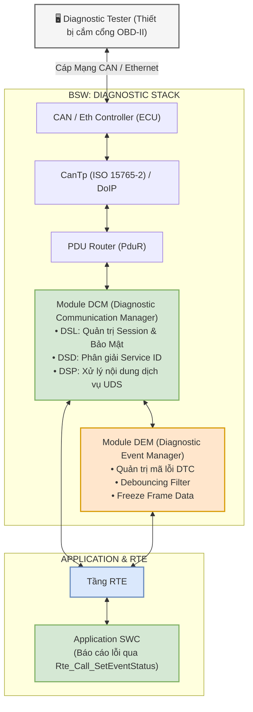
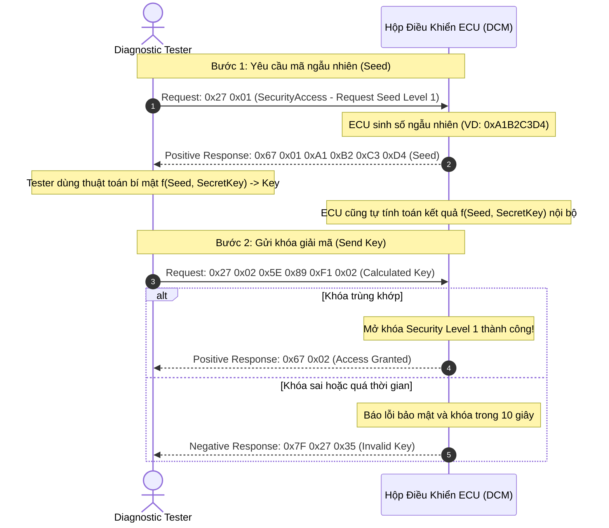
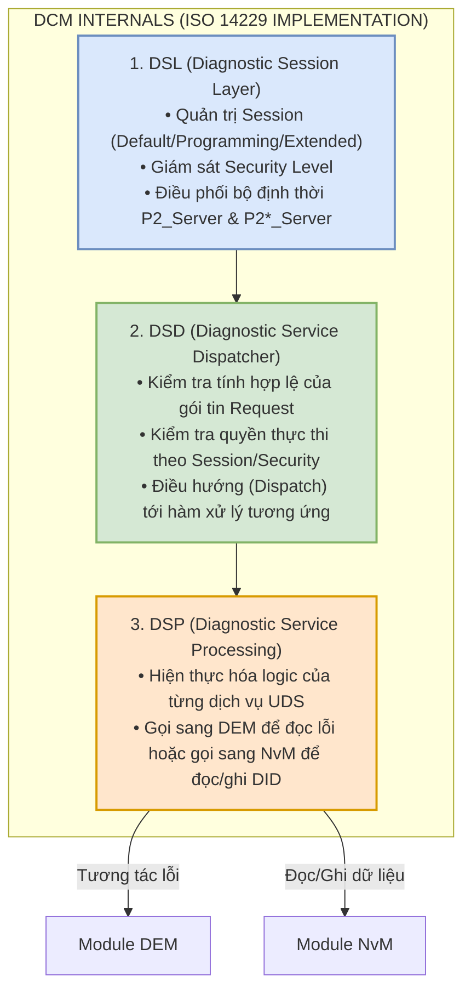
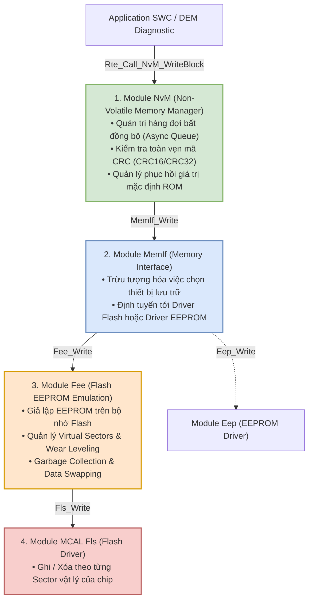
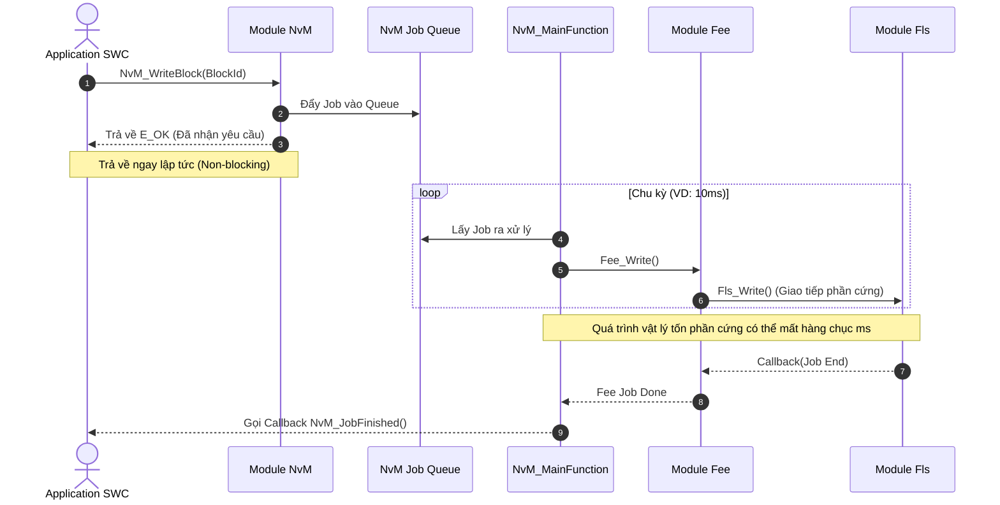
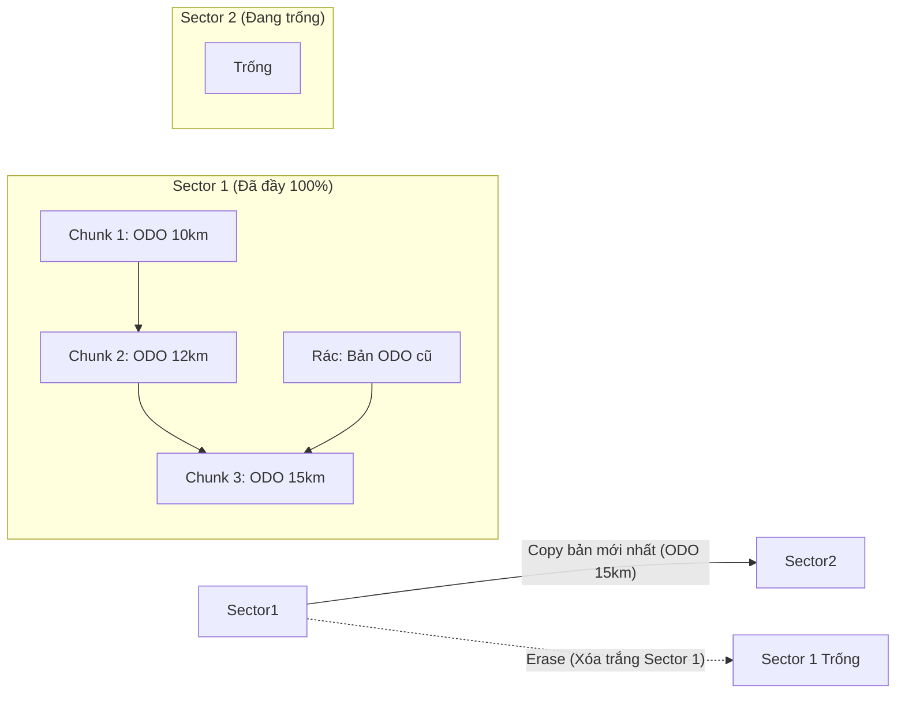

# Chuyên Đề 04: Diagnostic Stack (UDS ISO 14229, DCM, DEM) & Memory Stack (NvM, MemIf, Fee) Masterclass
## Masterclass Phân Tích Chuyên Sâu Giao Thức Chẩn Đoán UDS, Hệ Thống Quản Lý Mã Lỗi DEM/DCM và Ngăn Xếp Lưu Trữ Bộ Nhớ Phi Bốc Hơi NvM/MemIf/Fee

> **Ngôn ngữ:** Tiếng Việt Kỹ Nghệ Chuẩn Mực  
> **Cấp độ:** Universal Learning Resource (Từ Newbie đến Expert)
> **Tiêu chuẩn tham chiếu:** ISO 14229-1 (UDS), ISO 15031 (OBD), AUTOSAR DCM SWS, AUTOSAR DEM SWS, AUTOSAR NvM SWS, AUTOSAR Fee SWS  
> **Mã nguồn đối chiếu thực tế:** Kho mã nguồn [Study_AUTOSAR-main/as/](file:///C:/Users/liem.vu/Liem.vuOD/Study_AUTOSAR-main/as) (`com/as.infrastructure/diagnostic/`, `com/as.infrastructure/memory/`)  

---

## 📖 Bảng Thuật Ngữ (Glossary) Bắt Buộc Cần Nắm

*   **UDS** (*Unified Diagnostic Services - ISO 14229*): Giao thức chẩn đoán hợp nhất tiêu chuẩn toàn cầu được sử dụng hầu hết trên các phương tiện hiện nay.
*   **DTC** (*Diagnostic Trouble Code*): Mã lỗi chẩn đoán hư hỏng phần cứng/cảm biến/mạng. Giúp kỹ thuật viên nhận diện nhanh nguyên nhân.
*   **DID** (*Data Identifier*): Mã định danh dữ liệu 2-byte dùng để đọc/ghi thông số từ ECU, ví dụ DID 0xF190 để lấy số VIN.
*   **NRC** (*Negative Response Code*): Mã phản hồi âm khi yêu cầu UDS không hợp lệ hoặc không thể thực thi (VD: 0x13, 0x33, 0x78).
*   **Freeze Frame**: Khung dữ liệu đóng băng, lưu lại trạng thái các cảm biến tại khoảnh khắc xảy ra lỗi, cực kỳ hữu ích để tái hiện sự kiện.
*   **DCM** (*Diagnostic Communication Manager*): Module quản lý giao tiếp chẩn đoán, đóng vai trò định tuyến các tin nhắn UDS tới ứng dụng tương ứng.
*   **DEM** (*Diagnostic Event Manager*): Module quản lý sự kiện chẩn đoán, lưu trữ DTC, Freeze Frame và Extended Data vào bộ nhớ.
*   **NvM** (*Non-Volatile Memory Manager*): Module quản lý bộ nhớ phi bốc hơi, trừu tượng hóa các thao tác với EEPROM hoặc Flash.
*   **Fee** (*Flash EEPROM Emulation*): Module giả lập hành vi EEPROM trên chip Flash vật lý, cung cấp thuật toán Wear Leveling để nâng cao tuổi thọ Flash.
*   **Fls** (*Flash Driver*): Driver phần cứng điều khiển chip Flash vật lý (MCAL).
*   **MemIf** (*Memory Abstraction Interface*): Tầng trung gian cho phép NvM giao tiếp với cả Fee (Flash) và Eep (EEPROM vật lý) một cách trong suốt.

---

## Mục Lục

1. [Tổng Quan Ngăn Xếp Chẩn Đoán (Diagnostic Stack & UDS ISO 14229)](#1-tổng-quan-ngăn-xếp-chẩn-đoán-diagnostic-stack--uds-iso-14229)
2. [Bảng Ma Trận Các Dịch Vụ UDS Cốt Lõi (Core UDS Services)](#2-bảng-ma-trận-các-dịch-vụ-uds-cốt-lõi-core-uds-services)
   - [2.1 Dịch Vụ 0x10: DiagnosticSessionControl](#21-dịch-vụ-0x10-diagnosticsessioncontrol)
   - [2.2 Dịch Vụ 0x27: SecurityAccess (Thuật Toán Seed & Key)](#22-dịch-vụ-0x27-securityaccess-thuật-toán-seed--key)
   - [2.3 Dịch Vụ 0x22 & 0x2E: Read / Write Data By Identifier (DID)](#23-dịch-vụ-0x22--0x2e-read--write-data-by-identifier-did)
   - [2.4 Dịch Vụ 0x19 & 0x14: Read & Clear DTC Information](#24-dịch-vụ-0x19--0x14-read--clear-dtc-information)
   - [2.5 Cấu Trúc Khung Phản Hồi Âm (Negative Response - NRC)](#25-cấu-trúc-khung-phản-hồi-âm-negative-response---nrc)
3. [Module DCM (Diagnostic Communication Manager: DSL, DSD, DSP)](#3-module-dcm-diagnostic-communication-manager-dsl-dsd-dsp)
4. [Module DEM (Diagnostic Event Manager) & Cấu Trúc Mã Lỗi DTC](#4-module-dem-diagnostic-event-manager--cấu-trúc-mã-lỗi-dtc)
   - [4.1 Cấu Trúc Mã Lỗi DTC 3-Byte & Mã Kiểu Lỗi (Fault Type Byte - FTB)](#41-cấu-trúc-mã-lỗi-dtc-3-byte--mã-kiểu-lỗi-fault-type-byte---ftb)
   - [4.2 Giải Mã Chi Tiết 8-Bit Của DTC Status Byte](#42-giải-mã-chi-tiết-8-bit-của-dtc-status-byte)
   - [4.3 Thuật Toán Lọc Rung Lỗi (Debounce Algorithms: Counter-Based vs Time-Based)](#43-thuật-toán-lọc-rung-lỗi-debounce-algorithms-counter-based-vs-time-based)
   - [4.4 Khung Dữ Liệu Đóng Băng (Freeze Frame) & Extended Data Records](#44-khung-dữ-liệu-đóng-băng-freeze-frame--extended-data-records)
5. [Ngăn Xếp Bộ Nhớ Phi Bốc Hơi (Memory Stack: NvM, MemIf, Fee, Fls)](#5-ngăn-xếp-bộ-nhớ-phi-bốc-hơi-memory-stack-nvm-memif-fee-fls)
   - [5.1 Kiến Trúc 4 Tầng Của Memory Stack](#51-kiến-trúc-4-tầng-của-memory-stack)
   - [5.2 3 Loại Khối Bộ Nhớ NVRAM Block Types (Native, Redundant, Dataset)](#52-3-loại-khối-bộ-nhớ-nvram-block-types-native-redundant-dataset)
   - [5.3 Chu Trình Đọc/Ghi Bất Đồng Bộ (NvM_WriteBlock)](#53-chu-trình-đọcghi-bất-đồng-bộ-nvm_readall-nvm_writeall-nvm_writeblock)
   - [5.4 Cơ Chế Giả Lập Flash EEPROM (Fee: Virtual Sectors, Wear Leveling, Garbage Collection)](#54-cơ-chế-giả-lập-flash-eeprom-fee-virtual-sectors-wear-leveling-garbage-collection)
6. [Kiến Trúc Bootloader Ô Tô (asboot), Ứng Dụng Chính (ascore) & Vùng Lưu Trữ Firmware Dự Phòng (FOTA / Anti-Brick)](#6-kiến-trúc-bootloader-ô-tô-asboot-ứng-dụng-chính-ascore--vùng-lưu-trữ-firmware-dự-phòng-fota--anti-brick)
   - [6.0 Bản Chất Kỹ Nghệ: Nạp Bàn Thí Nghiệm (JTAG/SWD/QEMU) vs Nạp Xe Thật (UDS Bootloader) & Bản Chất Việc Sửa Linker Script](#60-bản-chất-kỹ-nghệ-nạp-bàn-thí-nghiệm-jtagswdqemu-vs-nạp-xe-thật-uds-bootloader--bản-chất-việc-sửa-linker-script)
   - [6.1 So Sánh Bản Chất Kỹ Nghệ: asboot vs ascore vs Vùng Lưu Trữ Dự Phòng](#61-so-sánh-bản-chất-kỹ-nghệ-asboot-vs-ascore-vs-vùng-lưu-trữ-dự-phòng)
   - [6.2 Giải Phẫu Cấu Trúc Module Của asboot Trong Dự Án as](#62-giải-phẫu-cấu-trúc-module-của-asboot-trong-dự-án-as)
   - [6.3 Chu Trình Nạp Flash Chuẩn UDS ISO 14229 & BSW Integration](#63-chu-trình-nạp-flash-chuẩn-uds-iso-14229--bsw-integration)
   - [6.4 Vùng Lưu Trữ Firmware Dự Phòng & 2 Kiến Trúc Chống Brick ECU](#64-vùng-lưu-trữ-firmware-dự-phòng--2-kiến-trúc-chống-brick-ecu)
   - [6.5 Cơ Chế Bàn Giao Quyền Thực Thi & Tái Định Vị Vector Table](#65-cơ-chế-bàn-giao-quyền-thực-thi--tái-định-vị-vector-table)
7. [Thực Chiến & Hands-On Exercise](#7-thực-chiến--hands-on-exercise)
8. [Các Cạm Bẫy Phổ Biến (Common Pitfalls)](#8-các-cạm-bẫy-phổ-biến-common-pitfalls)
9. [Bằng Chứng Mã Nguồn & Định Nghĩa Giao Tiếp](#9-bằng-chứng-mã-nguồn--định-nghĩa-giao-tiếp-trong-paraias)
10. [Đúc Kết Kỹ Nghệ & Bảng Tra Cứu APIs](#10-đúc-kết-kỹ-nghệ--bảng-tra-cứu-apis)
11. [Bộ Câu Hỏi Phỏng Vấn (Interview Questions)](#11-bộ-câu-hỏi-phỏng-vấn)

---

## 1. Tổng Quan Ngăn Xếp Chẩn Đoán (Diagnostic Stack & UDS ISO 14229)

🟢 **LEVEL 1: NEWBIE FRIENDLY**
📖 **Diagnostic Stack** giống như một "bác sĩ khám bệnh" cho xe ô tô. Khi bạn cắm máy chẩn đoán vào cổng OBD-II dưới vô lăng, máy đó sẽ "hỏi" ECU (hộp điều khiển) xem có bệnh gì không, xe chạy tốt không.
💡 *Ví dụ:* Máy chẩn đoán hỏi: "Nhiệt độ nước làm mát bao nhiêu?". ECU trả lời: "Đang là 90 độ C". Quá trình trao đổi này được chuẩn hóa toàn cầu bằng giao thức gọi là UDS.

🟡 **LEVEL 2: INTERMEDIATE**
Ngăn xếp chẩn đoán (*Diagnostic Stack*) phục vụ việc giao tiếp giữa **Thiết bị kiểm chuẩn bên ngoài (Diagnostic Tester / Scanner cắm qua cổng OBD-II)** và các hộp **ECU** trên xe hơi để:
1. Đọc và xóa mã lỗi hư hỏng phần cứng/cảm biến (**Diagnostic Trouble Codes - DTCs**).
2. Đọc thông số thời gian thực của xe (Live Sensor Data: Điện áp bình, Nhiệt độ dầu, Tốc độ động cơ).
3. Hiệu chỉnh cấu hình (Calibration), nạp số khung xe (VIN), và cập nhật Firmware (Flashing / FOTA).
4. Khởi chạy các Routine đặc biệt như xả gió phanh, tự học vị trí bướm ga.



🔴 **LEVEL 3: EXPERT (Deep Dive)**
Ở cấp độ kiến trúc hệ thống, Diagnostic Stack phải xử lý các luồng dữ liệu song song và quản lý bộ nhớ đệm (buffer management). Khi nhận một gói lệnh UDS dài qua CanTp (ISO 15765-2 Segmentation), PDUR gọi DCM cung cấp buffer (`Dcm_ProvideRxBuffer`). DCM phải tính toán timeout (P2/P2*). Nếu việc thao tác bộ nhớ kéo dài, DCM phải tự động phát NRC 0x78 (Response Pending) định kỳ để Tester không bị timeout ở Transport Layer. Sự đồng bộ giữa DCM (nhận request), DEM (đọc trạng thái fault hiện tại) và NvM (lấy snapshot data) là cực kỳ quan trọng, thường được đồng bộ thông qua các hàm callback bất đồng bộ được gọi từ BSW Scheduler (SchM).

---

## 2. Bảng Ma Trận Các Dịch Vụ UDS Cốt Lõi (Core UDS Services)

🟢 **LEVEL 1: NEWBIE FRIENDLY**
Giao thức UDS định nghĩa các "mã lệnh" chuẩn. Ví dụ `0x22` là đọc dữ liệu, giống như bạn gửi tin nhắn `GET_INFO` cho bạn bè. ECU trả lời `0x62` (cộng thêm 0x40 vào 0x22) kèm theo dữ liệu bạn cần. Nếu ECU bận hoặc bạn yêu cầu sai, nó sẽ trả lời bằng mã lỗi (NRC).

🟡 **LEVEL 2: INTERMEDIATE**
Chuẩn **ISO 14229-1 (Unified Diagnostic Services - UDS)** quy định các mã dịch vụ (*Service Identifier - SID*) chuẩn. Dưới đây là bảng phân loại các Service quan trọng nhất:

| SID Request | SID Positive Response | Tên Dịch Vụ UDS | Mô Tả Kỹ Thuật & Ứng Dụng Thực Tế |
|:---:|:---:|---|---|
| **`0x10`** | `0x50` | **DiagnosticSessionControl** | Chuyển đổi phiên làm việc (Default, Programming, Extended Diagnostic). |
| **`0x11`** | `0x51` | **ECUReset** | Yêu cầu ECU khởi động lại phần cứng (Hard Reset, Soft Reset, Key-Off-On). |
| **`0x14`** | `0x54` | **ClearDiagnosticInformation** | Xóa sạch bộ nhớ lưu trữ mã lỗi DTC và Freeze Frame trong Flash/EEPROM. |
| **`0x19`** | `0x59` | **ReadDTCInformation** | Đọc danh sách mã lỗi, số lượng lỗi, Snapshot dữ liệu lúc xảy ra lỗi. |
| **`0x22`** | `0x62` | **ReadDataByIdentifier (RDBI)** | Đọc dữ liệu biến/thông số từ ECU dựa theo mã định danh 2-byte DID. |
| **`0x2E`** | `0x6E` | **WriteDataByIdentifier (WDBI)** | Ghi dữ liệu cấu hình (VIN, Calibration data) vào bộ nhớ ECU theo DID. |
| **`0x27`** | `0x67` | **SecurityAccess** | Mở khóa bảo mật mức cao (yêu cầu Seed $
ightarrow$ tính toán Key) trước khi nạp Flash. |
| **`0x28`** | `0x68` | **CommunicationControl** | Bật / tắt tạm thời việc phát gói tin thông thường trên mạng CAN. |
| **`0x31`** | `0x71` | **RoutineControl** | Kích hoạt thực thi một hàm chức năng đặc biệt (Xả gió phanh ABS, Kiểm tra kim phun). |
| **`0x34`** | `0x74` | **RequestDownload** | Bắt đầu quy trình nạp phần mềm FOTA: Khai báo địa chỉ và dung lượng binary. |
| **`0x36`** | `0x76` | **TransferData** | Truyền các khối dữ liệu binary nhị phân vào RAM/Flash của ECU. |
| **`0x37`** | `0x77` | **RequestTransferExit** | Kết thúc quá trình truyền dữ liệu và kiểm tra toàn vẹn mã CRC. |

🔴 **LEVEL 3: EXPERT (Deep Dive)**
Các dịch vụ như 0x22, 0x2E, 0x31 đòi hỏi quyền truy cập dựa trên (1) Session, (2) Security Level, (3) Application State. Ma trận quyền truy cập này được định nghĩa tĩnh trong cấu hình DcmDsp (DcmDspDidInfo, DcmDspRoutineInfo). Ví dụ, DID 0xF190 (VIN) có thể cấu hình Read Allowed trong mọi Session, nhưng Write chỉ Allowed trong Extended Session và Security Level 1. Nếu không thỏa mãn, DCM tự động reject request bằng DSD mà không cần DSP xử lý, trả về 0x7F 0x2E 0x33.

### 2.1 Dịch Vụ 0x10: DiagnosticSessionControl
Mỗi ECU luôn khởi động ở chế độ mặc định (**Default Session**). Để thực hiện các tác vụ nguy hiểm, Tester phải yêu cầu chuyển Session. Mỗi session được duy trì bằng bộ đếm timeout (S3_Server, mặc định 5s). Nếu Tester ngắt kết nối không gửi thông điệp TesterPresent (0x3E), session sẽ reset về Default.
* `0x01` — **Default Session:** Phiên cơ bản, chỉ cho phép đọc thông số và đọc lỗi.
* `0x02` — **Programming Session:** Phiên nạp Flash Bootloader (vô hiệu hóa các ứng dụng thông thường).
* `0x03` — **Extended Diagnostic Session:** Cho phép điều khiển cơ cấu chấp hành và cấu hình thông số.

### 2.2 Dịch Vụ 0x27: SecurityAccess (Thuật Toán Seed & Key)

Quy trình bắt tay bảo mật 2 bước để ngăn chặn truy cập trái phép vào ECU (ví dụ ngăn chặn Odometer tampering - tua công tơ mét).



🔧 **Code C: Thuật toán f(Seed, Key) và Pitfall Attempt Counter**
```c
// Ví dụ thuật toán XOR/CRC đơn giản (Chỉ mang tính chất minh họa học thuật)
uint32 Calculate_Key(uint32 Seed, uint32 SecretKey) {
    // ⚠️ Warning: Thuật toán thực tế dùng AES-128/RSA, đây chỉ là dummy example
    return (Seed ^ SecretKey) + 0x12345678; 
}

// State Machine trong DCM
static uint8 SecurityAttemptCounter = 0;
static boolean IsLockedOut = FALSE;

Std_ReturnType Dcm_ProcessSecurityAccess(uint32 ReceivedKey) {
    if (IsLockedOut) {
        return E_NOT_OK; // ❌ Phải chờ Delay Timer (ví dụ 10 giây) kết thúc
    }
    
    uint32 ExpectedKey = Calculate_Key(CurrentSeed, APP_SECRET_KEY);
    
    if (ReceivedKey == ExpectedKey) {
        SecurityAttemptCounter = 0; // ✅ Best Practice: Luôn reset counter khi đúng để tránh khóa do tích lũy
        Unlock_Security_Level();
        return E_OK;
    } else {
        SecurityAttemptCounter++;
        if (SecurityAttemptCounter >= 3) {
            IsLockedOut = TRUE;
            Start_Penalty_Timer(10000); // 💀 Critical: Khóa 10 giây (Anti-bruteforce bảo vệ Brute Force Attack)
        }
        return E_NOT_OK;
    }
}
```

### 2.3 Dịch Vụ 0x22 & 0x2E: Read / Write Data By Identifier (DID)
Mỗi thông số được định danh bằng một số nguyên 2-byte (**DID - Data Identifier**):
* `0xF190`: Mã nhận diện xe VIN (17 ký tự ASCII).
* `0xF189`: Phiên bản phần mềm ECU Software Version.
* `0x0100`: Điện áp ắc-quy (Battery Voltage).

💡 **Code Example: Gửi UDS Request 0x22 & 0x2E (Đọc/Ghi VIN)**
```text
[ĐỌC VIN - Service 0x22, DID 0xF190]
Request  (Tester -> ECU): 0x22 0xF1 0x90
Response (ECU -> Tester): 0x62 0xF1 0x90 0x57 0x41 0x55 0x5A 0x5A 0x5A ... (Chuỗi ASCII của WAUZZZ...)

[GHI VIN - Service 0x2E, DID 0xF190]
Request  (Tester -> ECU): 0x2E 0xF1 0x90 0x57 0x41 0x55 0x5A 0x5A 0x5A ...
Response (ECU -> Tester): 0x6E 0xF1 0x90 (Báo hiệu ECU đã nhận và ghi thành công)
```
*(Nếu việc ghi mất thời gian, ECU sẽ trả về NRC 0x78 cho Tester đợi, sau đó trả về 0x6E).*

### 2.4 Dịch Vụ 0x19 & 0x14: Read & Clear DTC Information
* `0x19 0x01`: Yêu cầu báo cáo số lượng mã lỗi theo mặt nạ trạng thái (*reportNumberOfDTCByStatusMask*).
* `0x19 0x02`: Yêu cầu báo cáo danh sách mã lỗi theo mặt nạ trạng thái (*reportDTCByStatusMask*).
* `0x19 0x04`: Đọc dữ liệu đóng băng Snapshot của một mã lỗi cụ thể (*reportDTCSnapshotRecordByDTCNumber*).
* `0x14 0xFF 0xFF 0xFF`: Xóa toàn bộ mã lỗi của tất cả các nhóm lỗi.

### 2.5 Cấu Trúc Khung Phản Hồi Âm (Negative Response - NRC)

Khi một yêu cầu không hợp lệ hoặc bị từ chối, ECU trả về khung lỗi có định dạng 3 byte:
```
+------------+------------------------+---------------------------------+
| Byte 0: 7F | Byte 1: Requested SID  | Byte 2: NRC (Negative Resp Code)|
+------------+------------------------+---------------------------------+
```

| Mã NRC | Tên Mã Lỗi Chuẩn | Ý Nghĩa Kỹ Thuật |
|:---:|---|---|
| **`0x11`** | `serviceNotSupported` | ECU không hỗ trợ Service ID này (ví dụ gửi 0xAA không tồn tại). |
| **`0x12`** | `subFunctionNotSupported` | Sub-function không được hỗ trợ trong phiên hiện tại. |
| **`0x13`** | `incorrectMessageLengthOrInvalidFormat` | Chiều dài byte của gói tin Request bị sai so với cấu hình chuẩn. |
| **`0x22`** | `conditionsNotCorrect` | Điều kiện xe chưa thỏa mãn (ví dụ: đòi xả phanh ABS nhưng xe đang chạy 100km/h). |
| **`0x31`** | `requestOutOfRange` | Tham số DID hoặc Routine ID vượt quá dải cho phép. |
| **`0x33`** | `securityAccessDenied` | Chưa mở khóa dịch vụ `0x27` thành công. |
| **`0x78`** | `responsePending` | ECU đã nhận lệnh hợp lệ nhưng đang bận xử lý tác vụ dài (ví dụ: Ghi Flash/EEPROM), Tester chờ tiếp. |

---

## 3. Module DCM (Diagnostic Communication Manager: DSL, DSD, DSP)

🟢 **LEVEL 1: NEWBIE FRIENDLY**
DCM là "Cảnh sát giao thông" và "Lễ tân" của ECU. Nó kiểm tra xem Tester có được phép gửi lệnh đó không (có đúng Session không, đã có thẻ VIP Security chưa), sau đó dẫn đường đến đúng phân hệ để lấy dữ liệu. Quản lý timeout cũng là việc của DCM.

🟡 **LEVEL 2: INTERMEDIATE**
Module DCM được chia thành 3 tầng chức năng nội bộ rõ rệt:



🔴 **LEVEL 3: EXPERT (Deep Dive)**
Quản trị tài nguyên đệm trong DCM rất khắt khe. Khi Tester gọi `0x19 0x02` (Read DTCs by Status Mask), buffer TX (Transmission Buffer) có thể không đủ chứa hàng trăm DTC. Việc phân trang (Pagination) thông qua cơ chế của ISO 15765-2 (gửi các Consecutive Frames liên tục) phải được xử lý ở tầng DSP kết hợp với DSD. Mỗi khi một block dữ liệu được gửi thành công, `Dcm_TpTxConfirmation` được kích hoạt, cho phép DCM điền block tiếp theo vào buffer, bảo đảm an toàn bộ nhớ RAM hẹp hòi của MCU.

---

## 4. Module DEM (Diagnostic Event Manager) & Cấu Trúc Mã Lỗi DTC

🟢 **LEVEL 1: NEWBIE FRIENDLY**
DEM giống như một "Cuốn sổ Nam Tào". Khi cảm biến (ví dụ: nhiệt độ) báo lỗi, DEM sẽ ghi vào sổ mã lỗi (DTC). Để chắc chắn đó không phải do chập chờn (xe đi vào ổ gà), DEM đếm: "Lỗi 1 lần, 2 lần... 10 lần! Chắc chắn lỗi rồi, bật đèn Check Engine lên!".

🟡 **LEVEL 2: INTERMEDIATE**
### 4.1 Cấu Trúc Mã Lỗi DTC 3-Byte & Mã Kiểu Lỗi (Fault Type Byte - FTB)

Một mã lỗi **DTC (Diagnostic Trouble Code)** trong AUTOSAR gồm đúng **3 bytes (24 bits)**, định dạng phổ biến nhất theo ISO 15031-6:

```
+-----------------------------------+-----------------------------------+-----------------------------------+
|     Byte 1 (High Byte): Category  |     Byte 2 (Middle Byte): Subsys  |     Byte 3 (Low Byte): Fault Type |
+-----------------------------------+-----------------------------------+-----------------------------------+
```

* **Byte 1 & 2:** Xác định phân hệ bị lỗi:
  * **`Pxxxx` (Powertrain):** Động cơ, Hộp số, Pin BMS.
  * **`Cxxxx` (Chassis):** Khung gầm, Phanh ABS, Trợ lực lái EPS.
  * **`Bxxxx` (Body):** Thân xe, Cửa, Đèn, Túi khí.
  * **`Uxxxx` (Network):** Lỗi giao tiếp mạng bus CAN/LIN/Ethernet/FlexRay.
* **Byte 3 (FTB - Fault Type Byte):** Loại lỗi cụ thể:
  * `0x11`: Ngắn mạch lên nguồn dương (*Short to Battery*).
  * `0x12`: Ngắn mạch xuống mass (*Short to Ground*).
  * `0x13`: Hở mạch (*Open Circuit*).
  * `0x29`: Tín hiệu không hợp lệ (*Signal Invalid*).

### 4.2 Giải Mã Chi Tiết 8-Bit Của DTC Status Byte

Mỗi mã lỗi trong ECU luôn đi kèm một **Byte Trạng Thái (Status Byte 8-bit)** phản ánh vòng đời của lỗi:

| Bit | Tên Cờ Trạng Thái | Giá Trị `1` | Giá Trị `0` |
|:---:|---|---|---|
| **Bit 0** | `testFailed` | Lỗi đang xuất hiện ở chu kỳ kiểm tra gần nhất. | Lần kiểm tra gần nhất không có lỗi. |
| **Bit 1** | `testFailedThisOperationCycle` | Đã từng xuất hiện lỗi ít nhất 1 lần trong chu kỳ nổ máy hiện tại. | Chưa từng bị lỗi trong chu kỳ nổ máy này. |
| **Bit 2** | `pendingDTC` | Lỗi xuất hiện tạm thời nhưng chưa đủ lâu để xác nhận (chờ Debounce). | Không có lỗi chờ xác nhận. |
| **Bit 3** | `confirmedDTC` | **Lỗi đã được xác nhận chính thức** (ghi đè vào bộ nhớ Flash/EEPROM). | Lỗi chưa được xác nhận hoặc đã bị xóa. |
| **Bit 4** | `testNotCompletedSinceLastClear` | Kể từ lần xóa lỗi gần nhất, thuật toán kiểm tra lỗi chưa hoàn tất chạy. | Thuật toán kiểm tra đã chạy xong ít nhất 1 lần. |
| **Bit 5** | `testFailedSinceLastClear` | Kể từ lần xóa lỗi gần nhất, đã có ít nhất 1 lần phát hiện lỗi. | Chưa từng phát hiện lỗi từ khi xóa. |
| **Bit 6** | `testNotCompletedThisOperationCycle` | Trong chu kỳ nổ máy này, thuật toán kiểm tra lỗi chưa hoàn tất chạy. | Thuật toán đã hoàn tất kiểm tra trong chu kỳ này. |
| **Bit 7** | `warningIndicatorRequested` | Yêu cầu bật đèn cảnh báo lỗi trên đồng hồ taplo (**đèn Check Engine / MIL ON**). | Không yêu cầu bật đèn cảnh báo. |

🔴 **LEVEL 3: EXPERT (Deep Dive)**
### 4.3 Thuật Toán Lọc Rung Lỗi (Debounce Algorithms: Counter-Based vs Time-Based)

Để tránh báo lỗi giả do nhiễu điện từ đột biến, DEM cung cấp 2 thuật toán lọc, thường được kỹ sư Calibration cấu hình.

1. **Counter-Based Debouncing (Bộ đếm bước):**
   * Duy trì một biến đếm *Fault Counter*.
   * Khi phát hiện lỗi $
ightarrow$ Tăng biến đếm thêm `+StepUp` (ví dụ: +2).
   * Khi không có lỗi $
ightarrow$ Giảm biến đếm `-StepDown` (ví dụ: -1).
   * Chỉ khi biến đếm vượt ngưỡng **`Failed Threshold` (+127)** $
ightarrow$ Mới chính thức xác nhận lỗi (`confirmedDTC = 1`).
2. **Time-Based Debouncing (Bộ đếm thời gian):**
   * Lỗi phải tồn tại liên tục trong một khoảng thời gian cố định (ví dụ: liên tục 500 ms) mới xác nhận lỗi.

🔧 **Code C: Counter-based debounce với State Machine**
```c
#define DEBOUNCE_FAILED_THRESHOLD  127
#define DEBOUNCE_PASSED_THRESHOLD -128
#define STEP_UP 2
#define STEP_DOWN 1

static int8 FaultCounter = 0;

// Hàm này được gọi chu kỳ 10ms từ DEM MainFunction để đánh giá trạng thái lỗi
void Dem_DebounceCounter(boolean IsErrorActive) {
    if (IsErrorActive) {
        if (FaultCounter < DEBOUNCE_FAILED_THRESHOLD) {
            FaultCounter += STEP_UP; // Tăng nhanh khi có lỗi
        }
        if (FaultCounter >= DEBOUNCE_FAILED_THRESHOLD) {
            Dem_ReportConfirmedDTC(); // ✅ Xác nhận lỗi, chuyển cờ bit 3 lên 1, kích hoạt Freeze Frame
        }
    } else {
        if (FaultCounter > DEBOUNCE_PASSED_THRESHOLD) {
            FaultCounter -= STEP_DOWN; // Giảm chậm khi không có lỗi
        }
        if (FaultCounter <= DEBOUNCE_PASSED_THRESHOLD) {
            Dem_ReportPassedDTC(); // Xóa trạng thái lỗi tạm thời, clear bit 0
        }
    }
}
```

### 4.4 Khung Dữ Liệu Đóng Băng (Freeze Frame) & Extended Data Records

* **Freeze Frame (Snapshot Data):** Ngay tại thời điểm mã lỗi được xác nhận (`confirmedDTC`), DEM lập tức chụp lại toàn bộ trạng thái cảm biến của xe lúc đó (Tốc độ xe, Điện áp bình, Nhiệt độ nước làm mát, Vị trí bàn đạp ga) và lưu vĩnh viễn vào Flash để thợ sửa xe điều tra nguyên nhân.
* **Extended Data Records:** Lưu trữ số lần lỗi lặp lại (*Fault Occurrence Counter*), chu kỳ lão hóa lỗi (*Aging Counter*). Nó giúp biết xe bị lỗi bao nhiêu lần kể từ lần nổ máy cuối.

📊 **Data: Ví dụ dữ liệu Freeze Frame thực tế của lỗi P0A7E (BMS Over-temperature)**
```text
DTC: P0A7E (0x0A7E) - Battery Pack Over Temperature
Status: 0x2F (Bit 0,1,2,3,5 là 1: Confirmed, TestFailedThisCycle, Pending...)
--- Freeze Frame Data Record ---
DID 0x0100 (Battery Voltage): 385.5 V
DID 0x0101 (Battery Current): +150.0 A (Discharge)
DID 0x0102 (Max Cell Temp):   65 °C 💀 Critical!
DID 0x0103 (Vehicle Speed):   120 km/h
```
*(Chẩn đoán từ chuyên gia: Xe chạy tốc độ cao, dòng xả pin cực lớn trong thời gian dài khiến nhiệt độ cell pin vượt ngưỡng an toàn).*

---

## 5. Ngăn Xếp Bộ Nhớ Phi Bốc Hơi (Memory Stack: NvM, MemIf, Fee, Fls)

🟢 **LEVEL 1: NEWBIE FRIENDLY**
Ngăn xếp nhớ (NvM) là "Ổ cứng SSD" của xe. Tắt máy dữ liệu vẫn còn (VD: Số Kilomet, mã lỗi, cài đặt đài Radio). Trong đó, Module Fee đóng vai trò "Kẻ đánh lừa", làm cho chip Flash vật lý tưởng mình là bộ nhớ EEPROM cao cấp, giúp phân bổ dữ liệu nhỏ lẻ để ghi và tăng tuổi thọ chip, tránh việc ghi đi ghi lại 1 chỗ gây cháy chip.

🟡 **LEVEL 2: INTERMEDIATE**
### 5.1 Kiến Trúc 4 Tầng Của Memory Stack



### 5.2 3 Loại Khối Bộ Nhớ NVRAM Block Types (Native, Redundant, Dataset)

| Loại Khối NVRAM | Cấu Trúc Vật Lý Lưu Trữ | Độ An Toàn & Khả Năng Khôi Phục | Ứng Dụng Thực Tế |
|---|---|---|---|
| **Native Block** | 1 bản sao duy nhất trong Flash + 1 mã kiểm tra CRC. | Trung bình: Nếu CRC lỗi $
ightarrow$ Dữ liệu bị hỏng vĩnh viễn, phải nạp lại ROM Default. | Lưu thông số cấu hình thông thường (Cài đặt âm lượng, Độ sáng màn hình, Vị trí ghế lái). |
| **Redundant Block** | **2 bản sao lưu độc lập (Copy 1 & Copy 2)** + 2 mã CRC riêng biệt. | **Cực cao**: Nếu Copy 1 bị hỏng hoặc mất nguồn giữa lúc đang ghi, NvM tự động khôi phục dữ liệu từ Copy 2. | **Dữ liệu an toàn sống còn**: Odometer (Số km xe đã chạy), Mã lỗi chẩn đoán DTC, Dữ liệu túi khí, Khóa bảo mật. |
| **Dataset Block** | Mảng gồm **N phần tử dữ liệu con** được đánh chỉ số từ `0` đến `N-1`. | Linh hoạt: Cho phép ứng dụng chọn lựa phần tử cần đọc/ghi qua hàm `NvM_SetDataIndex()`. | Bảng dữ liệu hiệu chỉnh động cơ theo nhiều chế độ lái (Eco, Sport, Comfort). |

🔴 **LEVEL 3: EXPERT (Deep Dive)**
### 5.3 Chu Trình Đọc/Ghi Bất Đồng Bộ (`NvM_ReadAll`, `NvM_WriteAll`, `NvM_WriteBlock`)

Quá trình ghi Flash mất rất nhiều thời gian (vài mili-giây đến vài giây tùy kích thước block). Do đó, NvM hoạt động theo cơ chế **Bất Đồng Bộ (Asynchronous Non-Blocking)**:

1. **Giai đoạn Khởi động xe (`NvM_ReadAll`):**
   * Hàm `EcuM` gọi `NvM_ReadAll()` lúc hệ thống boot.
   * NvM tự động nạp toàn bộ các block dữ liệu từ Flash vào các vùng nhớ RAM tương ứng (*RAM Mirror Buffers*) và kiểm tra mã CRC. Nếu sai, nạp Default ROM.
2. **Giai đoạn Hoạt động bình thường Lúc Xe Chạy:**
   * Ứng dụng chỉ việc đọc/ghi trực tiếp trên RAM Mirror Buffer $
ightarrow$ Tốc độ tức thì (0 ns).
   * Khi muốn lưu vĩnh viễn xuống Flash, ứng dụng gọi `NvM_WriteBlock(BlockId, NULL)` $
ightarrow$ Lệnh được đẩy vào hàng đợi *NvM Queue*. Hàm nền `NvM_MainFunction()` chạy định kỳ để âm thầm thực thi tác vụ từ hàng đợi, nhường CPU cho các task khác chạy song song.
3. **Giai đoạn Tắt máy (`NvM_WriteAll`):**
   * Khi tài xế tắt chìa khóa xe (Key-Off), `EcuM` gọi `NvM_WriteAll()`.
   * NvM quét toàn bộ các RAM Mirror có cờ đánh dấu đã thay đổi (*Block Changed*) và ghi đồng loạt xuống Flash trước khi ngắt nguồn ECU hoàn toàn (đòi hỏi Mạch duy trì nguồn - Power Hold Circuit).



### 5.4 Cơ Chế Giả Lập Flash EEPROM (Fee: Virtual Sectors, Wear Leveling, Garbage Collection)

Bộ nhớ Flash có 2 nhược điểm vật lý cố hữu:
1. **Phải xóa toàn bộ Sector** lớn (ví dụ: 4KB - 64KB) trước khi ghi.
2. **Tuổi thọ xóa/ghi có giới hạn** (khoảng 10.000 đến 100.000 lần Erase Cycles), nếu ghi mãi vào 1 chỗ sẽ gây "cháy" sector đó.

Module **`Fee`** giải quyết triệt để vấn đề này, biến Flash thô sơ thành một thiết bị lưu trữ thông minh:
* **Virtual Sectors:** Chia Flash thành ít nhất 2 Sector ảo (*Sector 1* và *Sector 2*).
* **Chunk Allocation:** Khi ứng dụng cập nhật một biến Odometer (12 byte), Fee không xóa Flash. Nó ghi thêm block 12 byte này vào vùng trống (*Appended Chunks*) ngay dưới block cũ. Lúc này block cũ bị đánh dấu là "Rác" (Invalidated).
* **Garbage Collection (Thu gom rác):** Khi Sector 1 gần đầy, Fee tự động kích hoạt tiến trình sao chép các bản dữ liệu *mới nhất và hợp lệ* từ Sector 1 sang Sector 2. Sau khi sao chép xong an toàn, nó mới xóa trắng hoàn toàn Sector 1 để tái sử dụng.
* Cơ chế này luân phiên sử dụng toàn bộ dung lượng Flash, dàn đều số lần Erase lên khắp bề mặt vật lý, thuật ngữ này gọi là **Wear Leveling**. Tuổi thọ bộ nhớ có thể tăng từ 10.000 lên hàng trăm ngàn vòng đời.



---

## 6. Kiến Trúc Bootloader Ô Tô (`asboot`), Ứng Dụng Chính (`ascore`) & Vùng Lưu Trữ Firmware Dự Phòng (FOTA / Anti-Brick)

### 6.0 Bản Chất Kỹ Nghệ: Nạp Bàn Thí Nghiệm (JTAG/SWD/QEMU) vs Nạp Xe Thật (UDS Bootloader) & Bản Chất Việc Sửa Linker Script

> 💡 **Câu hỏi kỹ nghệ bản chất:**  
> *"Nạp qua cáp JTAG/SWD trên bàn thí nghiệm là gì? Tại sao khi chạy trên máy ảo QEMU ta lại tạm thời loại bỏ `asboot` và nạp thẳng `ascore`? Và tại sao khi làm như thế ta bắt buộc phải sửa file Linker Script (`linker.lds`)?"*

#### 1. "Nạp Qua Cáp JTAG/SWD Trên Bàn Thí Nghiệm" Nghĩa Là Gì?
* **Trên bàn thí nghiệm (Lab Bench / R&D Desk):** Kỹ sư cầm trên tay bo mạch phát triển (Development Board) hoặc một ECU mẫu đã được mở nắp vỏ. Trên mạch có các chân hàn kim loại nhỏ gọi là header nạp (`SWDIO`, `SWCLK`, `NRST`, `GND` hoặc JTAG `TMS`, `TCK`, `TDI`, `TDO`). Kỹ sư cắm một mạch nạp phần cứng vật lý (như ST-Link, J-Link, Lauterbach Trace32, PE Micro) trực tiếp vào các chân này và nối cáp USB vào máy tính.
  - **Đặc quyền của JTAG/SWD:** Mạch nạp có quyền lực tối thượng can thiệp thẳng vào phần cứng của chip vi điều khiển: Nó cưỡng bức CPU dừng chạy (Halt Core), điều khiển bus bộ nhớ ghi xóa Flash trực tiếp, và nạp từng byte file nhị phân vào Flash chỉ trong 1-2 giây.
* **Trên máy ảo QEMU:** Khi bạn chạy lệnh `qemu-system-arm -M lm3s6965evb -kernel stm32f107vc.exe`, QEMU đóng vai trò **chính là một cỗ máy nạp JTAG/SWD ảo siêu tốc**! QEMU đọc thẳng file nhị phân ELF từ ổ cứng máy tính và nạp thô dữ liệu trực tiếp vào bộ nhớ RAM/Flash mô phỏng, rồi đặt con trỏ lệnh Program Counter (PC) của CPU ảo vào hàm khởi động. **Hoàn toàn không cần đường truyền mạng CAN và không cần giao thức nạp chẩn đoán nào!**

#### 2. Tại Sao Trên Xe Thật (Production Vehicle) Lại TUYỆT ĐỐI KHÔNG THỂ Dùng JTAG/SWD?
* **ECU trên xe thật đã được đóng gói kín trong hộp nhôm đúc nguyên khối chống nước và bụi bẩn theo tiêu chuẩn IP67 / IP69K**, lắp đặt sâu trong khoang máy, dưới ghế lái, hoặc bên trong khối pack pin cao áp của xe điện.
* **Hoàn toàn không có chân cắm JTAG/SWD nào thò ra ngoài vỏ hộp!** Nếu muốn cắm JTAG, người thợ sửa xe hoặc kỹ sư sẽ phải tháo dỡ linh kiện xe, dùng tuốc-nơ-vít cạy keo silicon chống nước, tháo nắp hộp nhôm làm rách gioăng cao su bảo vệ (gây mất bảo hành của hãng và nguy cơ chập cháy do nước lọt vào).
* **Giao tiếp vật lý duy nhất giữa hộp ECU với thế giới bên ngoài là Giắc Cắm Bó Dây Điện Của Xe (Wiring Harness Connector)**. Giắc này chỉ dẫn ra 2 dây cấp nguồn (12V / GND) và các cặp dây mạng truyền thông trong xe: **CAN High / CAN Low**, LIN, hoặc Automotive Ethernet nối về cổng chẩn đoán OBD-II dưới vô lăng.
* **HỆ QUẢ:** Khi xe xuất xưởng chạy ngoài đường hoặc đưa vào xưởng dịch vụ bảo hành (Gara), **cách duy nhất để nạp lại phần mềm là gửi các gói tin dữ liệu nhị phân qua cổng chẩn đoán OBD-II (mạng CAN/Ethernet) vào một chương trình nạp có sẵn trong chip: đó chính là Bootloader (`asboot`)!**

```
+---------------------------------------------------------------------------------------------------+
|               SO SÁNH 2 PHƯƠNG THỨC NẠP FIRMWARE TRONG VÒNG ĐỜI KỸ NGHỆ Ô TÔ                      |
+---------------------------------------------------------------------------------------------------+

[PHƯƠNG THỨC 1: BÀN THÍ NGHIỆM / MÁY ẢO QEMU (DEVELOPMENT MODE)]
   Máy tính Dev ──(Cáp USB ST-Link / J-Link / QEMU Kernel)──► Bơm thẳng mã máy vào Flash CPU
   • Ưu điểm: Nhanh như chớp (1-2 giây), debug từng dòng lệnh C qua GDB, không cần giao thức.
   • Nhược điểm: Chỉ dùng được khi mạch mở nắp trên bàn lab; xe đã lắp ráp hoàn chỉnh KHÔNG THỂ dùng!

[PHƯƠNG THỨC 2: XE THẬT NGOÀI GARA / DÂY CHUYỀN LẮP RÁP (PRODUCTION MODE)]
   Máy chẩn đoán (Tester) ──(Cổng OBD-II / Cáp CAN Bus)──► [asboot] ──(Ghi Flash nội bộ)──► [ascore]
   • Ưu điểm: Nạp qua giắc điện ngoài xe mà không cần mở vỏ hộp ECU; Hỗ trợ nâng cấp từ xa qua 4G (FOTA).
   • Nhược điểm: Phải tuân theo chu trình đóng gói UDS ($10 02, $27, $34, $36, $37), tốn 1-3 phút.
+---------------------------------------------------------------------------------------------------+
```

#### 3. Bản Chất Cốt Lõi: Tại Sao Tạm Bỏ `asboot` Để Nạp `ascore` Vào QEMU/Board Lại Phải Sửa File Linker Script (`linker.lds`)?
Đây là câu hỏi chạm đến bản chất sâu sắc nhất về **kiến trúc phần cứng vi điều khiển ARM Cortex-M**:

##### ⚙️ Cơ Chế Phần Cứng CPU Khi Bật Nguồn (Power-On Reset):
Lõi CPU ARM Cortex-M được đúc sẵn trong silicon một hành vi vật lý bất biến: Khi có xung nguồn điện, phần cứng **luôn luôn đọc 8 bytes đầu tiên tại địa chỉ mặc định `0x00000000`** (hoặc địa chỉ Flash vật lý ánh xạ tương đương `0x08000000` trên dòng chip STM32):
* `0x00000000`: Nạp vào thanh ghi con trỏ ngăn xếp `MSP` (Main Stack Pointer).
* `0x00000004`: Nạp vào thanh ghi con trỏ lệnh `PC` (Program Counter) để nhảy đến lệnh C đầu tiên.

##### 🚗 Trường Hợp 1: Chế Độ Xe Thật (Production Mode — Chạy Kèm Bootloader `asboot`):
* `asboot` được biên dịch bằng [`linker-boot.lds`](file:///C:/Users/liem.vu/Liem.vuOD/Study_AUTOSAR-main/as/com/as.application/board.stm32f107vc/script/linker-boot.lds) với cấu hình: `FLASH.ORIGIN = 0x08000000`. Khi cấp nguồn, CPU đọc địa chỉ `0x08000000` và chạy thẳng vào hàm `reset_handler` của Bootloader.
* `ascore` được biên dịch bằng [`linker-app.lds`](file:///C:/Users/liem.vu/Liem.vuOD/Study_AUTOSAR-main/as/build/nt/lm3s6965evb/ascore/linker.lds) với cấu hình: `FLASH.ORIGIN = 0x08010000` (được đẩy lùi 64KB để nhường đất cho `asboot`). Toàn bộ bảng Vector Table và mã lệnh của `ascore` bắt đầu từ `0x08010000`.
* Khi cấp nguồn, CPU **không thể tự chạy `ascore` ngay**, mà `asboot` sẽ chạy trước, kiểm tra an toàn CRC, sau đó `asboot` mới thực thi lệnh ghi thanh ghi `SCB->VTOR = 0x08010000` và nhảy vào `ascore`.

##### 🧪 Trường Hợp 2: Chế Độ Thí Nghiệm / QEMU Debug Nhanh (Loại Bỏ `asboot`, Chỉ Nạp `ascore` — Standalone Mode):
* Trong quá trình học tập hoặc phát triển tính năng mới (ví dụ viết logic điều khiển xe, kiểm thử ma trận truyền thông CAN), bạn muốn sửa code và kiểm tra kết quả ngay trong 2 giây. Bạn không muốn mỗi lần chạy thử lại phải giả lập toàn bộ tiến trình nạp chẩn đoán UDS phiền phức của Bootloader.
* Vì vậy, bạn quyết định **chỉ biên dịch và nạp duy nhất file `ascore`** vào máy ảo QEMU hoặc nạp trực tiếp qua ST-Link.
* 💥 **CHUYỆN GÌ XẢY RA NẾU BẠN KHÔNG SỬA FILE LINKER SCRIPT?**
  - Nếu bạn vẫn để `ascore` biên dịch với `ORIGIN = 0x08010000` (hoặc `0x00010000` trên QEMU): Toàn bộ code `ascore` nằm tít ở địa chỉ `0x08010000`.
  - Trong khi đó, tại gốc bộ nhớ `0x08000000` (nơi CPU phần cứng sẽ đọc đầu tiên), do không có `asboot` được nạp vào, vùng nhớ này **HOÀN TOÀN TRỐNG RỖNG** (chứa toàn số `0xFFFFFFFF` hoặc `0x00000000`).
  - Khi bật máy ảo QEMU, CPU đọc tại `0x00000000`, nạp vào PC giá trị `0xFFFFFFFF` ➔ **Hệ thống bị treo cứng và sập ngay lập tức (HardFault Crash) trước khi kịp chạy bất kỳ dòng code nào!**
* ✅ **VÌ SAO PHẢI SỬA FILE `linker.lds`?**
  - Để giải quyết vấn đề trên, bạn sửa file `linker.lds`: Đổi `ORIGIN = 0x08010000` (hoặc `0x00010000`) lùi về gốc **`ORIGIN = 0x08000000`** (hoặc `0x00000000` trên QEMU).
  - Khi liên kết (Link), bảng Vector Table của `ascore` được đặt **ngay tại vị trí xuất phát đầu tiên của phần cứng CPU**!
  - Khi QEMU bật lên, CPU đọc ngay tại gốc `0x00000000` thấy đúng Entry [0] (`knl_system_stack_top`) và Entry [1] (`reset_handler`) của `ascore`.
  - `ascore` lập tức tự khởi động, gọi [`EcuM_Init()`](file:///C:/Users/liem.vu/Liem.vuOD/Study_AUTOSAR-main/as/release/ascore/app/main.c) tự cấu hình ngoại vi từ con số 0, bật hệ điều hành `askar` và chạy mượt mà mà **hoàn toàn không cần đến sự hiện diện của Bootloader!**

---

Trong sản xuất phần mềm ECU ô tô thực tế theo chuẩn AUTOSAR, bộ nhớ Flash của vi điều khiển được phân vùng thành 3 thực thể có vai trò, kiến trúc và vòng đời hoàn toàn khác biệt:

```
+===================================================================================================+
|               CẤU TRÚC PHÂN BỔ BỘ NHỚ FLASH THỰC TẾ TRONG DỰ ÁN AS (STM32F107VC)                  |
+===================================================================================================+

Địa chỉ Flash
0x08040000 +-------------------------------------------------------------------------------------+  <-- HẾT FLASH VẬT LÝ (256 KB)
           | 3. VÙNG LƯU TRỮ DỰ PHÒNG (BACKUP / INACTIVE BANK / OTA STAGING SLOT)                |
           | • Không chứa mã lệnh thực thi trực tiếp khi xe chạy bình thường                    |
           | • Lưu bản sao Firmware an toàn (Golden Image) hoặc gói cập nhật FOTA mới tải về     |
           | • Dung lượng: 64 KB – 128 KB                                                        |
0x08010000 +-------------------------------------------------------------------------------------+
           | 2. APPLICATION CORE FIRMWARE (`ascore`)                                             |  (Biên dịch bởi `linker-app.lds`)
           | • Bảng Vector Table của App (VTOR trỏ tại 0x08010000)                               |
           | • Hệ điều hành AUTOSAR OS (`askar` ECC2, 6 Tasks đa nhiệm tiền định)                 |
           | • Toàn bộ ngăn xếp BSW: ComStack (Can, CanIf, PduR, Com), Diag (Dcm, Dem), NvM/Fee   |
           | • Tầng trừu tượng RTE và các Software Component (SWC) điều khiển xe                 |
           | • Dung lượng: 128 KB – 192 KB                                                       |
0x08000000 +-------------------------------------------------------------------------------------+  <-- ĐỊA CHỈ NHẢY (APP_START_ADDR)
           | 1. BOOTLOADER FIRMWARE (`asboot`)                                                   |  (Biên dịch bởi `linker-boot.lds`)
           | • Bảng Vector Table mặc định của MCU (Nạp tại 0x08000000)                           |
           | • Primary Bootloader (`pbl_core.c`) & Flash Bootloader Engine (`bl_core.c`)          |
           | • UDS Flash Reprogramming Kernel ($10 02, $27, $34, $36, $37, $31)                  |
           | • Driver Flash vật lý độc lập (Polling mode, không dùng OS)                        |
           | • Dung lượng: 32 KB – 64 KB                                                         |
0x08000000 +-------------------------------------------------------------------------------------+  <-- GỐC FLASH VẬT LÝ
```

---

### 6.1 So Sánh Bản Chất Kỹ Nghệ: `asboot` vs `ascore` vs `Vùng Lưu Trữ Dự Phòng`

| Tiêu Chí Kỹ Nghệ | Bootloader Firmware (`asboot`) | Application Firmware (`ascore`) | Vùng Lưu Trữ Dự Phòng (Backup Slot) |
|---|---|---|---|
| **Định Nghĩa** | Khối chương trình khởi động tối giản, độc lập, nạp cố định tại gốc bộ nhớ Flash. | Phần mềm điều khiển nghiệp vụ chính thức của ECU ô tô (Operational SW). | Phân vùng Flash tĩnh dùng để chứa bản sao dữ liệu hoặc firmware thứ 2. |
| **Vị Trí Flash** | Gốc Flash (`0x08000000` trên STM32 / `0x00000000` trên QEMU LM3S). | Vùng giữa Flash (`0x08010000` trên STM32 / `0x00010000` trên LM3S). | Vùng cuối Flash (`0x08040000`+) hoặc chip External SPI Flash. |
| **Hệ Điều Hành** | **KHÔNG DÙNG OS** (Chạy vòng lặp tuần tự Polling đơn luồng). | **CÓ OS** (AUTOSAR OS `askar` chuẩn ECC2, đa nhiệm tiền định). | **KHÔNG** (Chỉ là vùng dữ liệu nhị phân thô, không thực thi). |
| **Tầng MCAL & BSW** | Chỉ gồm Driver tối thiểu: CAN Polling + Flash Programming. | Ngăn xếp BSW hoàn chỉnh 6 tầng: CAN, LIN, ETH, NvM, Fee, Dem, Dcm, RTE. | Không có. |
| **Thời Điểm Kích Hoạt** | 5ms đến 20ms đầu sau Power-On Reset hoặc khi nhận lệnh UDS `$10 02`. | Suốt toàn bộ vòng đời vận hành bình thường của xe (Drive Cycle). | Không bao giờ được CPU trực tiếp nhảy vào thực thi lệnh. |
| **Mục Đích Xây Dựng** | Cứu hộ ECU khi App hỏng; Tiếp nhận nạp Flash UDS; Xác thực an toàn (Secure Boot). | Thực thi logic điều khiển xe (BMS đo pin, VCU điều khiển mô tơ, BCM mở cửa). | Chống biến ECU thành "cục gạch" (Anti-brick) khi FOTA lỗi; Hỗ trợ Rollback. |

---

### 6.2 Giải Phẫu Cấu Trúc Module Của `asboot` Trong Dự Án `as`

Toàn bộ mã nguồn của Bootloader nằm tại thư mục [`as/com/as.infrastructure/boot/common/`](file:///C:/Users/liem.vu/Liem.vuOD/Study_AUTOSAR-main/as/com/as.infrastructure/boot/common/):

```
as/com/as.infrastructure/boot/common/
├── bootloader.h    <-- Định nghĩa macro log, cấp bảo mật BL_SECURITY_LEVEL_PRGS (0x02)
├── pbl_core.c      <-- Primary Bootloader: Kiểm tra cờ nạp, gọi Flash erase/write qua XCP
├── bl_core.c       <-- Flash Bootloader Engine: Quản lý danh sách blMemoryList[], UDS CheckMemory, Jump App
├── bl_sessec.c     <-- Session & Security: Xử lý Programming Session ($10 02) và thuật toán Seed/Key ($27)
├── main.c          <-- Hàm main() của Bootloader: Khởi tạo CAN, cấu hình Timer 1000ms chờ nạp
└── miniblt.h       <-- Định nghĩa cấu trúc khung gói nạp mini bootloader
```

#### 1. Module Quản Lý Bộ Nhớ Flash: `bl_core.c` ([`bl_core.c: L73-L79`](file:///C:/Users/liem.vu/Liem.vuOD/Study_AUTOSAR-main/as/com/as.infrastructure/boot/common/bl_core.c#L73-L79))
Bootloader quản lý các phân vùng Flash thông qua mảng cấu trúc tĩnh `blMemoryList[]`. Khi máy chẩn đoán gửi yêu cầu xóa hoặc ghi Flash, hàm `Dcm_CheckMemory()` sẽ đối chiếu địa chỉ để đảm bảo Tester không ghi đè vào chính vùng Bootloader:

```c
/* as/com/as.infrastructure/boot/common/bl_core.c */
static BL_MemoryInfoType blMemoryList[] = {
    /* STM32F107VC  */ { 0x00010000, 0x00040000, 0xFF, 0x04|0x02|0x01 }, /* Vùng nạp ascore (192KB) */
    /* VERSATILEPB  */ { 0x00040000, 0x08000000, 0xFF, 0x04|0x02|0x01 },
    /* MPC56XX      */ { 0x00020000, 0x00180000, 0xFF, 0x04|0x02|0x01 },
    /* FLASH DRIVER */ { 0x00000000, 0x00001000, 0xFD, 0x04|0x02|0x01 }, /* Vùng RAM chứa Flash Driver */
};
```

#### 2. Module Bảo Mật Seed & Key: `bl_sessec.c` ([`bl_sessec.c: L29-L65`](file:///C:/Users/liem.vu/Liem.vuOD/Study_AUTOSAR-main/as/com/as.infrastructure/boot/common/bl_sessec.c#L29-L65))
Để ngăn ngừa việc nạp phần mềm trái phép vào xe, `asboot` yêu cầu mở khóa bảo mật trước khi cho phép xóa Flash:
- Khi nhận `$27 01`, `BL_GetProgramSessionSeed()` sinh ra một số ngẫu nhiên 4-byte từ nhịp `GetOsTick()`.
- Máy chẩn đoán tính toán Key dựa trên thuật toán bí mật và gửi lại qua `$27 02`.
- `BL_CompareProgramSessionKey()` so khớp `u32KeyExpected = bl_prgs_seed ^ 0x94586792`. Nếu khớp, cờ bảo mật được mở và dừng bộ đếm `BL_StopAppTimer()` để không tự nhảy vào App!

---

### 6.3 Chu Trình Nạp Flash Chuẩn UDS ISO 14229 & BSW Integration

Một chu kỳ nạp lại phần mềm (Flash Reprogramming) cho ECU ô tô từ máy chẩn đoán (Tester) diễn ra qua chuỗi 8 bước nghiêm ngặt:

```
+===================================================================================================+
|               CHU KỲ NẠP FLASH UDS HOÀN CHỈNH TỪ TESTER ĐẾN ASBOOT QUA MẠNG CAN                   |
+===================================================================================================+

    MÁY CHẨN ĐOÁN (TESTER)                                 HỘP ĐIỀU KHIỂN ECU (ASBOOT)
             │                                                          │
   [1] Gửi:  │── 0x10 02 (DiagnosticSessionControl: ProgrammingSession) ──►│ Chuyển sang phiên nạp
       Nhận: │◄── 0x50 02 (Positive Response) ──────────────────────────│ Khóa các Task thông thường
             │                                                          │
   [2] Gửi:  │── 0x27 01 (SecurityAccess: Request Seed) ───────────────►│ Sinh số ngẫu nhiên `Seed`
       Nhận: │◄── 0x67 01 [Seed 4 bytes] ───────────────────────────────│ Lưu `bl_prgs_seed` vào RAM
             │                                                          │
   [3] Gửi:  │── 0x27 02 [Key 4 bytes = Seed ^ 0x94586792] ────────────►│ So sánh khóa `u32KeyExpected`
       Nhận: │◄── 0x67 02 (Security Unlocked OK) ───────────────────────│ Dừng Timer nhảy App
             │                                                          │
   [4] Gửi:  │── 0x31 01 FF 00 [StartAddr, Length] (Erase Flash Routine) ─►│ Gọi `eraseFlash()` trong bl_core
       Nhận: │◄── 0x71 01 FF 00 (Flash Erased Successfully) ────────────│ Xóa sạch phân vùng ascore
             │                                                          │
   [5] Gửi:  │── 0x34 [Format, Addr: 0x08010000, Size: 128KB] ─────────►│ `RequestDownload`: Kiểm tra
       Nhận: │◄── 0x74 [MaxNumberOfBlockLength: 4096 bytes] ────────────│ Cấp phát bộ đệm nhận dữ liệu
             │                                                          │
   [6] Gửi:  │── 0x36 01 [4096 bytes dữ liệu nhị phân] ─────────────────►│ `TransferData`: Ghi vào Flash
       Nhận: │◄── 0x76 01 (Block 1 Write OK) ───────────────────────────│ Gọi `FLASH_DRIVER_WRITE()`
             │   (Lặp lại bước 6 cho đến khi truyền hết file Hex)      │
             │                                                          │
   [7] Gửi:  │── 0x37 (RequestTransferExit) ────────────────────────────►│ `RequestTransferExit`
       Nhận: │◄── 0x77 (Transfer Closed OK) ────────────────────────────│ Đóng phiên truyền dữ liệu
             │                                                          │
   [8] Gửi:  │── 0x31 01 02 02 [CRC32 Checksum mong đợi] ───────────────►│ `CheckMemory`: Tính CRC Flash
       Nhận: │◄── 0x71 01 02 02 (Integrity Verification PASSED) ────────│ Khớp CRC32 -> Cho phép Boot
             │                                                          │
   [9] Gửi:  │── 0x11 01 (ECUReset: Hard Reset) ────────────────────────►│ CPU Reset vật lý
             │                                                          ▼
                                                                Nhảy vào `ascore` mới!
+===================================================================================================+
```

---

### 6.4 Vùng Lưu Trữ Firmware Dự Phòng & 2 Kiến Trúc Chống Brick ECU

#### ❓ Tại sao trong ngành ô tô bắt buộc phải có Vùng Lưu Trữ Dự Phòng?
Khi nâng cấp phần mềm từ xa qua sóng di động (**FOTA — Firmware Over-The-Air**), xe có thể đang chạy vào hầm mất sóng 4G, hoặc ắc quy 12V bị sụt nguồn giữa chừng đúng lúc đang xóa Flash (bước 4). Nếu hệ thống chỉ có 1 vùng nhớ duy nhất chứa `ascore`, hành động xóa Flash dở dang sẽ làm ECU **bị hỏng hoàn toàn (Bricked ECU)**, xe không thể khởi động lại để chạy về gara.

Tiêu chuẩn an toàn chức năng **ISO 26262** và quy định an ninh mạng **UN ECE R156** bắt buộc các ECU trung tâm (Gateway, VCU, ADAS) phải triển khai một trong hai kiến trúc sau:

#### 🌟 Kiến Trúc 1: A/B Dual-Bank Swapping (Phần Cứng Hỗ Trợ Độc Lập)
*Áp dụng trên các dòng vi điều khiển ô tô cao cấp: Infineon AURIX TC3xx, STM32H7, NXP S32K3, Renesas RH850.*
- Bộ nhớ Flash vật lý được chia đôi thành 2 Bank phần cứng hoàn toàn độc lập: **Bank A** và **Bank B**.
- **Cơ chế hoạt động:**
  1. Xe đang vận hành bình thường trên đường bằng Firmware tại **Bank A**.
  2. Module FOTA tải bản Firmware mới qua mạng 4G và ghi trực tiếp vào **Bank B** (Background Download). Quá trình này hoàn toàn không làm gián đoạn việc lái xe của tài xế!
  3. Sau khi tải xong, ECU tính toán chữ ký số RSA/SHA256 trên Bank B.
  4. Khi tài xế dừng xe, về số P và tắt khóa điện, Bootloader chỉ cần ghi 1 bit vào thanh ghi điều khiển Flash của MCU (`FLASH_OPTCR.SWAP_BANK = 1`).
  5. Phần cứng MCU tự động đảo địa chỉ: Bank B lập tức biến thành gốc `0x08000000`, Bank A trở thành vùng dự phòng. **Thời gian chuyển giao chỉ mất 0.1 giây (Zero Downtime)!**
  6. **Cơ chế Rollback:** Nếu Bank B khởi động bị lỗi làm Watchdog Reset 3 lần liên tiếp, Bootloader tự động xóa bit `SWAP_BANK` để đảo ngược lại Bank A an toàn.

#### 🌟 Kiến Trúc 2: Single-Bank Staging Slot + Golden Image Recovery
*Áp dụng trên các dòng vi điều khiển chỉ có 1 Bank Flash vật lý (như STM32F107VC trong dự án `as`).*
- Bộ nhớ Flash chia thành 3 phân vùng: `asboot` (`0x08000000`), `ascore` (`0x08010000`), và **Vùng Dự Phòng Staging Slot** (`0x08040000`).
- **Cơ chế hoạt động:**
  1. Dữ liệu nạp mới được ghi toàn bộ vào **Staging Slot**.
  2. Bootloader kiểm tra toàn vẹn CRC32 của Staging Slot. Nếu sai lệch do rớt mạng, hủy bỏ ngay lập tức — phân vùng `ascore` hiện tại vẫn nguyên vẹn 100%.
  3. Nếu CRC32 hợp lệ, `asboot` mới bắt đầu sao chép dữ liệu từ Staging Slot đè sang phân vùng `ascore`.
  4. Nếu trong quá trình chép đè bị mất nguồn điện, `asboot` phát hiện cờ `UpdateInProgress = TRUE` khi có điện trở lại và **tự động phục hồi lại từ bản sao an toàn (Golden Image)** được lưu trong chip nhớ ngoài SPI Flash / eMMC.

---

### 6.5 Cơ Chế Bàn Giao Quyền Thực Thi & Tái Định Vị Vector Table

Trong file [`bl_core.c: L402-L416`](file:///C:/Users/liem.vu/Liem.vuOD/Study_AUTOSAR-main/as/com/as.infrastructure/boot/common/bl_core.c#L402-L416), hàm `BL_TestJumpToApplicatin()` kích hoạt hàm liên kết `application_main()` để chuyển quyền sang `ascore`. Để quá trình chuyển giao này diễn ra an toàn tuyệt đối mà không bị crash hệ thống, chuỗi thao tác phần cứng sau bắt buộc phải được thực thi:

```
[BƯỚC 1: ĐÓNG BĂNG NGOẠI VI]
Vô hiệu hóa toàn bộ ngắt trong NVIC: `NVIC->ICER[i] = 0xFFFFFFFF`.
Xóa sạch toàn bộ cờ ngắt đang chờ: `NVIC->ICPR[i] = 0xFFFFFFFF`.
Dừng hoàn toàn bộ đếm nhịp SysTick: `SysTick->CTRL = 0`.
     │
     ▼
[BƯỚC 2: TÁI ĐỊNH VỊ VECTOR TABLE SANG ASCORE]
Ghi địa chỉ bắt đầu của `ascore` vào thanh ghi VTOR:
`SCB->VTOR = 0x08010000;`  (Trên STM32) hoặc `0x00010000;` (Trên QEMU).
     │
     ▼
[BƯỚC 3: THIẾT LẬP LẠI ĐỈNH NGĂN XẾP MAIN STACK POINTER (MSP)]
Đọc 4 bytes đầu tiên tại Entry [0] của ascore và gán vào thanh ghi SP:
`__set_MSP(*((uint32_t*)0x08010000));`
     │
     ▼
[BƯỚC 4: NHẢY VÀO RESET_HANDLER CỦA ASCORE]
Đọc con trỏ hàm tại Entry [1] của ascore (địa chỉ hàm `reset_handler` trong startup.S):
`pFunction app_entry = (pFunction)(*((uint32_t*)0x08010004));`
Thực thi lệnh rào cản pipeline và nhảy:
`__DSB(); __ISB();`
`app_entry();`  ➔ `ascore` bắt đầu chạy chu trình EcuM_Init() từ con số 0!
```

---

## 7. Thực Chiến & Hands-On Exercise

🛠️ **Hands-On Exercise: Dùng CANoe/PCAN gửi UDS frame đọc DTC và parse response**
**Yêu cầu:** Kết nối máy tính (cài đặt phần mềm CANoe hoặc PCAN-Explorer) với mạng CAN của xe qua cổng OBD-II.
**Bước 1:** Gửi UDS Request đọc mã lỗi:
`Tx: 03 19 02 08 00 00 00 00`
*(Giải thích: `03` là PCI độ dài gói Single Frame, `19 02` là Service ReadDTCByStatusMask, `08` là Mask lọc theo bit 3 - Confirmed DTC).*
**Bước 2:** ECU xử lý và trả về UDS Response. Nhận khung phản hồi:
`Rx: 07 59 02 09 0A 7E 2F 00`
**Bước 3:** Parse Response:
*   `07`: Độ dài nội dung 7 byte.
*   `59 02`: Positive Response của dịch vụ 19 02 (19 + 40 = 59).
*   `09`: DTC Status Availability Mask của ECU (báo cho Tester biết ECU có thể cung cấp các trạng thái nào).
*   `0A 7E`: Chính là mã lỗi `P0A7E` được lưu dưới dạng Hex.
*   `2F`: Status Byte của lỗi này (0x2F tức là 0010 1111 dạng nhị phân, bit 0,1,2,3 và 5 đều bật $
ightarrow$ TestFailed + Confirmed + Pending + TestFailedSinceLastClear).

🎯 **Real-world Scenario:**
Xe điện (EV) đang đi trên cao tốc, tài xế thấy báo lỗi hệ thống pin (BMS) nhấp nháy trên đồng hồ trung tâm. Thợ sửa xe đưa xe vào gara, dùng máy chẩn đoán cắm vào cổng OBD-II, gửi lệnh `19 04` (Read DTC Snapshot) để đọc Freeze Frame của mã lỗi P0A7E. Khi phân tích Freeze Frame trên màn hình máy scan, thợ thấy `Max Cell Temp` là 65 độ C tại thời điểm lỗi phát sinh, trong khi `Vehicle Speed` đang là 120km/h. Thợ sửa chữa tiếp tục kích hoạt Routine Control `0x31` bật bơm nước bằng tay, kết quả thấy bơm quay lờ đờ, dòng điện tiêu thụ thấp. Kết luận: Hệ thống làm mát pin bị nghẽn (do mô tơ bơm nước làm mát yếu đi sau thời gian sử dụng), dẫn đến nhiệt độ cell pin không kịp thoát khi xả dòng lớn chạy cao tốc. Thợ quyết định thay cụm bơm nước.

---

## 8. Các Cạm Bẫy Phổ Biến (Common Pitfalls)

1. ⚠️ **NRC 0x78 Loop:** ECU trả về NRC 0x78 (Response Pending) liên tục mà không có điểm dừng khi thao tác NvM bị kẹt hoặc phần cứng Fls bị lỗi không thể hoàn thành lệnh, làm Tester bị treo vô hạn, ảnh hưởng đến quy trình sản xuất End-Of-Line. ✅ *Khắc phục: Phải cấu hình thông số DcmDspMaxNumOf0x78 trong DCM để giới hạn số vòng lặp tối đa, quá giới hạn thì abort và trả về NRC `0x22` hoặc `0x10`.*
2. 💀 **Seed=0 Vulnerability:** Thuật toán sinh random trong chip (TRNG - True Random Number Generator) bị lỗi khởi tạo, lúc nào cũng sinh ra `Seed = 0x00000000`. Hacker bắt được gói, dễ dàng tìm được khóa bí mật (SecretKey) nếu thuật toán là hàm toán học đơn giản. ✅ *Khắc phục: Luôn kiểm tra Seed sinh ra, nếu bằng 0 phải sinh lại. Hơn nữa, tích hợp các chuẩn mã hóa HSM (Hardware Security Module) hoặc AES-128 để mã hóa Seed-Key.*
3. ❌ **NvM Blocking:** Gọi trực tiếp hàm ghi Flash (`Fls_Write`) bên trong một hàm ngắt (Interrupt ISR) hoặc MainFunction đồng bộ của ứng dụng. Điều này chiếm trọn CPU, gây treo Task, OS Watchdog reset ECU. ✅ *Khắc phục: Bắt buộc gọi `NvM_WriteBlock` (Async) để ghi ngầm nền, và cung cấp callback `Rte_Call_NvM_JobFinished()`.*
4. ⚠️ **Redundant block bị corruption cả 2 bản:** Mất nguồn điện đúng lúc hệ thống đang ghi song song hoặc ghi đè cả hai block dự phòng cùng một lúc. ✅ *Khắc phục: Kiến trúc module MemIf và Fee phải xử lý ghi tuần tự (Sequential). Ghi xong Copy 1 hoàn chỉnh, cập nhật Management byte (trạng thái hợp lệ), xác nhận thành công, rồi mới bắt đầu ghi Copy 2. Vậy nếu mất điện lúc ghi Copy 1, ta còn Copy 2 nguyên vẹn, và ngược lại.*
5. ❌ **Bỏ qua Negative Response khi Routine Control:** Tester gửi lệnh kích hoạt hàm xả gió phanh ABS (`0x31 0x01 0x02 0x03`), Tester (máy chẩn đoán của thợ) nhận về khung NRC `0x7F 0x31 0x22` (Conditions Not Correct, do ECU từ chối vì xe đang chạy ở tốc độ cao). Tester lại hiển thị cho thợ là "Bắt đầu xả gió thành công" vì lập trình viên quên bắt lỗi. Gây hiểu nhầm vô cùng nguy hiểm.

---

## 9. Bằng Chứng Mã Nguồn & Định Nghĩa Giao Tiếp

### 9.1 Cấu Trúc Khối Dữ Liệu NvM: `NvM.h`
**File:** `com/as.infrastructure/include/NvM.h`

```c
/* Khởi tạo toàn bộ ngăn xếp NvM */
void NvM_Init(void);

/* Đọc đồng loạt toàn bộ dữ liệu từ Flash lên RAM lúc khởi động (Gọi từ EcuM) */
void NvM_ReadAll(void);

/* Ghi đồng loạt toàn bộ dữ liệu từ RAM xuống Flash lúc tắt nguồn (Gọi từ EcuM) */
void NvM_WriteAll(void);

/* Yêu cầu ghi 1 block bất đồng bộ (Gọi từ App SWC) */
Std_ReturnType NvM_WriteBlock(NvM_BlockIdType BlockId, const uint8 *NvM_SrcPtr);

/* Yêu cầu đọc 1 block bất đồng bộ */
Std_ReturnType NvM_ReadBlock(NvM_BlockIdType BlockId, uint8 *NvM_DstPtr);

/* Lấy trạng thái kết quả của yêu cầu bất đồng bộ (Đang PENDING, OK, hay FAILED) */
Std_ReturnType NvM_GetErrorStatus(NvM_BlockIdType BlockId, NvM_RequestResultType *RequestResultPtr);
```

🔧 **Code Example: NvM_WriteBlock với callback khi ghi xong**
```c
// File: Bms_NvM_Callback.c
// Hàm này được cấu hình gọi khi NvM xử lý xong Job trong hàng đợi cho một Block cụ thể (Ví dụ block cấu hình dòng xả)
Std_ReturnType NvM_JobFinished_BMS_Config(uint8 ServiceId, NvM_RequestResultType JobResult) {
    if (JobResult == NVM_REQ_OK) {
        // Ghi thành công vào bộ nhớ phi bốc hơi, gửi notification cho State Machine của BMS
        Bms_UpdateStatus_NvmWrite(BMS_NVM_SUCCESS);
    } else {
        // Lỗi ghi bộ nhớ (ví dụ do Flash bị mòn, vượt quá tuổi thọ, hoặc lỗi phần cứng)
        Bms_UpdateStatus_NvmWrite(BMS_NVM_FAILED);
        // Báo lỗi hệ thống bộ nhớ lên DEM, để kỹ thuật viên biết ECU đã hư phần cứng lưu trữ
        (void) Dem_SetEventStatus(DEM_EVENT_EEPROM_ERROR, DEM_EVENT_STATUS_FAILED);
    }
    return E_OK; // Return OK cho BSW caller
}
```

### 9.2 Báo Cáo Lỗi Từ Ứng Dụng Lên DEM: `Dem.h`
**File:** `com/as.infrastructure/include/Dem.h`

```c
/* Hàm API cốt lõi để SWC hoặc BSW báo cáo trạng thái lỗi cho DEM */
Std_ReturnType Dem_SetEventStatus(
    Dem_EventIdType     EventId,       /* Mã định danh sự kiện lỗi (Được gen từ cấu hình) */
    Dem_EventStatusType EventStatus    /* Trạng thái: DEM_EVENT_STATUS_PASSED hoặc DEM_EVENT_STATUS_FAILED */
);

/* Hàm xóa mã lỗi chẩn đoán (Được gọi từ DCM khi nhận UDS 0x14) */
Std_ReturnType Dem_ClearDTC(
    uint32              DTC,           /* Mã DTC 3-byte hoặc 0xFFFFFF (Clear All) */
    Dem_DTCKindType     DTCKind,       /* Nhóm lỗi: DEM_DTC_KIND_ALL_DTCS */
    Dem_DTCOriginType   DTCOrigin      /* Vùng nhớ lưu: DEM_DTC_ORIGIN_PRIMARY_MEMORY */
);
```

🔧 **Code Example: Implement Dem_SetEventStatus trong BMS SWC cho lỗi quá nhiệt**
```c
// File: Bms_App.c
// Task giám sát nhiệt độ định kỳ mỗi 50ms
void BMS_MonitorTemperature(void) {
    // Lấy nhiệt độ cao nhất từ tất cả các cell pin (qua BSW ADC hoặc Sensor)
    float CurrentMaxTemp = Adc_GetMaxCellTemperature();
    
    // Nếu nhiệt độ lớn hơn 60 độ, báo lỗi FAILED
    if (CurrentMaxTemp >= 60.0f) {
        (void) Dem_SetEventStatus(DEM_DTC_BMS_OVERTEMP_P0A7E, DEM_EVENT_STATUS_FAILED);
        
        // Có thể bổ sung cơ chế Derating (giảm công suất xe để bảo vệ) tại đây
        Bms_ActivatePowerDerating(DERATING_LEVEL_SEVERE);
    } 
    // Nếu nhiệt độ giảm xuống mức an toàn, báo PASSED
    else if (CurrentMaxTemp <= 50.0f) {
        // Hiện tượng Hysteresis (trễ) giữa 50 - 60 giúp lọc rung chập chờn
        (void) Dem_SetEventStatus(DEM_DTC_BMS_OVERTEMP_P0A7E, DEM_EVENT_STATUS_PASSED);
        Bms_DeactivatePowerDerating();
    }
}
```

---

### 9.3 Cấu Trúc Khối Nạp Flash Của Bootloader: `bl_core.c` & `bl_sessec.c`
**File:** `com/as.infrastructure/boot/common/bl_core.c`

```c
/* Định nghĩa phân vùng bộ nhớ được phép lập trình Flash */
static BL_MemoryInfoType blMemoryList[] = {
    /* STM32F107VC  */ { 0x00010000, 0x00040000, 0xFF, 0x04|0x02|0x01 }, /* ascore */
    /* MPC56XX      */ { 0x00020000, 0x00180000, 0xFF, 0x04|0x02|0x01 },
    /* FLASH DRIVER */ { 0x00000000, 0x00001000, 0xFD, 0x04|0x02|0x01 },
};

/* Hàm kiểm tra tính hợp lệ của địa chỉ nạp từ Tester */
boolean Dcm_CheckMemory(uint8 attr, uint8 memoryIdentifier, uint32 memoryAddress, uint32 length);

/* Hàm chuyển giao quyền thực thi sang application_main() */
Std_ReturnType BL_TestJumpToApplicatin(uint8 *inBuffer, uint8 *outBuffer, Dcm_NegativeResponseCodeType *errorCode) {
    imask_t imask;
    Irq_Save(imask);
    application_main(); /* Nhảy vào ascore */
    Irq_Restore(imask);
    *errorCode = DCM_E_REQUEST_OUT_OF_RANGE;
    return E_NOT_OK;
}
```

---

## 10. Đúc Kết Kỹ Nghệ & Bảng Tra Cứu APIs

```
[BẢNG TỔNG KẾT VAI TRÒ DIAGNOSTIC & MEMORY STACK TRONG AUTOSAR CLASSIC]

1. DCM (Diagnostic Communication Manager):
   - Xử lý phiên làm việc (Session Control 0x10) và xác thực bảo mật Seed/Key (Security Access 0x27).
   - Tiếp nhận và định tuyến các dịch vụ UDS 0x11, 0x14, 0x19, 0x22, 0x2E, 0x31.
   - Quản lý P2, P2* timeout, phát sinh NRC 0x78 khi hệ thống bận rộn.

2. DEM (Diagnostic Event Manager):
   - Quản lý tập trung toàn bộ mã lỗi DTC 3-byte và Status Byte 8-bit từ tất cả SWC.
   - Cung cấp thuật toán lọc rung lỗi (Debounce Counter/Timer) giảm thiểu false-positive.
   - Chụp dữ liệu đóng băng Freeze Frame Data Record và Extended Data Record tại tích tắc lỗi xảy ra.
   - Quyết định việc bật đèn cảnh báo MIL (Check Engine).

3. NVM (Non-Volatile Memory Manager):
   - Đọc/Ghi dữ liệu bất đồng bộ xuống phần cứng lưu trữ vật lý.
   - Hỗ trợ Native, Redundant (2 bản sao an toàn chống mất nguồn), Dataset blocks.
   - Tự động hóa tiến trình NvM_ReadAll lúc Startup và NvM_WriteAll lúc Shutdown xe.
   - Đảm bảo tính toàn vẹn qua cấu hình CRC16/CRC32.

4. FEE (Flash EEPROM Emulation):
   - Giả lập hành vi EEPROM (ghi nhỏ lẻ byte) trên nền tảng bộ nhớ Flash (buộc xóa sector).
   - Phân tán mức độ hao mòn số lần ghi (Wear Leveling) bảo vệ chip.
   - Tự động thu gom vùng nhớ rác (Garbage Collection) trong nền.
```

---

## 11. Bộ Câu Hỏi Phỏng Vấn (Interview Questions)

**Q1:** Sự khác biệt cốt lõi giữa hàm `NvM_WriteBlock` và `NvM_WriteAll` là gì? Khi nào dùng cái nào?
> *Trả lời:* `NvM_WriteBlock` là hàm lưu 1 block dữ liệu cụ thể một cách bất đồng bộ, thường được gọi bởi SWC khi đang chạy bình thường để lưu ngay một dữ liệu quan trọng. Trái lại, `NvM_WriteAll` là hàm lưu đồng loạt toàn bộ các block RAM bị thay đổi (có cờ Block Changed) xuống Flash. Nó chỉ được gọi một lần duy nhất bởi BSW Manager (`EcuM`) trong pha Shutdown Phase lúc tắt máy. Dùng WriteBlock liên tục quá nhiều sẽ làm mòn Flash, còn dùng WriteAll thì phải đảm bảo ECU không bị ngắt điện đột ngột trước khi quá trình ghi hàng loạt hoàn tất (cần Power Hold Relay).

**Q2:** Hãy giải thích ý nghĩa và sự liên kết của bit 3 (ConfirmedDTC) và bit 0 (TestFailed) trong DTC Status Byte?
> *Trả lời:* Bit 0 biểu thị lỗi đang thực sự xảy ra ngay tại khoảnh khắc hệ thống lấy mẫu hiện tại. Bit 3 biểu thị lỗi đã từng tồn tại đủ lâu để vượt qua bộ lọc đếm thời gian/số lần (Debounce Filter) và đã được ghi nhận chính thức vào bộ nhớ phi bốc hơi. 
> - Nếu bit 0 = 1 và bit 3 = 0: Lỗi mới chớm xuất hiện, đang chờ đếm Debounce, chưa lưu.
> - Nếu bit 0 = 1 và bit 3 = 1: Lỗi đang xảy ra và đã được ghi nhận.
> - Nếu bit 0 = 0 nhưng bit 3 = 1: Lỗi đã từng xảy ra và được xác nhận trước đây, nhưng hiện tại hệ thống cảm biến đã ổn định và không còn lỗi (Ví dụ: tuột giắc cắm nhưng thợ đã cắm lại). Lỗi này gọi là lỗi lịch sử.

**Q3:** Cơ chế Wear Leveling của module Fee hoạt động như thế nào để bảo vệ Flash khỏi hiện tượng hao mòn do ghi lặp lại?
> *Trả lời:* Module Fee tạo ra khái niệm các "Virtual Sectors". Thay vì xóa toàn bộ Sector khi có một byte thay đổi (gây tốn kém và mòn bộ nhớ), Fee sử dụng cơ chế "Chunk Allocation" để ghi nối tiếp các block mới cập nhật vào vùng trống tiếp theo của Sector hiện tại, đồng thời đánh dấu block cũ là invalid (rác). Khi Sector hiện tại đã đầy, cơ chế "Garbage Collection" sẽ kích hoạt: copy các block dữ liệu mới nhất (còn hợp lệ) sang một Sector mới, và tiến hành "Erase" toàn bộ Sector cũ để tạo vùng trống luân phiên. Điều này dàn trải chu kỳ xóa/ghi (Erase/Write cycles) luân phiên ra toàn bộ bề mặt vật lý của bộ nhớ Flash, tránh tình trạng "cháy" một vùng nhớ cụ thể.

**Q4:** NRC 0x78 (Response Pending) được gửi trong hoàn cảnh nào? Làm sao để Tester không bị treo vô hạn?
> *Trả lời:* NRC 0x78 được gửi bởi module DCM khi nó đã nhận một Request hợp lệ, nhưng quá trình thực thi cần nhiều thời gian hơn P2 timeout (ví dụ: đang gọi NvM_WriteBlock để ghi DID xuống Flash, thao tác I/O này mất hàng trăm ms). DCM sẽ phát NRC 0x78 để "xin" Tester cấp thêm thời gian P2*. Để ngăn chặn vòng lặp 0x78 vô tận khi phần cứng Flash bị treo, ta phải cấu hình thuộc tính `DcmDspMaxNumOf0x78` (số lần phát NRC 0x78 tối đa). Nếu vượt quá số lần này mà Job chưa xong, DCM tự động abort tác vụ và trả về NRC 0x10 hoặc 0x22 (General Reject), giải phóng kết nối cho Tester.

**Q5:** Trong kiến trúc ECU ô tô, tại sao `asboot` lại không sử dụng hệ điều hành RTOS/AUTOSAR OS mà chạy theo mô hình Polling tuần tự?
> *Trả lời:* Bootloader là thành phần cứu hộ an toàn mức thấp nhất (Safety-critical / Fail-safe recovery). Nếu tích hợp RTOS vào Bootloader, kích thước mã máy sẽ phình to (vượt ngưỡng 32-64KB của sector đầu Flash), thời gian khởi động (Startup latency) bị kéo dài vượt quá mức cho phép (yêu cầu xe phải phản hồi CAN trong vòng 20-50ms), và tiềm ẩn nguy cơ Deadlock hoặc Stack Overflow trong nhân OS khi Flash bị lỗi. Chạy Polling đơn luồng đảm bảo tính đơn giản tuyệt đối (Deterministic execution), dễ dàng chứng minh chứng chỉ an toàn ISO 26262 ASIL-D.

**Q6:** Trình bày cơ chế chống Brick ECU khi thực hiện nâng cấp FOTA qua kiến trúc Dual-Bank Flash A/B Swapping?
> *Trả lời:* Trong kiến trúc Dual-Bank, bộ nhớ Flash chia thành Bank A (đang chạy) và Bank B (dự phòng). Firmware mới được ghi ngầm vào Bank B trong lúc xe vẫn chạy bình thường trên Bank A. Sau khi nạp xong, hệ thống kiểm tra chữ ký số RSA/SHA256 trên Bank B. Khi đỗ xe và tắt máy, Bootloader cấu hình thanh ghi phần cứng MCU tráo đổi địa chỉ (`SWAP_BANK`), biến Bank B thành địa chỉ gốc để khởi động App mới. Nếu App mới bị lỗi khiến Watchdog reset liên tục (vượt quá `MAX_BOOT_ATTEMPTS`), Bootloader phát hiện và tự động xóa cờ `SWAP_BANK` để Rollback quay trở lại Bank A, đảm bảo xe không bao giờ bị "chết đứng" ngoài đường.

