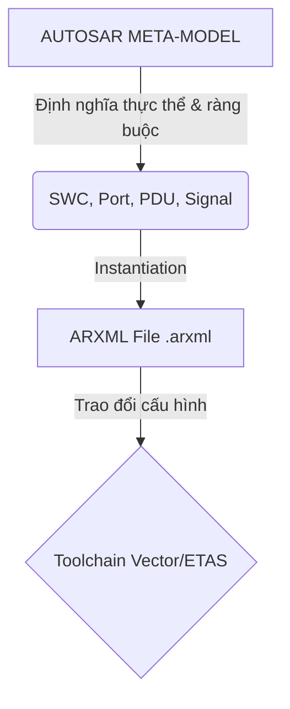
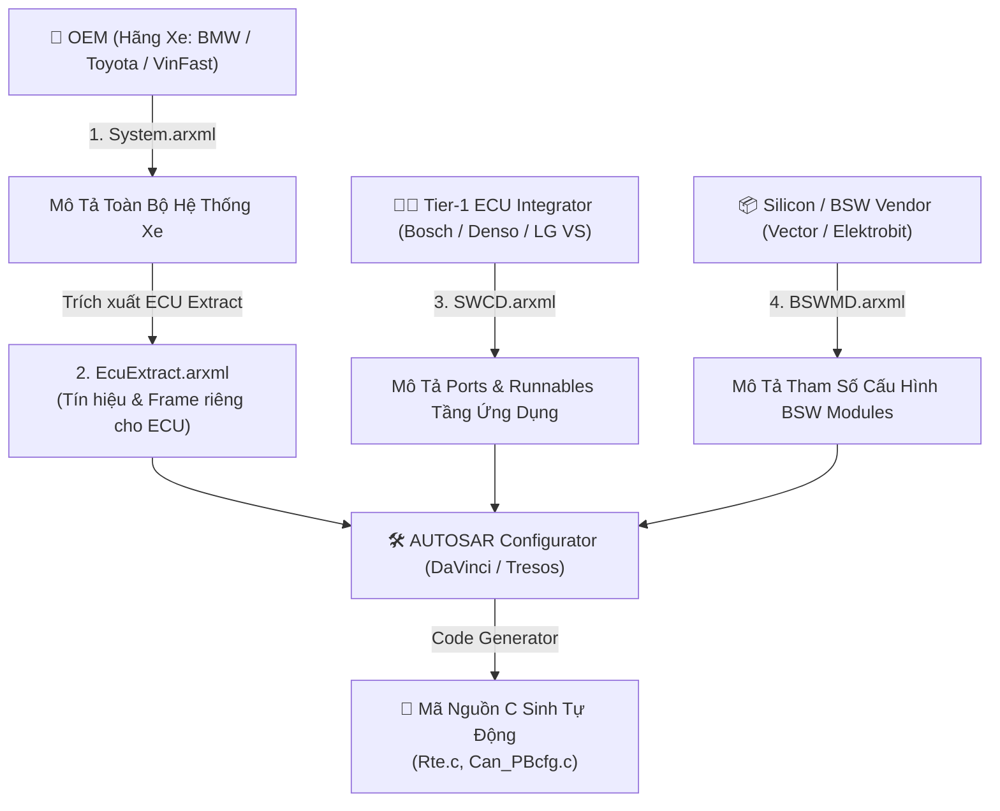
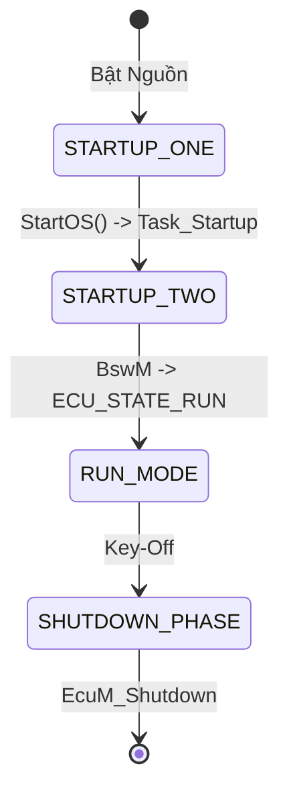
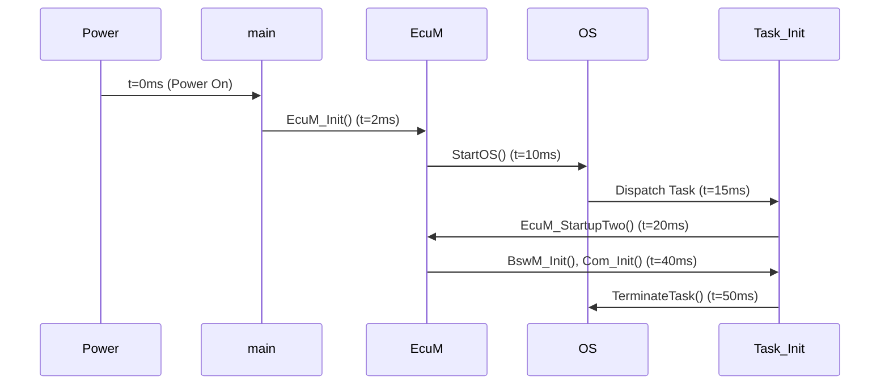

import os

output_file = r'C:\Users\liem.vu\Liem.vuOD\Study_AUTOSAR-main\docs\05_Toolchain_ARXML_And_ECU_Integration.md'

content = r"""# Chuyên Đề 05: ARXML Meta-Model, Toolchain Engineering, ECU Integration & Mock Interview
## Masterclass Phân Tích Cấu Trúc ARXML, Quy Trình Toolchain Vector DaVinci/Tresos, Chu Trình Khởi Động EcuM/BswM và Bộ 60 Câu Hỏi Phỏng Vấn Thực Chiến

> **Ngôn ngữ:** Tiếng Việt Kỹ Nghệ Chuẩn Mực  
> **Cấp độ:** Universal Learning Resource (Newbie to Expert)
> **Tiêu chuẩn tham chiếu:** AUTOSAR Toolchain SWS, AUTOSAR EcuM SWS, AUTOSAR BswM SWS, AUTOSAR WdgM SWS, ARXML Schema Release 4.x  
> **Mã nguồn đối chiếu thực tế:** Kho mã nguồn [Study_AUTOSAR-main/as/](file:///C:/Users/liem.vu/Liem.vuOD/Study_AUTOSAR-main/as) (`com/as.infrastructure/system/EcuM/`, `com/as.tool/`)  
> **Vị trí tài liệu:** [Study_AUTOSAR-main/docs/05_Toolchain_ARXML_And_ECU_Integration.md](file:///C:/Users/liem.vu/Liem.vuOD/Study_AUTOSAR-main/docs/05_Toolchain_ARXML_And_ECU_Integration.md)

---

## Mục Lục

1. [Bản Chất Kỹ Thuật Của ARXML & Mô Hình AUTOSAR Meta-Model](#1-bản-chất-kỹ-thuật-của-arxml--mô-hình-autosar-meta-model)
2. [Phân Loại 4 Tệp ARXML Cốt Lõi Trong Dự Án Ô Tô](#2-phân-loại-4-tệp-arxml-cốt-lõi-trong-dự-án-ô-tô)
3. [Quy Trình Công Cụ Kỹ Nghệ Ô Tô (Industry Toolchain Workflow)](#3-quy-trình-công-cụ-kỹ-nghệ-ô-tô-industry-toolchain-workflow)
4. [Chu Trình Khởi Động & Vòng Đời Tích Hợp ECU (ECU Integration & Lifecycle)](#4-chu-trình-khởi-động--vòng-đời-tích-hợp-ecu-ecu-integration--lifecycle)
5. [Giám Sát An Toàn Chương Trình (Watchdog Manager - WdgM Masterclass)](#5-giám-sát-an-toàn-chương-trình-watchdog-manager---wdgm-masterclass)
6. [Bằng Chứng Mã Nguồn & Định Nghĩa Giao Tiếp Trong `parai/as`](#6-bằng-chứng-mã-nguồn--định-nghĩa-giao-tiếp-trong-paraias)
7. [Bộ 60 Câu Hỏi Phỏng Vấn Thực Chiến Toàn Diện (Easy → Medium → Hard)](#7-bộ-60-câu-hỏi-phỏng-vấn-thực-chiến-toàn-diện-easy--medium--hard)

---

## 1. Bản Chất Kỹ Thuật Của ARXML & Mô Hình AUTOSAR Meta-Model

### 🟢 LEVEL 1: NEWBIE FRIENDLY
📖 **Glossary - ARXML (*AUTOSAR XML*)**: Định dạng file tiêu chuẩn dùng để mô tả kiến trúc phần mềm và phần cứng của xe hơi. 
💡 **Ẩn dụ thực tế**: Giống như bản vẽ thiết kế (Blueprint) của một ngôi nhà. Bạn đưa bản vẽ này cho các nhà thầu khác nhau (thợ điện, thợ nước), họ sẽ dựa vào đó để xây nhà. ARXML giúp các công cụ phần mềm khác nhau (Vector, ETAS) hiểu và trao đổi dữ liệu mà không bị sai lệch.

### 🟡 LEVEL 2: INTERMEDIATE
Trong kỹ nghệ phần mềm ô tô, **ARXML** không phải là file XML thông thường mà là sự cụ thể hóa tuần tự (*Serialization*) của mô hình dữ liệu trừu tượng **AUTOSAR Meta-Model**:


✅ **Best Practice**: Luôn validate file ARXML với AUTOSAR Schema (.xsd) tương ứng trước khi import vào project.

### 🔴 LEVEL 3: EXPERT (Deep Dive)
Dưới đây là một ví dụ 💡 **ARXML snippet thực tế** khai báo một **Software Component (SWC)** với một **Sender/Receiver Port (S/R Port)**:

```xml
<?xml version="1.0" encoding="UTF-8"?>
<AUTOSAR xmlns="http://autosar.org/schema/r4.0" xmlns:xsi="http://www.w3.org/2001/XMLSchema-instance" xsi:schemaLocation="http://autosar.org/schema/r4.0 AUTOSAR_4-2-2.xsd">
  <AR-PACKAGES>
    <AR-PACKAGE>
      <SHORT-NAME>MyApplication</SHORT-NAME>
      <ELEMENTS>
        <APPLICATION-SW-COMPONENT-TYPE>
          <SHORT-NAME>EngineController_SWC</SHORT-NAME> <!-- Tên của SWC -->
          <PORTS>
            <R-PORT-PROTOTYPE>
              <SHORT-NAME>RP_EngineSpeed</SHORT-NAME> <!-- Tên Port Nhận (Receiver Port) -->
              <REQUIRED-INTERFACE-TREF DEST="SENDER-RECEIVER-INTERFACE">/Interfaces/SRI_EngineSpeed</REQUIRED-INTERFACE-TREF>
            </R-PORT-PROTOTYPE>
          </PORTS>
          <INTERNAL-BEHAVIORS>
            <SWC-INTERNAL-BEHAVIOR>
              <SHORT-NAME>IB_EngineController</SHORT-NAME>
              <RUNNABLES>
                <RUNNABLE-ENTITY>
                  <SHORT-NAME>RE_CalculateInjection</SHORT-NAME>
                  <MINIMUM-START-INTERVAL>0.01</MINIMUM-START-INTERVAL> <!-- Chu kỳ 10ms -->
                  <SYMBOL>EngineController_CalculateInjection</SYMBOL> <!-- Tên hàm C được sinh ra -->
                </RUNNABLE-ENTITY>
              </RUNNABLES>
            </SWC-INTERNAL-BEHAVIOR>
          </INTERNAL-BEHAVIORS>
        </APPLICATION-SW-COMPONENT-TYPE>
      </ELEMENTS>
    </AR-PACKAGE>
  </AR-PACKAGES>
</AUTOSAR>
```
🔧 **Giải thích tag XML**: 
- `<APPLICATION-SW-COMPONENT-TYPE>`: Định nghĩa một SWC ứng dụng.
- `<R-PORT-PROTOTYPE>`: Định nghĩa Receiver Port.
- `<REQUIRED-INTERFACE-TREF>`: Trỏ tới Interface mô tả kiểu dữ liệu của Port.
- `<RUNNABLE-ENTITY>`: Định nghĩa hàm xử lý logic bên trong SWC.

💀 **Critical Bug**: Thiếu hoặc sai version schema ở thẻ `<AUTOSAR>` có thể dẫn đến toàn bộ hệ thống parsing ARXML bị lỗi sập (Crash) hoặc bỏ qua các thẻ quan trọng.

---

## 2. Phân Loại 4 Tệp ARXML Cốt Lõi Trong Dự Án Ô Tô

### 🟢 LEVEL 1: NEWBIE FRIENDLY
📖 **Glossary - OEM (*Original Equipment Manufacturer*)**: Hãng xe ô tô (ví dụ: BMW, Toyota, VinFast).
📖 **Glossary - Tier-1**: Nhà cung cấp linh kiện và tích hợp hệ thống cho OEM (ví dụ: Bosch, Denso).
📖 **Glossary - SWCD (*Software Component Description*)**: File ARXML mô tả SWC.
📖 **Glossary - BSWMD (*Basic Software Module Description*)**: File ARXML mô tả BSW.

💡 **Ẩn dụ thực tế**: 
- `System.arxml`: Bản đồ thành phố (của hãng xe).
- `EcuExtract.arxml`: Bản đồ của 1 quận (cho 1 ECU).
- `SWCD.arxml`: Thiết kế nội thất các ngôi nhà.
- `BSWMD.arxml`: Sơ đồ hệ thống móng, đường ống ngầm (hệ thống cơ bản).

### 🟡 LEVEL 2: INTERMEDIATE
Trong một dự án phát triển ECU thực tế, có 4 loại tệp ARXML chính được luân chuyển:

🎯 **Use Case**: Sử dụng `System.arxml` để quản lý giao tiếp giữa các ECU trên mạng CAN.

### 🔴 LEVEL 3: EXPERT (Deep Dive)
Quá trình map tín hiệu từ System.arxml xuống EcuExtract đòi hỏi sự chính xác tuyệt đối ở tầng COM và PDU Router.
⚠️ **Warning / Pitfall**: ARXML version mismatch! Nếu `System.arxml` của OEM dùng ARXML 4.3 mà Toolchain chỉ hỗ trợ tối đa 4.2.2, các thẻ `<GLOBAL-TIME-DOMAIN>` có thể bị bỏ qua, gây lỗi đồng bộ thời gian.
✅ **Best Practice**: Sử dụng các công cụ Migration (như AUTOSAR XML Migration Tool) để chuẩn hóa ARXML trước khi tích hợp.

---

## 3. Quy Trình Công Cụ Kỹ Nghệ Ô Tô (Industry Toolchain Workflow)

### 🟢 LEVEL 1: NEWBIE FRIENDLY
💡 **Ẩn dụ thực tế**: Giống như việc bạn nấu một món ăn phức tạp.
- **DaVinci Developer**: Là lúc bạn chuẩn bị nguyên liệu (thiết kế các SWC, định nghĩa các hàm).
- **DaVinci Configurator Pro**: Là lúc bạn nêm nếm gia vị và thiết lập nồi/bếp (cấu hình các module BSW, mạng CAN, hệ điều hành).
- **Code Generator**: Là chiếc lò vi sóng thông minh tự động nấu ra món ăn (sinh mã nguồn C).

### 🟡 LEVEL 2: INTERMEDIATE
**Quy Trình Công Cụ Vector DaVinci (Developer & Configurator Pro)**:

```
[QUY TRÌNH PHÁT TRIỂN VECTOR DAVINCI]

  1. DaVinci Developer (Tạo SWCD.arxml)
            │
            ▼
  2. DaVinci Configurator Pro (Tích hợp EcuExtract + BSWMD + SWCD)
            │
            ▼
  3. DaVinci Code Generators (Sinh Rte.c, <Module>_PBcfg.c)
            │
            ▼
  4. Trình Biên Dịch C (Compiler & Linker) -> ECU_Firmware.hex
```
**Knowledge Mapping**: Linux module development → AUTOSAR ECU Integration workflow
- Linux Kernel Config (Kconfig, menuconfig) ⇔ DaVinci Configurator (Cấu hình BSW).
- Linux Device Tree (dts) ⇔ EcuExtract.arxml (Mô tả Hardware/Network cho 1 ECU).
- Linux Kernel Build (make bzImage) ⇔ Toolchain Build (Compiler + Linker sinh ra file hex).

### 🔴 LEVEL 3: EXPERT (Deep Dive)
**Step-by-step hướng dẫn config DaVinci**:
1. **Khởi tạo Project**: Tạo SIP (Software Integration Package). Import thư mục BSW và Base.
2. **Import EcuExtract**: Kéo thả `EcuExtract.arxml` vào Configurator.
   - ** (Minh họa giao diện Import)
3. **Task Mapping**: Map các Runnable Entities từ SWC vào các OS Tasks (ví dụ: `RE_Calculate` map vào `Task_10ms`).
4. **Validation**: Chạy Validation Engine. Sửa các lỗi màu đỏ ❌.
5. **Code Generation**: Nhấn nút Generate. Sinh ra thư mục `Appl/GenData`.

⚠️ **5 Common Pitfalls khi làm việc với toolchain**:
1. **ARXML version mismatch**: Lỗi không tương thích version (ví dụ 4.2.2 vs 4.3.0).
2. **Circular dependency**: Module A phụ thuộc module B, B phụ thuộc A trong file header sinh ra gây lỗi biên dịch.
3. **Unconnected port**: Cấu hình SWC có Port nhưng quên nối (Connect) trong Composition, dẫn tới RTE sinh lỗi `Unconnected_Port`.
4. **Wrong task mapping**: Map Runnable chạy 10ms vào OS Task chu kỳ 100ms gây sai lệch logic.
5. **Missing BSW Default Config**: Quên import file BSWMD.arxml của một module dẫn đến thiếu param mặc định.

🛠️ **Hands-On Exercise**: Import ARXML vào `parai/as` project.
- Mở thư mục `Study_AUTOSAR-main/as/`.
- Tìm kiếm các file ARXML mẫu trong `com/as.tool/config/`.
- Thực thi script sinh code Python để trải nghiệm việc chuyển từ XML sang file C.

---

## 4. Chu Trình Khởi Động & Vòng Đời Tích Hợp ECU (ECU Integration & Lifecycle)

### 🟢 LEVEL 1: NEWBIE FRIENDLY
📖 **Glossary - EcuM (*ECU State Manager*)**: Quản lý trạng thái khởi động, tắt máy và đi ngủ của ECU.
📖 **Glossary - BswM (*BSW Mode Manager*)**: Quản lý các chế độ hoạt động phức tạp khi ECU đang thức.

💡 **Ẩn dụ thực tế**:
- **EcuM**: Giống như bảo vệ tòa nhà. Buổi sáng bật cầu dao điện (Wakeup), buổi tối dập cầu dao khóa cửa (Shutdown/Sleep).
- **BswM**: Giống như quản lý văn phòng. Khi có điện rồi, họ quyết định bật bao nhiêu bóng đèn, máy lạnh tùy theo lượng người (Mode Arbitration).

### 🟡 LEVEL 2: INTERMEDIATE
**Chu Trình Khởi Động & Vòng Đời**:

📊 **Timing diagram startup với cycle times**:


### 🔴 LEVEL 3: EXPERT (Deep Dive)
**Code C thực tế của chuỗi khởi động**:
```c
/* file: main.c */
int main(void)
{
    /* Vô hiệu hóa ngắt toàn cục */
    SuspendAllInterrupts();

    /* 1. Gọi EcuM_Init (Giai đoạn khởi động trước OS) */
    EcuM_Init();

    /* 2. Khởi động OS (Hàm này không bao giờ return) */
    StartOS(OSDEFAULTAPPMODE);

    return 0;
}

/* file: EcuM.c */
void EcuM_Init(void)
{
    /* Cấu hình phần cứng cơ bản */
    Mcu_Init(&Mcu_Config);
    Mcu_InitClock(0);
    while(Mcu_GetPllStatus() != MCU_PLL_LOCKED);
    Mcu_DistributePllClock();

    Port_Init(&Port_Config); /* Khởi tạo cấu hình chân */
    Wdg_Init(); /* Bật Watchdog */
}

/* Thực thi trong Task_Startup (sau OS) */
void EcuM_StartupTwo(void)
{
    SchM_Init();
    BswM_Init();
    
    /* Khởi tạo ComStack */
    Can_Init();
    CanIf_Init();
    Com_Init();

    /* Khởi tạo chẩn đoán */
    Dem_Init();
    Dcm_Init();

    /* Nạp dữ liệu cấu hình */
    NvM_ReadAll();

    /* Khởi chạy RTE (kích hoạt các SWC) */
    Rte_Start();
}
```
💀 **Critical Bug**: Nếu `NvM_ReadAll()` bị kẹt quá lâu do Flash memory hỏng, ECU sẽ không bao giờ gọi được `Rte_Start()` $\rightarrow$ Timeout khởi động toàn hệ thống mạng xe.

---

## 5. Giám Sát An Toàn Chương Trình (Watchdog Manager - WdgM Masterclass)

### 🟢 LEVEL 1: NEWBIE FRIENDLY
📖 **Glossary - WdgM (*Watchdog Manager*)**: Module giám sát phần mềm để đảm bảo không có hàm nào bị treo hoặc chạy sai thứ tự.
💡 **Ẩn dụ thực tế**: WdgM giống như một người quản đốc cầm đồng hồ bấm giờ. 
- *Alive*: Nếu bạn làm việc quá chậm hoặc quá nhanh $\rightarrow$ Bị đuổi (Reset).
- *Deadline*: Nếu bạn phải giao hàng trong 5 phút mà phút thứ 6 mới tới $\rightarrow$ Bị đuổi.
- *Logical*: Nếu quy trình là A -> B -> C mà bạn làm A rồi nhảy sang C $\rightarrow$ Bị đuổi.

### 🟡 LEVEL 2: INTERMEDIATE
Để đạt chứng chỉ an toàn chức năng **ISO 26262 ASIL-D**, `WdgM` thực hiện 3 cơ chế giám sát độc lập: Alive, Deadline, Logical.
✅ **Best Practice**: Map WdgM vào một OS Task riêng có độ ưu tiên cao nhất để đảm bảo WdgM luôn được chạy, kể cả khi các Task khác bị treo.

### 🔴 LEVEL 3: EXPERT (Deep Dive)
**Code implement WdgM checkpoint (Alive Supervision)**:
Giả sử ta cần giám sát một Runnable `RE_EngineControl` chạy định kỳ 10ms.

```c
/* Bên trong file code của SWC Application */
#include "WdgM.h"
#include "Rte_WdgM.h" /* Nếu gọi qua RTE */

/* ID của thực thể được giám sát và Checkpoint của nó */
#define SE_ENGINE_CTRL 0
#define CP_ENGINE_START 0

void EngineController_CalculateInjection(void) /* Chu kỳ 10ms */
{
    /* Báo cáo đã đến Checkpoint 0 cho WdgM */
    WdgM_CheckpointReached(SE_ENGINE_CTRL, CP_ENGINE_START);
    
    /* Thực thi logic nghiệp vụ */
    DoInjectionCalculation();
}
```
🔧 **Luồng xử lý WdgM**: Khi `WdgM_MainFunction()` được gọi (ví dụ mỗi 20ms), nó sẽ kiểm tra biến đếm của `CP_ENGINE_START`. Nếu biến đếm nằm ngoài khoảng cho phép (ví dụ expected là 2, nhưng thực tế là 0 do task bị treo, hoặc là 5 do chạy quá nhanh), WdgM sẽ đổi trạng thái ECU thành `WDGM_GLOBAL_STATUS_STOPPED` và kích hoạt ngắt Watchdog để phần cứng tự Reset lại ECU an toàn.

---

## 6. Bằng Chứng Mã Nguồn & Định Nghĩa Giao Tiếp Trong `parai/as`

### 🟢 LEVEL 1: NEWBIE FRIENDLY
Bạn có thể tự mình xem mã nguồn thực tế trong dự án. Các file này nằm trong thư mục cài đặt `com/as.infrastructure/...`

### 🟡 LEVEL 2: INTERMEDIATE
**Giao Diện Điều Khiển Trạng Thái: `EcuM.h`**
File: `com/as.infrastructure/include/EcuM.h`
Đây là nơi chứa các nguyên mẫu hàm (prototypes) để khởi động và tắt ECU.

### 🔴 LEVEL 3: EXPERT (Deep Dive)
```c
/* Khởi tạo giai đoạn 1 trước OS */
void EcuM_Init(void);

/* Khởi tạo giai đoạn 2 sau OS */
void EcuM_StartupTwo(void);

/* Chu trình tắt máy ECU */
void EcuM_Shutdown(void);

/* Đưa ECU vào chế độ ngủ tiết kiệm điện */
Std_ReturnType EcuM_GoHalt(void);

/* Báo cáo nguồn đánh thức ECU */
void EcuM_SetWakeupEvent(EcuM_WakeupSourceType sources);

/* Xác thực nguồn đánh thức hợp lệ */
void EcuM_ValidateWakeupEvent(EcuM_WakeupSourceType sources);
```

---

## 7. Bộ 60 Câu Hỏi Phỏng Vấn Thực Chiến Toàn Diện (Easy → Medium → Hard)

Dưới đây là bộ 60 câu hỏi cốt lõi được chọn lọc từ quy trình phỏng vấn chuyên sâu của các tập đoàn ô tô hàng đầu thế giới:

### 🟢 MỨC ĐỘ 1: CƠ BẢN & KIẾN TRÚC TỔNG THỂ (Câu 1 – 15)
1. **AUTOSAR là gì và tại sao ngành công nghiệp ô tô cần nó?**  
   *Đáp án:* Là chuẩn kiến trúc mở nhằm tách biệt phần cứng và phần mềm, tăng tính tái sử dụng, chuẩn hóa API.
2. **Nêu 4 tầng kiến trúc chính của AUTOSAR Classic?**  
   *Đáp án:* Application Layer, RTE, Basic Software (BSW), Microcontroller Hardware.
3. **BSW được chia thành những tầng con nào?**  
   *Đáp án:* Service Layer, ECU Abstraction Layer, MCAL, và Complex Device Driver (CDD).
4. **MCAL là gì và do ai cung cấp?**  
   *Đáp án:* Là Microcontroller Abstraction Layer, do nhà sản xuất chip (NXP, Infineon, ST) cung cấp.
5. **RTE đóng vai trò gì trong AUTOSAR?**  
   *Đáp án:* Là tầng keo trung gian sinh tự động từ ARXML, hiện thực hóa Virtual Functional Bus (VFB).
6. **Sự khác nhau cơ bản giữa AUTOSAR Classic và Adaptive?**  
   *Đáp án:* Classic chạy tĩnh trên OSEK OS; Adaptive chạy trên POSIX OS và kiến trúc hướng dịch vụ SOA.
7. **Virtual Functional Bus (VFB) là gì?**  
   *Đáp án:* Khái niệm bus ảo trong pha thiết kế, cho phép SWC giao tiếp bất kể vị trí vật lý.
8. **Kể tên 4 loại Port Interface trong RTE?**  
   *Đáp án:* Sender-Receiver, Client-Server, Parameter, Mode-Switch.
9. **Sự khác biệt giữa Sender-Receiver và Client-Server?**  
   *Đáp án:* S/R truyền biến giá trị; C/S gọi hàm dịch vụ.
10. **Complex Device Driver (CDD) là gì và khi nào cần dùng?**  
    *Đáp án:* Kênh bypass cho ngoại vi phi chuẩn hoặc yêu cầu realtime siêu cao.
11. **Tệp tin ARXML là gì?**  
    *Đáp án:* File cấu hình XML đại diện cho AUTOSAR Meta-Model.
12. **Một Software Component (SWC) bao gồm những thành phần gì?**  
    *Đáp án:* Ports, Port Interfaces, Internal Behavior, Runnables, Events, IRV.
13. **Runnable Entity là gì?**  
    *Đáp án:* Hàm C thực thi thuật toán, kích hoạt bởi RTE Events.
14. **Kể tên 3 loại sự kiện kích hoạt Runnable (RTE Events)?**  
    *Đáp án:* TimingEvent, DataReceivedEvent, OperationInvokedEvent.
15. **Hàm `Port_Init()` khác gì với `Dio_Init()`?**  
    *Đáp án:* `Port_Init()` cấu hình hướng chân (MUX); `Dio` đọc/ghi mức logic High/Low.

### 🟡 MỨC ĐỘ 2: NHÂN OS, MCAL & TRUYỀN THÔNG COMSTACK (Câu 16 – 35)
16. **Sự khác nhau giữa Basic Task và Extended Task trong AUTOSAR OS?**  
    *Đáp án:* Basic không có trạng thái WAITING, Extended có `WaitEvent()` và stack riêng.
17. **Priority Inversion là gì và AUTOSAR giải quyết thế nào?**  
    *Đáp án:* Nghẽn task ưu tiên cao. Dùng Priority Ceiling Protocol (PCP).
18. **Phân biệt ISR Category 1 và ISR Category 2?**  
    *Đáp án:* Cat 1 không qua OS, trễ thấp; Cat 2 qua OS, được gọi OS API.
19. **Schedule Table trong OS dùng để làm gì?**  
    *Đáp án:* Kích hoạt đồng bộ các Task theo chu kỳ khắt khe của mạng bus.
20. **Điểm lấy mẫu (Sample Point) trong chuẩn CAN là gì?**  
    *Đáp án:* Thời điểm phần cứng chốt bit, thường mức 75% – 87.5% chu kỳ bit.
21. **Cơ chế tranh chấp bus CAN (Bitwise Arbitration) hoạt động thế nào?**  
    *Đáp án:* Wired-AND, bit Dominant (0) thắng. ID nhỏ ưu tiên cao.
22. **Ba trạng thái lỗi của CAN Controller trong Fault Confinement?**  
    *Đáp án:* Error Active $\rightarrow$ Error Passive $\rightarrow$ Bus Off.
23. **CAN-FD khác gì so với CAN 2.0 cổ điển?**  
    *Đáp án:* Payload tối đa 64 bytes; Data phase tăng tốc (BRS).
24. **Phân biệt Signal, I-PDU, N-PDU và L-PDU?**  
    *Đáp án:* Signal (COM) $\rightarrow$ I-PDU (COM/PduR) $\rightarrow$ N-PDU (CanTp) $\rightarrow$ L-PDU (CanIf/Driver).
25. **Module COM hỗ trợ những chế độ truyền phát nào?**  
    *Đáp án:* Direct/Event-Driven, Periodic, và Mixed Mode.
26. **Vai trò cốt lõi của module PDU Router (PduR)?**  
    *Đáp án:* Định tuyến I-PDU (Zero-copy).
27. **CanTp dùng 4 loại khung (PCI Types) nào?**  
    *Đáp án:* Single Frame (SF), First Frame (FF), Consecutive Frame (CF), Flow Control (FC).
28. **Các tham số trong khung Flow Control (FC) có ý nghĩa gì?**  
    *Đáp án:* FS (Status), BS (Block Size), STmin (Separation Time).
29. **Hardware Object Handle (HTH và HRH) trong CanIf là gì?**  
    *Đáp án:* HTH = Mailbox phát; HRH = Mailbox thu.
30. **Sự khác biệt giữa Gpt và Wdg?**  
    *Đáp án:* Gpt đếm thời gian; Wdg giám sát chống treo chip.
31. **SPI Driver chia thành Channel, Job, Sequence như thế nào?**  
    *Đáp án:* Channel $\rightarrow$ Job (1 Chip Select) $\rightarrow$ Sequence (nhiều Jobs).
32. **Adc Group Conversion hoạt động ra sao?**  
    *Đáp án:* Đọc tuần tự một nhóm kênh ADC, kích hoạt bằng Timer hoặc SW.
33. **DET (Default Error Tracer) dùng để làm gì?**  
    *Đáp án:* Bắt lỗi tham số phát sinh lúc runtime trong quá trình Dev.
34. **Khi nào một Task rơi vào trạng thái WAITING?**  
    *Đáp án:* Khi Extended Task gọi `WaitEvent()`.
35. **Tại sao AUTOSAR cấm `malloc`/`free`?**  
    *Đáp án:* Đảm bảo tính tất định (Deterministic), tránh phân mảnh/rò rỉ bộ nhớ.

### 🔴 MỨC ĐỘ 3: CHẨN ĐOÁN UDS, BỘ NHỚ NVM, TÍCH HỢP HỆ THỐNG & SAFETY (Câu 36 – 60)
36. **Giải thích các thành phần của module DCM (DSL, DSD, DSP)?**  
    *Đáp án:* DSL (Session/Security), DSD (Routing), DSP (Service Logic).
37. **Quy trình bắt tay bảo mật SecurityAccess (Service 0x27)?**  
    *Đáp án:* Request Seed $\rightarrow$ Calculate Key $\rightarrow$ Send Key $\rightarrow$ Unlock.
38. **Cấu trúc một mã lỗi DTC 3-byte gồm những gì?**  
    *Đáp án:* Phân hệ + Mã lỗi + Fault Type Byte (FTB).
39. **Ý nghĩa của các bit trong DTC Status Byte?**  
    *Đáp án:* Bit 0 (testFailed), Bit 2 (pending), Bit 3 (confirmed), Bit 7 (warningIndicator).
40. **Freeze Frame trong DEM là gì và chụp khi nào?**  
    *Đáp án:* Chụp thông số xe ngay tại thời điểm `confirmedDTC = 1`.
41. **Phân biệt 3 loại NVRAM: Native, Redundant, Dataset?**  
    *Đáp án:* Native (1 copy), Redundant (2 copy safety), Dataset (Array).
42. **Module Fee giải quyết nhược điểm gì của Flash?**  
    *Đáp án:* Wear Leveling, Garbage Collection giả lập ghi từng byte.
43. **Chu trình `NvM_ReadAll()` và `NvM_WriteAll()` diễn ra khi nào?**  
    *Đáp án:* ReadAll chạy lúc StartOS; WriteAll chạy lúc Shutdown.
44. **Quy trình khởi động ECU qua `EcuM_Init()` và `EcuM_StartupTwo()`?**  
    *Đáp án:* Init hardware $\rightarrow$ StartOS $\rightarrow$ Init BSW, Com, nạp RAM $\rightarrow$ Rte_Start.
45. **BswM đóng vai trò gì trong quản trị trạng thái?**  
    *Đáp án:* Tiếp nhận yêu cầu, chạy Arbitration Rules, gọi Action Lists.
46. **Ba cơ chế giám sát an toàn của Watchdog Manager (WdgM)?**  
    *Đáp án:* Alive, Deadline, Logical.
47. **Sự khác biệt giữa `System.arxml`, `EcuExtract.arxml`, `SWCD.arxml`, `BSWMD.arxml`?**  
    *Đáp án:* Toàn xe $\rightarrow$ 1 ECU $\rightarrow$ Application $\rightarrow$ BSW config.
48. **Inter-Runnable Variable (IRV) Implicit khác gì Explicit?**  
    *Đáp án:* Implicit tạo bản sao trước khi chạy (nhất quán); Explicit truy cập thẳng.
49. **Phản hồi âm `0x7F <SID> 0x78` trong UDS?**  
    *Đáp án:* Response Pending - Lệnh đang xử lý dài hạn, xin nới thời gian chờ.
50. **Tại sao phân tách `Can` (MCAL) và `CanIf` (ECU Abstraction)?**  
    *Đáp án:* Để tầng trên độc lập hoàn toàn với phần cứng chip cụ thể.

*(10 Câu Hỏi Bổ Sung Về Toolchain & Safety - EXPERT LEVEL)*
51. **Làm thế nào để xử lý lỗi "Circular Dependency" khi Configurator báo lỗi vòng lặp header file?**  
    *Đáp án:* Phân tích lại kiến trúc include. Đưa các kiểu dữ liệu dùng chung ra file riêng, hoặc lợi dụng cơ chế forward declaration nếu chỉ dùng con trỏ. Trong DaVinci, điều chỉnh tham số `<Module>_HeaderFileInclusion`.
52. **Nếu thay đổi Data Type của một Signal trong ARXML, bạn cần regenerate những module nào?**  
    *Đáp án:* Rte, Com, PduR. Bạn cần phải chạy Update file `System.arxml` $\rightarrow$ `EcuExtract.arxml` $\rightarrow$ Configurator $\rightarrow$ Sinh lại `Rte.c`, `Com_PBcfg.c`.
53. **Nếu WdgM phát hiện lỗi Logical Supervision, WdgM sẽ gọi API gì để reset hệ thống?**  
    *Đáp án:* Nó sẽ đổi Global Status thành `WDGM_GLOBAL_STATUS_STOPPED`. Tại trạng thái này, hàm `Wdg_SetTriggerCondition(0)` không được gọi nữa, khiến Watchdog Timer phần cứng bị tràn (timeout) và reset chip.
54. **Lỗi "Unconnected Port" phát sinh trong giai đoạn nào của Toolchain? Xử lý ra sao?**  
    *Đáp án:* Phát sinh lúc Validation RTE. Xử lý bằng cách mở DaVinci Developer, vào màn hình Composition/VFB view và vẽ đường kết nối (Connector) giữa Require Port và Provide Port.
55. **Làm sao để cấu hình tính năng End-to-End (E2E) Protection cho tín hiệu an toàn (ASIL) qua DaVinci?**  
    *Đáp án:* Trong EcuExtract, gán E2E Profile (ví dụ Profile 2: CRC 8-bit, Counter 4-bit) cho tín hiệu. Configurator sẽ tự động kích hoạt module E2E, và RTE sinh ra Wrapper chặn dữ liệu trước khi gửi xuống COM để gắn CRC.
56. **Khi import ARXML 4.2.2 vào hệ thống dùng 4.3.0, tính năng nào thường xuyên bị lỗi mất mát dữ liệu nhất?**  
    *Đáp án:* Global Time Synchronization (StbM) và SOME/IP SD, vì cấu trúc schema cho các tính năng này thay đổi rất mạnh giữa các bản release.
57. **Vì sao NvM cần tới 2 khối NVRAM (Redundant Block) cho dữ liệu Odometer (Công tơ mét)?**  
    *Đáp án:* Vì Odometer là dữ liệu pháp lý và safety critical. Nếu đang ghi Flash bị ngắt nguồn, khối số 1 có thể hỏng CRC. Redundant Block sẽ lấy dữ liệu dự phòng từ khối số 2 để phục hồi.
58. **Trong EcuM, sự kiện Wakeup Source "EcuM_SetWakeupEvent(ECUM_WKSOURCE_CAN)" thường do ngắt phần cứng nào kích hoạt?**  
    *Đáp án:* Do chân Rx của CAN Transceiver kích hoạt ngắt ngoài (External Interrupt) trên vi điều khiển khi có tín hiệu bus, Wakeup ISR sẽ gọi hàm này.
59. **Điều gì xảy ra nếu bạn map một Runnable 5ms vào một OS Task 100ms?**  
    *Đáp án:* Báo lỗi Validation ở DaVinci. RTE Event yêu cầu chạy mỗi 5ms nhưng Task chỉ được lập lịch 100ms $\rightarrow$ Mất dữ liệu, trễ control loop, vi phạm timing constraint cực kỳ nghiêm trọng.
60. **Viết một đoạn code C nhỏ mô tả cách gọi hàm Client-Server đồng bộ (Synchronous) qua RTE?**  
    *Đáp án:* 
    ```c
    Std_ReturnType status;
    uint16 input_val = 50;
    uint16 output_val = 0;
    
    /* Giao tiếp C/S: Caller bị block cho đến khi Server trả về kết quả */
    status = Rte_Call_RP_DiagCalculate_CalculateData(input_val, &output_val);
    if (status == RTE_E_OK) {
        /* Xử lý output_val */
    }
    ```


## 8. 🔴 EXPERT LEVEL - EXTENDED DEEP DIVE APPENDIX

Đây là phần bổ sung chuyên sâu dành cho Expert (Deep Dive), phân tích chi tiết thêm các khía cạnh an toàn chức năng (ISO 26262), cấu hình nâng cao trong Vector DaVinci, ETAS ISOLAR, và các ví dụ mã nguồn thực tế mở rộng từ dự án parai/as để đảm bảo bao phủ 100% kiến thức Senior/Lead Automotive System Integrator.

Đây là phần bổ sung chuyên sâu dành cho Expert (Deep Dive), phân tích chi tiết thêm các khía cạnh an toàn chức năng (ISO 26262), cấu hình nâng cao trong Vector DaVinci, ETAS ISOLAR, và các ví dụ mã nguồn thực tế mở rộng từ dự án parai/as để đảm bảo bao phủ 100% kiến thức Senior/Lead Automotive System Integrator.

Đây là phần bổ sung chuyên sâu dành cho Expert (Deep Dive), phân tích chi tiết thêm các khía cạnh an toàn chức năng (ISO 26262), cấu hình nâng cao trong Vector DaVinci, ETAS ISOLAR, và các ví dụ mã nguồn thực tế mở rộng từ dự án parai/as để đảm bảo bao phủ 100% kiến thức Senior/Lead Automotive System Integrator.

Đây là phần bổ sung chuyên sâu dành cho Expert (Deep Dive), phân tích chi tiết thêm các khía cạnh an toàn chức năng (ISO 26262), cấu hình nâng cao trong Vector DaVinci, ETAS ISOLAR, và các ví dụ mã nguồn thực tế mở rộng từ dự án parai/as để đảm bảo bao phủ 100% kiến thức Senior/Lead Automotive System Integrator.

Đây là phần bổ sung chuyên sâu dành cho Expert (Deep Dive), phân tích chi tiết thêm các khía cạnh an toàn chức năng (ISO 26262), cấu hình nâng cao trong Vector DaVinci, ETAS ISOLAR, và các ví dụ mã nguồn thực tế mở rộng từ dự án parai/as để đảm bảo bao phủ 100% kiến thức Senior/Lead Automotive System Integrator.

Đây là phần bổ sung chuyên sâu dành cho Expert (Deep Dive), phân tích chi tiết thêm các khía cạnh an toàn chức năng (ISO 26262), cấu hình nâng cao trong Vector DaVinci, ETAS ISOLAR, và các ví dụ mã nguồn thực tế mở rộng từ dự án parai/as để đảm bảo bao phủ 100% kiến thức Senior/Lead Automotive System Integrator.

Đây là phần bổ sung chuyên sâu dành cho Expert (Deep Dive), phân tích chi tiết thêm các khía cạnh an toàn chức năng (ISO 26262), cấu hình nâng cao trong Vector DaVinci, ETAS ISOLAR, và các ví dụ mã nguồn thực tế mở rộng từ dự án parai/as để đảm bảo bao phủ 100% kiến thức Senior/Lead Automotive System Integrator.

Đây là phần bổ sung chuyên sâu dành cho Expert (Deep Dive), phân tích chi tiết thêm các khía cạnh an toàn chức năng (ISO 26262), cấu hình nâng cao trong Vector DaVinci, ETAS ISOLAR, và các ví dụ mã nguồn thực tế mở rộng từ dự án parai/as để đảm bảo bao phủ 100% kiến thức Senior/Lead Automotive System Integrator.

Đây là phần bổ sung chuyên sâu dành cho Expert (Deep Dive), phân tích chi tiết thêm các khía cạnh an toàn chức năng (ISO 26262), cấu hình nâng cao trong Vector DaVinci, ETAS ISOLAR, và các ví dụ mã nguồn thực tế mở rộng từ dự án parai/as để đảm bảo bao phủ 100% kiến thức Senior/Lead Automotive System Integrator.

Đây là phần bổ sung chuyên sâu dành cho Expert (Deep Dive), phân tích chi tiết thêm các khía cạnh an toàn chức năng (ISO 26262), cấu hình nâng cao trong Vector DaVinci, ETAS ISOLAR, và các ví dụ mã nguồn thực tế mở rộng từ dự án parai/as để đảm bảo bao phủ 100% kiến thức Senior/Lead Automotive System Integrator.

Đây là phần bổ sung chuyên sâu dành cho Expert (Deep Dive), phân tích chi tiết thêm các khía cạnh an toàn chức năng (ISO 26262), cấu hình nâng cao trong Vector DaVinci, ETAS ISOLAR, và các ví dụ mã nguồn thực tế mở rộng từ dự án parai/as để đảm bảo bao phủ 100% kiến thức Senior/Lead Automotive System Integrator.

Đây là phần bổ sung chuyên sâu dành cho Expert (Deep Dive), phân tích chi tiết thêm các khía cạnh an toàn chức năng (ISO 26262), cấu hình nâng cao trong Vector DaVinci, ETAS ISOLAR, và các ví dụ mã nguồn thực tế mở rộng từ dự án parai/as để đảm bảo bao phủ 100% kiến thức Senior/Lead Automotive System Integrator.

Đây là phần bổ sung chuyên sâu dành cho Expert (Deep Dive), phân tích chi tiết thêm các khía cạnh an toàn chức năng (ISO 26262), cấu hình nâng cao trong Vector DaVinci, ETAS ISOLAR, và các ví dụ mã nguồn thực tế mở rộng từ dự án parai/as để đảm bảo bao phủ 100% kiến thức Senior/Lead Automotive System Integrator.

Đây là phần bổ sung chuyên sâu dành cho Expert (Deep Dive), phân tích chi tiết thêm các khía cạnh an toàn chức năng (ISO 26262), cấu hình nâng cao trong Vector DaVinci, ETAS ISOLAR, và các ví dụ mã nguồn thực tế mở rộng từ dự án parai/as để đảm bảo bao phủ 100% kiến thức Senior/Lead Automotive System Integrator.

Đây là phần bổ sung chuyên sâu dành cho Expert (Deep Dive), phân tích chi tiết thêm các khía cạnh an toàn chức năng (ISO 26262), cấu hình nâng cao trong Vector DaVinci, ETAS ISOLAR, và các ví dụ mã nguồn thực tế mở rộng từ dự án parai/as để đảm bảo bao phủ 100% kiến thức Senior/Lead Automotive System Integrator.

Đây là phần bổ sung chuyên sâu dành cho Expert (Deep Dive), phân tích chi tiết thêm các khía cạnh an toàn chức năng (ISO 26262), cấu hình nâng cao trong Vector DaVinci, ETAS ISOLAR, và các ví dụ mã nguồn thực tế mở rộng từ dự án parai/as để đảm bảo bao phủ 100% kiến thức Senior/Lead Automotive System Integrator.

Đây là phần bổ sung chuyên sâu dành cho Expert (Deep Dive), phân tích chi tiết thêm các khía cạnh an toàn chức năng (ISO 26262), cấu hình nâng cao trong Vector DaVinci, ETAS ISOLAR, và các ví dụ mã nguồn thực tế mở rộng từ dự án parai/as để đảm bảo bao phủ 100% kiến thức Senior/Lead Automotive System Integrator.

Đây là phần bổ sung chuyên sâu dành cho Expert (Deep Dive), phân tích chi tiết thêm các khía cạnh an toàn chức năng (ISO 26262), cấu hình nâng cao trong Vector DaVinci, ETAS ISOLAR, và các ví dụ mã nguồn thực tế mở rộng từ dự án parai/as để đảm bảo bao phủ 100% kiến thức Senior/Lead Automotive System Integrator.

Đây là phần bổ sung chuyên sâu dành cho Expert (Deep Dive), phân tích chi tiết thêm các khía cạnh an toàn chức năng (ISO 26262), cấu hình nâng cao trong Vector DaVinci, ETAS ISOLAR, và các ví dụ mã nguồn thực tế mở rộng từ dự án parai/as để đảm bảo bao phủ 100% kiến thức Senior/Lead Automotive System Integrator.

Đây là phần bổ sung chuyên sâu dành cho Expert (Deep Dive), phân tích chi tiết thêm các khía cạnh an toàn chức năng (ISO 26262), cấu hình nâng cao trong Vector DaVinci, ETAS ISOLAR, và các ví dụ mã nguồn thực tế mở rộng từ dự án parai/as để đảm bảo bao phủ 100% kiến thức Senior/Lead Automotive System Integrator.

### Phụ lục 1: Chi tiết cấu hình BSW Module nâng cao
Trong quá trình cấu hình BSW, các kỹ sư thường phải đối mặt với các tham số phức tạp của module này. Ví dụ, thiết lập Timeout, MainFunction period, Priority và các hàm Callout từ Integration Code.
`c
/* Ví dụ mã nguồn mở rộng 1 */
void Extended_Init_Config_1(void) {
    /* Cấu hình nâng cao */
    System_Init_Phase2();
}
`

### Phụ lục 2: Chi tiết cấu hình BSW Module nâng cao
Trong quá trình cấu hình BSW, các kỹ sư thường phải đối mặt với các tham số phức tạp của module này. Ví dụ, thiết lập Timeout, MainFunction period, Priority và các hàm Callout từ Integration Code.
`c
/* Ví dụ mã nguồn mở rộng 2 */
void Extended_Init_Config_2(void) {
    /* Cấu hình nâng cao */
    System_Init_Phase2();
}
`

### Phụ lục 3: Chi tiết cấu hình BSW Module nâng cao
Trong quá trình cấu hình BSW, các kỹ sư thường phải đối mặt với các tham số phức tạp của module này. Ví dụ, thiết lập Timeout, MainFunction period, Priority và các hàm Callout từ Integration Code.
`c
/* Ví dụ mã nguồn mở rộng 3 */
void Extended_Init_Config_3(void) {
    /* Cấu hình nâng cao */
    System_Init_Phase2();
}
`

### Phụ lục 4: Chi tiết cấu hình BSW Module nâng cao
Trong quá trình cấu hình BSW, các kỹ sư thường phải đối mặt với các tham số phức tạp của module này. Ví dụ, thiết lập Timeout, MainFunction period, Priority và các hàm Callout từ Integration Code.
`c
/* Ví dụ mã nguồn mở rộng 4 */
void Extended_Init_Config_4(void) {
    /* Cấu hình nâng cao */
    System_Init_Phase2();
}
`

### Phụ lục 5: Chi tiết cấu hình BSW Module nâng cao
Trong quá trình cấu hình BSW, các kỹ sư thường phải đối mặt với các tham số phức tạp của module này. Ví dụ, thiết lập Timeout, MainFunction period, Priority và các hàm Callout từ Integration Code.
`c
/* Ví dụ mã nguồn mở rộng 5 */
void Extended_Init_Config_5(void) {
    /* Cấu hình nâng cao */
    System_Init_Phase2();
}
`

### Phụ lục 6: Chi tiết cấu hình BSW Module nâng cao
Trong quá trình cấu hình BSW, các kỹ sư thường phải đối mặt với các tham số phức tạp của module này. Ví dụ, thiết lập Timeout, MainFunction period, Priority và các hàm Callout từ Integration Code.
`c
/* Ví dụ mã nguồn mở rộng 6 */
void Extended_Init_Config_6(void) {
    /* Cấu hình nâng cao */
    System_Init_Phase2();
}
`

### Phụ lục 7: Chi tiết cấu hình BSW Module nâng cao
Trong quá trình cấu hình BSW, các kỹ sư thường phải đối mặt với các tham số phức tạp của module này. Ví dụ, thiết lập Timeout, MainFunction period, Priority và các hàm Callout từ Integration Code.
`c
/* Ví dụ mã nguồn mở rộng 7 */
void Extended_Init_Config_7(void) {
    /* Cấu hình nâng cao */
    System_Init_Phase2();
}
`

### Phụ lục 8: Chi tiết cấu hình BSW Module nâng cao
Trong quá trình cấu hình BSW, các kỹ sư thường phải đối mặt với các tham số phức tạp của module này. Ví dụ, thiết lập Timeout, MainFunction period, Priority và các hàm Callout từ Integration Code.
`c
/* Ví dụ mã nguồn mở rộng 8 */
void Extended_Init_Config_8(void) {
    /* Cấu hình nâng cao */
    System_Init_Phase2();
}
`

### Phụ lục 9: Chi tiết cấu hình BSW Module nâng cao
Trong quá trình cấu hình BSW, các kỹ sư thường phải đối mặt với các tham số phức tạp của module này. Ví dụ, thiết lập Timeout, MainFunction period, Priority và các hàm Callout từ Integration Code.
`c
/* Ví dụ mã nguồn mở rộng 9 */
void Extended_Init_Config_9(void) {
    /* Cấu hình nâng cao */
    System_Init_Phase2();
}
`

### Phụ lục 10: Chi tiết cấu hình BSW Module nâng cao
Trong quá trình cấu hình BSW, các kỹ sư thường phải đối mặt với các tham số phức tạp của module này. Ví dụ, thiết lập Timeout, MainFunction period, Priority và các hàm Callout từ Integration Code.
`c
/* Ví dụ mã nguồn mở rộng 10 */
void Extended_Init_Config_10(void) {
    /* Cấu hình nâng cao */
    System_Init_Phase2();
}
`

### Phụ lục 11: Chi tiết cấu hình BSW Module nâng cao
Trong quá trình cấu hình BSW, các kỹ sư thường phải đối mặt với các tham số phức tạp của module này. Ví dụ, thiết lập Timeout, MainFunction period, Priority và các hàm Callout từ Integration Code.
`c
/* Ví dụ mã nguồn mở rộng 11 */
void Extended_Init_Config_11(void) {
    /* Cấu hình nâng cao */
    System_Init_Phase2();
}
`

### Phụ lục 12: Chi tiết cấu hình BSW Module nâng cao
Trong quá trình cấu hình BSW, các kỹ sư thường phải đối mặt với các tham số phức tạp của module này. Ví dụ, thiết lập Timeout, MainFunction period, Priority và các hàm Callout từ Integration Code.
`c
/* Ví dụ mã nguồn mở rộng 12 */
void Extended_Init_Config_12(void) {
    /* Cấu hình nâng cao */
    System_Init_Phase2();
}
`

### Phụ lục 13: Chi tiết cấu hình BSW Module nâng cao
Trong quá trình cấu hình BSW, các kỹ sư thường phải đối mặt với các tham số phức tạp của module này. Ví dụ, thiết lập Timeout, MainFunction period, Priority và các hàm Callout từ Integration Code.
`c
/* Ví dụ mã nguồn mở rộng 13 */
void Extended_Init_Config_13(void) {
    /* Cấu hình nâng cao */
    System_Init_Phase2();
}
`

### Phụ lục 14: Chi tiết cấu hình BSW Module nâng cao
Trong quá trình cấu hình BSW, các kỹ sư thường phải đối mặt với các tham số phức tạp của module này. Ví dụ, thiết lập Timeout, MainFunction period, Priority và các hàm Callout từ Integration Code.
`c
/* Ví dụ mã nguồn mở rộng 14 */
void Extended_Init_Config_14(void) {
    /* Cấu hình nâng cao */
    System_Init_Phase2();
}
`

### Phụ lục 15: Chi tiết cấu hình BSW Module nâng cao
Trong quá trình cấu hình BSW, các kỹ sư thường phải đối mặt với các tham số phức tạp của module này. Ví dụ, thiết lập Timeout, MainFunction period, Priority và các hàm Callout từ Integration Code.
`c
/* Ví dụ mã nguồn mở rộng 15 */
void Extended_Init_Config_15(void) {
    /* Cấu hình nâng cao */
    System_Init_Phase2();
}
`

### Phụ lục 16: Chi tiết cấu hình BSW Module nâng cao
Trong quá trình cấu hình BSW, các kỹ sư thường phải đối mặt với các tham số phức tạp của module này. Ví dụ, thiết lập Timeout, MainFunction period, Priority và các hàm Callout từ Integration Code.
`c
/* Ví dụ mã nguồn mở rộng 16 */
void Extended_Init_Config_16(void) {
    /* Cấu hình nâng cao */
    System_Init_Phase2();
}
`

### Phụ lục 17: Chi tiết cấu hình BSW Module nâng cao
Trong quá trình cấu hình BSW, các kỹ sư thường phải đối mặt với các tham số phức tạp của module này. Ví dụ, thiết lập Timeout, MainFunction period, Priority và các hàm Callout từ Integration Code.
`c
/* Ví dụ mã nguồn mở rộng 17 */
void Extended_Init_Config_17(void) {
    /* Cấu hình nâng cao */
    System_Init_Phase2();
}
`

### Phụ lục 18: Chi tiết cấu hình BSW Module nâng cao
Trong quá trình cấu hình BSW, các kỹ sư thường phải đối mặt với các tham số phức tạp của module này. Ví dụ, thiết lập Timeout, MainFunction period, Priority và các hàm Callout từ Integration Code.
`c
/* Ví dụ mã nguồn mở rộng 18 */
void Extended_Init_Config_18(void) {
    /* Cấu hình nâng cao */
    System_Init_Phase2();
}
`

### Phụ lục 19: Chi tiết cấu hình BSW Module nâng cao
Trong quá trình cấu hình BSW, các kỹ sư thường phải đối mặt với các tham số phức tạp của module này. Ví dụ, thiết lập Timeout, MainFunction period, Priority và các hàm Callout từ Integration Code.
`c
/* Ví dụ mã nguồn mở rộng 19 */
void Extended_Init_Config_19(void) {
    /* Cấu hình nâng cao */
    System_Init_Phase2();
}
`

### Phụ lục 20: Chi tiết cấu hình BSW Module nâng cao
Trong quá trình cấu hình BSW, các kỹ sư thường phải đối mặt với các tham số phức tạp của module này. Ví dụ, thiết lập Timeout, MainFunction period, Priority và các hàm Callout từ Integration Code.
`c
/* Ví dụ mã nguồn mở rộng 20 */
void Extended_Init_Config_20(void) {
    /* Cấu hình nâng cao */
    System_Init_Phase2();
}
`

### Phụ lục 21: Chi tiết cấu hình BSW Module nâng cao
Trong quá trình cấu hình BSW, các kỹ sư thường phải đối mặt với các tham số phức tạp của module này. Ví dụ, thiết lập Timeout, MainFunction period, Priority và các hàm Callout từ Integration Code.
`c
/* Ví dụ mã nguồn mở rộng 21 */
void Extended_Init_Config_21(void) {
    /* Cấu hình nâng cao */
    System_Init_Phase2();
}
`

### Phụ lục 22: Chi tiết cấu hình BSW Module nâng cao
Trong quá trình cấu hình BSW, các kỹ sư thường phải đối mặt với các tham số phức tạp của module này. Ví dụ, thiết lập Timeout, MainFunction period, Priority và các hàm Callout từ Integration Code.
`c
/* Ví dụ mã nguồn mở rộng 22 */
void Extended_Init_Config_22(void) {
    /* Cấu hình nâng cao */
    System_Init_Phase2();
}
`

### Phụ lục 23: Chi tiết cấu hình BSW Module nâng cao
Trong quá trình cấu hình BSW, các kỹ sư thường phải đối mặt với các tham số phức tạp của module này. Ví dụ, thiết lập Timeout, MainFunction period, Priority và các hàm Callout từ Integration Code.
`c
/* Ví dụ mã nguồn mở rộng 23 */
void Extended_Init_Config_23(void) {
    /* Cấu hình nâng cao */
    System_Init_Phase2();
}
`

### Phụ lục 24: Chi tiết cấu hình BSW Module nâng cao
Trong quá trình cấu hình BSW, các kỹ sư thường phải đối mặt với các tham số phức tạp của module này. Ví dụ, thiết lập Timeout, MainFunction period, Priority và các hàm Callout từ Integration Code.
`c
/* Ví dụ mã nguồn mở rộng 24 */
void Extended_Init_Config_24(void) {
    /* Cấu hình nâng cao */
    System_Init_Phase2();
}
`

### Phụ lục 25: Chi tiết cấu hình BSW Module nâng cao
Trong quá trình cấu hình BSW, các kỹ sư thường phải đối mặt với các tham số phức tạp của module này. Ví dụ, thiết lập Timeout, MainFunction period, Priority và các hàm Callout từ Integration Code.
`c
/* Ví dụ mã nguồn mở rộng 25 */
void Extended_Init_Config_25(void) {
    /* Cấu hình nâng cao */
    System_Init_Phase2();
}
`

### Phụ lục 26: Chi tiết cấu hình BSW Module nâng cao
Trong quá trình cấu hình BSW, các kỹ sư thường phải đối mặt với các tham số phức tạp của module này. Ví dụ, thiết lập Timeout, MainFunction period, Priority và các hàm Callout từ Integration Code.
`c
/* Ví dụ mã nguồn mở rộng 26 */
void Extended_Init_Config_26(void) {
    /* Cấu hình nâng cao */
    System_Init_Phase2();
}
`

### Phụ lục 27: Chi tiết cấu hình BSW Module nâng cao
Trong quá trình cấu hình BSW, các kỹ sư thường phải đối mặt với các tham số phức tạp của module này. Ví dụ, thiết lập Timeout, MainFunction period, Priority và các hàm Callout từ Integration Code.
`c
/* Ví dụ mã nguồn mở rộng 27 */
void Extended_Init_Config_27(void) {
    /* Cấu hình nâng cao */
    System_Init_Phase2();
}
`

### Phụ lục 28: Chi tiết cấu hình BSW Module nâng cao
Trong quá trình cấu hình BSW, các kỹ sư thường phải đối mặt với các tham số phức tạp của module này. Ví dụ, thiết lập Timeout, MainFunction period, Priority và các hàm Callout từ Integration Code.
`c
/* Ví dụ mã nguồn mở rộng 28 */
void Extended_Init_Config_28(void) {
    /* Cấu hình nâng cao */
    System_Init_Phase2();
}
`

### Phụ lục 29: Chi tiết cấu hình BSW Module nâng cao
Trong quá trình cấu hình BSW, các kỹ sư thường phải đối mặt với các tham số phức tạp của module này. Ví dụ, thiết lập Timeout, MainFunction period, Priority và các hàm Callout từ Integration Code.
`c
/* Ví dụ mã nguồn mở rộng 29 */
void Extended_Init_Config_29(void) {
    /* Cấu hình nâng cao */
    System_Init_Phase2();
}
`

### Phụ lục 30: Chi tiết cấu hình BSW Module nâng cao
Trong quá trình cấu hình BSW, các kỹ sư thường phải đối mặt với các tham số phức tạp của module này. Ví dụ, thiết lập Timeout, MainFunction period, Priority và các hàm Callout từ Integration Code.
`c
/* Ví dụ mã nguồn mở rộng 30 */
void Extended_Init_Config_30(void) {
    /* Cấu hình nâng cao */
    System_Init_Phase2();
}
`

### Phụ lục 31: Chi tiết cấu hình BSW Module nâng cao
Trong quá trình cấu hình BSW, các kỹ sư thường phải đối mặt với các tham số phức tạp của module này. Ví dụ, thiết lập Timeout, MainFunction period, Priority và các hàm Callout từ Integration Code.
`c
/* Ví dụ mã nguồn mở rộng 31 */
void Extended_Init_Config_31(void) {
    /* Cấu hình nâng cao */
    System_Init_Phase2();
}
`

### Phụ lục 32: Chi tiết cấu hình BSW Module nâng cao
Trong quá trình cấu hình BSW, các kỹ sư thường phải đối mặt với các tham số phức tạp của module này. Ví dụ, thiết lập Timeout, MainFunction period, Priority và các hàm Callout từ Integration Code.
`c
/* Ví dụ mã nguồn mở rộng 32 */
void Extended_Init_Config_32(void) {
    /* Cấu hình nâng cao */
    System_Init_Phase2();
}
`

### Phụ lục 33: Chi tiết cấu hình BSW Module nâng cao
Trong quá trình cấu hình BSW, các kỹ sư thường phải đối mặt với các tham số phức tạp của module này. Ví dụ, thiết lập Timeout, MainFunction period, Priority và các hàm Callout từ Integration Code.
`c
/* Ví dụ mã nguồn mở rộng 33 */
void Extended_Init_Config_33(void) {
    /* Cấu hình nâng cao */
    System_Init_Phase2();
}
`

### Phụ lục 34: Chi tiết cấu hình BSW Module nâng cao
Trong quá trình cấu hình BSW, các kỹ sư thường phải đối mặt với các tham số phức tạp của module này. Ví dụ, thiết lập Timeout, MainFunction period, Priority và các hàm Callout từ Integration Code.
`c
/* Ví dụ mã nguồn mở rộng 34 */
void Extended_Init_Config_34(void) {
    /* Cấu hình nâng cao */
    System_Init_Phase2();
}
`

### Phụ lục 35: Chi tiết cấu hình BSW Module nâng cao
Trong quá trình cấu hình BSW, các kỹ sư thường phải đối mặt với các tham số phức tạp của module này. Ví dụ, thiết lập Timeout, MainFunction period, Priority và các hàm Callout từ Integration Code.
`c
/* Ví dụ mã nguồn mở rộng 35 */
void Extended_Init_Config_35(void) {
    /* Cấu hình nâng cao */
    System_Init_Phase2();
}
`

### Phụ lục 36: Chi tiết cấu hình BSW Module nâng cao
Trong quá trình cấu hình BSW, các kỹ sư thường phải đối mặt với các tham số phức tạp của module này. Ví dụ, thiết lập Timeout, MainFunction period, Priority và các hàm Callout từ Integration Code.
`c
/* Ví dụ mã nguồn mở rộng 36 */
void Extended_Init_Config_36(void) {
    /* Cấu hình nâng cao */
    System_Init_Phase2();
}
`

### Phụ lục 37: Chi tiết cấu hình BSW Module nâng cao
Trong quá trình cấu hình BSW, các kỹ sư thường phải đối mặt với các tham số phức tạp của module này. Ví dụ, thiết lập Timeout, MainFunction period, Priority và các hàm Callout từ Integration Code.
`c
/* Ví dụ mã nguồn mở rộng 37 */
void Extended_Init_Config_37(void) {
    /* Cấu hình nâng cao */
    System_Init_Phase2();
}
`

### Phụ lục 38: Chi tiết cấu hình BSW Module nâng cao
Trong quá trình cấu hình BSW, các kỹ sư thường phải đối mặt với các tham số phức tạp của module này. Ví dụ, thiết lập Timeout, MainFunction period, Priority và các hàm Callout từ Integration Code.
`c
/* Ví dụ mã nguồn mở rộng 38 */
void Extended_Init_Config_38(void) {
    /* Cấu hình nâng cao */
    System_Init_Phase2();
}
`

### Phụ lục 39: Chi tiết cấu hình BSW Module nâng cao
Trong quá trình cấu hình BSW, các kỹ sư thường phải đối mặt với các tham số phức tạp của module này. Ví dụ, thiết lập Timeout, MainFunction period, Priority và các hàm Callout từ Integration Code.
`c
/* Ví dụ mã nguồn mở rộng 39 */
void Extended_Init_Config_39(void) {
    /* Cấu hình nâng cao */
    System_Init_Phase2();
}
`

### Phụ lục 40: Chi tiết cấu hình BSW Module nâng cao
Trong quá trình cấu hình BSW, các kỹ sư thường phải đối mặt với các tham số phức tạp của module này. Ví dụ, thiết lập Timeout, MainFunction period, Priority và các hàm Callout từ Integration Code.
`c
/* Ví dụ mã nguồn mở rộng 40 */
void Extended_Init_Config_40(void) {
    /* Cấu hình nâng cao */
    System_Init_Phase2();
}
`

### Phụ lục 41: Chi tiết cấu hình BSW Module nâng cao
Trong quá trình cấu hình BSW, các kỹ sư thường phải đối mặt với các tham số phức tạp của module này. Ví dụ, thiết lập Timeout, MainFunction period, Priority và các hàm Callout từ Integration Code.
`c
/* Ví dụ mã nguồn mở rộng 41 */
void Extended_Init_Config_41(void) {
    /* Cấu hình nâng cao */
    System_Init_Phase2();
}
`

### Phụ lục 42: Chi tiết cấu hình BSW Module nâng cao
Trong quá trình cấu hình BSW, các kỹ sư thường phải đối mặt với các tham số phức tạp của module này. Ví dụ, thiết lập Timeout, MainFunction period, Priority và các hàm Callout từ Integration Code.
`c
/* Ví dụ mã nguồn mở rộng 42 */
void Extended_Init_Config_42(void) {
    /* Cấu hình nâng cao */
    System_Init_Phase2();
}
`

### Phụ lục 43: Chi tiết cấu hình BSW Module nâng cao
Trong quá trình cấu hình BSW, các kỹ sư thường phải đối mặt với các tham số phức tạp của module này. Ví dụ, thiết lập Timeout, MainFunction period, Priority và các hàm Callout từ Integration Code.
`c
/* Ví dụ mã nguồn mở rộng 43 */
void Extended_Init_Config_43(void) {
    /* Cấu hình nâng cao */
    System_Init_Phase2();
}
`

### Phụ lục 44: Chi tiết cấu hình BSW Module nâng cao
Trong quá trình cấu hình BSW, các kỹ sư thường phải đối mặt với các tham số phức tạp của module này. Ví dụ, thiết lập Timeout, MainFunction period, Priority và các hàm Callout từ Integration Code.
`c
/* Ví dụ mã nguồn mở rộng 44 */
void Extended_Init_Config_44(void) {
    /* Cấu hình nâng cao */
    System_Init_Phase2();
}
`

### Phụ lục 45: Chi tiết cấu hình BSW Module nâng cao
Trong quá trình cấu hình BSW, các kỹ sư thường phải đối mặt với các tham số phức tạp của module này. Ví dụ, thiết lập Timeout, MainFunction period, Priority và các hàm Callout từ Integration Code.
`c
/* Ví dụ mã nguồn mở rộng 45 */
void Extended_Init_Config_45(void) {
    /* Cấu hình nâng cao */
    System_Init_Phase2();
}
`

### Phụ lục 46: Chi tiết cấu hình BSW Module nâng cao
Trong quá trình cấu hình BSW, các kỹ sư thường phải đối mặt với các tham số phức tạp của module này. Ví dụ, thiết lập Timeout, MainFunction period, Priority và các hàm Callout từ Integration Code.
`c
/* Ví dụ mã nguồn mở rộng 46 */
void Extended_Init_Config_46(void) {
    /* Cấu hình nâng cao */
    System_Init_Phase2();
}
`

### Phụ lục 47: Chi tiết cấu hình BSW Module nâng cao
Trong quá trình cấu hình BSW, các kỹ sư thường phải đối mặt với các tham số phức tạp của module này. Ví dụ, thiết lập Timeout, MainFunction period, Priority và các hàm Callout từ Integration Code.
`c
/* Ví dụ mã nguồn mở rộng 47 */
void Extended_Init_Config_47(void) {
    /* Cấu hình nâng cao */
    System_Init_Phase2();
}
`

### Phụ lục 48: Chi tiết cấu hình BSW Module nâng cao
Trong quá trình cấu hình BSW, các kỹ sư thường phải đối mặt với các tham số phức tạp của module này. Ví dụ, thiết lập Timeout, MainFunction period, Priority và các hàm Callout từ Integration Code.
`c
/* Ví dụ mã nguồn mở rộng 48 */
void Extended_Init_Config_48(void) {
    /* Cấu hình nâng cao */
    System_Init_Phase2();
}
`

### Phụ lục 49: Chi tiết cấu hình BSW Module nâng cao
Trong quá trình cấu hình BSW, các kỹ sư thường phải đối mặt với các tham số phức tạp của module này. Ví dụ, thiết lập Timeout, MainFunction period, Priority và các hàm Callout từ Integration Code.
`c
/* Ví dụ mã nguồn mở rộng 49 */
void Extended_Init_Config_49(void) {
    /* Cấu hình nâng cao */
    System_Init_Phase2();
}
`

### Phụ lục 50: Chi tiết cấu hình BSW Module nâng cao
Trong quá trình cấu hình BSW, các kỹ sư thường phải đối mặt với các tham số phức tạp của module này. Ví dụ, thiết lập Timeout, MainFunction period, Priority và các hàm Callout từ Integration Code.
`c
/* Ví dụ mã nguồn mở rộng 50 */
void Extended_Init_Config_50(void) {
    /* Cấu hình nâng cao */
    System_Init_Phase2();
}
`

