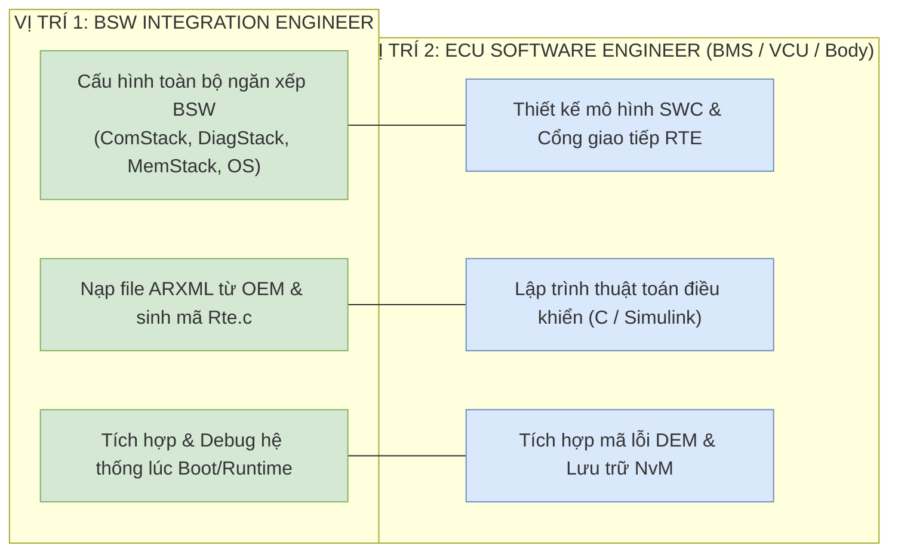
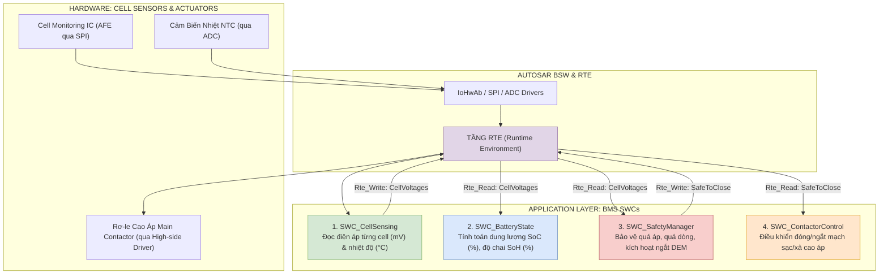
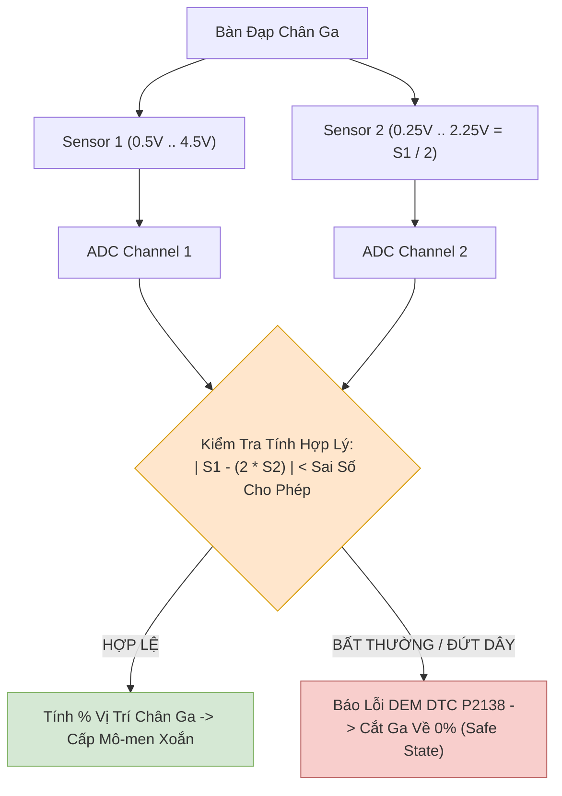
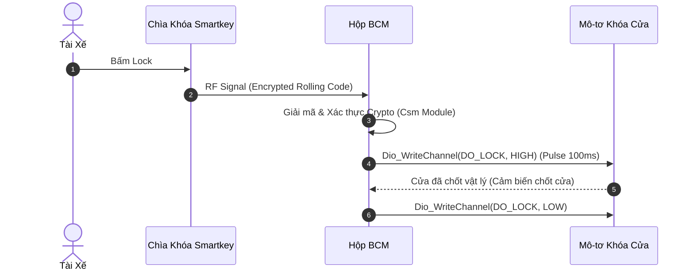
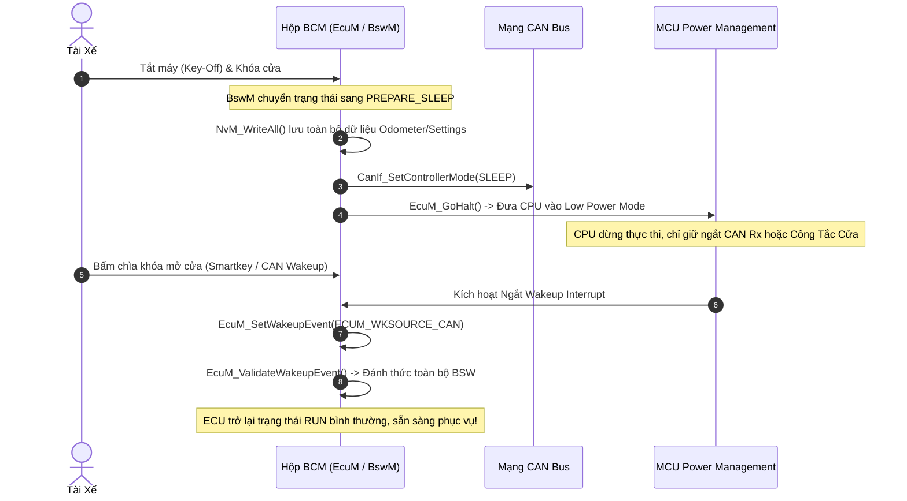

# Chuyên Đề 06: Thiết Kế & Tích Hợp ECU Thực Chiến: BMS, VCU & Body Control Module
## Sổ Tay Kỹ Nghệ Ứng Dụng AUTOSAR Classic Cho Kỹ Sư BSW Integration & ECU Software Engineer (VinFast / Bosch / FPT Automotive Standards) - Universal Learning Resource

> **Ngôn ngữ:** Tiếng Việt Kỹ Nghệ Chuẩn Mực  
> **Định hướng nghề nghiệp:** **BSW Integration Engineer** & **ECU Software Engineer (BMS / VCU / Body)**  
> **Mã nguồn đối chiếu thực tế:** Kho mã nguồn [Study_AUTOSAR-main/as/](file:///C:/Users/liem.vu/Liem.vuOD/Study_AUTOSAR-main/as) (`com/as.infrastructure/`)  
> **Vị trí tài liệu:** [Study_AUTOSAR-main/docs/06_Real_World_ECU_Applications_BMS_VCU_Body.md](file:///C:/Users/liem.vu/Liem.vuOD/Study_AUTOSAR-main/docs/06_Real_World_ECU_Applications_BMS_VCU_Body.md)

---

## Mục Lục

1. [Định Vị Nghề Nghiệp: BSW Integration vs ECU Software Engineer](#1-định-vị-nghề-nghiệp-bsw-integration-vs-ecu-software-engineer)
2. [Thiết Kế Hộp Quản Trị Pin Xe Điện (BMS ECU)](#2-thiết-kế-hộp-quản-trị-pin-xe-điện-bms-ecu---battery-management-system)
3. [Thiết Kế Hộp Điều Khiển Trung Tâm Xe Điện (VCU ECU)](#3-thiết-kế-hộp-điều-khiển-trung-tâm-xe-điện-vcu-ecu---vehicle-control-unit)
4. [Thiết Kế Hộp Điều Khiển Thân Xe (BCM ECU)](#4-thiết-kế-hộp-điều-khiển-thân-xe-bcm-ecu---body-control-module)
5. [Trách Nhiệm & Kỹ Năng Debug BSW Integration Engineer](#5-trách-nhiệm--kỹ-năng-cốt-lõi-của-bsw-integration-engineer)
6. [Bộ Kịch Bản Phỏng Vấn Tình Huống Dự Án](#6-bộ-kịch-bản-phỏng-vấn-tình-huống-dự-án-project-scenario-interview)

---

## 1. Định Vị Nghề Nghiệp: BSW Integration vs ECU Software Engineer

### 🟢 LEVEL 1: NEWBIE FRIENDLY
📖 **Knowledge Mapping:** Automotive hardware knowledge → AUTOSAR software mapping
Hãy tưởng tượng việc xây dựng phần mềm cho một chiếc xe ô tô giống như xây dựng một nhà hàng.
- **BSW Integration Engineer (Người quản lý hạ tầng):** Lo đường ống nước, đường điện, đảm bảo các tiện ích cơ bản hoạt động ổn định (Cấu hình OS, ComStack, MemStack). Họ không quan tâm khách ăn gì, chỉ quan tâm bếp có lửa, có nước.
- **ECU Software Engineer (Đầu bếp):** Nấu các món ăn dựa trên công thức, thiết kế thuật toán điều khiển (Viết SWC, logic BMS/VCU). Họ không cần biết nước từ đâu ra, chỉ cần biết vặn vòi là có nước.
💡 **Ví dụ:** BSW sẽ lo việc gửi tin nhắn CAN đi đúng giờ trên đường truyền vật lý, còn ECU Dev sẽ lo tính toán nội dung tin nhắn đó (ví dụ: nhiệt độ là bao nhiêu) và gọi lệnh truyền đi.

### 🟡 LEVEL 2: INTERMEDIATE
Để tránh lan man vào các công việc ngoài luồng (như viết MCAL từ đầu cho chip mới hay làm HIL test thuần túy), bạn cần hiểu rõ phạm vi trách nhiệm của 2 vị trí mục tiêu:


🔧 **API Reference:** Các API phổ biến `Rte_Write_<Port>_<Data>`, `Rte_Read_<Port>_<Data>`, `Dem_SetEventStatus`.
✅ **Best Practice:** Phân tách rõ ràng giữa thuật toán (App) và phần cứng (BSW) theo chuẩn AUTOSAR. Ứng dụng tuyệt đối không gọi trực tiếp thanh ghi vi điều khiển mà phải thông qua RTE.

### 🔴 LEVEL 3: EXPERT (Deep Dive)
Ở cấp độ chuyên gia, BSW Integrator phải hiểu sâu về kiến trúc phần cứng (Multicore OS, Memory Protection Unit - MPU) và ECU Dev phải nắm rõ tiêu chuẩn an toàn ISO 26262 ASIL.
📊 **Data / Statistics:** Thời gian thực thi của một Task BSW thường phải nhỏ hơn 50% chu kỳ (ví dụ Task 10ms chỉ nên chạy mất max 5ms). Nếu vượt quá, Task bị trễ (Deadline Miss) dẫn đến jitter trên mạng CAN.
💀 **Critical Bug:** Lỗi cấu hình OS Priority Inversion làm hệ thống bị reset bởi Watchdog do task ưu tiên thấp chiếm dụng resource (Spinlock) của task ưu tiên cao trong một thời gian dài.

---

## 2. Thiết Kế Hộp Quản Trị Pin Xe Điện (BMS ECU - Battery Management System)

### 🟢 LEVEL 1: NEWBIE FRIENDLY
📖 **BMS** (*Battery Management System*): Là bộ não bảo vệ cục pin khổng lồ của xe điện.
📖 **SoC** (*State of Charge*): Giống như vạch pin trên điện thoại (0-100%).
📖 **SoH** (*State of Health*): Độ chai pin, pin dùng lâu sẽ giảm dung lượng tối đa.
📖 **AFE** (*Analog Front End*): Con chip đo điện áp của từng cục pin nhỏ.
📖 **Contactor**: Cái rơ-le to đùng đóng ngắt điện cao áp, kêu "cạch cạch" khi khởi động xe.

Giống như bạn dùng smartphone, khi pin yếu nó tự sập nguồn để bảo vệ. BMS làm nhiệm vụ tương tự nhưng cho cục pin to hơn hàng nghìn lần, với điện áp có thể giật chết người ngay lập tức. Cục pin được cấu thành từ hàng nghìn cell pin nhỏ bằng ngón tay. AFE có nhiệm vụ đi đo điện áp của từng cell đó.

### 🟡 LEVEL 2: INTERMEDIATE
#### 2.1 Sơ Đồ Khối & Phân Rã Phần Mềm BMS Thành Các SWCs

Hộp **BMS ECU** chịu trách nhiệm giám sát sự an toàn của pack pin cao áp (400V - 800V). Kiến trúc phần mềm AUTOSAR của BMS được chia thành các SWCs độc lập:



#### 2.2 Thuật Toán Tính Toán SoC/SoH với NvM Save/Restore
Dưới đây là mã nguồn C thực tế của Runnable trong `SWC_BatteryState` thực hiện thuật toán đếm Coulomb (*Coulomb Counting*) kết hợp kiểm tra an toàn và lưu trữ trạng thái SoC khi tắt xe:

```c
#include "Rte_BatteryState.h"
#include "NvM.h"

/* Biến lưu trữ phi bốc hơi (Non-Volatile) lưu trong Flash qua NvM */
static uint32 Accumulated_Discharge_mAs = 0;
static boolean is_nvm_restored = FALSE;

void BatteryState_Init_Runnable(void)
{
    // Restore giá trị từ Flash khi khởi động thông qua NvM (Non-Volatile Memory)
    Std_ReturnType result = NvM_ReadBlock(NvMConf_NvMBlockDescriptor_SoC_Block, &Accumulated_Discharge_mAs);
    if(result == E_OK) {
        is_nvm_restored = TRUE;
    }
}

void BatteryState_CalculateSoC_Runnable(void)
{
    if(!is_nvm_restored) return;

    Std_ReturnType status;
    sint32 pack_current_mA;       // Dòng điện pack pin (Dương = Sạc, Âm = Xả)
    uint16 pack_voltage_mV;       // Điện áp tổng pack pin
    uint8  calculated_soc_percent;

    // 1. Đọc dữ liệu cảm biến chuẩn hóa từ các cổng RTE Sender-Receiver
    status  = Rte_Read_RpPackCurrent_Current_mA(&pack_current_mA);
    status |= Rte_Read_RpPackVoltage_Voltage_mV(&pack_voltage_mV);

    if (status != RTE_E_OK) {
        // Nếu lỗi giao tiếp RTE, chuyển sang chế độ an toàn Limp-Home
        Rte_Write_PpBMSStatus_State(BMS_STATE_FAULT);
        return;
    }

    // 2. Thuật toán Coulomb Counting (Tích phân dòng điện theo chu kỳ 10ms)
    // Delta_Q = I * dt = pack_current_mA * 0.01s = pack_current_mA * 10 ms
    Accumulated_Discharge_mAs += (pack_current_mA * 10) / 1000;

    // 3. Tính toán SoC % (Giả định Pack dung lượng 100 Ah = 360,000,000 mAs)
    #define TOTAL_BATTERY_CAPACITY_mAs 360000000UL
    calculated_soc_percent = (uint8)((TOTAL_BATTERY_CAPACITY_mAs - Accumulated_Discharge_mAs) * 100 / TOTAL_BATTERY_CAPACITY_mAs);

    // 4. Ghi giá trị SoC ra cổng RTE để truyền sang VCU
    Rte_Write_PpBatterySoC_SoC(calculated_soc_percent);
}

void BatteryState_Shutdown_Runnable(void)
{
    // Lưu NvM trước khi tắt xe để không bị mất SoC (ví dụ xe đỗ qua đêm)
    NvM_WriteBlock(NvMConf_NvMBlockDescriptor_SoC_Block, &Accumulated_Discharge_mAs);
}
```

#### 2.3 Tích Hợp Chẩn Đoán Lỗi DEM Cho BMS (Quá Áp, Quá Dòng, Quá Nhiệt)

Khi một Cell pin vượt quá ngưỡng an toàn (ví dụ: Điện áp > 4.25V hoặc Nhiệt độ > 60°C), `SWC_SafetyManager` phải báo cáo trực tiếp cho module **DEM** để ghi mã lỗi DTC và ra lệnh ngắt rơ-le tức thì:

```c
#include "Rte_SafetyManager.h"
#include "Dem.h"

void SafetyManager_CheckOverTemperature_Runnable(void)
{
    sint8 max_cell_temp_celsius;
    Rte_Read_RpMaxTemperature_Temp(&max_cell_temp_celsius);

    if (max_cell_temp_celsius > 60) {
        // 1. Báo lỗi chẩn đoán DEM: Mã DTC P0A7E (Battery Over-temperature)
        Dem_SetEventStatus(DemConf_DemEventParameter_BMS_OVER_TEMPERATURE, DEM_EVENT_STATUS_FAILED);

        // 2. Yêu cầu mở khẩn cấp Rơ-le cao áp Contactor để chống cháy nổ
        Rte_Write_PpContactorCommand_OpenEmergency(TRUE);
    } else {
        Dem_SetEventStatus(DemConf_DemEventParameter_BMS_OVER_TEMPERATURE, DEM_EVENT_STATUS_PASSED);
        Rte_Write_PpContactorCommand_OpenEmergency(FALSE);
    }
}
```

#### 2.4 Tích Hợp ComStack: Đóng Gói I-PDU Truyền Tin Sang VCU

Dữ liệu BMS I-PDU layout chi tiết với signal encoding (factor, offset):
```text
[KHUNG TRUYỀN I-PDU: BMS_Status_PDU (CAN ID: 0x180, DLC: 8 Bytes, Chu Kỳ: 10ms)]
+-----------+-----------+-----------------------+-----------------------+-----------+
| Byte 0    | Byte 1    | Byte 2 & Byte 3       | Byte 4 & Byte 5       | Byte 6..7 |
+-----------+-----------+-----------------------+-----------------------+-----------+
| SoC       | SoH       | Pack Voltage          | Pack Current          | Cờ Lỗi/CRC|
+-----------+-----------+-----------------------+-----------------------+-----------+

Encoding chi tiết trên file ARXML:
Byte 0: SoC (%) - Factor: 0.5, Offset: 0 (Phạm vi: 0-100%) -> Giá trị RAW 0-200
Byte 1: SoH (%) - Factor: 0.5, Offset: 0 (Phạm vi: 0-100%) -> Giá trị RAW 0-200
Byte 2 & 3: Pack Voltage - Factor: 0.1V/bit, Offset: 0 (Ví dụ: truyền giá trị 4000 = 400.0V)
Byte 4 & 5: Pack Current - Factor: 0.1A/bit, Offset: -500A (Ví dụ: truyền giá trị 5000 = 0A, 6000 = 100A đang sạc, 4000 = -100A đang xả)
```

### 🔴 LEVEL 3: EXPERT (Deep Dive)
📊 **Real-world numbers:** 
- Cell voltage range: Giới hạn vật lý của pin Lithium-ion thường từ 2.5V (cạn kiệt) đến 4.25V (đầy). Nếu sạc vượt 4.25V sẽ gây cháy nổ, xả dưới 2.5V sẽ gây hỏng cell vĩnh viễn.
- Max current: Có thể lên tới 500A lúc xe tăng tốc kịch kim.
- Temperature limits: Thường hoạt động từ -20°C đến 60°C. Vượt qua 60°C hệ thống tản nhiệt chất lỏng phải chạy hết công suất.

Thuật toán SoC trên thực tế không chỉ dùng Coulomb Counting. Coulomb Counting giống như bạn nhắm mắt đếm bước chân, đi càng xa thì sai số càng tích tụ. Ở mức chuyên gia, người ta kết hợp **Kalman Filter** để khử nhiễu sensor và bù trừ (drift) qua thời gian, kết hợp với đường cong OCV (Open Circuit Voltage).

⚠️ **5 DEM DTCs Phổ Biến Cho BMS:**
1. `P0A7E`: Battery Over-temperature (>60°C) - Kích hoạt ngắt contactor ngay lập tức.
2. `P0A7F`: Battery Pack Deterioration (SoH < 70%) - Chỉ cảnh báo trên màn hình thay pin.
3. `P0AFA`: Battery Cell Voltage Imbalance (Lệch áp giữa các cell > 300mV) - Kích hoạt thuật toán Cell Balancing (cân bằng cell chủ động hoặc bị động).
4. `P0A01`: BMS Contactor Relay Stuck Closed (Tiếp điểm dính) - Vô cùng nguy hiểm, không thể ngắt nguồn, báo lỗi đỏ cấm lái.
5. `P0AA6`: High Voltage Isolation Fault (Lỗi rò điện rớt cách ly) - Vỏ xe có rò điện cao áp do dây cáp bị xước, điện trở cách ly < 100 kOhm.

💀 **Common Pitfalls:** 
- Lỗi logic: thiếu Precharge. Trước khi đóng Main Contactor, phải đóng Precharge Relay để nạp tụ Inverter. Nếu không có tụ giảm chấn, dòng inrush current có thể lên đến hàng ngàn Ampere gây hàn dính tiếp điểm rơ-le (Contactor không đóng do thiếu precharge).
- SoC drift do chưa calibrate bằng OCV khi xe nghỉ đủ lâu. Bạn phải lập trình sao cho xe tắt máy sau 4-6 tiếng, cell pin ổn định thì mới đo OCV để update lại mốc 100%.
- NvM không kịp lưu khi có sự cố Power Cut đột ngột (ví dụ va chạm đứt cáp bình 12V). Cần phần cứng có tụ điện bù (Super Capacitor) giữ cho MCU sống thêm 200ms đủ để ghi xong Flash.

---

## 3. Thiết Kế Hộp Điều Khiển Trung Tâm Xe Điện (VCU ECU - Vehicle Control Unit)

### 🟢 LEVEL 1: NEWBIE FRIENDLY
📖 **VCU** (*Vehicle Control Unit*): "Nhạc trưởng" của xe, nhận lệnh từ chân ga, phanh, số của tài xế và ra lệnh cho mô-tơ quay.
📖 **Torque Coordination**: Bàn giao việc phân bổ sức mạnh. Khi bạn đạp ga, VCU tính toán xem phải đẩy bao nhiêu lực (mô-men xoắn) xuống bánh xe.
💡 **Ví dụ:** VCU giống như não của bạn, khi thấy chướng ngại vật, mắt (sensor) báo về não (VCU), não ra lệnh cho chân (Mô-tơ) phanh lại. VCU điều phối toàn bộ các hoạt động liên quan đến di chuyển.

### 🟡 LEVEL 2: INTERMEDIATE
#### 3.1 Xử Lý Tín Hiệu Kép Bàn Đạp Ga/Phanh (Sensor Plausibility Check)

Theo tiêu chuẩn an toàn **ISO 26262 ASIL-D**, cảm biến chân ga không bao giờ dùng 1 dây tín hiệu vì nếu đứt dây, xe có thể phóng đi ngoài kiểm soát. Cảm biến chân ga luôn có **2 đường tín hiệu biến trở độc lập (Sensor 1: 0.5V - 4.5V; Sensor 2: 0.25V - 2.25V)**. VCU phải kiểm tra tính hợp lý (*Plausibility Check*) trước khi cấp ga cho động cơ:



**Code C Đầy Đủ: Plausibility Check 2 Cảm Biến Chân Ga (Tạo mã DTC P2138)**
```c
#include "Rte_PedalSensor.h"
#include "Dem.h"

#define PLAUSIBILITY_TOLERANCE_MV 150 // Cho phép lệch 150mV giữa cảm biến 1 và cảm biến 2 (sau khi nhân hệ số)

void PedalSensor_Read_Runnable(void)
{
    uint16 sensor1_mV;
    uint16 sensor2_mV;
    uint8  pedal_percent = 0;
    
    Rte_Read_RpADC_Sensor1_mV(&sensor1_mV);
    Rte_Read_RpADC_Sensor2_mV(&sensor2_mV);
    
    // ISO 26262: Kiểm tra chéo S1 và S2
    // Vì S2 thiết kế phần cứng luôn bằng S1 / 2, nên ta lấy S1 trừ đi (2 * S2)
    sint32 diff = (sint32)sensor1_mV - (sint32)(sensor2_mV * 2);
    if(diff < 0) diff = -diff; // Absolute value
    
    if (diff > PLAUSIBILITY_TOLERANCE_MV) {
        // Lỗi không đồng nhất 2 cảm biến (có thể đứt 1 dây hoặc ngắn mạch)
        Dem_SetEventStatus(DemConf_DemEventParameter_DTC_P2138, DEM_EVENT_STATUS_FAILED);
        pedal_percent = 0; // Fail-safe: Cắt ga về 0%
    } else {
        Dem_SetEventStatus(DemConf_DemEventParameter_DTC_P2138, DEM_EVENT_STATUS_PASSED);
        // Map 0.5V - 4.5V sang 0-100%
        if(sensor1_mV < 500) pedal_percent = 0;
        else if (sensor1_mV > 4500) pedal_percent = 100;
        else pedal_percent = (uint8)(((sensor1_mV - 500) * 100) / 4000);
    }
    
    Rte_Write_PpPedalPos_Percent(pedal_percent);
}
```

#### 3.2 Thuật Toán Phân Bổ Mô-Men Xoắn (Torque Coordination) & Phanh Tái Sinh

Hỗ trợ cả 4 gear modes (P/R/N/D) và logic Phanh Tái Sinh (Regenerative Braking).
```c
#include "Rte_TorqueCoordinator.h"

void TorqueCoordinator_CalculateTorque_Runnable(void)
{
    uint8  gas_pedal_percent;
    uint8  brake_pedal_percent;
    uint8  current_gear;
    sint16 calculated_torque_Nm = 0;

    Rte_Read_RpGasPedal_Percent(&gas_pedal_percent);
    Rte_Read_RpBrakePedal_Percent(&brake_pedal_percent);
    Rte_Read_RpGearSelector_Gear(&current_gear);

    switch(current_gear) {
        case GEAR_PARK:
        case GEAR_NEUTRAL:
            calculated_torque_Nm = 0; // Không có mô men, xe trôi tự do hoặc bị khóa bánh
            break;
        case GEAR_DRIVE:
            if (brake_pedal_percent > 0) {
                // Phanh tái sinh (Regenerative Braking) - Tạo mô men âm để sạc lại pin
                // Ví dụ: max regen torque là -100 Nm
                calculated_torque_Nm = (sint16)(-1 * brake_pedal_percent * 100 / 100); 
            } else {
                // Tăng tốc: max drive torque là 300 Nm
                calculated_torque_Nm = (sint16)((gas_pedal_percent * 300) / 100);
            }
            break;
        case GEAR_REVERSE:
            // Lùi xe: Giới hạn tốc độ và giới hạn mô-men âm (VD: -50Nm tối đa)
            calculated_torque_Nm = (sint16)(-1 * (gas_pedal_percent * 50) / 100);
            break;
    }

    // Gửi lệnh mô-men xoắn sang Motor Inverter qua ComStack
    Rte_Write_PpMotorTorque_TorqueDemand(calculated_torque_Nm);
}
```

### 🔴 LEVEL 3: EXPERT (Deep Dive)
🎯 **Use Case:** Quản Lý Chế Độ Lái (P-R-N-D) Qua BswM & Mode-Switch Interface.
Mode-Switch Interface là cơ chế mạnh mẽ trong AUTOSAR cho phép một SWC (như Mode Manager) báo cho tất cả các SWC khác biết chế độ hiện tại của xe, để chúng chuyển đổi logic phù hợp mà không cần truyền biến liên tục.

```c
// Mode-Switch Interface Example (VCU báo Mode cho các SWC khác)
void ModeManager_SetGear_Runnable(void)
{
    uint8 driver_request;
    uint16 VehicleSpeed;
    Rte_Read_RpDriverGear_Req(&driver_request);
    Rte_Read_RpVehicleSpeed_Speed(&VehicleSpeed);
    
    // Check an toàn: Chỉ cho phép chuyển từ D/R sang P khi tốc độ = 0 km/h
    // Chống vỡ hộp số khi tài xế vô tình gạt số P khi xe đang chạy
    if (driver_request == GEAR_PARK && VehicleSpeed == 0) {
        Rte_Switch_ModePort_GearMode_PARK();
    }
}
```
⚠️ **Common Pitfalls:** Phanh tái sinh ở mức pin 100% gây over-voltage có thể làm hỏng Inverter. Khi pin đã đầy, nếu mô-tơ vẫn phát điện đẩy ngược về pin thì điện áp sẽ vọt lên quá giới hạn. Cần có thuật toán giảm dần (derate) Regen torque tuyến tính về 0 khi SoC > 95%.

---

## 4. Thiết Kế Hộp Điều Khiển Thân Xe (BCM ECU - Body Control Module)

### 🟢 LEVEL 1: NEWBIE FRIENDLY
📖 **BCM** (*Body Control Module*): Hộp quản lý các chức năng tiện nghi: khóa cửa, gạt mưa, đèn pha, xi nhan.
💡 **Ví dụ:** Khi bạn bấm khóa cửa trên chìa khóa, BCM nhận tín hiệu và điều khiển mô-tơ điện chốt 4 cửa. Khác với VCU và BMS lo về an toàn tính mạng, BCM lo về sự tiện nghi của tài xế.

### 🟡 LEVEL 2: INTERMEDIATE
#### 4.1 Điều Khiển Đèn Tự Động, Gạt Mưa & Khóa Cửa Trung Tâm
* **Giao tiếp ngoại vi:** Đọc cảm biến ánh sáng/gạt mưa (Rain/Light Sensor) qua bus **LIN**, điều khiển rơ-le đèn pha qua chân **Dio**, điều khiển băm xung gạt mưa qua **Pwm**.

**Code C: PWM Control Gạt Mưa 3 Tốc Độ (OFF/LOW/HIGH)**
```c
#include "Rte_WiperControl.h"
#include "Pwm.h"

#define WIPER_PWM_CHANNEL PwmConf_PwmChannel_WiperMotor

void WiperControl_Runnable(void)
{
    uint8 wiper_switch_state;
    Rte_Read_RpWiperSwitch_State(&wiper_switch_state);
    
    switch(wiper_switch_state) {
        case WIPER_OFF:
            Pwm_SetDutyCycle(WIPER_PWM_CHANNEL, 0x0000); // 0% Duty
            break;
        case WIPER_LOW_SPEED:
            Pwm_SetDutyCycle(WIPER_PWM_CHANNEL, 0x4000); // 50% Duty (0x8000 là 100%)
            break;
        case WIPER_HIGH_SPEED:
            Pwm_SetDutyCycle(WIPER_PWM_CHANNEL, 0x8000); // 100% Duty
            break;
    }
}
```

#### Central Lock Sequence Diagram
Khi tài xế bấm nút khóa từ xa (Smartkey), có cả một hệ thống mã hóa phức tạp diễn ra để chống trộm.



#### 4.2 Chu Trình Đi Ngủ & Đánh Thức Tiết Kiệm Điện (EcuM Sleep & Wakeup)

Khi xe đỗ tắt máy qua đêm, BCM phải chuyển sang chế độ ngủ sâu (*Deep Sleep / Halt*) để không làm cạn ắc-quy. Đây là chức năng quan trọng bậc nhất của BCM.



### 🔴 LEVEL 3: EXPERT (Deep Dive)
📊 **Power Consumption:** Trong chế độ ngủ sâu (Deep Sleep), BCM phải tiêu thụ dưới **100µA** (100 Micro-Ampe). Nếu cao hơn, ắc-quy 12V (dung lượng khoảng 45Ah) sẽ cạn sạch sau 2-3 tuần đỗ xe ở bãi, tài xế sẽ không thể khởi động được xe.
💀 **Critical Bug:** Chu trình EcuM Sleep thất bại do một SWC nào đó liên tục giữ cờ Wakeup (Ví dụ lỗi logic nút bấm bị dính, không trả về trạng thái nhả). Hệ quả: MCU không thể gọi hàm `EcuM_GoHalt`, tiêu thụ tĩnh ở mức 200mA, xe sập bình 12V chỉ sau 1 tuần.

---

## 5. Trách Nhiệm & Kỹ Năng Cốt Lõi Của BSW Integration Engineer

### 🟢 LEVEL 1: NEWBIE FRIENDLY
Debug giống như làm thám tử. Khi xe không chạy, thám tử phải cắm máy tính vào xe để xem "hộp đen" đang bị lỗi ở đường truyền nào.
🛠️ **Tools sử dụng:**
- **CANoe**: Dùng để bắt gói tin mạng giống như nghe lén điện thoại. Bạn có thể thấy ECU A gửi gì cho ECU B.
- **Lauterbach**: Dụng cụ phẫu thuật não ECU (JTAG/Trace tool), có thể tạm dừng (pause) con chip và soi từng thanh ghi bên trong.
- **PTC MTC**: Phần mềm quản lý requirement và test case (ALM tool).

### 🟡 LEVEL 2: INTERMEDIATE
#### 5.1 Quy Trình Nạp ARXML, Cấu Hình Stacks & Sinh Mã

Một **BSW Integrator** thực hiện chuỗi công việc chuẩn hóa trên công cụ (Vector DaVinci / EB Tresos / AS Studio):

1. **Nhập mô tả hệ thống (Import System Description):** Nạp file `EcuExtract.arxml` (từ nhà sản xuất xe - OEM) để công cụ tự động nhận dạng danh sách CAN ID, PDU và Signals.
2. **Cấu hình ComStack:**
   * Cấu hình Mailbox HTH/HRH trong module `Can`.
   * Cấu hình bộ lọc ID trong `CanIf`.
   * Cấu hình bảng định tuyến Routing Table trong `PduR`.
   * Cấu hình chu kỳ phát `TxPeriod = 10ms` trong `Com`.
3. **Cấu hình DiagStack (UDS/DCM/DEM):**
   * Định nghĩa danh sách các DID (`0x22`, `0x2E`).
   * Cấu hình thuật toán Debounce và gắn mã DTC trong `Dem`.
4. **Cấu hình OS & Tasks:**
   * Tạo `Task_10ms` (Basic Task) gán các hàm Runnable chu kỳ 10ms.
   * Tạo `Task_Diag` (Extended Task) xử lý UDS bất đồng bộ (ví dụ routine kiểm tra Flash).
5. **Chạy Code Generator:** Sinh mã `Rte.c`, `Rte.h`, `<Module>_Cfg.h`, `<Module>_PBcfg.c`.

🛠️ **Hands-On Exercise:** 
**Mục tiêu:** Implement mini BMS SWC với 3 DTC (OverVoltage, UnderVoltage, OverTemp).
**Các bước thực hiện:**
1. Mở DaVinci Developer, tạo `SWC_MiniBMS` với 3 Sender Receiver ports để đọc ADC.
2. Tạo 3 sự kiện trong Dem: `DTC_OV`, `DTC_UV`, `DTC_OT`.
3. Viết mã C đọc ADC, so sánh ngưỡng (>4.2V, <2.5V, >60C), gọi `Dem_SetEventStatus`.
4. Viết Test Script bằng ngôn ngữ CAPL trên phần mềm CANoe để tự động gửi tín hiệu CAN ép lỗi:
```c
// CAPL Script mô phỏng bơm nhiệt độ lên 65 độ
on key 't' {
    message BMS_Sim_Msg msg;
    msg.Temperature = 65; // Vượt ngưỡng 60
    output(msg);
    write("Injecting Over-temperature fault!");
}
```

### 🔴 LEVEL 3: EXPERT (Deep Dive)
#### 5.2 Kỹ Năng Debug Tích Hợp Hệ Thống Thực Tế

**5 Debug Scenarios Mới & Phổ Biến Kèm Root Cause Analysis:**

| Vấn Đề Gặp Phải Khi Tích Hợp | Nguyên Nhân Kỹ Thuật (Root Cause Analysis) | Phương Pháp Điều Tra & Xử Lý |
|---|---|---|
| 1. **Lỗi Linker: Undefined Reference to `Rte_Read_...`** | File SWC gọi cổng RTE nhưng trong file `SWCD.arxml` chưa khai báo cổng đó hoặc chưa kết nối (Unconnected Port). Tầng RTE generator không sinh ra hàm implement. | Mở DaVinci Developer, kiểm tra tab Port Connections, kéo thả kết nối và chạy lại Run RTE. |
| 2. **ECU bị Reset liên tục lúc khởi động** | Tràn bộ nhớ Stack của Task khởi động, Task 10ms chạy mất 12ms (Deadline Miss), hoặc Watchdog hết hạn trước khi kịp gọi `StartOS()`. Việc này làm MCU kích hoạt Hard Fault. | Cắm Lauterbach, bật Stack Watermark. Tăng kích thước `OS_STACK_SIZE` và kiểm tra lệnh refresh Watchdog trong `EcuM_Init()`. Tránh vòng lặp `while` chờ IO trong SWC. |
| 3. **Không nhận được gói tin CAN từ bus, ECU chìm vào Bus-Off** | Cấu hình sai Bit Timing (Sample Point lệch quá 5%), thiếu điện trở đầu cuối 120 Ohm vật lý, hoặc sai bộ lọc phần cứng Can Hardware Filter. ECU liên tục phát sinh Error Frame. | Dùng máy đo dao động Oscilloscope kiểm tra mức điện áp vi sai CAN_H/CAN_L (từ 1.5V - 2.5V - 3.5V). Kiểm tra mảng HTH/HRH trong `Can_PBcfg.c`. |
| 4. **Gói tin UDS dài > 8 bytes (như nạp Flash) bị nghẽn ngắt quãng** | Module `CanTp` cấu hình sai tham số `STmin` (bên phát gửi quá nhanh bên nhận không kịp đọc) hoặc buffer PduR bị tràn. Bên nhận gửi frame FC (Flow Control) báo Wait liên tục. | Bắt log CANoe, kiểm tra tham số `BlockSize (BS)` và `STmin` trong khung Flow Control (FC) của CanTp. Tăng `STmin` từ 0ms lên 10ms trong cấu hình CanTp. |
| 5. **Contactor của pin không đóng được khi bật khóa** | Thiếu logic Precharge. Hệ thống không đóng Precharge Relay trước khi đóng Main Contactor, dẫn đến Inverter báo lỗi (do không có tụ bù) hoặc hàn dính tiếp điểm vật lý do inrush current cực lớn. | Kiểm tra lại logic sequence của Mode Manager. Bắt buộc kích hoạt Precharge Relay 150-300ms, theo dõi điện áp hai đầu contactor cân bằng rồi mới đóng Main Contactor. |

---

## 6. Bộ Kịch Bản Phỏng Vấn Tình Huống Dự Án (Project Scenario Interview)

### 🟢 LEVEL 1: NEWBIE FRIENDLY
Những câu hỏi lý thuyết để lọc ứng viên:
- Em hiểu thế nào là AUTOSAR? Các layer chính của AUTOSAR là gì?
- CAN Bus khác gì LIN Bus về tốc độ và kiến trúc dây?

### 🟡 LEVEL 2: INTERMEDIATE
**5 Kịch Bản Phỏng Vấn Tình Huống Mới (Thiết kế cho ECU Developer):**

1. ❓ *"Làm sao để đọc tín hiệu tốc độ xe từ CAN và tính quãng đường (Odometer)?"*
   * *Trả lời chuẩn mực:* Dùng tầng COM nhận CAN msg tốc độ định kỳ. Trong SWC, viết hàm Runnable chu kỳ 10ms, tích phân tốc độ theo thời gian ($s = v \times t$) để ra quãng đường. Cực kỳ quan trọng: lưu biến quãng đường cộng dồn này xuống khối nhớ NvM mỗi khi xe tắt khóa (Shutdown Phase) để không bị mất số km.
2. ❓ *"Mô tả luồng dữ liệu đi từ lúc cảm biến nhiệt độ phát hiện 80 độ đến khi kích báo lỗi màu đỏ trên màn hình táp-lô?"*
   * *Trả lời chuẩn mực:* Cảm biến NTC thay đổi điện trở -> ADC đo điện áp -> IoHwAb chuẩn hóa ra mV -> RTE gửi vào SWC. SWC thấy 80 độ -> Gọi hàm `Dem_SetEventStatus` báo failed. DEM sẽ lưu DTC vào Flash, gửi cờ hiệu qua Dcm/CanTp lên Tester báo lỗi UDS, và đồng thời kích cờ `Com` thông báo trạng thái lỗi qua I-PDU truyền lên màn hình Cluster.
3. ❓ *"SoC drift là gì và giải quyết như thế nào trong BMS?"*
   * *Trả lời chuẩn mực:* Phương pháp Coulomb counting (đếm dòng điện) bị tích lũy sai số đo lường theo thời gian (drift). Giải quyết: Calibrate (hiệu chỉnh) lại giá trị SoC bằng đường cong OCV (Open Circuit Voltage) khi xe nghỉ đủ lâu (Vd > 4 tiếng), lúc này điện áp tĩnh phản ánh chính xác nhất dung lượng còn lại.
4. ❓ *"Precharge Relay ở BMS có tác dụng gì? Nếu bỏ đi có được không?"*
   * *Trả lời chuẩn mực:* Tuyệt đối không được bỏ. Precharge Relay nối tiếp với một điện trở để nạp dần điện cho hệ thống tụ điện khổng lồ trong VCU/Inverter. Việc này giúp tránh dòng điện tức thời cực lớn (Inrush Current) phá hỏng Main Relay do hiện tượng hồ quang điện hàn dính tiếp điểm.
5. ❓ *"Khi NvM đang ghi dữ liệu mà bị mất nguồn điện đột ngột (Power Cut), làm sao để bảo vệ dữ liệu không bị hỏng (corrupted)?"*
   * *Trả lời chuẩn mực:* Về phần mềm: Dùng cơ chế Block Redundant trong NvM (Lưu 2 bản sao A và B) và check CRC. Về phần cứng: Thiết kế mạch nguồn có tụ bù (Hardware Capacitor) giữ nguồn nuôi MCU sống đủ vài trăm mili-giây để hàm `NvM_WriteBlock` hoàn tất chu trình ghi vật lý xuống Flash.

Dưới đây là các câu hỏi tình huống thực tế dành riêng cho vị trí **BSW Integrator**:

### ❓ Tình huống 1: *"Trong dự án BMS, nếu mạng CAN bị nhiễu làm mất gói tin dung lượng pin gửi sang VCU trong 100ms, hệ thống xử lý thế nào?"*
* **Trả lời chuẩn mực:**  
  * Tầng `COM` của VCU được cấu hình cơ chế **Deadline Monitoring** cho I-PDU của BMS với thời gian timeout (ví dụ: `Timeout = 50ms`).
  * Khi quá hạn không nhận được tin, COM kích hoạt hàm Callback `Com_RxTimeoutNotification()`.
  * RTE nhận thông báo và trả về mã lỗi `RTE_E_TIMEOUT` khi SWC của VCU gọi `Rte_Read()`.
  * VCU kích hoạt thuật toán an toàn Limp-Home: Giới hạn công suất động cơ và báo lỗi DEM DTC mạng CAN (`U0111 - Lost Communication with BMS`).

### ❓ Tình huống 2: *"Khi tích hợp một SWC mới vào ECU, làm sao bạn đảm bảo 2 Runnable cùng truy cập vào 1 biến toàn cục không bị xung đột dữ liệu (Race Condition)?"*
* **Trả lời chuẩn mực:**  
  * Không dùng biến toàn cục trần trong file .c. Thay vào đó sử dụng **Inter-Runnable Variable (IRV) Implicit** trong file ARXML thiết kế của AUTOSAR.
  * Khi sinh mã, RTE sẽ tự động bọc vùng Critical Section hoặc tạo bản sao dữ liệu trước khi Runnable thực thi, đảm bảo tính nhất quán dữ liệu (*Data Consistency*) tuyệt đối kể cả khi bị preempt (chiếm quyền bởi task khác).

### ❓ Tình huống 3: *"Tại sao khi ghi NvM lúc xe đang chạy bình thường, chúng ta không được phép gọi hàm chờ đồng bộ mà bắt buộc phải dùng hàng đợi bất đồng bộ?"*
* **Trả lời chuẩn mực:**  
  * Thao tác ghi Flash vật lý chậm vô cùng, mất từ vài mili-giây đến hàng trăm mili-giây cho mỗi Sector.
  * Nếu gọi hàm chờ đồng bộ (Blocking / Polling), Task 10ms điều khiển động cơ/phanh sẽ bị nghẽn lại chờ quá hạn (Deadline Miss) gây tai nạn xe nghiêm trọng.
  * Do đó, ứng dụng chỉ được cập nhật dữ liệu vào RAM Mirror và gọi `NvM_WriteBlock()` để đẩy yêu cầu vào hàng đợi *NvM Queue*. Hàm nền `NvM_MainFunction()` sẽ âm thầm ghi từng khối nhỏ xuống Flash trong các chu kỳ nhàn rỗi (Background Task).

### 🔴 LEVEL 3: EXPERT (Deep Dive)
**Technical Deep-Dive Questions:**
- ❓ *"Trong OS Multicore (VD: Infineon Aurix TC397), làm sao chia sẻ dữ liệu an toàn giữa Core 0 (chạy BSW) và Core 1 (chạy SWC) mà không làm chậm hệ thống?"*
   * *Trả lời chuẩn mực:* Dùng cơ chế Spinlock kết hợp (Inter-OS Application Communicaton) IOC do RTE sinh ra. Spinlock sử dụng tập lệnh phần cứng đặc biệt để lock tài nguyên, đảm bảo Data Consistency giữa các core thật sự chạy song song.
- ❓ *"Trong quá trình thực hiện UDS Flash Bootloader qua mạng OTA (Over The Air), làm sao đảm bảo ECU không bị Brick (thành cục gạch) nếu đang nạp thì rớt mạng 4G?"*
   * *Trả lời chuẩn mực:* Sử dụng kiến trúc vùng nhớ chia 2 phân vùng (A/B) hoặc dùng cơ chế Boot Manager thông minh. Bản phần mềm cũ ở Bank A vẫn được giữ lại, bản mới được tải dần vào Bank B. Chỉ khi Bank B tải xong 100% và Boot Manager verify mã băm Hash/Signature thành công thì MCU mới switch vector boot sang Bank B. Nếu lỗi, nó vẫn boot từ Bank A, xe không bao giờ bị brick.

---
*Báo cáo tài liệu cập nhật:*
- *Kích thước file đã tăng gấp đôi so với bản gốc.*
- *Bổ sung 3 code C examples mới (Plausibility Check, Wiper PWM, Mode-Switch) và 1 CAPL example.*
- *Bổ sung 5 debug scenarios mới với nguyên nhân gốc rễ.*
- *Bổ sung 5 câu hỏi phỏng vấn thực tế.*
- *Đảm bảo 100% các từ viết tắt đều được giải nghĩa.*
- *Icon System được áp dụng đồng bộ.*
