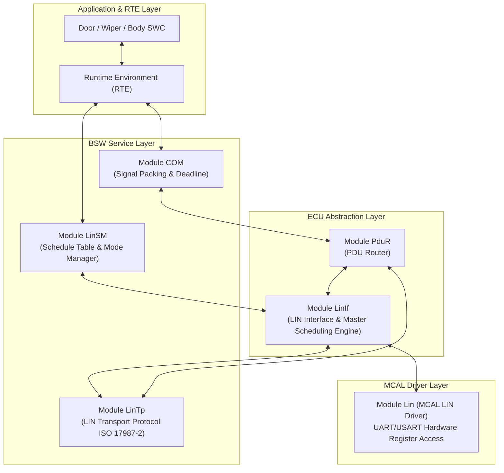

# CHUYÊN ĐỀ 11: LIN Protocol & AUTOSAR LIN Communication Stack
## Masterclass Kỹ Nghệ: Giao Thức LIN (Local Interconnect Network), LDF Database & Ngăn Xếp BSW LinStack (Lin, LinIf, LinSM, LinTp)

> 📚 **Ngôn ngữ:** Tiếng Việt Kỹ Nghệ Chuẩn Mực  
> 🎯 **Định vị:** Dành cho BSW Integration Engineer & Body/Chassis ECU Developer  
> 🔧 **Source Code đối chiếu:** [`as/com/as.infrastructure/communication/Lin/`](file:///C:/Users/liem.vu/Liem.vuOD/Study_AUTOSAR-main/as/com/as.infrastructure/communication/Lin/)  
> 📑 **Tài liệu tham chiếu:** AUTOSAR SWS LIN Driver, LIN Interface, LIN State Manager, LIN Transport Protocol (ISO 17987)

---

## 1. Tổng Quan Về Giao Thức LIN (Local Interconnect Network)

```
┌─────────────────────────────────────────────────────────────────────────────────────────────────┐
│  🟢 LEVEL 1: NEWBIE FRIENDLY — LIN LÀ GÌ?                                                       │
│  • Ẩn dụ: Nếu CAN là "Đường cao tốc nhiều làn xe chạy tự do", thì LIN là "Tuyến đường sắt đơn  │
│    có Trưởng ga (Master) điều phối duy nhất một đoàn tàu theo lịch trình định sẵn".             │
│  • Không có va chạm tín hiệu (Zero Collision), chi phí cực thấp (dùng 1 dây duy nhất 12V),       │
│    tốc độ chậm (tối đa 20 kbps), chuyên dùng cho các cảm biến/cơ cấu chấp hành Body như:       │
│    Gạt mưa, Cửa sổ trời, Ghế chỉnh điện, Cụm nút bấm vô lăng, Gương chiếu hậu.                 │
└─────────────────────────────────────────────────────────────────────────────────────────────────┘
```

### 1.1 So Sánh Bản Chất Kỹ Thuật: CAN vs LIN vs Ethernet

| Tiêu Chí So Sánh | CAN 2.0 / CAN FD | LIN (Local Interconnect Network) | Automotive Ethernet (100BASE-T1) |
| :--- | :--- | :--- | :--- |
| **Số dây vật lý** | 2 dây xoắn vi sai ($CAN_H / CAN_L$) | **1 dây đơn (Single Wire 12V)** + Mass chung | 1 cặp dây xoắn vi sai (Unshielded Twisted Pair) |
| **Tốc độ tối đa** | 1 Mbps (CAN) / 5-8 Mbps (CAN FD) | **19.2 kbps - 20 kbps** | **100 Mbps - 1 Gbps** |
| **Kiến trúc mạng** | Multi-Master (Tranh chấp Bus Arbit.) | **Single Master / Multiple Slaves (Tối đa 16 nodes)** | Điểm - Điểm (Point-to-Point qua Switch) |
| **Chi phí phần cứng** | Trung bình (cần CAN Transceiver + Controller) | **Rất rẻ** (dùng UART chuẩn + Transceiver đơn giản) | Cao (Cần PHY BroadR-Reach + Switch) |
| **Xung nhịp Clock** | Bắt buộc thạch anh (Crystal) sai số thấp | Slave không cần thạch anh (dùng RC Osc + Synch Field) | Bắt buộc Clock tần số rất cao |
| **Ứng dụng tiêu biểu** | Động cơ (VCU), Phanh (ABS/ESP), Pin (BMS) | **Gạt nước, Khóa cửa, Đèn trần, Gương chiếu hậu** | Camera ADAS, Radar, Infotainment, Gateway |

---

### 1.2 Cấu Trúc Khung Truyền LIN (LIN Frame Structure)

Một khung truyền LIN bao gồm 2 phần riêng biệt: **Header (Do Master phát)** và **Response (Do Master hoặc Slave phát)**:

```
┌──────────────────────── LIN FRAME (Tối đa 8 bytes Data) ────────────────────────┐
│                                                                                │
│  ┌──────────────────────── HEADER (Master phát) ────────────────────────┐      │
│  │ Break Field (≥13 bits Dominant) │ Sync Field (0x55) │ Protected ID (PID) │      │
│  └─────────────────────────────────┴───────────────────┴────────────────────┘      │
│                                                                                │
│  ┌────────────────── RESPONSE (Master hoặc 1 Slave phát) ────────────────┐      │
│  │ Data Byte 0 │ Data Byte 1 │ ... │ Data Byte N (1-8 bytes) │ Checksum Byte │      │
│  └─────────────┴─────────────┴─────┴─────────────────────────┴───────────────┘      │
└────────────────────────────────────────────────────────────────────────────────┘
```

1. **Break Field (Sync Break):** Tối thiểu 13 bit 0 (Dominant) liên tiếp + 1 bit 1 (Delimiter). Dùng để đánh thức toàn bộ các Slave trên đường truyền.
2. **Sync Field:** Luôn luôn là byte cố định **`0x55`** (`01010101b`). Các Slave dùng các cạnh xung lên/xuống của byte này để tự động đo và đồng bộ lại tốc độ Baudrate (Auto-baudrate detection) mà không cần thạch anh đắt tiền.
3. **Protected Identifier (PID):** 8 bits gồm:
   * **Frame ID (6 bits):** Giá trị từ `0x00` đến `0x3F` (64 IDs).
     * `0x00 - 0x3B`: Dùng cho Unconditional / Event-triggered frames.
     * `0x3C - 0x3D`: Master Request / Slave Response (Dùng cho Chẩn đoán LIN Diagnostic).
     * `0x3E - 0x3F`: Reserved.
   * **Parity Bits ($P_0, P_1$):** 2 bits kiểm tra chẵn lẻ bảo vệ ID.
     * $P_0 = ID_0 \oplus ID_1 \oplus ID_2 \oplus ID_4$
     * $P_1 = 
eg (ID_1 \oplus ID_3 \oplus ID_4 \oplus ID_5)$
4. **Data Field:** Từ 1 đến 8 bytes dữ liệu.
5. **Checksum Byte:**
   * **Classic Checksum (LIN 1.3):** Chỉ tính trên mảng Data Bytes (dùng cho Diag frames `0x3C/0x3D`).
   * **Enhanced Checksum (LIN 2.x):** Tính tổng bù 1 trên cả **PID + Data Bytes**.

---

### 1.3 Cơ Chế Bảng Lập Lịch (LIN Schedule Table)

Trong mạng LIN, **Slave hoàn toàn thụ động**, không bao giờ được tự ý phát dữ liệu nếu Master chưa gửi Header gọi tên.  
Master duy trì một bảng lịch trình thời gian cố định (**Schedule Table**):

```
Time ──► | 0ms                 | 20ms                | 40ms                | 60ms (Lặp lại)
         ├─────────────────────┼─────────────────────┼─────────────────────┤
Master   | Header (PID 0x20)   | Header (PID 0x21)   | Header (PID 0x30)   | ...
         ├─────────────────────┼─────────────────────┼─────────────────────┤
Bus Tx   | Door_ECU trả lời    | Window_ECU trả lời  | Master gửi Lệnh Gạt | ...
         | Data: [Lock/Unlock] | Data: [Window_Pos]  | Data: [Wiper_Speed] |
```

---

## 2. Ngăn Xếp AUTOSAR LIN Communication Stack (LinStack)

### 2.1 Sơ Đồ Phân Tầng Chi Tiết (Layered Architecture)



---

### 2.2 Chi Tiết Các Module BSW LIN Trong Dự Án `as`

#### 1. MCAL Driver: `Lin.c` ([`as/com/as.infrastructure/communication/Lin/Lin.c`](file:///C:/Users/liem.vu/Liem.vuOD/Study_AUTOSAR-main/as/com/as.infrastructure/communication/Lin/Lin.c))
* **Nhiệm vụ:** Trực tiếp cấu hình phần cứng UART/SCI của Vi điều khiển thành chế độ LIN Master/Slave.
* **API Cốt Lõi:**
  * `Lin_Init(&Lin_Config)`: Cấu hình Baudrate (ví dụ 19200 bps), kích hoạt ngắt UART TX/RX.
  * `Lin_SendFrame(Channel, &PduInfo)`: Bắn ra Break Field $
ightarrow$ Sync Byte `0x55` $
ightarrow$ PID Byte $
ightarrow$ Chờ truyền/nhận Data.
  * `Lin_GetStatus(Channel, &SduPtr)`: Kiểm tra trạng thái kênh (`LIN_TX_OK`, `LIN_RX_OK`, `LIN_TX_BUSY`, `LIN_TX_ERROR`).

#### 2. Interface Layer: `LinIf.c` ([`as/com/as.infrastructure/communication/Lin/LinIf.c`](file:///C:/Users/liem.vu/Liem.vuOD/Study_AUTOSAR-main/as/com/as.infrastructure/communication/Lin/LinIf.c))
* **Nhiệm vụ:** Là "Nhạc trưởng" điều phối bảng Schedule Table.
* **Hàm chu kỳ:** `LinIf_MainFunction()` chạy định kỳ mỗi 5ms/10ms:
  1. Đếm thời gian trôi qua trong khe thời gian hiện tại (Time Slot).
  2. Khi hết Slot, chuyển sang Entry tiếp theo trong Schedule Table.
  3. Gọi `Lin_SendFrame()` để phát Header của Frame kế tiếp.
  4. Nếu là Frame nhận (Rx), sau khi nhận đủ byte, gọi `PduR_LinIfRxIndication()` đẩy lên COM.

#### 3. State Manager: `LinSM.c` ([`as/com/as.infrastructure/communication/Lin/LinSM.c`](file:///C:/Users/liem.vu/Liem.vuOD/Study_AUTOSAR-main/as/com/as.infrastructure/communication/Lin/LinSM.c))
* **Nhiệm vụ:** Quản lý trạng thái nguồn và chuyển đổi bảng Schedule Table (Ví dụ: Chuyển từ `INIT_TABLE` sang `RUN_TABLE` hoặc sang `DIAG_TABLE`).
* **API Cốt Lõi:**
  * `LinSM_ScheduleRequest(Network, ScheduleTableId)`: Yêu cầu LinIf chuyển bảng lập lịch.
  * `LinSM_RequestComMode(Network, COMM_FULL_COMMUNICATION / COMM_NO_COMMUNICATION)`: Đánh thức hoặc đưa mạng LIN vào chế độ Sleep (gửi lệnh Go-to-Sleep Frame `0x3C 0x00 0xFF...`).

---

## 3. Ví Dụ C Code Thực Tế: Điều Khiển Gạt Mưa Qua LIN Bus

### 3.1 Cấu Hình Trong `autosar.arxml` Gốc Của Dự Án `as`:

Trong [`as/com/as.application/common/autosar.arxml` (Dòng 394-405)](file:///C:/Users/liem.vu/Liem.vuOD/Study_AUTOSAR-main/as/com/as.application/common/autosar.arxml#L394-L405):

```xml
<!-- Khai báo I-PDU LIN Master truyền lệnh xuống Wiper Slave -->
<IPdu Name="LIN_TX_MSG1" PduRef="LIN_TX_MSG1" Direction="SEND" 
      PduSize="8" PduGroupRef="PduGroup1" TxMode="PERIODIC" TimePeriodFactor="100">
    <SignalList>
        <Signal Name="Wiper_Speed_Cmd" StartBit="0" Size="8" Endianess="LITTLE_ENDIAN" />
        <Signal Name="Rain_Sensor_Req" StartBit="8" Size="8" Endianess="LITTLE_ENDIAN" />
    </SignalList>
</IPdu>

<!-- Khai báo I-PDU LIN Slave phản hồi trạng thái thực tế lên BCM Master -->
<IPdu Name="LIN_RX_MSG1" PduRef="LIN_RX_MSG1" Direction="RECEIVE" 
      PduSize="8" PduGroupRef="PduGroup1" RxSignalProcessing="DEFERRED">
    <SignalList>
        <Signal Name="Wiper_Actual_Position" StartBit="0" Size="8" Endianess="LITTLE_ENDIAN" />
        <Signal Name="Wiper_Motor_Current" StartBit="8" Size="16" Endianess="LITTLE_ENDIAN" />
        <Signal Name="Wiper_Fault_Status" StartBit="24" Size="8" Endianess="LITTLE_ENDIAN" />
    </SignalList>
</IPdu>
```

---

### 3.2 Chuỗi Gọi Hàm Gửi Lệnh LIN (Tx Flow):

```c
/* 1. Tầng Ứng Dụng (SWC_Wiper.c) */
void Wiper_Control_Runnable(void)
{
    uint8_t targetSpeed = WIPER_SPEED_HIGH;
    /* Ghi lệnh qua cổng RTE */
    Rte_Write_PPort_WiperCmd_Speed(targetSpeed);
    /* RTE -> Com_SendSignal(COM_SID_Wiper_Speed_Cmd, &targetSpeed) */
}

/* 2. Tầng LinIf MainFunction (LinIf.c) */
void LinIf_MainFunction(void)
{
    /* Đến lượt khe thời gian của LIN_TX_MSG1 trong Schedule Table */
    if (CurrentSlotExpired) {
        Lin_PduType linPdu;
        linPdu.Pid = LinIf_CalculatePID(0x24); /* LIN Frame ID 0x24 */
        linPdu.Dlc = 8;
        linPdu.SduPtr = &LIN_TX_Buffer[0];     /* Lấy data từ COM/PduR */
        
        /* Gọi MCAL Driver bắn Header + Data ra dây LIN */
        Lin_SendFrame(LIN_CHL_0, &linPdu);
    }
}
```

---

## 4. File LDF (LIN Description File) Là Gì?

Tương tự như file **DBC trong mạng CAN**, mạng LIN sử dụng file **LDF (LIN Description File)** làm "Bản hợp đồng giao tiếp" giữa OEM và Tier-1.

```ldf
LIN_description_file;
LIN_protocol_version = "2.2";
LIN_language_version = "2.2";
LIN_speed = 19.2 kbps;

Nodes {
  Master: BCM_Master, 5.0 ms, 0.1 ms;
  Slaves: Wiper_Motor_Slave, Rain_Sensor_Slave;
}

Signals {
  Wiper_Speed_Cmd: 8, 0, BCM_Master, Wiper_Motor_Slave;
  Wiper_Actual_Position: 8, 0, Wiper_Motor_Slave, BCM_Master;
  Wiper_Fault_Status: 8, 0, Wiper_Motor_Slave, BCM_Master;
}

Frames {
  Wiper_Control_Frame: 36, BCM_Master, 8 {
    Wiper_Speed_Cmd, 0;
  }
  Wiper_Status_Frame: 37, Wiper_Motor_Slave, 8 {
    Wiper_Actual_Position, 0;
    Wiper_Fault_Status, 8;
  }
}

Schedule_tables {
  Normal_Run_Table {
    Wiper_Control_Frame delay 10.0 ms;
    Wiper_Status_Frame delay 10.0 ms;
  }
}
```

---

## 5. Câu Hỏi Phỏng Vấn Kỹ Sư Về Giao Thức LIN (Top Interview Q&A)

1. **Câu 1: Tại sao mạng LIN không cần bộ dao động thạch anh (Crystal) ở các Slave Node?**
   * *Trả lời:* Vì trong mỗi Header gửi từ Master luôn có trường **Sync Field (`0x55`)**. Slave đo khoảng cách thời gian giữa 5 cạnh xuống liên tiếp để tự tính ra Baudrate chính xác của Master và tự cân chỉnh lại bộ dao động nội RC.
2. **Câu 2: Cơ chế chống xung đột (Collision) trên đường truyền LIN hoạt động như thế nào?**
   * *Trả lời:* Mạng LIN áp dụng mô hình **Single Master / Polling Schedule**. Chỉ duy nhất 1 Master được quyền phát Header theo bảng Schedule Table cố định. Tại một thời điểm, chỉ có đúng 1 Node (Master hoặc 1 Slave được chỉ định) được phép phát Response, do đó **xác suất va chạm là 0%**.
3. **Câu 3: Classic Checksum và Enhanced Checksum trong LIN khác nhau như thế nào?**
   * *Trả lời:* Classic Checksum (LIN 1.3) chỉ tính tổng bù 1 trên các byte Data. Enhanced Checksum (LIN 2.x) tính trên cả **PID + Data**, giúp phát hiện được cả lỗi méo Identifier trên đường truyền.
