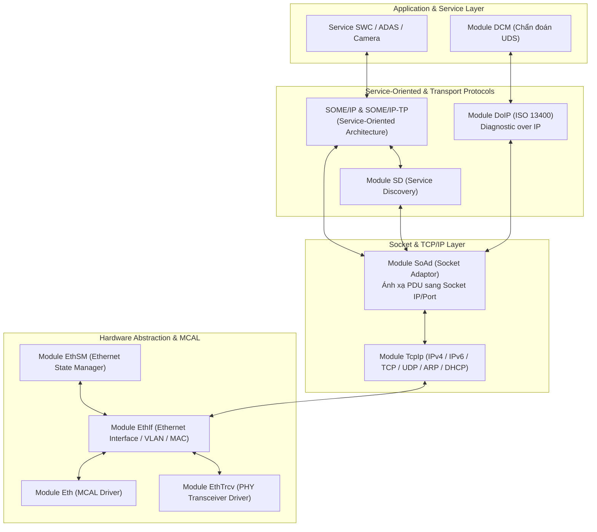
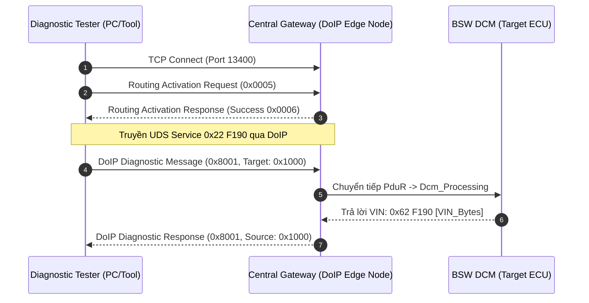

# CHUYÊN ĐỀ 12: Automotive Ethernet, SOME/IP & DoIP Stack Deep Dive
## Masterclass Kỹ Nghệ: Mạng Ethernet Ô Tô (100BASE-T1), Giao Thức SOME/IP, Service Discovery (SD), DoIP (ISO 13400) & Ngăn Xếp BSW EthStack

> 📚 **Ngôn ngữ:** Tiếng Việt Kỹ Nghệ Chuẩn Mực  
> 🎯 **Định vị:** Dành cho BSW Integration Engineer, Gateway/ADAS/Infotainment ECU Developer  
> 🔧 **Source Code đối chiếu:** [`as/com/as.infrastructure/communication/Eth/`](file:///C:/Users/liem.vu/Liem.vuOD/Study_AUTOSAR-main/as/com/as.infrastructure/communication/Eth/), [`EthIf/`](file:///C:/Users/liem.vu/Liem.vuOD/Study_AUTOSAR-main/as/com/as.infrastructure/communication/EthIf/), [`SoAd/`](file:///C:/Users/liem.vu/Liem.vuOD/Study_AUTOSAR-main/as/com/as.infrastructure/communication/SoAd/), [`DoIP/`](file:///C:/Users/liem.vu/Liem.vuOD/Study_AUTOSAR-main/as/com/as.infrastructure/communication/DoIP/), [`SD/`](file:///C:/Users/liem.vu/Liem.vuOD/Study_AUTOSAR-main/as/com/as.infrastructure/communication/SD/)  
> 📑 **Tài liệu tham chiếu:** IEEE 802.3bw (100BASE-T1), AUTOSAR SWS Ethernet, SoAd, SOME/IP, ISO 13400 (DoIP)

---

## 1. Tổng Quan Về Automotive Ethernet (Ethernet Trên Ô Tô)

```
┌─────────────────────────────────────────────────────────────────────────────────────────────────┐
│  🟢 LEVEL 1: NEWBIE FRIENDLY — TẠI SAO XE HƠI HIỆN ĐẠI CẦN ETHERNET?                            │
│  • Bùng nổ dữ liệu: Camera 4K ADAS, Lidar, Radar, Màn hình giải trí siêu nét, Cập nhật phần mềm  │
│    từ xa qua mạng (OTA Firmware Update).                                                        │
│  • Băng thông CAN FD (5 Mbps) hay LIN (20 kbps) hoàn toàn bị "nghẽn cổ chai".                   │
│  • Automotive Ethernet (100BASE-T1 / 1000BASE-T1) mang băng thông 100 Mbps - 1 Gbps lên xe,      │
│    nhưng ĐẶC BIỆT CHỈ DÙNG 1 CẶP DÂY XOẮN ĐƠN (Single Twisted Pair) để giảm trọng lượng xe!     │
└─────────────────────────────────────────────────────────────────────────────────────────────────┘
```

### 1.1 Khác Biệt Giữa Ethernet Văn Phòng (Standard RJ45) vs Automotive Ethernet (100BASE-T1)

| Tiêu Chí | Ethernet Văn Phòng (100BASE-TX) | Automotive Ethernet (100BASE-T1 / BroadR-Reach) |
| :--- | :--- | :--- |
| **Số lượng dây** | 4 dây (2 cặp xoắn TX/RX riêng biệt) | **Chỉ 1 cặp dây xoắn duy nhất (2 dây - Full Duplex)** |
| **Đầu nối cáp** | Đầu cắm nhựa bấm hạt RJ45 | Giắc cắm ô tô chịu rung, chống nước (Rosenberger H-MTD) |
| **Chống nhiễu EMC** | Yếu, không chịu được nhiễu động cơ/bugi | Cực cao (đạt tiêu chuẩn khắt khe CISPR 25 Class 5) |
| **Chiều dài cáp** | Lên tới 100m | Tối đa 15 mét (đủ bao quát toàn bộ chiều dài xe ô tô) |
| **Khối lượng dây** | Nặng, cồng kềnh | **Giảm 50% trọng lượng** bó dây điện của xe |

---

## 2. Ngăn Xếp AUTOSAR Ethernet Communication Stack (EthStack)

### 2.1 Sơ Đồ Toàn Cảnh Phân Tầng BSW Ethernet



---

### 2.2 Vai Trò Cốt Lõi Từng Module Trong Dự Án `as`:

1. **`Eth.c` (MCAL Driver):** Quản lý khối điều khiển Ethernet MAC phần cứng (DMA Ring Buffer, Descriptor TX/RX).
2. **`EthIf.c` (Ethernet Interface):** Trừu tượng hóa nhiều cổng Controller/Transceiver, xử lý gắn nhãn VLAN (IEEE 802.1Q).
3. **`TcpIp` (LwIP / BSD Core):** Cung cấp ngăn xếp mạng IP tiêu chuẩn (Cấp phát IP qua DHCP/Auto-IP, đóng gói gói tin TCP/UDP).
4. **`SoAd.c` (Socket Adaptor):** Là **"Chiếc cầu nối vạn năng"** biến thế giới AUTOSAR PDU truyền thống thành các luồng Socket IP (IP:Port). Ví dụ: Nhận PDU từ PduR $\longrightarrow$ Đóng gói thành UDP Payload gửi đến `192.168.1.100:30490`.
5. **`DoIP.c` (Diagnostic over IP - ISO 13400):** Cho phép máy chẩn đoán Tester cắm cáp mạng LAN vào cổng sạc xe để flash nạp Firmware cho toàn bộ xe trong vài phút thay vì vài giờ qua CAN!
6. **`SomeIp` & `SD` (Scalable service-Oriented MiddlewarE over IP & Service Discovery):** Triển khai kiến trúc hướng dịch vụ **SOA (Client - Server)** trên xe hiện đại.

---

## 3. Giao Thức SOME/IP & Service Discovery (SD)

Khác với CAN/LIN truyền thông theo kiểu gửi tín hiệu cố định (Signal-based), Ethernet trên xe sử dụng **SOME/IP (Service-Oriented Architecture - SOA)** theo mô hình **Publish/Subscribe** và **Remote Procedure Call (RPC)**:

```
┌──────────────────────── SOME/IP HEADER (16 Bytes) ────────────────────────┐
│ Message ID (Service ID 16-bit + Method/Event ID 16-bit)                   │
├───────────────────────────────────────────────────────────────────────────┤
│ Length (32-bit: Chiều dài payload còn lại)                                │
├───────────────────────────────────────────────────────────────────────────┤
│ Request ID (Client ID 16-bit + Session ID 16-bit)                         │
├───────────────────────────────────────────────────────────────────────────┤
│ Protocol Version (8-bit) │ Interface Version (8-bit) │ Message Type (8-bit)│
├───────────────────────────────────────────────────────────────────────────┤
│ Return Code (8-bit)                                                       │
├───────────────────────────────────────────────────────────────────────────┤
│ Payload Data (Dữ liệu Struct / JSON / mảng Bytes linh hoạt)               │
└───────────────────────────────────────────────────────────────────────────┘
```

### 3.1 3 Kiểu Giao Tiếp Cốt Lõi Của SOME/IP:
1. **Method (Request - Response / Fire & Forget):** Client gọi hàm thực thi từ xa trên Server (Ví dụ: Client gọi `Server.OpenTrunk()`).
2. **Event (Publish - Subscribe):** Server phát dữ liệu khi có thay đổi cho các Client đã đăng ký (Ví dụ: Camera ADAS phát `Event: Pedestrian_Detected`).
3. **Field (Getter / Setter / Notifier):** Đọc/ghi và giám sát biến trạng thái từ xa.

---

### 3.2 Service Discovery (SD) — Cơ Chế Tự Động Tìm Thấy Dịch Vụ:
* **Không cần hard-code địa chỉ IP:** Khi ECU Khởi động, nó gửi bản tin **`SOME/IP-SD: FindService`** (Hỏi: "Có ai cung cấp dịch vụ Định Vị GPS không?").
* ECU GPS trả lời **`SOME/IP-SD: OfferService`** ("Tôi là GPS Server tại IP 192.168.1.50:30490").
* Client gửi **`SOME/IP-SD: Subscribe`** để bắt đầu nhận luồng tọa độ!

---

## 4. Chẩn Đoán Qua Mạng IP: DoIP (Diagnostic over IP - ISO 13400)



---

## 5. Ví Dụ C Code: Khởi Tạo Socket Ethernet Trong `as`

Trong [`as/com/as.infrastructure/communication/Eth/Eth.c`](file:///C:/Users/liem.vu/Liem.vuOD/Study_AUTOSAR-main/as/com/as.infrastructure/communication/Eth/Eth.c) và [`SoAd.c`](file:///C:/Users/liem.vu/Liem.vuOD/Study_AUTOSAR-main/as/com/as.infrastructure/communication/SoAd/SoAd.c):

```c
/* 1. Khởi tạo MCAL Driver Ethernet */
void Init_Eth_Stack(void)
{
    Eth_Init(&Eth_Config);
    Eth_SetControllerMode(0, ETH_MODE_ACTIVE);
    EthTrcv_SetTransceiverMode(0, ETH_TRCV_MODE_NORMAL);
}

/* 2. Gửi PDU qua Socket Adaptor (SoAd) */
Std_ReturnType SoAd_Transmit_Example(PduIdType SoAdTxPduId, const PduInfoType *PduInfoPtr)
{
    SoAd_SocketType *sock = &SoAd_Sockets[SoAdTxPduId];
    
    /* Đóng gói vào UDP/TCP Socket */
    return TcpIp_Transmit(sock->TcpIpSocketId, PduInfoPtr->SduDataPtr, PduInfoPtr->SduLength, &sock->RemoteAddr);
}
```

---

## 6. Câu Hỏi Phỏng Vấn Kỹ Sư Về Automotive Ethernet (Top Interview Q&A)

1. **Câu 1: Phân biệt vai trò của SOME/IP và DoIP trên ô tô?**
   * *Trả lời:* 
     * **SOME/IP (SOA):** Dùng cho giao tiếp thời gian chạy giữa các ứng dụng điều khiển xe (Inter-ECU runtime communication, ADAS, Infotainment).
     * **DoIP (ISO 13400):** Dùng riêng cho việc Chẩn đoán xe (Diagnostics) và Nạp phần mềm (Flashing/OTA) thay thế cho CanTp.
2. **Câu 2: Module SoAd (Socket Adaptor) có vai trò gì trong kiến trúc AUTOSAR Classic?**
   * *Trả lời:* SoAd đóng vai trò cầu nối chuyển đổi giữa **Mô hình PDU tĩnh (PduId / Signal-based)** của AUTOSAR BSW với **Mô hình Socket IP động (IP address, Port, TCP/UDP)** của ngăn xếp mạng TCP/IP.
3. **Câu 3: Tại sao Ethernet trên ô tô (100BASE-T1) chỉ cần 1 cặp dây xoắn mà vẫn truyền nhận song công (Full-Duplex) cùng lúc được?**
   * *Trả lời:* Nhờ công nghệ lai tín hiệu và bộ lọc triệt tiếng vọng chủ động (**Digital Echo Cancellation**) trong chip PHY BroadR-Reach. Chip PHY có thể phân tách tín hiệu mình tự phát ra khỏi tín hiệu nhận về trên cùng một cặp dây dẫn.
